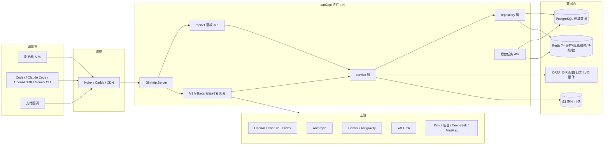
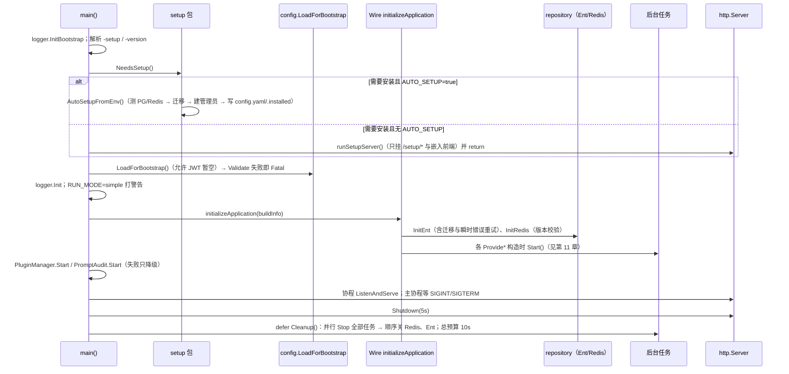
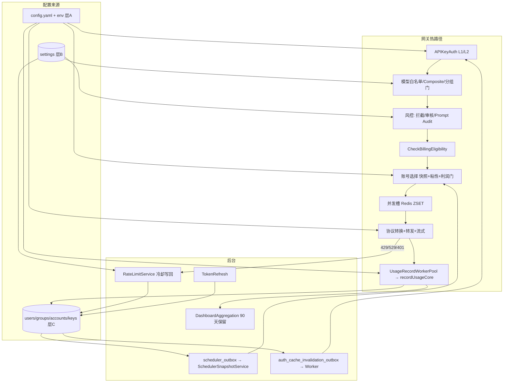

# Sub2API 架构说明与运维手册

| 项 | 值 |
| --- | --- |
| 适用版本 | 后端 `0.2.4`（`backend/cmd/server/VERSION`），分支 `main`，2026-09-11 对照源码重写 |
| 上游 | [Wei-Shaw/sub2api](https://github.com/Wei-Shaw/sub2api)；本仓库是保留本地能力的下游维护分支 |
| 读者 | 后端/前端程序员、运维/SRE、系统管理员 |
| 权威顺序 | 源码与测试 > 本手册 > `llm-wiki/wiki/*.md`（AI 快速入口）。本手册与源码冲突时以源码为准并回来修手册 |
| 引用约定 | `路径#函数名` 指向实现；行号只在少数关键锚点给出，按 0.2.4 基线，仅作定位参考 |
| 不写入 | 任何密钥、token、生产地址私密信息 |

---

## 目录

**前言**：如何使用本手册

**第一部分 系统全景**
1. 系统定位与边界
2. 运行时全景
3. 仓库地图与分层

**第二部分 运转过程（程序员必读）**
4. 进程生命周期：启动、Setup、配置加载、Wire、后台任务、关闭
5. 配置体系：三层配置、优先级、环境变量映射、启动校验
6. 一次网关请求的完整路径
7. 账号调度与并发控制
8. 计费、额度与结算流
9. 管理面与用户面：会话、管理鉴权链、子管理员、step-up、幂等、审计
10. 热配置（settings）机制
11. 后台任务全景
12. 数据层：PostgreSQL、迁移、Redis 键空间、数据保留
13. 流程关联图：谁依赖谁、一次改动如何传播

**第三部分 重点维护方向（程序员）**
14. 不变量与高风险热点
15. 改一类需求要动哪些文件
16. 上游合并纪律与本地独有能力
17. 验证矩阵

**第四部分 运维手册（运维/管理员）**
18. 环境与依赖要求
19. 首次部署与本地启动
20. 进程配置逐项：默认值、合法范围、影响、调整方向、是否重启
21. 管理后台热配置逐项
22. 反向代理与边缘合同
23. 日常操作：发布、重启、配置变更、备份恢复、在线更新
24. 监控、健康检查与容量
25. 故障排查树
26. 安全基线清单

**附录**
A. 环境变量速查 · B. 端口与路径 · C. Redis 键前缀 · D. 错误码速查 · E. 术语 · F. 本手册维护规则

---

## 前言：如何使用本手册

本手册回答四个问题：系统怎么运转（第 4–13 章）、维护时哪些地方不能碰、碰了要连带改什么（第 14–17 章）、运维怎么配、每项配置改了会发生什么、往哪个方向调（第 18–26 章）、出了问题从哪查（第 25 章）。

按角色的最短阅读路径：

| 角色 | 必读 | 按需 |
| --- | --- | --- |
| 后端程序员 | 2、3、4、5、6、7、8、10、11、13、14、15 | 9、12、16、17 |
| 前端程序员 | 2、3.4、9.1、9.5、10、15.6 | 6（理解错误码）、21 |
| 运维 / SRE | 2、4、5、11、18、19、20、22、23、24、25、26 | 6、7（理解 429/503 语义）、12 |
| 系统管理员（配业务） | 1、8、21、23.5、26 | 9.2、9.3 |
| 新人第一周 | 前言、1、2、3、4、5、6，然后按角色 | — |

写法约定：

- "必须 / 禁止" 是源码或部署合同强制的；"建议" 是运维经验。
- 每个配置项都给出：默认值（来自 `backend/internal/config/config.go#setDefaults`）、合法范围（来自 `Config.Validate`）、影响、调整方向、生效方式。
- 涉及金额、鉴权、调度的结论都对照过实现文件；引用的函数名可直接 `rg` 定位。

---

# 第一部分 系统全景

## 1. 系统定位与边界

### 1.1 它是什么

Sub2API 是一个**单进程 Go 服务**，同时承担两种角色：

1. **AI 网关**：客户端把 OpenAI / Anthropic / Gemini / Grok / Codex 等协议的 Base URL 指到本服务，携带平台发放的 API Key（默认前缀 `sk-`），网关完成鉴权、分组准入、账号调度、协议转换、上游转发、流式回写、失败切换、用量记录与计费。
2. **管理与用户平台**：Vue 3 SPA（生产构建后嵌入 Go 二进制）+ `/api/v1` REST API，提供用户注册登录、API Key 管理、余额/订阅/支付、上游账号池管理、分组与定价、风控审计、运维监控、备份更新。

### 1.2 它不是什么

- 不是模型推理服务，所有生成都发生在上游账号所属的平台。
- 不是 WAF/DDoS 防护。应用内的限流与无效凭据封禁只是进程内安全网（`deploy/EDGE_SECURITY.md` 明确要求边缘承担体积型防护）。
- 不是多租户 SaaS 控制面：一个部署 = 一套 PostgreSQL + Redis + 一组对等进程。

### 1.3 核心对象一句话

| 对象 | 作用 | 表 / 位置 |
| --- | --- | --- |
| User | 平台用户。角色 `admin` / `sub_admin` / `user`；余额、并发、TOTP、Passkey、`restrict_public_groups` | `users` |
| API Key | 网关调用凭证，绑定一个 Group；有状态、有效期、额度、RPM、IP 白/黑名单 | `api_keys` |
| Group | 调度与计费单元：platform、倍率、高峰倍率、模型白名单/映射、订阅日/周/月限额、按模型定价、利润控制、Fast 策略、能力开关（图片/Live/批量生图） | `groups` |
| Account | 上游账号：OAuth / API Key / Setup Token / Agent Identity / Bedrock / Service Account 等；可调度状态、代理、模型映射、配额快照、倍率（上游成本） | `accounts`、`account_groups` |
| CompositeModelRoute | `platform=composite` 分组的 public model → 目标平台路由表 | `composite_model_routes` |
| Channel 定价 | 渠道级 token/按次/图片/视频价格、分时价、Fast/Flex 倍率 | `channel_*pricing*` |
| UsageLog | 每次请求的用量与费用；模型三口径 `requested_model` / `upstream_model` / `upstream_response_model` | `usage_logs` |
| Subscription | 套餐与用户订阅窗口（日/周/月） | `subscription_plans`、`user_subscriptions` |
| PaymentOrder | 支付订单及状态机 | `payment_orders`、`payment_provider_instances`、`payment_audit_logs` |
| Setting | 可热更新的运行时设置（管理后台绝大多数开关） | `settings(key,value)` |
| Proxy | 出站代理，含有效期与回退链 | `proxies` |

### 1.4 本仓库与上游的关系

| 维度 | 约定 |
| --- | --- |
| 合并方向 | 定期以固定 SHA 合入 `Wei-Shaw/sub2api main`，记录追加到 `docs/features/sub2api -merage-list.md`（只追加） |
| 重叠能力 | 采用上游实现，不修上游自身缺陷（只记录到 `docs/features/technical-debt-board-cn.md`） |
| 本地独有能力 | 必须保留，清单见第 16 章与 `docs/upstream-merge-playbook.md` |

---

## 2. 运行时全景

### 2.1 组件与数据流



### 2.2 职责分配

| 组件 | 负责 | 不负责 |
| --- | --- | --- |
| PostgreSQL | 一切权威数据：用户、Key、分组、账号、用量、订单、settings、迁移记录、outbox | 热路径限流计数 |
| Redis | API Key 鉴权 L2 缓存、并发槽（ZSET）、RPM、计费缓存、调度快照、粘性会话、refresh token、leader lock、pub/sub 失效通知 | 权威数据（Redis 清空后可从 DB 重建，但会有短暂抖动） |
| 进程内存 | 鉴权 L1 缓存、settings 各功能缓存、快照读缓存、代理熔断、无效凭据限流 | 跨实例一致性（靠 TTL 与 outbox 收敛） |
| `DATA_DIR` | `config.yaml`、`.installed`、`logs/`、`request-archive/`、`plugins/`、定价缓存（`pricing.data_dir`） | — |

### 2.3 部署形态

| 形态 | 前端 | 首次初始化 | 典型 |
| --- | --- | --- | --- |
| 源码 + systemd（**本仓库现网约定**，第 19.3 节） | 先 `pnpm build` 到 `backend/internal/web/dist`，再 `go build -tags embed` | 已有 `config.yaml` | `/opt/sub2api/backend/bin/server` |
| Docker Compose（`deploy/docker-compose*.yml`） | 镜像已嵌入 | `AUTO_SETUP=true` 环境变量自动初始化 | 数据卷 `/app/data` |
| 上游二进制 + `deploy/install.sh` | 发布包已嵌入 | Web 向导 | `/opt/sub2api/sub2api`，`/etc/sub2api/config.yaml` |
| 本地开发（`start-local.cmd`） | Vite 独立端口反代到后端 | `AUTO_SETUP=true`，数据在 `.localdev/` | Windows |

漏掉 `-tags embed` 时编入 `backend/internal/web/embed_off.go`，首页返回 `Frontend not embedded. Build with -tags embed to include frontend.`

### 2.4 多实例约束

可以水平扩展多个对等进程，前提：

1. 共享同一 PostgreSQL、同一 Redis 逻辑库；`JWT_SECRET`、`TOTP_ENCRYPTION_KEY` 必须完全一致。
2. 第 11 章标注为 **有锁** 的任务只在持锁实例执行；标注为 **无锁** 的任务每个实例都会跑（多数幂等，但 V1 渠道探测与 OAuth token refresh 会重复发请求）。
3. 热配置靠各实例本地缓存 TTL 收敛（多数 60 秒），API Key 鉴权缓存靠 outbox + Redis 通知收敛（毫秒到 30 秒）。
4. 反向代理不需要会话粘性：粘性会话（sticky session）是网关到上游账号的绑定，存在 Redis，与哪个实例处理无关。

---

## 3. 仓库地图与分层

### 3.1 目录

```
xyai/
├── backend/
│   ├── cmd/server/            main.go（入口）VERSION wire.go（DI 源图）wire_gen.go（生成，禁止手改）
│   ├── cmd/localadmin/        本地脚本用：同步管理员密码
│   ├── ent/schema/            表结构定义；ent/ 其余为生成代码（禁止手改）
│   ├── migrations/            SQL 迁移（只增不改，见第 12 章）
│   ├── resources/model-pricing/ 内置价格 fallback
│   └── internal/
│       ├── config/            Viper 加载、默认值、校验
│       ├── setup/             首次安装（Web 向导 / CLI / AUTO_SETUP）
│       ├── server/            http.go router.go routes/*.go middleware/*.go
│       ├── handler/           HTTP 绑定与响应；handler/admin/ 管理端
│       ├── service/           业务编排（网关、调度、计费、设置、后台任务）
│       ├── repository/        Ent / SQL / Redis / 外部 HTTP
│       ├── payment/           支付抽象与 provider
│       ├── securityaudit/     Prompt Audit
│       ├── service/promptmetrics/ Prompt Metrics（本地能力）
│       ├── pkg/               openai claude gemini xai apicompat logger timezone 等
│       └── web/               embed_on.go / embed_off.go / dist/（前端产物）
├── frontend/                  Vue 3 + Vite 5 + Pinia + vue-i18n；只用 pnpm
├── deploy/                    config.example.yaml .env.example docker-compose*.yml Caddyfile sub2api.service install.sh EDGE_SECURITY.md
├── tools/                     start-local.ps1 / stop-local.ps1 / 知识图谱脚本
├── docs/                      本手册、功能设计、合并记录、技术债看板
├── llm-wiki/wiki/             AI 开发前必读知识
└── AGENTS.md                  AI 协作规则（进入任务先读 wiki）
```

### 3.2 后端分层与放置规则

```
HTTP 请求
  → server/middleware  横切：恢复、日志、CORS、安全头、鉴权、限流、归档、拦截、审计、step-up
  → handler            绑定/校验参数，调 service，写响应；不直接碰 Ent
  → service            业务编排：计费、调度、协议转换、后台任务；跨 repository 组合
  → repository         Ent / 原生 SQL / Redis / 上游 HTTP；不含业务判断
  → PostgreSQL / Redis / 上游
```

- 新能力按层放置；handler 里不写复杂业务，service 里不拼 SQL 细节。
- 上游 v0.1.146 起大文件按领域拆分（`setting_service.go`、`gateway_service.go`、`openai_gateway_service.go`、`usage_log_repo.go` 等只留薄入口）。找实现先 `rg` 函数名，不要把拆分文件合回去。
- 依赖注入：`backend/internal/{repository,service,handler,server,payment,securityaudit}/wire.go` 定义 ProviderSet，`cmd/server/wire.go` 汇总；改了任何 provider 签名必须 `cd backend && go generate ./cmd/server`（指令固定为 `go run -mod=mod github.com/google/wire/cmd/wire`）。

### 3.3 关键入口速查

| 问题 | 看这里 |
| --- | --- |
| 进程怎么起、怎么停 | `backend/cmd/server/main.go` |
| 全局中间件顺序 | `backend/internal/server/router.go#SetupRouter` |
| 网关路由与中间件链 | `backend/internal/server/routes/gateway.go#RegisterGatewayRoutes` |
| 管理端路由与鉴权链 | `backend/internal/server/routes/admin.go#RegisterAdminRoutes` |
| 登录/OAuth 路由与限流 | `backend/internal/server/routes/auth.go` |
| API Key 鉴权 13 步 | `backend/internal/server/middleware/api_key_auth.go#apiKeyAuthWithSubscription` |
| 配置默认值 / 校验 | `backend/internal/config/config.go#setDefaults` / `#Validate` |
| 首次安装判定 | `backend/internal/setup/setup.go#NeedsSetup` / `#AutoSetupFromEnv` |
| 迁移执行 | `backend/internal/repository/migrations_runner.go`；瞬时错误重试在 `repository/ent.go` |
| Redis 版本校验 | `backend/internal/repository/redis.go#validateRedisServerInfo` |
| 账号选择（Anthropic） | `backend/internal/service/gateway_scheduling.go#SelectAccountWithLoadAwareness` |
| 账号选择（OpenAI 族） | `backend/internal/service/openai_account_scheduler.go`，入口 `SelectAccountWithSchedulerForCapability` |
| 并发槽 | `backend/internal/service/concurrency_service.go`、`repository/concurrency_cache.go` |
| 计费预检 / 扣费 | `service/billing_cache_service.go#CheckBillingEligibility`、`service/gateway_usage_billing.go#recordUsageCore`、`repository/usage_billing_repo.go#applyUsageBilling` |
| 定价解析 | `service/model_pricing_resolver.go#Resolve`、`service/pricing_service.go`、`service/billing_service.go#computeTokenBreakdown` |
| settings 键常量 | `backend/internal/service/domain_constants.go`（`SettingKey*`） |
| 子管理员权限目录 | `backend/internal/service/admin_permission.go` |
| 后台任务清理顺序 | `backend/cmd/server/wire.go#provideCleanup` |

### 3.4 前端在系统中的位置

- 构建：`pnpm --dir frontend run build` → `vue-tsc -b && vite build` → 输出 `backend/internal/web/dist`，后端 `-tags embed` 嵌入并注入 public settings 到 HTML（`web.NewFrontendServer(settingService)`，settings 保存后 `InvalidateCache`）。
- 运行时依赖：`GET /api/v1/settings/public` 决定路由守卫（注册、支付、风控、模型广场、Passkey 等开关）；守卫只有在 settings **加载成功且显式为 false** 时才重定向，加载失败不当作关闭。
- API client `frontend/src/api/client.ts`：baseURL 默认 `/api/v1`；自动带 `Authorization`；401 用 `refresh_token` 调 `/auth/refresh` 后重试一次；失败清 localStorage 跳 `/login`。管理页请求加 `X-Admin-UI-Request: 1`（仅作 Server-Timing 采集范围信号，不是凭据）。
- 直连 fetch/WebSocket 必须用 `buildApiUrl` / `buildGatewayUrl`，避免部署到自定义 `VITE_API_BASE_URL` 时打错 origin。
- 开发端口：Vite `VITE_DEV_PORT`（默认 3000），代理 `/api`、`/v1`、`/setup` 到 `VITE_DEV_PROXY_TARGET`（默认 `http://localhost:8080`）。

---

# 第二部分 运转过程（程序员必读）

## 4. 进程生命周期

### 4.1 启动时序（`backend/cmd/server/main.go`）



要点：

1. **命令行**：`-version` 打印后退出；`-setup` 走 CLI 向导后退出；无参数进入判定。
2. **版本号**：ldflags `-X main.Version=...` 优先，否则 `//go:embed VERSION`。`BuildType` 默认 `source`，CI 发布包为 `release`；在线更新只认 GitHub Release 资产，`source` 构建常无匹配包（第 23.6 节）。
3. **Setup 进程**是独立的精简 Gin：`Recovery`、空 CORS、默认 CSP、`/setup/status|test-db|test-redis|install`、嵌入前端；`ReadHeaderTimeout 30s`、`IdleTimeout 120s`，HTTP/1 + h2c。安装成功后约 500ms 触发进程重启，下一次 `NeedsSetup()` 为 false。
4. **主进程 HTTP**（`server/http.go#ProvideHTTPServer`）只设 `MaxHeaderBytes`、`ReadHeaderTimeout`、`IdleTimeout`；**故意不设 `ReadTimeout` / `WriteTimeout`**（流式响应可持续十几分钟、大请求体读取慢）。全局 `http.MaxBytesHandler` 上限取 `server.max_request_body_size`（≤0 时回落 `gateway.max_body_size`）。h2c 仅在 `server.h2c.enabled=true` 时配置。
5. **优雅关闭**：`Shutdown` 等 5 秒让在途 HTTP 结束；随后 Cleanup 10 秒预算内并行停止所有后台任务（步名见 `provideCleanup`，超时打印 `cleanup timed out after 10 seconds`），最后关 Redis、Ent。systemd `Restart=always`（上游模板）。

### 4.2 首次安装判定与自动初始化（`backend/internal/setup/setup.go`）

`NeedsSetup()` 按顺序：

| 步 | 判定 | 结果 |
| --- | --- | --- |
| 1 | `SKIP_SETUP` ∈ {`true`,`1`,`yes`} | 不当作首次安装，直接主服务（你必须自己准备好 `config.yaml`/env 和库） |
| 2 | `{DATA_DIR}/config.yaml` 存在 | 不安装 |
| 3 | `{DATA_DIR}/.installed` 存在 | 不安装（防止删 config 强迫重装） |
| 4 | 都不存在 | 首次安装 |

`GetDataDir()`：`DATA_DIR` 非空 → 用它；否则 `/app/data` 存在且可写 → 用它；否则当前目录 `.`。

`AutoSetupFromEnv()`（`AUTO_SETUP` ∈ {`true`,`1`,`yes`}）逐步：

1. 时区：`TZ` → `TIMEZONE` → `Asia/Shanghai`。
2. 组装 `SetupConfig`：`DATABASE_HOST/PORT/USER/PASSWORD/DBNAME/SSLMODE`（**SSLMODE 默认 `disable`**，注意与运行时配置默认 `prefer` 不同）、`REDIS_HOST/PORT/USERNAME/PASSWORD/DB/ENABLE_TLS`、`ADMIN_EMAIL`（默认 `admin@sub2api.local`）、`ADMIN_PASSWORD`（空则随机生成，只出现在日志）、`SERVER_HOST/PORT/MODE`（默认 `0.0.0.0/8080/release`）、`JWT_SECRET`（空则随机 32 字节并警告）、`JWT_EXPIRE_HOUR`（24）、`SETUP_MIGRATION_TIMEOUT_SECONDS`（0 → 60 秒）。
3. 测 PostgreSQL（不存在则 `CREATE DATABASE`）→ 测 Redis → `initializeDatabase`（跑全部迁移）。
4. `createAdminUser`：仅当库里 **没有任何用户** 时创建；已有 admin 或已有用户但无 admin 都跳过（不覆盖密码）。
5. `writeConfigFile`：写 `{DATA_DIR}/config.yaml`，权限 `0600`；只包含 `server`、`database`、`redis`、`jwt`、`default`、`rate_limit`、`timezone`。**管理员密码不写文件**。
6. `createInstallLock`：写 `.installed`。

运维含义：`AUTO_SETUP` 只在首次跑一次。之后只改环境变量里的 DB 账号是不够的——运行时配置的来源是 `config.yaml` + env（env 覆盖 yaml，见第 5 章），但 Setup 写下的 yaml 里已经固化了当时的 DB/Redis/JWT。要么改 yaml，要么用 env 覆盖同名键，要么（仅本地开发）删掉 `config.yaml` 与 `.installed` 重装。

### 4.3 Ent / 迁移 / Redis 初始化（Wire 阶段）

| 步骤 | 行为 | 失败后果 |
| --- | --- | --- |
| PostgreSQL 连接池 | `SetMaxOpenConns/MaxIdleConns/ConnMaxLifetime/ConnMaxIdleTime` 取 `database.*`；DSN 附 `TimeZone=`（空时区回落 `Asia/Shanghai`），并 `timezone.Init(cfg.Timezone)` | 起不来 |
| 瞬时错误重试（`repository/ent.go`） | 仅 SQLSTATE `57P03`（库启动中）与 `08*`（连接类）；最多再试 8 次，退避 `1<<(attempt-1)` 秒、上限 30 秒；迁移总超时 10 分钟 | `28P01` 认证失败、checksum 不匹配、SQL 错误 **立即失败** |
| 迁移互斥 | PostgreSQL advisory lock ID `694208311321144027`，`pg_try_advisory_lock` 每 500ms 轮询 | 多实例同时启动只有一个跑迁移，其余等待 |
| 迁移执行 | `schema_migrations(filename, checksum, applied_at)`；checksum 为去空白后内容 SHA256；按完整文件名 `sort.Strings` 排序；普通 `.sql` 事务内，`_notx.sql` 事务外逐条（先清理同名 invalid index） | checksum 不匹配 → 启动失败，说明已应用文件被改过 |
| Redis | `INFO server` 的 `redis_version` 主版本必须 ≥ 7；若有 `memurai_version` 则放行；TLS 最低 1.2 | 起不来（`Redis 7+ is required`） |

### 4.4 路由装配顺序（`server/router.go#SetupRouter`）

全局中间件（每个请求都过）：`Recovery` → 可信代理设置（`configureTrustedProxies`）→ `RequestLogger` → `SessionBindingContext`（把客户端 IP/UA 快照进 context，IP 口径见第 5.5 节）→ `Logger` → `CORS` → `SecurityHeaders`（CSP，`frame-src` 从 settings 动态刷新）→ `ServerTiming`（默认关）→ Prompt Metrics `CaptureMiddleware` → 嵌入前端（带 settings 注入与缓存失效回调）。

然后注册：`/health`（`routes/common.go`）→ `/api/v1/auth` → `/api/v1/user|keys|usage|...` → `/api/v1/model-plaza` → `/api/v1/admin`（含 Prompt Metrics 管理路由，同样挂合规门与限流）→ 网关（`/v1`、`/v1beta`、根级别名、`/backend-api/codex`、`/antigravity/*`）→ 支付 → 自定义页面路由。

`PanelRateLimiter` 在这里构造并注入各模块（第 9.4 节）。

---

## 5. 配置体系

### 5.1 三层配置

| 层 | 存在哪 | 谁改 | 生效 | 典型内容 |
| --- | --- | --- | --- | --- |
| **A 进程配置** | `config.yaml` + 环境变量 → `config.Config` 单例 | 运维改文件 / systemd `Environment=` / Compose `.env` | **重启进程** | 监听、DB/Redis、JWT/TOTP、网关超时与连接池、调度、日志、后台任务周期、安全边界 |
| **B 热配置** | 表 `settings(key,value)` | 管理后台 `/admin/settings` 及子页，或管理 API | 当前节点立即（部分经本地缓存 5–60 秒），其他节点靠 TTL | 注册/验证码/SMTP/OEM、Panel 限流、冷却时间、流超时、风控、渠道监控、支付开关、插件入口、客户端 IP 兼容开关 |
| **C 业务数据** | users / api_keys / groups / accounts / channels / proxies | 各管理页 | 保存即生效（鉴权快照经 outbox 失效） | 账号、分组、定价、Key |

改错层的典型症状："改了不生效"（改了 yaml 但该项其实是 settings）或"重启后丢了"（改了 settings 却期望它像 yaml 一样是部署资产）。第 20/21 章的逐项表都标了所属层。

### 5.2 进程配置加载算法（`config.go#load`）

1. `viper.SetConfigName("config")`、类型 yaml；`configureConfigSource`：若 `CONFIG_FILE` 非空 → **只读该文件**（不存在或读失败 → 启动失败）；否则按顺序在 `DATA_DIR`（非空时）、`/app/data`、`.`、`./config`、`/etc/sub2api` 查找 `config.yaml`。
2. `viper.AutomaticEnv()` + `SetEnvKeyReplacer(".", "_")`：任意键 `a.b.c` ↔ 环境变量 `A_B_C`。**但 viper 只解码 `AllKeys()` 里已注册的键**，所以只有 `setDefaults()`/`setEnvReachableDefaults()` 注册过或出现在 yaml 里的键才能被 env 覆盖；这是为什么新增配置必须在 `setDefaults` 注册默认值（哪怕是零值）。
3. 特殊绑定：`TZ` 非空时显式 `viper.Set("timezone", TZ)`（优先于 `TIMEZONE`）；`ENABLE_SERVER_TIMING` → `server.enable_server_timing`；`SERVER_TRUSTED_PROXIES`、`SECURITY_FORWARDED_CLIENT_IP_HEADERS` 用 `os.LookupEnv` 手工按逗号切分（显式空字符串表示清空 yaml 列表）。
4. `setDefaults()` → `ReadInConfig()`（文件不存在不算错，用默认+env；**文件存在但 YAML 语法错 → 启动失败**）→ `Unmarshal`。
5. 归一化：`RunMode` 规范为 `standard|simple`；`server.mode` 小写；各 OAuth URL trim；`user_message_queue.mode` 非法值告警清空；`forced_codex_instructions_template_file` 非空时立即读文件（不存在 → 启动失败）；旧键兼容（`disable_codex_originator_normalization`、`sticky_previous_response_ttl_seconds`）。
6. `totp.encryption_key` 为空 → **随机生成并 warn**（不失败，但重启后所有 TOTP/加密字段作废）。
7. `LoadForBootstrap` 允许 `jwt.secret` 暂空（用 32 个 `0` 占位过校验后再清空），供安装刚完成的进程用；日常 `Load()` 要求非空且 ≥32 字节。
8. `Validate()`（第 5.4 节）→ 通过后若 `security.url_allowlist.enabled=false`、`response_headers.enabled=false`、JWT 弱口令则打 warn。

`GetServerAddress()`（Setup 阶段监听地址）复用同一文件选择，优先级 env > yaml > `0.0.0.0:8080`。

### 5.3 代码默认值 vs 示例文件

`deploy/config.example.yaml` 与 `.env.example` 是**建议值**，与 `setDefaults()` 不同处必须心里有数：

| 键 | `setDefaults()` | `config.example.yaml` / `.env.example` | 生产取向 |
| --- | --- | --- | --- |
| `server.h2c.enabled` | `false` | `true` | 有反代且客户端走 h2c 才开 |
| `security.trust_forwarded_ip_for_api_key_acl` | `true`（升级兼容） | `false` | 生产关，并配准 `server.trusted_proxies` |
| `security.url_allowlist.enabled` | `false` | `false` | 生产建议开 |
| `security.url_allowlist.allow_private_hosts` / `allow_insecure_http` | `true` / `true` | `true` / `true` | 生产 `false` / `false` |
| `database.max_open_conns` / `max_idle_conns` | 256 / 128 | 示例 256 / 128；Compose 默认 50 / 10 | 按 PG `max_connections` 反推（第 24.3 节） |
| `redis.pool_size` / `min_idle_conns` | 1024 / 128 | `.env.example` 4096 / 256；Compose 默认 1024 / 10 | 按并发调 |
| `log.format` | `console` | `json` | 容器/集中日志用 json |
| `database.sslmode` | `prefer` | `prefer`；AUTO_SETUP 写 `disable` | 跨网 `require`+ |
| `gateway.request_intercept.enabled` | `true` | — | 规则为空等于放行；库里 `request_intercept_enabled` 可热关 |

### 5.4 启动校验（`Config.Validate`）

不通过就 `Failed to load config`。值班按报错字段名改：

| 字段 | 合法条件 |
| --- | --- |
| `jwt.secret` | 非空；UTF-8 字节数 ≥ 32 |
| `jwt.expire_hour` | 1–168（>24 警告） |
| `jwt.access_token_expire_minutes` | ≥0（>720 警告）；`refresh_token_expire_days` >0（>90 警告）；`refresh_window_minutes` ≥0 |
| `server.read_header_timeout` | 1–60 秒 |
| `server.max_header_bytes` | 8192–1048576 |
| `server.idle_timeout` | >0；`max_request_body_size` ≥0 |
| `server.h2c.*`（启用时） | streams>0；idle>0；frame 16384–16777215；upload/conn ≥65535；upload/stream>0 |
| `server.frontend_url`（非空时） | 绝对 http(s) URL，无 query、无 userinfo、无 fragment |
| `log.level` / `log.format` / `log.stacktrace_level` | `debug\|info\|warn\|error` / `json\|console` / `none\|error\|fatal` |
| `log.output` | `to_stdout` 与 `to_file` 不能同时 false；rotation `max_size_mb`>0 |
| `security.csp.policy` | `csp.enabled=true` 时非空 |
| `security.forwarded_client_ip_headers` | 合法 HTTP 头名，去重后 ≤16 个 |
| `webauthn.*`（启用时） | `rp_display_name` 非空；`rp_id` 无 scheme/端口/路径；至少一个 origin，非 localhost 必须 https，且在 RP 域内 |
| `linuxdo_connect` / `oidc_connect` / `wechat_connect`（启用时） | client_id、redirect_url 等必填；`token_auth_method` ∈ post/basic/none；OIDC scopes 含 `openid`，`clock_skew_seconds` 0–600 |
| `gemini.oauth.client_id` / `client_secret` | 同空或同有 |
| `billing.circuit_breaker.*`（启用时） | 三项 >0；`minimum_balance_reserve` ≥0 |
| `database.max_open_conns` | >0；`max_idle_conns` 0..max_open |
| `redis.*` | 三个 timeout >0；`pool_size`>0；`min_idle_conns` 0..pool_size |
| `api_key_auth_cache.invalid_abuse.*`（启用时） | threshold ≥10；window 1–3600；block 1–3600；capacity 256–1000000 |
| `dashboard_aggregation.*`（启用时） | interval>0；`retention.usage_logs_days`>0；`usage_billing_dedup_days` ≥ `usage_logs_days`；hourly/daily >0 |
| `usage_cleanup.*`（启用时） | 四项 >0 |
| `token_analysis.max_preview_chars` | 1–2000；`usage_match_window_seconds` 1–120 |
| `idempotency.*` | 全部 >0 |
| `gateway.max_body_size` | >0；`text_max_body_size` 1..max_body_size |
| `gateway.openai_default_reasoning_effort` | 空或 none/minimal/low/medium/high/xhigh/extrahigh/max |
| `gateway.grok_response_header_timeout` | 0–1800 |
| `gateway.openai_first_output_timeout_seconds` | 0 或 30–600；`openai_high_effort_first_output_timeout_seconds` 0 或 30–1800 |
| `gateway.stream_data_interval_timeout` | 0 或 30–300 |
| `gateway.stream_keepalive_interval` | 0 或 5–30 |
| `gateway.image_stream_data_interval_timeout` | 0 或 60–1800；`image_stream_keepalive_interval` 0 或 5–60；`image_nonstream_keepalive_interval` 0 或 5–60 |
| `gateway.max_line_size` | 0 或 ≥1MiB |
| `gateway.models_list_cache_ttl_seconds` | 10–30 |
| `gateway.connection_pool_isolation` | `proxy\|account\|account_proxy` |
| `gateway.large_request.mode` | `off\|warn\|tool_output_compact`；阈值 >0；`giant ≥ normal`；`absolute_recent_tool_keep ≤ recent_tool_keep` |
| `gateway.usage_record.*` | worker/queue/timeout >0；`overflow_policy` ∈ `drop\|sample\|sync`；auto-scale 时 min ≤ worker_count ≤ max，up% 1–100，down% 0–99 且 < up% |
| `gateway.openai_ws.*` | `client_first_message_timeout_seconds`>0；idle/连接上限 ≥0；`min_idle ≤ max_idle ≤ max_conns_per_account`；`pool_target_utilization` ∈ (0,1]；`ingress_mode_default` ∈ off/ctx_pool/passthrough/http_bridge；`scheduler_score_weights` 非负且不全为 0 |
| `gateway.scheduling.*` | sticky/fallback 等待与队列 >0；`outbox_lag_rebuild_seconds ≥ outbox_lag_warn_seconds` |
| `concurrency.ping_interval` | 5–30 |
| `ops.cleanup.*`（启用时） | `system_log_retention_days`>0；`schedule` 非空 |
| `plugins.*` | `max_upload_bytes` 1–1GiB；`max_uncompressed_bytes` ∈ [upload, 2GiB]；`start_timeout_seconds` 1–120 |
| `gateway.grok.free_quota_*`（soft gate 启用时） | token_limit>0；percent 1–100；window_hours>0 |

### 5.5 客户端 IP 口径（安全相关的配置交互）

两套来源，由 `security.trust_forwarded_ip_for_api_key_acl`（进程默认 `true`，可被 settings `api_key_acl_trust_forwarded_ip` 热覆盖）切换：

- **开**（兼容模式）：按 `security.forwarded_client_ip_headers`（≤16 个，可热改）顺序读自定义头，再回落 `CF-Connecting-IP` → `X-Real-IP` → `X-Forwarded-For`。**不校验直连对端**，任何能直接打到进程的人都能伪造 IP。必须用防火墙保证只有反代/CDN 能回源。
- **关**（严格模式）：完全忽略自定义头，以 Gin `server.trusted_proxies` 为权威；未配置或显式空 → 只信直连对端 IP。

这个口径同时用于：API Key IP 白/黑名单、无效凭据 abuse limiter、会话绑定（IP/UA）、审计日志、Panel 公开接口限流、入口拒绝聚合。配错的后果是把所有用户算成同一个反代 IP，触发误封与误限流。

---

## 6. 一次网关请求的完整路径

以 `POST /v1/responses`（OpenAI 分组）和 `POST /v1/messages`（Anthropic 分组）为例。根级别名（`/responses`、`/chat/completions`、`/messages/count_tokens`、`/images/*`、`/videos/*`、Grok 语音/搜索）和 `/backend-api/codex/*`、`/antigravity/*`、`/v1beta/*` 共用同一套中间件语义（第 6.1 节顺序对根级路由逐条显式挂载）。

### 6.1 路由层中间件链（`routes/gateway.go`）

```
/v1 组：
  RequestBodyLimit(gateway.max_body_size 256MiB；embeddings/alpha-search 用 text_max_body_size 32MiB)
  → ClientRequestID（生成/透传请求 ID）
  → OpsErrorLoggerMiddleware（失败请求进 Ops 错误日志）
  → InboundEndpointMiddleware（把根级/别名端点归一为 /v1/... 供后续判断）
  → APIKeyAuth（第 6.2 节，13 步）
  → GET /v1/sub2api/billing 直接放行到 KeyBillingInfo
  → GroupModelAllowlist（分组模型白名单，只看客户端书写的模型名）
  → compositeTarget（composite 分组：按路由表解析目标平台并改写 body 的 model）
  → RequireGroupAssignment（未分组 Key → 403，除非 settings allow_ungrouped_key_scheduling=true）
  → RequestArchive（默认关；开则读完整 body 入异步队列写 JSONL）
  → guardResponsesSubpath(RequestIntercept)（先拒非法 /responses/* 子路径；/responses/input_tokens 直接本地计数；再做关键词拦截）
  → handler
```

必须保持的顺序合同：白名单在 composite 改写之前（只能看客户端模型名）；`guardResponsesSubpath` 在 `RequestIntercept` 之前（否则拦截规则命中"成功返回"会绕过路径白名单）；根级别名和 Grok 媒体/语音路由必须显式挂 `requestArchive` → `requestIntercept`（它们不在 `/v1` 组内）。

`RequestIntercept` 的语义：对 POST 的 messages/responses/chat/gemini generateContent 请求，按规则（`match`+`keywords`+`match_scope`）匹配文本；命中则**直接返回固定 `reply`，不选账号、不打上游、不计费**。规则来源：settings `request_intercept_rules`（管理端 `/admin/request-intercept`）优先，其次 `gateway.request_intercept.rules_file`；开关 `request_intercept_enabled` 可热关。

### 6.2 API Key 鉴权 13 步（`middleware/api_key_auth.go#apiKeyAuthWithSubscription`）

| # | 检查 | 失败响应 |
| --- | --- | --- |
| 1 | 无效凭据 abuse：`CheckInvalidAuthAbuse`（按可信客户端 IP，IPv6 按 /64；默认 60 秒内 120 次无效后封 60 秒） | 429 `INVALID_AUTH_RATE_LIMITED` + `Retry-After` |
| 2 | 凭据头超长（`MaxAPIKeyCredentialBytes=128`，Authorization 额外 +128） | 401 `INVALID_API_KEY` |
| 3 | 用 query `key`/`api_key` 传凭据 | 400 `api_key_in_query_deprecated` |
| 4 | 提取：`Authorization: Bearer` → `x-api-key` → `x-goog-api-key` | 缺失 401 `API_KEY_REQUIRED` |
| 5 | `APIKeyService.GetByKey`：L1 进程缓存（默认 15s）→ L2 Redis `apikey:auth:{hash}`（300s）→ singleflight → DB；DB 查找并发上限 `lookup_concurrency=64` | 不存在 401 `INVALID_API_KEY`；查找槽满 503 `API_KEY_AUTH_OVERLOADED`；其他 500 `INTERNAL_ERROR` |
| 6 | Key 状态非 active（expired / quota_exhausted 交给后面精确报） | 401 `API_KEY_DISABLED` |
| 7 | Key 的 IP 白/黑名单 | 403 `ACCESS_DENIED` |
| 8 | 用户存在且 `IsActive` | 401 `USER_NOT_FOUND` / `USER_INACTIVE` |
| 9 | 分组存在且启用 | 403 `GROUP_DELETED` / `GROUP_DISABLED` |
| 10 | 专属分组授权 / `restrict_public_groups`：`User.CanBindGroup` | 403 `GROUP_NOT_ALLOWED` |
| 11 | **`RUN_MODE=simple`**：写 context 后直接放行，**跳过 12–13** | — |
| 12 | 订阅型分组：`GetActiveSubscription` | 无订阅 403 `SUBSCRIPTION_NOT_FOUND` |
| 13 | 计费前置（`/v1/usage`、`/v1/sub2api/billing`、异步图片 GET 除外）：Key 额度 → Key 到期 → 订阅窗口 `EnsureWindowMaintenance`（同步条件重置并回读）→ 日/周/月限额 → 非订阅余额 ≤0 | 429 `API_KEY_QUOTA_EXHAUSTED`（OpenAI Responses 路径写 `insufficient_quota`）；403 `API_KEY_EXPIRED`；500 `SUBSCRIPTION_MAINTENANCE_FAILED`；429 `USAGE_LIMIT_EXCEEDED`；403 `SUBSCRIPTION_INVALID`；403 `INSUFFICIENT_BALANCE` |

写入 context：API Key（含 Group 快照）、`AuthSubject{UserID, Concurrency}`、用户角色、订阅（可选）、`ctxkey.Group`、`ctxkey.UserID`。**RPM 不在这里**，在 handler 的 `CheckBillingEligibility` 里（第 6.4 节）。

L1/L2 快照的失效：API Key、用户、分组、专属分组授权关系的变更由数据库触发器写入 `auth_cache_invalidation_outbox`（只存 key 的 SHA-256），worker 每 500ms 领取（lease 30s，批 100，并发 16），先清本机 L1 + Redis L2 + 发布 `auth:cache:invalidate`，30 秒后再做一次二次失效（`service/auth_cache_invalidation_outbox.go`）。所以改用户/Key/分组后**不需要清 Redis**，最慢 30 秒内所有实例收敛。

### 6.3 Handler 主流程

OpenAI 族（`handler/openai_gateway_handler.go#Responses`、`handler/openai_chat_completions.go#ChatCompletions`）与 Anthropic（`handler/gateway_handler.go#Messages`）步骤同构：

1. 读 body（宽松 JSON，预分配）→ 解析模型、stream、reasoning 等；compact 路径归一。
2. **安全审计** `checkSecurityAudit`：`securityaudit.Coordinator`（Prompt Audit：off / async / blocking）叠加 legacy 内容审核（关键词、Prompt Risk、LLM judge）。blocking 且 Guard 不可用 → 503 fail-closed；默认全关。
3. **用户并发槽** `AcquireUserSlotWithWait`（Redis ZSET `concurrency:user:{userID}`，槽 TTL `gateway.concurrency_slot_ttl_minutes` 默认 30 分钟）；满则按等待计划排队或拒绝（第 7.3 节）。
4. **计费预检** `BillingCacheService.CheckBillingEligibility`（第 6.4 节、第 8.3 节）：余额/订阅/用户×平台配额/Key 5h-1d-7d 限额/RPM。`simple` 模式全跳过。
5. 粘性会话哈希 `GenerateSessionHash`（第 7.2 节）→ 查 Redis 缓存的会话账号。
6. **failover 循环**（`service/failover_loop.go`）：选账号（Anthropic `SelectAccountWithLoadAwareness`；OpenAI 族 `SelectAccountWithSchedulerForCapability`）→ 若返回 `WaitPlan` 则登记等待并 `AcquireAccountSlotWithWaitTimeout` → 抢账号槽（`concurrency:account:{accountID}`）→ 协议转换与转发 → 成功则提交用量任务 → 失败按 `UpstreamFailoverError` 决定：同账号重试（默认最多 3 次、间隔 500ms）/ 换账号（默认最多 `gateway.max_account_switches=10`，Gemini 3）/ 停止。
7. 客户端已收到语义字节后一般禁止再切号（Anthropic 直接判定；OpenAI `openAIForwardMayFailover`）；`ctx.Err()!=nil`（客户端断开）→ `FailoverCanceled` 终止循环。
8. 释放账号槽、用户槽；会话失败时 `ReleaseAccountSession`。

### 6.4 计费预检细节（`billing_cache_service.go#CheckBillingEligibility`）

顺序：`simple` 跳过 → 熔断器 `Allow()`（默认开：连续失败 5 次开路、30 秒后半开放 3 个请求；失败返回 `BILLING_SERVICE_ERROR`）→ 分组是订阅型且有订阅 → 订阅路径（status 必须 `active` 且未过期，日/周/月用量 ≥ 分组限额报 `DAILY|WEEKLY|MONTHLY_LIMIT_EXCEEDED`）；否则余额路径（`balance ≤ 0` 或 `< billing.minimum_balance_reserve`(默认 0.000001) → `INSUFFICIENT_BALANCE`），**仅余额模式**再查用户×平台配额 → Key 5h/1d/7d 限额 → RPM（Key 覆盖 → 分组 → 用户硬顶；`GROUP_RPM_EXCEEDED` / `USER_RPM_EXCEEDED`）。RPM 计数在此递增。

### 6.5 转发与流式

- 上游 HTTP 客户端按 `gateway.connection_pool_isolation`（默认 `account_proxy`：每账号×代理一套连接池）隔离；`response_header_timeout` 默认 600 秒等首包（OpenAI 可单独 `openai_response_header_timeout`，Grok 默认 120）。
- 流式回写：`stream_data_interval_timeout`（默认 180 秒无数据即断）与 `stream_keepalive_interval`（默认 10 秒给客户端心跳）；图片流分别 900 / 10。
- 上游错误：service 若已把完整错误写给客户端，调用 `MarkResponseCommitted`，handler 不再追加通用错误帧；流中途错误仍补协议级终止帧。
- 客户端断开：Chat raw 路径会继续排空上游以拿到 usage 计费；生图路径用 `detachUpstreamContext` 不取消已发出的出图。

### 6.6 用量记录与扣费（`gateway_usage_billing.go#recordUsageCore`）

1. Handler `submitUsageRecordTask` → `UsageRecordWorkerPool.Submit`：默认 128 worker、队列 16384、任务超时 5 秒；队列满时策略 `gateway.usage_record.overflow_policy` 默认 `sync`（提交方内联执行，**不丢账**；`drop`/`sample` 会造成扣费与 usage_logs 缺口，仅显式运维场景使用）。因此扣费**不阻塞响应**，但通常在响应结束后几百毫秒内完成。
2. 组装 token 桶：input、image_input、output、cache_creation（5m/1h 明细）、cache_read、image_output，以及按次的 search/audio/video/image 计数。
3. 定价与费用：`CalculateCostUnified` / token 路径（第 8.1 节）得到 `TotalCost`（上游口径）与 `ActualCost`（用户口径 = TotalCost × 有效倍率）。
4. `applyUsageBilling`（`repository/usage_billing_repo.go`）同一事务内按序：订阅日/周/月用量 += ActualCost（订阅组）**或** 余额扣 ActualCost（先尝试 `balance >= amount` 原子更新，失败则仍扣成负数并标记 `BalanceOverdrafted`）→ API Key 额度 → API Key 5h/1d/7d 用量 → 账号配额（API Key/Bedrock 型账号按 `TotalCost × account.rate_multiplier`）。
5. 写 `usage_logs`（模型三口径、request_type、service_tier、reasoning 两口径、cache 分桶、image/video 元数据、`session_id`、`upstream_request_id`、`long_context_billing_applied`、`native_compaction_v2` 等）。
6. 事后缓存：订阅用量缓存、余额缓存同步、Key 限额缓存、账号 last_used、用户×平台配额 Redis 计数（仅余额模式且有限额）。
7. `simple` 模式只写 usage_logs，不做 4。

### 6.7 端点分流速查

| 路径 | 分流 |
| --- | --- |
| `/v1/messages` | OpenAI/Grok/Kimi/智谱/DeepSeek/MiniMax 分组 → `OpenAIGateway.Messages`（Anthropic→OpenAI 桥）；其他 → `Gateway.Messages` |
| `/v1/messages/count_tokens` | OpenAI/CN → 桥到 `/v1/responses/input_tokens`；Grok → 本地 tokenizer 估算；Anthropic 原生。均不占槽不写用量 |
| `/v1/responses`、`/v1/chat/completions` | 同上分流；OpenAI 兼容 API Key 账号不支持 Responses 时 fallback 到 Chat 并重新合成 Responses SSE |
| `GET /v1/responses` | Responses WebSocket 入口 |
| `/v1/embeddings` | 仅 `platform=openai`，否则 404 feature gate |
| `/v1/images/*` | OpenAI → Images；Grok → Grok media；其他 404 |
| `/v1/videos/*` | Grok（及 composite 路由到 Grok）|
| `/v1/tts` `/stt` `/custom-voices` `/realtime` `/web_search` `/x_search` | 仅 Grok |
| `GET /v1/models` | 带 `client_version` → Codex manifest（按分组生成）；否则 OpenAI 风格列表 |
| `/v1/alpha/search` | Codex 独立搜索，仅上游 2xx 计一次 web search 费 |
| `/v1/live`、`/backend-api/codex/realtime/calls` | OpenAI Live，需分组 `allow_live` 且账号具备能力 |
| `/v1beta/models/*` | Gemini 原生（Google 风格鉴权 `APIKeyAuthWithSubscriptionGoogle`） |
| `/antigravity/v1*` | 强制 `platform=antigravity` |

---

## 7. 账号调度与并发控制

### 7.1 候选账号过滤（Anthropic 路径 `gateway_scheduling.go#SelectAccountWithLoadAwareness`；OpenAI 族同构）

按顺序过滤，任一不满足即出候选池：

1. `Account.IsSchedulable()`：status active、`schedulable=true`、未因到期自动暂停、不在 `overload_until` / `rate_limit_reset_at` / `temp_unschedulable_until` 冷却内、API Key/Bedrock 型配额未耗尽。
2. 平台匹配与分组成员（`account_groups`，带 priority）。
3. **利润门** `isGatewayAccountProfitEligible`：分组开了 `profit_control_enabled` 时，只保留 `账号倍率 U ≤ 下游倍率 D × (1 − margin − buffer)` 的账号；配置读取失败 fail-open。
4. 模型支持：账号模型映射/白名单是否覆盖本次（映射后）模型。
5. 渠道限制 `isChannelRestricted`。
6. 模型级临时限流缓存（`(account, model)` 维度的 429/临时摘除）。
7. 配额/窗口成本/账号 RPM（Anthropic OAuth）。
8. OpenAI 族额外：代理流断熔断隔离（`openai_proxy_stream_circuit`，默认 60 秒内 2 次断流隔离 10 分钟，进程内、重启清空；若隔离导致无账号，第二轮忽略隔离 fail-open）、Spark 影子账号、pool auth 退避、sticky 逃逸（`gateway.openai_scheduler.sticky_escape_*`：TTFT EWMA > 15000ms 或错误率 > 0.5 时跳过粘性账号）。

候选为空时区分两种错误：池中**没有任何账号支持该模型** → 404 `model_not_found`；其他（全部冷却/满载/查询失败）→ 503 无可用账号。

### 7.2 粘性会话（sticky session）

| 平台 | 会话键来源（优先级） | TTL |
| --- | --- | --- |
| Anthropic | `metadata.user_id` 内嵌 session → `cache_control: ephemeral` 内容哈希 → `ClientIP:UA:APIKeyID + system + messages` 哈希 | 1 小时 |
| OpenAI 族 | 头 `session-id` / `session_id` / `conversation_id` / `x-session-*` / `x-conversation-id`（Grok 另认 `x-grok-conv-id`）→ body `prompt_cache_key` → 内容回退 | `gateway.openai_ws.sticky_session_ttl_seconds` 3600 |

命中会话账号但它满载时：不立刻换号，而是返回 `AccountWaitPlan` 排队等待（`gateway.scheduling.sticky_session_max_waiting=3`，`sticky_session_wait_timeout=120s`）；无粘性时的兜底排队 `fallback_max_waiting=100`，`fallback_wait_timeout=30s`。Nginx 必须 `underscores_in_headers on`，否则带下划线的会话头被丢，粘性失效、缓存命中率下降。

### 7.3 并发槽（`concurrency_service.go`、`repository/concurrency_cache.go`）

| 维度 | Redis 键 | 说明 |
| --- | --- | --- |
| 用户槽 | `concurrency:user:{userID}`（ZSET，成员=请求 ID，score=过期时间） | 上限 = 用户 `concurrency`；0 表示不限 |
| 账号槽 | `concurrency:account:{accountID}` | 上限 = 账号 `concurrency` |
| 用户等待计数 | `concurrency:wait:{userID}` | 排队人数上限 |
| 账号等待计数 | `wait:account:{accountID}` | 同上 |
| 槽 TTL | `gateway.concurrency_slot_ttl_minutes` 默认 30 分钟（缓存兜底 15 分钟） | 进程崩溃不释放的槽靠 TTL 回收；`gateway.scheduling.slot_cleanup_interval` 默认 30 秒扫过期成员 |

错误映射（`handler/concurrency_error_response.go`）——**值班必须分清**：

| 情况 | HTTP | code |
| --- | --- | --- |
| 排队已满 | 429 `rate_limit_error` | `gateway_queue_full` |
| 并发超限（不排队） | 429 | `gateway_concurrency_limit` |
| Redis / Lua 出错（`ConcurrencyCacheError`） | **503** `server_error`，文案 "Concurrency service unavailable" | 空 code |
| 客户端等待中取消 | 499 | — |

503 是基础设施故障，不是用户打得太猛；本地能力（第 16 章）明确禁止把 Redis 错误包装成 429。

### 7.4 调度快照与 outbox（`service/scheduler_snapshot_service.go`）

- 热路径不查 DB 选号，读 Redis 中的账号/分组快照（`gateway.scheduling.snapshot_mget_chunk_size=128`、`load_batch_cache_ttl_ms=200` 批量负载读缓存）。
- DB 的账号/分组变更由 `scheduler_outbox` 记录（带 `dedup_key`），`SchedulerSnapshotService` 每 `outbox_poll_interval_seconds=1` 消费（批 200）增量更新快照；每 `full_rebuild_interval_seconds=300` 全量重建；outbox 滞后超过 `outbox_lag_warn_seconds=5` 告警、超过 `outbox_lag_rebuild_seconds=10` 连续 `outbox_lag_rebuild_failures=3` 次或积压超 `outbox_backlog_rebuild_rows=10000` 行触发强制重建（此时 CPU/DB 会短时冲高，是自愈不是故障）。
- 快照缺失时受控回源 DB：`db_fallback_enabled=true`，可用 `db_fallback_max_qps` 限流。
- 单个账号字段无法 JSON 编码时跳过该账号而不阻断整批。

### 7.5 上游错误如何影响账号可用性（`service/ratelimit_service.go#HandleUpstreamError`）

| 上游状态 | 处理 | 时长来源 |
| --- | --- | --- |
| 529 过载 | `overload_until` | settings `overload_cooldown_settings`，默认启用 10 分钟（进程配置 `rate_limit.overload_cooldown_minutes=10` 是旧默认） |
| 429 | 优先解析 Anthropic/OpenAI 重置头；否则回退冷却 | settings `rate_limit_429_cooldown_settings`，默认 5 秒（可 1–7200） |
| 401 | 认证错误：临时摘除或永久标错（`token_revoked`/`token_invalidated`）；pool 模式与 Agent Identity 有特例 | `rate_limit.oauth_401_cooldown_minutes=10` 等 |
| 403 | 平台相关处理（Grok 约 30 分钟） | — |
| 其他 5xx | **默认只记日志，不下线账号** | — |
| 账号自定义"临时不可调度规则" | 命中状态码/关键字时写 `(account, model)` 或账号级临时摘除 | 账号配置 |
| 同账号重试耗尽后 | 仅对 400/502 且非请求级瞬时错误做 `TempUnscheduleRetryableError` | — |

OpenAI 传输层持久网络错误（连接/代理故障）由 `handleOpenAIUpstreamTransportError` 触发换号并临时摘除账号；context-window 类错误不触发账号 block。

---

## 8. 计费、额度与结算流

### 8.1 定价解析链（`service/model_pricing_resolver.go#Resolve`）

```
① 分组 model_pricing（精确名 > 通配前缀）      命中 → Source=group
② 渠道定价 channel_model_pricing（含分时价、Fast/Flex 倍率、cache 5m/1h）
③ 目录（PricingService 内存：远程 LiteLLM 目录 → 内置 fallback 文件 → override_file 浅合并）  Source=litellm
④ 都没有 → ErrModelPricingUnavailable（token 请求将无法计价；图片请求写零费用但 billing_mode=image）
```

目录层的数据来源与刷新（`service/pricing_service.go`）：

| 项 | 值 |
| --- | --- |
| 远程 | `pricing.remote_url`（Wei-Shaw/model-price-repo 的 JSON）+ `hash_url`（sha256） |
| 磁盘缓存 | `{pricing.data_dir}/model_pricing.json` 与 `.sha256`（`data_dir` 默认 `./data`） |
| 检查频率 | 每 `hash_check_interval_minutes=10` 分钟比对远程 hash；hash 变化或本地文件年龄 ≥ `update_interval_hours=24` 才下载 |
| fallback | `pricing.fallback_file` 默认 `./resources/model-pricing/model_prices_and_context_window.json`（Docker 镜像必须把 `backend/resources` 拷到 `/app/resources`） |
| override | `pricing.override_file`：按精确模型名对字段浅合并，`null` 删字段，可新增目录里没有的模型；与 fallback 一起算内容指纹，变化即热重载（同用 10 分钟 ticker），文件损坏只告警不影响已加载目录 |
| 访问 GitHub | 走 `update.proxy_url`（`UPDATE_PROXY_URL`）；`security.url_allowlist.pricing_hosts` 默认只放 `raw.githubusercontent.com` |

### 8.2 费用公式（`service/billing_service.go#computeTokenBreakdown`）

```
InputCost         = 文本输入 tokens × input 单价 (+ 图片输入 tokens × image_input 单价)
OutputCost        = 文本输出 tokens × output 单价 (+ 图片输出 tokens × image_output 单价)
CacheCreationCost = 5m tokens × 5m 单价 + 1h tokens × 1h 单价      （无明细时整桶按 5m）
CacheReadCost     = cache_read tokens × cache_read 单价
长上下文           = 超阈值后 input/cache 各乘 input multiplier，output 乘 output multiplier
service tier      = priority/fast：优先用目录 priority 绝对价，否则 × FastMultiplier(默认 2.0)；flex × FlexMultiplier(默认 0.5)
TotalCost         = 上述之和                                  ← 上游口径
ActualCost        = TotalCost × 有效倍率                        ← 用户扣费口径
```

有效倍率 = 用户×分组覆盖（表 `user_group_rate_multipliers`，缓存 `gateway.user_group_rate_cache_ttl_seconds=30`）或分组 `rate_multiplier`，订阅型分组在 `[peak_start, peak_end)` 内再乘 `peak_rate_multiplier`（左闭右开、不跨天、图片按次不受峰）。`free_openai_fast` 只把用户 `ActualCost` 按 Standard 重算，`TotalCost`/`service_tier`/账号成本仍是 priority 口径。账号成本 = `TotalCost × account.rate_multiplier`（用于账号配额与利润控制中的"上游倍率 U"）。

"三态价"不变量：分组 `model_pricing` 为空 ≠ 零价（落到下一层）；`0` 是合法免费价；Grok 视频/语音/搜索价 NULL=代码默认、0=免费、正数=覆盖。前后端都不能用 falsy 判断"没配"。

### 8.3 余额 vs 订阅 vs 平台配额

| 模式 | 判定 | 预检 | 扣费 |
| --- | --- | --- | --- |
| 订阅 | 分组 `IsSubscriptionType()` 且用户有该分组 active 订阅 | 状态/过期；日/周/月用量 vs 分组限额 | `daily/weekly/monthly_usage_usd += ActualCost` |
| 余额 | 其他 | `balance > 0` 且 ≥ `minimum_balance_reserve`；用户×平台配额 | 原子 `balance -= ActualCost`；不足仍扣成负数并标 `BalanceOverdrafted` |
| 用户×平台配额 | 仅余额模式 | Redis 计数 vs `user_platform_quotas`（缺行=无限额，sentinel 缓存 3600s） | Redis INCR；`database.user_platform_quota_flusher_enabled=true` 时批量刷库（默认关） |

订阅窗口（`service/subscription_service.go#EnsureWindowMaintenance`、`domain/user_subscription.go`）：日窗口按服务时区自然日 0 点；周 7×24h、月 30×24h 从锚点滚动；**任何窗口不越过 `expires_at`**；一日套餐（`HasOneTimeDailyQuota`）不自动滚动。鉴权中间件在发现窗口过期时同步条件重置并回读再校验（不允许用内存清零 fail-open）。

计费缓存（Redis，`repository/billing_cache.go`）：`billing:balance:{userID}`（5 分钟 + 抖动）、`billing:sub:{userID}:{groupID}`、`apikey:rate:{keyID}`（7 天）、`billing:user_platform_quota:{userID}:{platform}`（86400 秒）、失效通知 `subscription:cache:invalidate`。管理端改余额/订阅/限额后会主动失效；直接 SQL 改库要等 TTL。

### 8.4 支付到入账（`service/payment_*.go`、`internal/payment/`）

```
创建订单 CreateOrder：读支付配置 → 校验金额（MIN_RECHARGE_AMOUNT 默认 1；MAX 0=不限；DAILY_RECHARGE_LIMIT 0=不限）
  → 待支付数 ≤ MAX_PENDING_ORDERS(3) → 负载均衡选 provider 实例 → 写 PENDING → 调 provider 下单
回调 /api/v1/payment/webhook/{easypay|alipay|wxpay|stripe|airwallex}：provider.VerifyNotification 验签 → PAID
履约 payment_fulfillment.go：5 分钟 lease 抢占 PAID/FAILED/超时 RECHARGING → RECHARGING
  → 余额入账（× BALANCE_RECHARGE_MULTIPLIER）或订阅分配/延长（审计 SUBSCRIPTION_ASSIGNED → SUCCESS）
  → 邀请返利 AccrueInviteRebateForOrder（审计 AFFILIATE_REBATE_APPLIED / SKIPPED 防重）
  → COMPLETED（CAS updated_at；失败 FAILED 可重试）
过期 PaymentOrderExpiryService：每 60s，leader lock；ORDER_TIMEOUT_MINUTES 默认 30 → EXPIRED
退款：COMPLETED → REFUND_REQUESTED → REFUNDING → REFUND_PENDING（异步受理，需查单确认）| REFUNDED | PARTIALLY_REFUNDED | REFUND_FAILED
```

状态全集：`PENDING PAID RECHARGING COMPLETED EXPIRED CANCELLED FAILED REFUND_REQUESTED REFUNDING REFUND_PENDING PARTIALLY_REFUNDED REFUNDED REFUND_FAILED`。管理看板金额按币种隔离，禁止跨币种求和。

**支付 provider 配置的存储**：`payment_provider_instances.config` **当前新写入为明文 JSON**（`payment_config_providers.go#encryptConfig`），历史 AES-256-GCM 密文仍可读（过渡期 shim）；读取 API 对敏感字段掩码。运维含义：数据库备份与访问权限要按"含支付密钥明文"管理。

### 8.5 兑换码 / 优惠码 / 返利

- 兑换码类型 `balance` / `concurrency` / `subscription`（`validity_days=0` → 30 天）/ `invitation`（仅注册时可用，运行期兑换返回 `REDEEM_CODE_UNSUPPORTED_TYPE`）。
- 优惠码注册后只加 `BonusAmount` 余额。
- 返利：`affiliate_rebate_rate` 默认 20%，冻结小时 0–720，有效天 0–3650，每被邀请人上限 0=不限；`affiliate_enabled` 默认 false。余额充值与订阅购买履约后触发。

### 8.6 用量聚合与保留

| 任务 | 周期 | 写什么 | 保留 |
| --- | --- | --- | --- |
| `DashboardAggregationService` | `dashboard_aggregation.interval_seconds=60`，lookback 120 秒，leader lock `dashboard:aggregation:leader`（5m） | `usage_dashboard_hourly`、`usage_dashboard_hourly_users`、`usage_dashboard_daily`、`usage_dashboard_daily_users`、水位 `usage_dashboard_aggregation_watermark` | hourly 180 天、daily 730 天 |
| 同一任务的保留清理 | 每轮 | 删 `usage_logs` 早于 `retention.usage_logs_days`（默认 **90**）的行；`usage_billing_dedup` 365 天 | 组织用量、Token 分析趋势、管理端"累计费用"都只覆盖这 90 天 |
| 分组日汇总 | 由 DB 触发器维护失效水位（`usage_group_daily_rollups`、`usage_group_rollup_state`），后台在聚合 leader 内同步 | 按服务时区自然日；时区变化重建日桶 | 随 usage_logs 保留 |
| `UsageCleanupService` | `worker_interval_seconds=10` 扫任务表 | **管理员显式创建**的按范围清理任务（≤ `max_range_days=31`，批 5000，任务超时 1800 秒） | — |

若运维已把 `usage_logs` 改为按月范围分区，聚合任务会自动补建上月/当月/下月分区（`EnsureUsageLogsPartitions`，表未分区时无操作）。

---

## 9. 管理面与用户面

### 9.1 登录会话（`service/auth_service.go`、`middleware/jwt_auth.go`）

- `POST /api/v1/auth/login`：验证码 → 密码 → 若全局 `totp_enabled` 且用户绑定 TOTP → 返回 `requires_2fa` + 临时 token（Redis 5 分钟）→ `POST /auth/login/2fa` 完成。
- JWT claims：`user_id`、`email`、`role`、`token_version`、`sid`、`bnd`（会话绑定哈希）。有效期 `jwt.access_token_expire_minutes>0` 按分钟，否则 `jwt.expire_hour`（默认 24）。
- Refresh token：`rt_` 前缀，Redis 存 SHA256：`refresh_token:{hash}`、`user_refresh_tokens:{userID}`、`token_family:{familyID}`；TTL `refresh_token_expire_days=30`；每次刷新轮转（旧 token 删除，重用 → `REFRESH_TOKEN_REUSED/INVALID`）。
- `token_version` 无数据库列：等于 `user.TokenVersion XOR SHA256(email + password_hash)[:8]`，改密码即让所有旧 JWT/refresh 失效并撤销 Redis 中的 refresh。
- 会话绑定 `session_binding_enabled`（settings，默认关）：IP/UA 变化 → 撤销 family → 401 `SESSION_BINDING_MISMATCH`。
- 认证入口限流（Redis 固定 1 分钟窗口，键 `rate_limit:{name}:{clientIP}`，fail-close）：`auth-register` 5、`auth-login` 20、`auth-login-2fa` 20、`auth-send-verify-code` 5、`refresh-token` 30，其余 OAuth/Passkey/忘密 5–20。超限 429。
- JWT 中间件错误码：`UNAUTHORIZED` / `INVALID_AUTH_HEADER` / `EMPTY_TOKEN` / `TOKEN_EXPIRED` / `INVALID_TOKEN` / `USER_NOT_FOUND` / `USER_INACTIVE` / `TOKEN_REVOKED`。

### 9.2 管理端鉴权链（`routes/admin.go#RegisterAdminRoutes`）

```
/api/v1/admin/* : AdminAuth → PanelRateLimiter.Global → AuditLog → AdminComplianceGuard → 各路由（部分再套 stepUpAuth）
```

- `AdminAuth`：优先 `x-api-key`（settings `admin_api_key`，**明文存储**，`subtle.ConstantTimeCompare`，绑定首个 admin；失败 401 `INVALID_ADMIN_KEY`）；否则 JWT，角色 `admin` 全放行，`sub_admin` 每次从 DB 取最新角色/状态/权限后按 `方法 + Gin 路由模板` 白名单匹配（`service/admin_permission.go#CanAccessAdminRoute`），未登记路由 403 `ADMIN_PERMISSION_DENIED`。
- 合规门：管理员未确认合规声明 → **423 Locked**，`ADMIN_COMPLIANCE_ACK_REQUIRED`（版本 `v2026.06.10`）；只有 `/api/v1/admin/compliance*` 旁路。
- 审计：变更类请求写 `audit_logs`（append-only）；body 上限 256KiB，JSON 中 `password|secret|token|apikey|accesskey|privatekey|otp|cookie|authorization|x-api-key|key|...` 等键值替换为 `***`。

### 9.3 子管理员（本地能力）

三项固定权限：`admin.subscriptions`（订阅页：查看、单条 `reset-quota`、`reset-daily-filtered`、compact 用户/分组筛选）、`admin.usage`（用量页与 Dashboard/Ops 只读）、`admin.token_analysis`（只读 + 选中用户趋势）。目录接口 `GET /api/v1/admin/permissions/catalog` 仅完整管理员可读。新增权限 = 扩权，必须同时改 catalog、`adminPermissionRouteRules`（方法 + 模板精确匹配）、前端 `meta.adminPermission` 与侧栏。

### 9.4 Panel API 限流（`middleware/panel_rate_limit.go`）

| 桶 | 键 | 默认 RPM | 挂载 |
| --- | --- | --- | --- |
| Global | `rate_limit:panel:global:user:{id}` | `user_rpm=240` | 已认证 auth/user/payment/admin |
| Heavy | `rate_limit:panel:heavy:user:{id}` | `heavy_rpm=60` | 用户用量聚合、Key daily usage、渠道监控 V2 用户接口 |
| PublicIP | `rate_limit:panel:public:ip:{ip}` | `public_ip_rpm=300` | `/settings/public`、邮件退订等公开路由；回环/内网不计 |

settings `panel_rate_limit_settings`：`enabled=true`、`exempt_admin=true`（完整管理员免 Global）；任一 RPM=0 表示该档不限；配置本地缓存 60 秒；Redis 故障 **fail-open**；超限 429 `RATE_LIMITED` + `Retry-After`。它保护的是数据库，不替代认证、WAF 或网关无效凭据限流。

### 9.5 Step-up（sudo）与现场 TOTP

- `step_up_enabled`（settings，默认关）开启后，敏感操作需先 `POST /api/v1/totp/step-up` 获得 15 分钟 grant（`StepUpGrantTTL`）。Admin API Key 不能取得 grant（`STEP_UP_ADMIN_API_KEY_FORBIDDEN`）；未绑 TOTP → `STEP_UP_TOTP_NOT_ENABLED`；缺 grant → `STEP_UP_REQUIRED`。开启前当前管理员必须已绑 TOTP。
- 中间件级 step-up 路由：账号/代理导出 `GET /admin/accounts/data`、`/admin/proxies/data`；备份 S3 与图片存储配置 PUT、创建备份、下载 URL、恢复；数据管理 S3 profile 写与备份任务；插件 upload/enable/disable/delete/config/test。handler 内判断：提升为管理员、创建 admin 用户。
- 清空审计 `POST /admin/audit-logs/clear` **不吃 grant**，必须现场 `totp_code`。

### 9.6 幂等（`service/idempotency.go`）

- 头 `Idempotency-Key`（备份任务也认 `X-Idempotency-Key`）。同键同 payload 在 TTL 内返回首次结果；同键不同 payload 冲突。
- `idempotency.observe_only=true`（默认）：没带 key 也执行，只记账。以下 admin scope 声明 `RequireKey`，但只有 `observe_only=false` 才真正拒绝缺 key：`admin.accounts.create|duplicate|batch_create|import_data|import_codex_session`、`admin.groups.duplicate`、`admin.proxies.create`、`admin.subscriptions.extend`、`admin.redeem_codes.generate|create_and_redeem`、`admin.usage.cleanup_tasks.create`、`admin.users.balance.update`、`admin.channel_monitors.duplicate`、`admin.system.update|rollback|restart`。
- **例外**：`POST /admin/subscriptions/reset-daily-filtered` 无视 `observe_only`，始终强制非空 key，且订阅 UPDATE 与幂等标记同事务提交。
- TTL：默认 86400 秒；系统操作 3600 秒；processing 超时 30 秒；失败重试退避 5 秒；存储响应上限 64KiB（UTF-8 安全截断）。

### 9.7 用户面主要接口族

`/api/v1/user`（资料、TOTP、Passkey）、`/keys`（API Key CRUD、`codex-models.json` 下载）、`/usage`（列表、stats、`dashboard/snapshot-v2`，Heavy 限流）、`/redeem`、`/subscriptions`、`/payment`（config/checkout/plans/limits/orders/refund；不暴露内部渠道）、`/channel-monitor-v2/*`（mode=v2 且服务端脱敏）、`/model-plaza`（可选 JWT，`model_plaza_enabled=false` → 404）。

---

## 10. 热配置（settings）机制

### 10.1 存储与读取

- 表 `settings(key VARCHAR(100) UNIQUE, value TEXT, updated_at)`；常量 `service/domain_constants.go` 的 `SettingKey*`。
- 管理读：`GET /api/v1/admin/settings`；公开读：`GET /api/v1/settings/public`（只返回前端初始化需要的非敏感字段：注册/验证码公开参数/OEM/OAuth 开关/功能开关；不含 SMTP 密码、captcha secret、`admin_api_key`）。
- 主表单写：`PUT /api/v1/admin/settings`——handler 先记录 JSON 里**实际出现**的字段，未出现的 key 不写库（`omittedSettingKeys` → `UpdateSettingsWithAuthSourceDefaultsOmitting`）；显式 `false`/`0`/空串仍是有效更新；密码类字段空串表示"不改已保存值"。脚本对接时不要发"空对象当全量"。
- 独立子资源（各自 GET/PUT，不随主表单保存）：`/admin/settings/admin-api-key`、`/overload-cooldown`、`/rate-limit-429-cooldown`、`/request-archive`、`/openai-images-oauth-unavailable-cooldown`、`/panel-rate-limit`、`/stream-timeout`、`/rectifier`、`/beta-policy`、`/web-search-emulation`（+ test/reset-usage）；备份/图片存储在 `/admin/backups/*`；上游账单探测与 Ollama Cloud 用量在账号路由下；邮件模板 `/admin/settings/email-templates/:event/:locale`。

### 10.2 缓存与跨实例收敛

**没有统一的 settings 缓存，也没有 settings 级 Redis pub/sub**。各功能自己缓存：

| 功能 | 本地缓存 TTL | 出错 TTL |
| --- | --- | --- |
| Panel 限流配置 | 60s | 5s |
| 网关运行态（客户端版本门、backend mode、转发开关、Codex UA、cyber 屏蔽、Grok 映射等） | 60s | 5s |
| 请求归档运行态 | 5s | 1s |
| OpenAI API Key 健康熔断设置 | 30s | — |
| 风控快照（`risk_control_enabled` + 内容审核 + Prompt Risk） | stale-while-refresh；保存后本节点立即原子替换 | 保留最后有效快照 |
| Prompt Audit 配置 | 5s + Redis 频道 `sub2api:prompt_guard:config:invalidate` | 保留最后可信快照 |
| Ops 运行态设置 | 30s + 抖动 | — |

保存后：当前节点经 `SetOnUpdateCallback` 立即失效嵌入前端 HTML 缓存并刷新 CSP `frame-src`；其他节点在各自 TTL 内收敛（最慢约 60 秒）。鉴权相关（API Key ACL 信任开关等）影响的是运行时快照而非 L1/L2 鉴权缓存。

### 10.3 键分组（完整常量见 `domain_constants.go`）

| 组 | 代表键 |
| --- | --- |
| 注册/协议/返利 | `registration_enabled` `email_verify_enabled` `registration_email_suffix_whitelist` `registration_email_domain_quota_enabled` `invitation_code_enabled` `promo_code_enabled` `password_reset_enabled` `affiliate_*` `login_agreement_*` |
| 风控 | `risk_control_enabled` `content_moderation_config` `prompt_risk_config` `prompt_audit_config` `request_intercept_enabled` `request_intercept_rules` `cyber_session_block_enabled` `cyber_session_block_ttl_seconds` |
| 邮件/验证码 | `smtp_*` `turnstile_*` `tencent_captcha_*` `aliyun_captcha_*` |
| 安全 | `api_key_acl_trust_forwarded_ip` `forwarded_client_ip_headers` `totp_enabled` `passkey_enabled` `session_binding_enabled` `step_up_enabled` `panel_rate_limit_settings` `audit_log_retention_days` `admin_api_key` |
| 第三方登录 | `*_connect_*` / `*_oauth_*`（LinuxDo/钉钉/微信/OIDC/GitHub/Google），进程 yaml 里同名组是默认值 |
| OEM/默认 | `site_name` `site_logo` `site_subtitle` `api_base_url` `doc_url` `contact_info` `home_content` `compact_home_enabled` `frontend_url` `table_*` `custom_menu_items` `custom_endpoints` `default_balance` `default_concurrency` `default_subscriptions` `default_user_rpm_limit` `auth_source_default_*` `force_email_on_third_party_signup` |
| 网关行为 | `overload_cooldown_settings` `rate_limit_429_cooldown_settings` `stream_timeout_settings` `request_archive_settings` `rectifier_settings` `beta_policy_settings` `openai_fast_policy_settings` `min/max_claude_code_version` `min/max_codex_version` `codex_cli_only_*` `allow_ungrouped_key_scheduling` `enable_identity_patch` `enable_client_dateline_normalization` `grok_default_text_model` `grok_cross_client_model_map_enabled` `grok_default_base_url_mode` `openai_codex_version_auto_sync_enabled` `openai_advanced_scheduler_*` |
| 监控/运维 | `ops_*` `channel_monitor_enabled` `channel_monitor_mode` `channel_monitor_hide_throughput` `channel_monitor_show_quota` `channel_monitor_hide_user_ranking` `upstream_billing_probe_settings` `ollama_cloud_usage_settings` `allow_user_view_error_requests` |
| 产品入口 | `payment_enabled` 及 `payment_*`（限额、超时、待支付数、充值倍率、深链）`model_plaza_enabled` `model_plaza_require_auth` `available_channels_enabled` `plugin_management_enabled` `purchase_subscription_*` `backend_mode_enabled` `hide_ccs_import_button` |
| 通知 | `balance_low_notify_*` `subscription_expiry_notify_enabled` `account_quota_notify_*` |

---

## 11. 后台任务全景

进程启动即运行的任务（Wire `Provide*` 构造时 `Start()`，`main.go` 另起 PluginManager 与 PromptAudit）。锁类型：**LLC** = `LeaderLockCache`，Redis 键 `leader:lock:` + 逻辑键，`SETNX`+TTL、无续约、任务完成即释放（Redis 不可用回退 PostgreSQL advisory）；**Raw** = 业务自己 `SETNX` 的裸 Redis 键（无前缀）；**PG** = advisory lock。"多实例"列：是 = 只有一份执行；否 = 每个实例都跑。

### 11.1 有互斥锁（多实例只跑一份）

| 任务 | 周期 | 锁 | 调节 |
| --- | --- | --- | --- |
| DashboardAggregationService | 60s | LLC `dashboard:aggregation:leader` 5m；回填 `dashboard:aggregation:group-usage-backfill:leader` 31m | `dashboard_aggregation.*` |
| BackupService 定时备份 | settings cron | LLC `backup:scheduled:leader` 35m（比 30m dump 上限长） | 备份页 schedule |
| PaymentOrderExpiryService | 60s | LLC `payment:order:expiry:leader` 3m | `ORDER_TIMEOUT_MINUTES` |
| SubscriptionExpiryService 到期提醒 | 1m | LLC `subscription:expiry:reminder:leader` 5m（状态更新本身无锁、幂等） | `subscription_expiry_notify_enabled` |
| OpenAIQuotaAutoResetService | 1m | LLC `jobs:openai-auto-reset-credit` 55s | 账号级 auto-reset |
| UpstreamBillingProbeService | 1m 检查，业务间隔默认 30m（5–1440） | LLC `upstream:billing:probe:leader` 2m | `upstream_billing_probe_settings` |
| OllamaCloudUsageService | 1m 检查，间隔默认 60m（15–1440），debounce 1m | LLC `ollama:cloud:usage:leader` 2m | `ollama_cloud_usage_settings`（默认关；session 加密需固定 `TOTP_ENCRYPTION_KEY`） |
| OpsMetricsCollector | settings `ops_metrics_interval_seconds` 默认 60（60s–1h） | Raw `ops:metrics:collector:leader` 90s + PG | `ops.enabled`、`ops_monitoring_enabled` |
| OpsAggregationService | 小时 10m / 日 1h | Raw `ops:aggregation:hourly:leader` 15m、`ops:aggregation:daily:leader` 10m | `ops.aggregation.enabled` |
| OpsAlertEvaluatorService | 默认 60s | Raw `ops:alert:evaluator:leader`（TTL 来自设置，默认 30s） | 告警规则 |
| OpsCleanupService | cron `ops.cleanup.schedule` 默认 `0 2 * * *` | Raw `ops:cleanup:leader` 30m + PG；simple 模式跳过锁 | `ops.cleanup.*_retention_days` 默认 30 |
| OpsScheduledReportService | 1m tick | Raw `ops:scheduled_reports:leader` 5m | 报告设置 |
| ChannelMonitorV2Aggregator | 1m | PG advisory（逻辑 `channel-monitor-v2-aggregator`，2m） | `channel_monitor_enabled` + `mode=v2`；`CHANNEL_MONITOR_V2_DISABLE_AGGREGATOR=1` 跳过本节点 |
| AuthCacheInvalidationWorker | 500ms | DB outbox lease 30s | 恒开 |

### 11.2 无全局锁（每实例都跑；标注是否幂等）

| 任务 | 周期 | 多实例影响 | 调节 |
| --- | --- | --- | --- |
| TokenRefreshService（OAuth 刷新） | `token_refresh.check_interval_minutes=5` | **会重复刷新**，靠 per-account 锁/退避与 provider 并发/QPS 门减轻 | `token_refresh.*`（并发 4、QPS 2、熔断 3、attempt 15s、cycle 240s、页 200） |
| ChannelMonitorRunner（V1 探测） | 每监控项自身间隔 ± jitter | **每实例都探测**，上游看到 N 倍探测 | `channel_monitor_enabled` + `mode=v1` |
| AccountExpiryService / ProxyExpiryService | 1m | 幂等 | 账号 auto-pause、代理有效期与回退 |
| UsageCleanupService | 10s 扫任务 | 任务表抢活，避免手工并行清同范围 | `usage_cleanup.*` |
| IdempotencyCleanupService | 60s | 幂等删除 | `idempotency.cleanup_*` |
| SchedulerSnapshotService | outbox 1s / 全量 300s | 设计为多实例 | `gateway.scheduling.*` |
| UsageRecordWorkerPool | 池 + 3s 自动扩缩 | 本进程 | `gateway.usage_record.*` |
| PricingService | 10m hash 检查 | 各实例各自下载到自己的 data_dir | `pricing.*` |
| TokenAnalysis 自动索引 | `token_analysis.auto_index_interval_seconds=300` | 会重复读归档（按 archive_id 幂等 upsert） | `token_analysis.index_enabled` |
| CNProviderBalanceCheckService | 10m | 重复查询 | `gateway.cn_providers.*` |
| OpenAICodexVersionSyncService | 6h | 幂等写 settings；GitHub 不可达保留旧值 | `openai_codex_version_auto_sync_enabled` |
| UserPlatformQuotaUsageFlusher | 2000ms | 默认关；开启时多实例需自行约束 | `database.user_platform_quota_flusher_*` |
| BatchImageWorkerRuntime / CleanupService | 5s 移队列、300s 恢复 / 30m | Redis 队列锁 | `batch_image.*`（默认关） |
| ScheduledTestRunnerService、UserConcurrencyPresetRunner | 每分钟 cron | 重复触发 | 计划表 |
| EmailQueueService | 3 worker | 本进程队列 | — |
| AuditLogService、OpsSystemLogSink、OpsIngressRejectAggregator | 1s / 1s / 5s 批量刷库 | 多写 | — |
| PromptMetrics、PromptAudit workers | 4 worker / 500ms | 设计为多实例 | `prompt_metrics.*`、`prompt_audit_config` |
| OAuth SessionStore 清理 ×5 | 5m | 本进程 | — |
| PluginManager reconcile | 1s | 每实例独立 | `plugins.*` |
| 并发槽过期清理、用户消息队列清理、TimingWheel | 30s / 60s / 1s | 幂等 | — |

`provideCleanup` 覆盖了上表绝大多数任务（步名与任务名一致）；TimingWheel、Deferred、槽清理、UMQ 清理没有独立 cleanup 步，随进程退出。

---

## 12. 数据层

### 12.1 PostgreSQL 与迁移铁律

- 建表只走 `backend/migrations/*.sql`，**不使用 Ent auto-migrate**（Ent 生成的 `migrate/schema.go` 与真实库可能不一致，例如 `proxies.backup_proxy_id` 在 Ent 里是唯一列、迁移里是普通外键，以迁移为准）。
- 已应用文件**不可修改、删除、重命名、重排**；数字前缀允许重复（历史上有多组 `151_`、`154_`、`172_`、`174_`、`194_`、`195_`、`232_`、`233_`、`234_`），runner 按完整文件名排序并以 `filename` 去重，不要为"编号好看"改名。
- `_notx.sql` 只放 `CREATE/DROP INDEX CONCURRENTLY` 等不能进事务的语句，必须幂等（`IF NOT EXISTS`）。
- 少数迁移（195、218、219、220）在 runner 里有"迁移名 + 已知旧 checksum"的窄兼容，只允许继续启动，不重跑、不补数据。
- 改表流程：改 `ent/schema/*.go` → `go generate ./ent` → `go generate ./cmd/server` → **新增**一个迁移文件写等价 SQL → 提交三者。

### 12.2 关键表族

| 族 | 表 |
| --- | --- |
| 身份与凭证 | `users` `auth_identities` `passkey_credentials` `api_keys` `user_allowed_groups` `user_group_rate_multipliers`（用户×分组倍率与 RPM 覆盖） |
| 调度 | `groups` `accounts` `account_groups` `composite_model_routes` `proxies` `scheduler_outbox` |
| 定价 | `channel_model_pricing` `channel_pricing_intervals` `channel_account_stats_*` |
| 用量 | `usage_logs`（三口径模型、cache 分桶、图片/视频/音频/搜索元数据）`usage_dashboard_hourly/daily(+_users)` `usage_group_daily_rollups` `usage_group_rollup_state` `user_platform_quotas` |
| 订阅/支付 | `subscription_plans` `user_subscriptions` `payment_orders` `payment_provider_instances` `payment_audit_logs` `redeem_codes` `promo_codes` affiliate 表族 |
| 运行时设置与安全 | `settings` `security_secrets` `idempotency_records` `audit_logs` `auth_cache_invalidation_outbox` `ops_ingress_reject_aggregates` |
| 风控与分析 | `content_moderation_logs` `prompt_audit_jobs` `prompt_audit_events`（`full_prompt` 持久化最多 65,536 rune 原文，高敏）`token_analysis_*`（含用户净输入全文）`user_prompt_events` |
| 监控 | `ops_*` `channel_monitor*`、V2 事实表与 rollup |
| 插件 | `sub2api_plugin_installations` `sub2api_plugin_bindings` |

### 12.3 Redis 键空间（前缀速查见附录 C）

鉴权 `apikey:auth:*`；并发 `concurrency:user:*` `concurrency:account:*` `concurrency:wait:*` `wait:account:*`；计费 `billing:*` `apikey:rate:*`；面板限流 `rate_limit:panel:*`；认证限流 `rate_limit:auth-*`；refresh token `refresh_token:*` `user_refresh_tokens:*` `token_family:*`；leader lock `leader:lock:*` 与 Ops 裸键 `ops:*:leader`；调度快照/粘性会话；OAuth 会话 `oauth:session:xai:*`；Prompt Audit 载荷 `sub2api:prompt_audit:payload:*`（≤30 分钟）；批量生图队列 `batch_image:queue:*`；看板缓存前缀 `dashboard_cache.key_prefix` 默认 `sub2api:`。

Redis 里没有权威数据，但 **不要 `FLUSHALL`**：会同时清掉并发槽（在途请求槽位丢失）、粘性会话、计费缓存和鉴权缓存，导致瞬时打穿数据库。排障只删具体键。

### 12.4 时区

`TZ`（优先）/`TIMEZONE`/`timezone` 决定：PostgreSQL 会话 `TimeZone`、应用 `pkg/timezone`、分组日汇总 `timezone_name`、看板小时/日桶、订阅日窗口、日志时间戳。三者必须一致（都来自同一配置）；改时区会重建日桶。组织用量报表的日期合同固定 `Asia/Shanghai`（本地能力）。

---

## 13. 流程关联图



一次改动如何传播（值班和开发都要能回答）：

| 你改了 | 立即影响 | 经由 | 最慢多久全网一致 |
| --- | --- | --- | --- |
| 用户状态/余额/Key/分组/专属授权（层 C） | 鉴权快照失效 | DB 触发器 → `auth_cache_invalidation_outbox` → worker 500ms → Redis pub/sub + 30s 二次失效 | ≈30 秒 |
| 账号/分组的调度相关字段 | 调度快照更新 | `scheduler_outbox` → 1 秒轮询；积压时全量重建 | 秒级 |
| 分组 platform | 渠道缓存立即失效（Redis pub/sub） | Channel cache invalidation | 秒级 |
| settings（层 B） | 本节点立即或 ≤60s | 各功能本地 TTL | ≈60 秒 |
| `config.yaml`/env（层 A） | 无 | 必须重启进程 | 重启后 |
| 价格 `override_file` | 10 分钟内热重载 | PricingService 指纹检查 | ≤10 分钟（各实例独立） |
| 上游 429/529 | 该账号（或 account×model）冷却 | `RateLimitService` 写 DB 字段 → outbox → 快照 | 秒级 |
| 迁移文件新增 | 下次启动执行 | `migrations_runner` + advisory lock | 重启后 |

---

# 第三部分 重点维护方向（程序员）

## 14. 不变量与高风险热点

下面每一条都是源码或测试已经固化的合同。破坏它们不会立刻编译失败，但会在生产上出现计费错误、越权、SSE 卡死或账号连坐。

### 14.1 网关与路由

1. 中间件顺序：`APIKeyAuth` → 模型白名单 → composite 改写 → `RequireGroupAssignment` → `RequestArchive` → `guardResponsesSubpath` → `RequestIntercept` → handler。根级别名与 Grok 媒体/语音路由必须逐条显式挂 archive/intercept。
2. 新增网关端点必须同步 `handler/endpoint.go` 的 `NormalizeInboundEndpoint` / `DeriveUpstreamEndpoint`、composite 的 `compositeRouteEndpointForPath`、嵌入前端的旁路列表（`web/embed_on.go#shouldBypassEmbeddedFrontend`，否则根级 API 会被 SPA fallback 吞成 HTML）。
3. 客户端可控的 Responses 子路径、Gemini 模型名在拼上游 URL 前必须过闭集 allowlist（`service.IsForwardableOpenAIResponsesRequestPath`、`IsSafeGeminiModelPathSegment`）。
4. 不给 `http.Server` 加 `WriteTimeout`/`ReadTimeout`；不加进程级请求信号量。
5. 已向客户端写出的错误必须 `MarkResponseCommitted`；流中途错误补协议终止帧；客户端收到语义字节后不再 failover。
6. OpenAI 官方端点出站前删顶层 `thinking`（Responses 保留 `reasoning`，Chat 保留 `reasoning_effort`）；`x-codex-routing-hint` 是网关自有头，先删客户端同名头；Anthropic `fallbacks`/`fallback_credit_token`/`context_management` 按最终 `anthropic-beta` 对称保留。
7. Responses→Chat 工具降级必须可逆且无歧义；`tool_choice` 只能指向转换后真实存在的工具。
8. reasoning-only 空流、上游 200 无 usage 不能返回成功空响应（本地能力：触发 failover 或错误兜底）。

### 14.2 鉴权与权限

1. 订阅窗口维护是鉴权正确性边界：中间件必须同步 `EnsureWindowMaintenance` 并回读；失败返回 500，不能内存清零放行。
2. `sub_admin` 只信数据库最新角色与权限，不信 JWT 旧角色；未知路由默认拒绝；不要为筛选方便把 `/admin/accounts`、`/admin/groups/all` 放进白名单。
3. `UserFromServiceShallow` 等浅 DTO 不得携带 `admin_permissions`；分组利润控制字段只在 admin DTO 暴露。
4. `restrict_public_groups`、专属分组、Key/用户/分组变更后必须让鉴权缓存失效（触发器已覆盖常规列；新增影响准入的列要同步扩展触发器，参考迁移 186/193）。
5. `admin_api_key` 与 JWT 管理员平权；Admin API Key 不能取得 step-up grant。

### 14.3 计费

1. 三口径模型名分开写；`upstream_model_mismatch` 三态，SQL 用 `IS TRUE/IS FALSE`。
2. 缓存 token 互斥分桶（input / cache_read / cache_write 5m|1h），兼容上游的 `cached_tokens`、`prompt_cache_hit_tokens`、`cache_creation_input_tokens` 原位补入，不整体替换 details。
3. `0` 是合法价格/并发/RPM；NULL 与 0 语义不同。
4. 响应模型计费（`billing_model_source=response_model`）把上游自报模型当不可信输入：冲突、更贵、归零、绕过渠道定价一律回落。
5. 余额扣减用原子 SQL，`BalanceOverdrafted` 要被调用方处理；管理员改余额走 `SetBalance`/`AdjustBalance`，不走通用 `Update`。
6. 用量任务溢出策略保持 `sync`，除非明确接受对账缺口。
7. 上游首输出超时（`openai_first_output_timeout_seconds`）开启即接受重复上游计费风险。

### 14.4 并发与可靠性

1. Redis/Lua 错误 → 503 `ConcurrencyCacheError`，不是 429。
2. 不重新引入 Redis 3 workaround（Redis 7+ 是启动硬门）。
3. 新后台任务：`Start()`/`Stop()` 成对，接入 `provideCleanup`，会写库或刷全局缓存的必须评估 leader lock。
4. 调度快照写入时单账号编码失败跳过不阻断整批。
5. `TOTP_ENCRYPTION_KEY` 未固定时拒绝保存依赖它的 secret（备份 S3、图片存储、Ollama session）——不要为了"方便"改成自动生成。

### 14.5 复杂度热点（改前先读测试）

`service/openai_gateway*.go` 及拆分文件、`pkg/apicompat/*`、`routes/gateway.go`、`service/billing_service.go` / `pricing_service.go` / `model_pricing_resolver.go`、`repository/concurrency_cache.go`、`service/gateway_scheduling.go` / `openai_account_scheduler.go`、`handler/wire.go` + `cmd/server/wire.go`、`migrations/`、`payment_fulfillment.go` / `idempotency.go`、`config.go`（默认值改动会改变生产请求行为）。

## 15. 改一类需求要动哪些文件

### 15.1 新网关端点

1. `routes/gateway.go` 注册（`/v1` 组 + 根级别名 + 必要时 codexDirect），保持第 14.1 条顺序。
2. `handler/endpoint.go`：常量、`NormalizeInboundEndpoint`、`DeriveUpstreamEndpoint`；`compositeRouteEndpointForPath`。
3. handler：`handler/gateway_handler*.go` 或 `openai_gateway*.go`；service 里协议转换/计费/模型映射。
4. 前端旁路：`web/embed_on.go` 的根级 API 列表（若为根级）。
5. 测试：`routes/gateway_test.go` 路由覆盖（archive/intercept 顺序断言）、handler 专项。

### 15.2 新管理 API

1. `routes/admin.go` 增加 `registerXxxRoutes` 并挂入 `RegisterAdminRoutes`；写操作按需 `stepUpAuth`。
2. `handler/admin/*.go` + DTO（脱敏字段、掩码）。
3. service / repository。
4. 幂等：写接口在 `idempotency.go` scope 表登记；敏感写考虑 `RequireKey`。
5. 子管理员可访问时：`admin_permission.go` catalog + `adminPermissionRouteRules`（方法 + 模板完全一致）+ 前端 `meta.adminPermission` + `adminPermissions.ts` + 侧栏。
6. 测试：handler、`admin_permission_test.go`（未知路由仍默认拒）、前端权限测试。

### 15.3 新表字段

1. `ent/schema/*.go` → `go generate ./ent` → `go generate ./cmd/server`。
2. 新增 `migrations/NNN_xxx.sql`（并发索引用 `_notx.sql` + `IF NOT EXISTS`）。
3. 若字段影响鉴权准入或调度：扩展 outbox 触发器（新迁移）、鉴权快照/调度快照投影、admin DTO。
4. 测 `./internal/repository`（必要时 `-tags=integration`）；更新 `llm-wiki/wiki/data-and-domain.md`。

### 15.4 新配置项（层 A）

1. `config.go`：结构体字段 + `mapstructure` tag + `setDefaults()` 注册（哪怕零值，否则 env 覆盖不到）+ `Validate()`。
2. 特殊 env 绑定写在 `load()`。
3. `deploy/config.example.yaml`、`deploy/.env.example`、四个 Compose 若需透传。
4. 本手册第 20 章加一行；`llm-wiki/wiki/ops.md`。
5. 测 `./internal/config`。

### 15.5 新热配置项（层 B）

1. `domain_constants.go` 加 `SettingKey*`。
2. `setting_service*.go` 读/写/默认解析（`setting_parse.go`）；决定是主表单字段（注意 omitted 语义）还是独立子资源。
3. 公开与否：`setting_public.go`。
4. 若网关热路径要读：加到对应运行态缓存（60s/5s）而不是每请求查库。
5. 前端 `api/admin/settings.ts` 类型 + `SettingsView.vue` 表单 + 中英文 locale；GET→form→PUT 保真测试。
6. 本手册第 21 章加一行。

### 15.6 前端页面/组件

- 只用 pnpm；改 `package.json` 必须提交 `pnpm-lock.yaml`（CI frozen lockfile）。
- 文案放 `frontend/src/i18n/locales/{en,zh}/` 对应域模块；跑 key 冲突与完整性测试。
- 改 `frontend/src/components/<模块>/` 必须同步该目录 `README.md`。
- 功能开关以 public settings 为准；加载失败不当作关闭。
- 子管理员页面设 `meta.adminPermission`；`0` 不能被 `|| default` 吃掉；日期用 `formatDateLocalInput` 而非 `toISOString().slice(0,10)`。

### 15.7 新后台任务

1. `service/xxx.go` 实现 `Start()`/`Stop()`；`service/wire.go` 写 `ProvideXxx`（构造时 `Start()`）。
2. `cmd/server/wire.go#provideCleanup` 加 Stop 步；`go generate ./cmd/server`；`go test ./cmd/server -run Wire`。
3. 多实例会重复副作用 → `LeaderLockCache`（键写进第 11.1 节）或 PG advisory。
4. 不要在 systemd timer / crontab 再跑一份同样的事。

### 15.8 新支付渠道

`docs/PAYMENT_CN.md` → `internal/payment/provider/` 实现含 `VerifyNotification` → webhook 挂 `/api/v1/payment/webhook/<name>` → 设置页 payment Tab + `SettingKey*` → 看板按币种隔离 → 小额真回调测创建/回调/入账/重复回调幂等。

### 15.9 新平台常量

`domain/constants.go` + `service/domain_constants.go` 平台列表、`AllowedQuotaPlatforms` 与 `user_platform_quotas` CHECK（新迁移）、调度快照平台列表、token cache invalidator、composite route 允许平台、Channel Monitor provider 约束、前端 platform 类型/颜色/图标/设置页。

## 16. 上游合并纪律与本地独有能力

流程（详见 `docs/upstream-merge-playbook.md`）：工作树干净 → `git fetch` → 独立分支以**固定上游 SHA** merge（不凭感觉跟 HEAD）→ 冲突按语义并集（不整块 ours/theirs）→ Wire 冲突改 provider 源再 generate → 第 17 章验证 → **追加** `docs/features/sub2api -merage-list.md` → 更新 wiki 与 `tools\refresh-understand-wiki.cmd`。

必须保留的本地能力（合并时对照）：

| 能力 | 主要位置 | 合并时看什么 |
| --- | --- | --- |
| RequestArchive / RequestIntercept | `middleware/request_archive.go`、`request_intercept.go`、`service/request_intercept_rules.go`、`/admin/request-intercept` | 网关每条路由仍挂载且顺序正确 |
| Prompt Metrics / Prompt Risk / LLM judge | `service/promptmetrics/`、`content_moderation.go`、`prompt_risk_judge.go` | Wire 仍注册；judge 回环头 `X-Sub2API-Prompt-Risk-Judge` |
| Token Analysis | `service/token_analysis*.go`、`/admin/token-analysis` | 自动索引 Stop 仍在 cleanup；输入留存脱敏 |
| 组织用量报表 | `repository/organization_usage_repo.go`、`/admin/organization-usage` | 日期合同 `Asia/Shanghai` |
| 子管理员 | `admin_permission.go`、前端 `adminPermissions.ts` | `UserUpdateFields.AdminPermissions` 随权限变更置位 |
| 用户并发预设 | `user_concurrency_preset*` | runner 仍在 Wire/cleanup |
| quota flusher | `user_platform_quota_flusher.go` | Wire + cleanup |
| OpenAI-compatible cache usage 归一化 | `openai_gateway_cc_pipeline.go` 等 | 互斥分桶不丢 |
| 默认 reasoning effort 注入 | `applyDefaultOpenAIReasoningEffort` | 仅推理模型、`gjson.Exists` 判已指定 |
| large-request compaction（默认 `warn`） | `gateway.large_request` | 默认不改写请求 |
| reasoning-only failover | OpenAI 流处理 | 空流不成功返回 |
| Redis 7+ 硬门、并发错误分类 | `repository/redis.go`、`concurrency_error_response.go` | 不恢复 Redis 3 workaround |
| Windows 本地启动 | `tools/start-local.ps1` | 端口探测、Redis 版本校验 |

不要合并历史分支 `upstream/revert-114-feature/atomic-scheduling` 的删除侧（会回退负载感知调度）。

## 17. 验证矩阵

| 改动面 | 至少运行 |
| --- | --- |
| 路由 / handler | `go test -tags=unit -p 1 -count=1 ./internal/config ./internal/server/routes ./internal/handler` |
| 网关 / 计费 / 调度 | `go test -p 1 -count=1 ./internal/service`（Windows 下按 `llm-wiki/wiki/ops.md` 固定 `GOCACHE`/`GOTMPDIR` 入口） |
| SQL / 迁移 | `go test -tags=unit ./internal/repository -run 'Migration\|Migrations'`；真实库再 `-tags=integration` |
| Wire | `go generate ./cmd/server && go test ./cmd/server -run Wire`（连续生成两次无漂移） |
| 配置 | `go test ./internal/config` |
| 前端 | `pnpm --dir frontend run lint:check && pnpm --dir frontend run typecheck && pnpm --dir frontend exec vitest run` |
| 生产构建自检 | `pnpm --dir frontend run build && cd backend && go build -tags embed ./...`，启动后 `curl /` 应返回 `<!doctype html>` |
| Lint | `golangci-lint run ./...`（CI 用 v2.13） |

CI（`.github/workflows/backend-ci.yml`）：Go 版本来自 `backend/go.mod`（1.27.0），pnpm 9 + Node 20 frozen lockfile，`make test-unit` / `make test-integration` / `make test-frontend`，golangci-lint v2.13，Apple container 脚本语法与 fixture，Compose `no-new-privileges` 与运行时资源检查脚本。`security-scan.yml`：`govulncheck`、`pnpm audit`（例外在 `.github/audit-exceptions.yml`）。升级 Go 必须同时改 `go.mod`、三个 workflow、三个 Dockerfile。

已知环境噪音：Windows 缺 `sh.exe` 时 `backup_pg_dumper` 3 个用例失败；插件安装器临时目录 rename 锁；这些不是业务回归。

---

# 第四部分 运维手册（运维 / 管理员）

## 18. 环境与依赖要求

| 依赖 | 要求 | 为什么 |
| --- | --- | --- |
| Go | **1.27.0**（`backend/go.mod`、CI、三个 Dockerfile 一致） | 版本漂移会让 CI 断言失败 |
| Node / pnpm | Node 20；CI 与生产构建 pnpm 9（`corepack pnpm@9.15.9`）；`start-local.ps1` 固定 `corepack pnpm@10.23.0` | lockfile v9；禁止 npm/yarn |
| PostgreSQL | 15+（本机常见 16，Compose 用 18-alpine）；`max_connections` ≥ 所有实例 `database.max_open_conns` 之和 + 20% 余量 | 应用默认每实例 256 连接 |
| Redis | **7+** 或 Memurai（启动硬校验） | 并发槽 Lua 脚本依赖 Redis 7 语义 |
| 反向代理 | Nginx / Caddy 负责 TLS；必须满足第 22 章合同 | SSE/WS 长连接 |
| 时钟与时区 | NTP；`TZ=Asia/Shanghai`（或统一的其他值） | 日窗口、日汇总、订阅日限按此切日 |
| 磁盘 | `DATA_DIR` 下日志（默认 100MB×10 份）、定价缓存、请求归档（开启时按日 JSONL）、备份分卷临时空间、插件包 | 归档开启后增长很快 |
| 出网 | `raw.githubusercontent.com`（价格目录）、`api.github.com`（在线更新查询）、各上游 API 域；国内可配 `UPDATE_PROXY_URL` | 不通时价格用 fallback，不影响启动 |
| 可选 | S3 兼容对象存储（备份/图片）、SMTP、支付渠道、`datamanagementd` 守护（`/tmp/sub2api-datamanagement.sock`） | 不装则对应菜单不可用 |

生产服务器目标：Linux（Ubuntu 20.04+/Debian 11+/CentOS 8+）。Windows 只用于开发。

## 19. 首次部署与本地启动

### 19.1 Docker Compose（`deploy/docker-compose.yml` 通用；`docker-compose.local.yml` 目录卷版）

```bash
cd deploy
cp .env.example .env && chmod 600 .env
# 必改：
#   POSTGRES_PASSWORD   长随机
#   JWT_SECRET          openssl rand -hex 32
#   TOTP_ENCRYPTION_KEY openssl rand -hex 32
#   ADMIN_EMAIL / ADMIN_PASSWORD
#   TZ、SERVER_PORT、RUN_MODE=standard
docker compose up -d
docker compose logs -f sub2api          # 首次看 "Admin user created" 与自动生成的密码（若未设 ADMIN_PASSWORD）
curl -fsS http://127.0.0.1:8080/health
```

Compose 做了什么：`AUTO_SETUP=true` → 首次进程在 `/app/data` 生成 `config.yaml` 与 `.installed`；`sub2api` 服务 `security_opt: no-new-privileges:true`、`nofile 100000`；健康检查 `wget /health` 每 30s，`start_period 120s`（给迁移和瞬时 DB 重试留时间）；PostgreSQL 健康检查同时 `pg_isready` 与 `SELECT 1`，`PGDATA=/var/lib/postgresql/data` 显式指定（否则 postgres:18 数据不落命名卷，`down/up` 会丢库）；Redis `--appendonly yes --appendfsync everysec`，命令多行必须保留行尾 `\`。

`.env` 中的 PostgreSQL 服务端参数（`POSTGRES_MAX_CONNECTIONS` 等）作用于数据库进程；`DATABASE_MAX_OPEN_CONNS` 等作用于应用连接池——两者要配套（第 24.3 节）。两份 Compose 不要混用：`docker-compose.yml` 用命名卷、start_period 120s；`docker-compose.local.yml` 用 `./data ./postgres_data ./redis_data` 便于整目录迁移。容器内始终监听 8080，改宿主机口只改 `SERVER_PORT`。

### 19.2 上游二进制 + systemd（`deploy/install.sh` / `deploy/sub2api.service`）

```bash
curl -sSL https://raw.githubusercontent.com/Wei-Shaw/sub2api/main/deploy/install.sh | sudo bash
sudo systemctl enable --now sub2api
```

布局：`/opt/sub2api/sub2api`（二进制）、`/opt/sub2api/data/`、`/etc/sub2api/config.yaml`；单元文件 `User=sub2api`、`WorkingDirectory=/opt/sub2api`、`Restart=always`、`NoNewPrivileges=true`、`ProtectSystem=strict`、`ReadWritePaths=/opt/sub2api`；监听通过 `Environment=SERVER_HOST/SERVER_PORT`。首次无 `config.yaml` 时进程只起 Setup 向导，浏览器完成后自动重启进入主服务。改端口：`systemctl edit sub2api` 写 `Environment=SERVER_PORT=...` → `daemon-reload` → `restart`。

### 19.3 本仓库源码 + systemd（现网约定）

| 项 | 值 |
| --- | --- |
| 代码 | `/opt/sub2api`（git 工作树） |
| 二进制 | `/opt/sub2api/backend/bin/server` |
| 工作目录 | `/opt/sub2api/backend`（因此 `pricing.fallback_file` 相对路径 `./resources/...` 可解析） |
| 服务 | `systemctl status sub2api` / `systemctl restart sub2api` |
| 配置 | systemd `Environment=` + 工作目录/`DATA_DIR`/`CONFIG_FILE` 指向的 `config.yaml` |
| **禁止** | 不重启 PostgreSQL、Redis、Nginx（`nginx -t && systemctl reload nginx` 即可）；不改服务器上的 Codex 登录/认证配置 |

上线步骤：

```bash
cd /opt/sub2api && git status --short --branch        # 不干净 → 停止上线
git fetch origin && git log --oneline -n 3 origin/main
git checkout main && git pull --ff-only origin main

pnpm --dir frontend install --frozen-lockfile          # 先前端
pnpm --dir frontend run build                          # 产物 → backend/internal/web/dist

cd backend                                             # 后后端
CGO_ENABLED=0 go build -tags embed \
  -ldflags="-s -w -X main.Version=$(tr -d '\r\n' < ./cmd/server/VERSION)" \
  -trimpath -o bin/server ./cmd/server
chown sub2api:sub2api bin/server && chmod 0750 bin/server   # 漏掉 → status=203/EXEC

systemctl restart sub2api                              # 会自动执行未应用迁移
systemctl status sub2api --no-pager
journalctl -u sub2api -n 120 --no-pager
curl -fsS http://127.0.0.1:<port>/health
curl -fsS http://127.0.0.1:<port>/ | head -3           # 应为 <!doctype html>
```

不能与 19.2 的目录布局混用；在线更新通道（第 23.6 节）对 `BuildType=source` 通常无匹配资产，源码部署以本节流程为准。

### 19.4 本地开发（Windows）

`start-local.cmd`（内部 `powershell -ExecutionPolicy Bypass -File tools\start-local.ps1`）：检查 `go`/`node`/`corepack`；探测 `127.0.0.1:5432` 与 `6379` 并校验 Redis 主版本 ≥7 或 Memurai；8080/3000 被占则换口；生成 `.localdev/local-env.ps1`（`DATABASE_USER/PASSWORD=postgres`、`DATABASE_DBNAME=sub2api`、随机 `JWT_SECRET`/`TOTP_ENCRYPTION_KEY`、`AUTO_SETUP=true`、`SERVER_MODE=debug`、`DATA_DIR=.localdev/backend-data`、`TZ=Asia/Shanghai`）与 `frontend/.env.local`；`corepack pnpm@10.23.0` 安装；`go run ./cmd/server`（日志 `.localdev/logs/backend.log`）；探活 `/health` 最多约 120 秒；`go run ./cmd/localadmin` 把管理员密码同步成脚本里的值；`pnpm run dev`。参数 `-SkipInstall`、`-NoBrowser`；停止 `stop-local.cmd`。

本地重装：停服务 → 删 `.localdev/backend-data/config.yaml` 与 `.installed` → 再启动（会重建管理员）。库不存在：`psql -U postgres -h 127.0.0.1 -c "CREATE DATABASE sub2api;"`（用 `127.0.0.1` 避免 `localhost` 走 IPv6）。

手动分端：`cd backend && go run ./cmd/server`；`cd frontend && pnpm install && pnpm run dev`。Apple Silicon 容器见 `deploy/APPLE_CONTAINER.md`。

## 20. 进程配置逐项（层 A，改后必须重启）

约定：默认值来自 `setDefaults()`；范围来自 `Validate()`；环境变量 = 键名大写、`.`→`_`（例外单列）。"方向"指按什么信号往哪调。

### 20.1 首次启动/安装类（只在 `AUTO_SETUP` 首次生效）

| 变量 | 默认 | 影响 | 方向 |
| --- | --- | --- | --- |
| `AUTO_SETUP` | 未设 | `true/1/yes` 且首次 → 自动初始化；否则起 Web 向导 | 容器必设 |
| `SKIP_SETUP` | 未设 | `true/1/yes` → 永不进入安装，必须自备配置与库 | 只在你完全外部管理配置时 |
| `DATA_DIR` | 空（→ 可写 `/app/data` → `.`） | config/.installed/logs/plugins/归档默认根；也进配置搜索路径 | 生产显式设置 |
| `CONFIG_FILE` | 空 | 非空则只读该文件，缺失即启动失败 | 想要"唯一配置来源"时用 |
| `ADMIN_EMAIL` / `ADMIN_PASSWORD` | `admin@sub2api.local` / 随机 | 仅空库首次建管理员；密码不写文件只打日志 | 首次务必抄走并改掉 |
| `SETUP_MIGRATION_TIMEOUT_SECONDS` | 0（=60s） | 首次迁移超时 | 大库/慢盘调大 |
| `DATABASE_SSLMODE`（安装期） | `disable` | 写进 yaml 的 sslmode | 跨网改 `require` |

### 20.2 `server`（`SERVER_*`）

| 键 | 默认 / 范围 | 影响 | 方向 |
| --- | --- | --- | --- |
| `host` / `port` | `0.0.0.0` / `8080` | 监听地址 | 反代同机可 `127.0.0.1` |
| `mode` | `release`（`debug\|release`） | `release` 关 Gin 调试输出；`debug` 日志更多 | 生产 `release` |
| `frontend_url` | 空；绝对 http(s)、无 query/userinfo | 邮件链接、OAuth 回跳基址；settings `frontend_url` 可热覆盖 | 对外 HTTPS 域名 |
| `trusted_proxies`（`SERVER_TRUSTED_PROXIES` 逗号分隔） | 未配置=只信直连 | 严格 IP 模式下的可信反代 CIDR；显式 `[]` 表示不信任任何转发头 | 只填直连本进程的反代/CDN 出口 |
| `read_header_timeout` | 10 / 1–60 秒 | 防慢头攻击；不影响流式时长 | 保持 |
| `max_header_bytes` | 65536 / 8KiB–1MiB | 请求头上限 | 大 cookie/长 token 报 431 时调大 |
| `idle_timeout` | 120 / >0 | keep-alive 空闲连接回收 | 反代 keepalive 应 ≤ 此值 |
| `max_request_body_size` | 256MiB / ≥0 | 全局 `MaxBytesHandler`；≤0 回落 `gateway.max_body_size` | 与反代 `client_max_body_size` 一致 |
| `enable_server_timing`（`ENABLE_SERVER_TIMING`） | false | 管理 UI 请求返回 `Server-Timing`（SQL/Redis/外部耗时） | 排性能问题临时开 |
| `h2c.enabled` 及子项 | false；streams 50、idle 75s、frame 1MiB、conn 2MiB、stream 512KiB | 明文 HTTP/2；影响单连接并发流与内存 | 反代→应用走 h2c 才开；否则保持 false |

### 20.3 `database`（`DATABASE_*`）

| 键 | 默认 / 范围 | 影响 | 方向 |
| --- | --- | --- | --- |
| `host` `port` `user` `password` `dbname` | `localhost` 5432 `postgres` `postgres` `sub2api` | 连接 | 生产独立强密码 |
| `sslmode` | `prefer` | 连接加密 | 跨网 `require`/`verify-full` |
| `max_open_conns` | 256 / >0 | 每实例最大连接（活跃+空闲），满则排队 | 实例数 × 此值 ≤ PG `max_connections` 的 50–80% |
| `max_idle_conns` | 128 / 0..max_open | 热连接数 | 约 open 的一半 |
| `conn_max_lifetime_minutes` | 30 / ≥0 | 强制重建连接，避开 NAT/LB 僵尸 | 0 不建议 |
| `conn_max_idle_time_minutes` | 5 / ≥0 | 空闲回收 | 保持 |
| `user_platform_quota_flusher_enabled` | false | 用户×平台配额写聚合刷库 | 多实例开启需自行保证单写 |
| `user_platform_quota_flush_interval_ms` / `flush_batch_size` | 2000 / 1000（硬顶 6000） | 刷库频率与批量 | 配额行数多再调 |

### 20.4 `redis`（`REDIS_*`）

| 键 | 默认 / 范围 | 影响 | 方向 |
| --- | --- | --- | --- |
| `host` `port` `username` `password` `db` | `localhost` 6379 空 空 0 | 连接；ACL 用户名默认用户留空 | 生产设密码；多环境用不同 `db` |
| `dial/read/write_timeout_seconds` | 5 / 3 / 3，均 >0 | 超时即视为缓存故障（并发 503、限流 fail-open/close 各异） | 跨机房适度放宽 |
| `pool_size` | 1024 / >0 | 每实例连接池 | 高并发 2048–4096，配套 Redis `maxclients` |
| `min_idle_conns` | 128 / 0..pool_size | 预热连接 | 保持 |
| `enable_tls` | false | 最低 TLS1.2 | 跨网开 |

### 20.5 `jwt` / `totp` / `webauthn`

| 键 | 默认 / 范围 | 影响 | 方向 |
| --- | --- | --- | --- |
| `jwt.secret`（`JWT_SECRET`） | 必填 ≥32 字节 | 签发/校验 JWT；变了=全员掉线 | 固定、随机、多实例一致 |
| `jwt.expire_hour` | 24 / 1–168 | 访问 token 有效期（`access_token_expire_minutes=0` 时） | 安全取向缩短 |
| `jwt.access_token_expire_minutes` | 0 / ≥0 | >0 优先于小时 | 高安全 15–60 |
| `jwt.refresh_token_expire_days` | 30 / >0 | refresh token TTL | ≤90 |
| `jwt.refresh_window_minutes` | 2 / ≥0 | 到期前允许刷新窗口 | 保持 |
| `totp.encryption_key`（`TOTP_ENCRYPTION_KEY`） | 空=每次随机 | 加密 TOTP secret、备份 S3 secret、图片存储 secret、Ollama session；变了=2FA 全废、密文解不开；空时拒绝保存新 secret | **生产必须固定** |
| `webauthn.enabled` `rp_display_name` `rp_id` `rp_origins` | false | Passkey；还需 settings `passkey_enabled` | 仅 HTTPS 正式域名开 |

### 20.6 `security`（`SECURITY_*`）

| 键 | 默认 | 影响 | 方向 |
| --- | --- | --- | --- |
| `trust_forwarded_ip_for_api_key_acl` | true | 见第 5.5 节；settings `api_key_acl_trust_forwarded_ip` 可热覆盖 | 生产 false + 配 `server.trusted_proxies` |
| `forwarded_client_ip_headers`（`SECURITY_FORWARDED_CLIENT_IP_HEADERS`） | 空 / ≤16 | 兼容模式下优先读取的自定义头 | 只填边缘会覆盖的头（如 `CF-Connecting-IP`） |
| `url_allowlist.enabled` | false | 上游/定价/CRS URL 白名单 + SSRF 检查；关闭只做格式校验并 warn | 生产 true |
| `url_allowlist.upstream_hosts` | OpenAI/Anthropic/Kimi/Moonshot/智谱/MiniMax/Gemini/Azure | 允许的上游 host；自建中转必须加入 | 按实际上游 |
| `url_allowlist.pricing_hosts` / `crs_hosts` | `raw.githubusercontent.com` / 空 | 价格目录与 CRS 允许 host | 按需 |
| `url_allowlist.allow_private_hosts` | true | 允许内网/回环上游 | 生产 false（审核/内网上游除外） |
| `url_allowlist.allow_insecure_http` | true | 允许 `http://` 上游 | 生产 false |
| `response_headers.enabled` `additional_allowed` `force_remove` | true / 空 / 空 | 上游响应头过滤 | 保持 |
| `csp.enabled` / `csp.policy` | true / `DefaultCSPPolicy` | 前端 CSP；自定义策略时旧策略缺的指令由 `security_headers.go#requiredCSPDirectiveValues` 运行时补 | 改 SDK 域名要同步默认串与补丁表 |
| `proxy_probe.insecure_skip_verify` | false | 代理探测跳过 TLS 校验 | 保持 false |
| `proxy_fallback.allow_direct_on_error` | false | 代理出错时允许直连 | 保持 false（防 IP 泄露） |

### 20.7 `cors`

`allowed_origins` 默认空=禁止跨域（前后端同域 embed 不需要）；前后端分离填完整 Origin；`allow_credentials=true`（默认）时不能配 `*`。

### 20.8 `gateway`：超时与体积

| 键 | 默认 / 范围 | 影响 | 方向 |
| --- | --- | --- | --- |
| `response_header_timeout` | 600 秒 / ≥0 | 等上游首包 | 上游排队久调大；过大会占槽 |
| `openai_response_header_timeout` | 0（=跟随） | 只收紧 OpenAI | 需要更快切号时 60–120 |
| `grok_response_header_timeout` | 120 / 0–1800 | Grok 首包 | — |
| `openai_first_output_timeout_seconds` | 0 / 0 或 30–600 | 原生 OpenAI HTTP 流首个语义输出 deadline（含首包等待），超时最多换号 1 次，暂存 ≤8MiB；**会重复上游计费** | 默认关；接受风险再 60–180 |
| `openai_high_effort_first_output_timeout_seconds` | 0 / 0 或 30–1800 | high/xhigh/max 的独立值，需上一项已开 | — |
| `max_body_size` | 256MiB / >0 | 多模态/图片/视频入口体积 | 与反代一致 |
| `text_max_body_size` | 32MiB / 1..max_body_size | `/embeddings`、`/alpha/search` | — |
| `upstream_response_read_max_bytes` `models_list_read_max_bytes` `proxy_probe_response_read_max_bytes` | 内置 / 1MiB | 非流式响应读取上限 | 上游返回超大 JSON 时调 |
| `stream_data_interval_timeout` | 180 / 0 或 30–300 | 文本流两块数据间隔上限，超则断流 | 上游思考久调到 300；0 关闭有悬挂风险 |
| `stream_keepalive_interval` | 10 / 0 或 5–30 | 给客户端心跳 | 反代空闲超时短时调小 |
| `image_stream_data_interval_timeout` / `image_stream_keepalive_interval` | 900 / 10；60–1800 / 5–60 | 生图流 | — |
| `image_nonstream_keepalive_interval` | 0 / 0 或 5–60 | 非流式图片 JSON 心跳；首个心跳后 HTTP 200 已提交，后续错误只能在体内表达 | 调用方能处理再开 |
| `max_line_size` | 500MiB / 0 或 ≥1MiB | SSE 单行上限 | 保持 |
| `log_upstream_error_body` / `_max_bytes` | true / 2048 | 上游错误体入日志（脱敏后） | 排障保持 |

### 20.9 `gateway`：连接池与 failover

| 键 | 默认 / 范围 | 影响 | 方向 |
| --- | --- | --- | --- |
| `connection_pool_isolation` | `account_proxy`（`proxy\|account\|account_proxy`） | 上游 HTTP 客户端隔离粒度 | 账号多代理少可 `proxy` 以省连接 |
| `max_idle_conns` / `max_idle_conns_per_host` / `max_conns_per_host` | 2560 / 120 / 1024（0=不限） | 上游连接池；影响 FD 与内存 | 高并发流式上调（`.env.example` 示例 8192/4096/2048），同时调 `ulimit -n` |
| `idle_conn_timeout_seconds` | 90 / >0（>180 警告） | 上游空闲连接回收 | 60–120 |
| `max_upstream_clients` / `client_idle_ttl_seconds` | 5000 / 900 | 客户端对象缓存上限与回收 | 账号×代理组合多时调大 |
| `max_account_switches` / `max_account_switches_gemini` | 10 / 3 | 一次请求最多换号次数 | 池大可保持；池小调小减少放大 |
| `failover_on_400` | false | 400 也换号 | 保持 false |
| `antigravity_fallback_cooldown_minutes` / `antigravity_extra_retries` | 1 / 10 | Antigravity 专属 | — |
| `openai_http2.*` | enabled true；代理失败回退 HTTP/1.1；阈值 2 次/60 秒，TTL 600 | OpenAI 上游协议 | 代理不支持 h2 时 `GATEWAY_OPENAI_HTTP2_ENABLED=false` |
| `openai_proxy_stream_circuit.*` | disabled false；2 次/60 秒隔离 600 秒 | 代理断流熔断（进程内） | 误隔离多则调高阈值或 `disabled=true` |
| `openai_default_reasoning_effort` | 空 | 仅 gpt-5.x / o 系列 Chat 入口未指定时注入 | 本地能力，按需 |
| `openai_compact_model` | `gpt-5.4` | `/responses/compact` 上游模型 | compact 端点不认新模型时降级 |
| `force_codex_cli` | false | 把所有 Responses 当 Codex CLI | 仅反代吞掉 UA 的兜底，影响全部客户端 |
| `codex_image_generation_bridge_enabled` | false | 给 Codex 注入生图工具 | 保持 false 除非产品需要 |
| `forced_codex_instructions_template_file` | 空 | 非空必须存在，否则启动失败 | — |
| `large_request.*` | enabled、mode `warn`、body 1MiB、tool 512KiB… | 超大 Chat 请求的 tool 输出观测/压缩；`warn` 只记录，`tool_output_compact` 且命中 allowlist 才改写 | 保持 `warn` |
| `user_message_queue.*` | 关 | 用户消息串行/节流（`serialize\|throttle`） | 特殊客户端才开 |
| `tls_fingerprint.enabled` | true | TLS 指纹伪装总开关（账号级再开） | — |
| `cn_providers.*` | 余额检查开、阈值 0.5、10 分钟 | Kimi/DeepSeek 余额低自动停调 | — |
| `grok.*` | free soft gate 开（50 万 token/24h 的 95%）、`password_auth_enabled=false` | Grok Free 本地软门；邮箱密码授权需 `YESCAPTCHA_CLIENT_KEY` | — |
| `image_concurrency.*` | 关 | 进程级图片并发上限与排队 | 生图打满 CPU/带宽时开 |

### 20.10 `gateway.scheduling` / `gateway.openai_ws` / `gateway.openai_scheduler`

| 键 | 默认 | 影响 | 方向 |
| --- | --- | --- | --- |
| `scheduling.sticky_session_max_waiting` / `sticky_session_wait_timeout` | 3 / 120s | 粘性账号满载时排队上限与等待 | 长会话缓存价值高可保持；想快切号则减小 |
| `scheduling.fallback_max_waiting` / `fallback_wait_timeout` | 100 / 30s | 无粘性时兜底排队 | 队列满即 429 `gateway_queue_full` |
| `scheduling.prefer_soonest_reset` | false | 优先最早重置窗口的账号 | use-it-or-lose-it 策略 |
| `scheduling.load_batch_*`、`snapshot_*_chunk_size` | 开、200ms、128/256 | 快照批量读写 | 保持 |
| `scheduling.slot_cleanup_interval` | 30s | 过期槽清理 | 保持 |
| `scheduling.db_fallback_*` | 开、0、0 | 快照缺失回源 DB 的超时/QPS | 快照抖动时限 QPS 保护 DB |
| `scheduling.outbox_*`、`full_rebuild_interval_seconds` | 1s / warn 5 / rebuild 10 / 3 次 / 10000 行 / 300s | 快照一致性与重建触发 | 出现频繁重建先查 DB 慢 |
| `concurrency_slot_ttl_minutes` | 30 | 槽位最长存活 | 超长请求（生图/Live）调大 |
| `usage_record.worker_count` / `queue_size` / `task_timeout_seconds` / `overflow_policy` | 128 / 16384 / 5 / `sync`；自动扩缩 128–512 | 用量落库吞吐 | 队列常满先看 DB；不要改 `drop` |
| `user_group_rate_cache_ttl_seconds` / `models_list_cache_ttl_seconds` | 30 / 15（10–30） | 倍率与模型列表缓存 | 保持 |
| `openai_ws.enabled` / `force_http` / `oauth_enabled` / `apikey_enabled` | true / false / true / true | Responses WebSocket 上游 | 代理让 WS 反复重连时 `GATEWAY_OPENAI_WS_FORCE_HTTP=true`（不关 HTTP/2） |
| `openai_ws.client_first_message_timeout_seconds` | 30 / >0 | 客户端首条 `response.create` 完整读取超时 | 大请求 120–300，代价是占连接更久 |
| `openai_ws.ingress_inter_turn_idle_timeout_seconds` | 300 / ≥0 | 回合间空闲；0 关 | — |
| `openai_ws.max_ingress_connections_per_api_key` | 64 / ≥0 | 跨实例 Redis 租约（TTL 60s/20s 刷）限制每 Key 存活连接；0 关；缓存不可用 fail-close | — |
| `openai_ws.http_bridge_enabled` / `http_bridge_threshold_bytes` | true / 15MiB | 首包过大时保持客户端 WS 改走 HTTP 上游 | — |
| `openai_ws.max_conns_per_account` `min/max_idle_per_account` `pool_target_utilization` | 128 / 4 / 12 / 0.7 | 上游 WS 连接池 | 账号少并发高时上调 |
| `openai_ws.scheduler_score_weights.*` | priority 1、load 1、queue 0.7、error_rate 0.8、ttft 0.5、reset 0、quota_headroom 0、upstream_cost 0、previous_response 5、session_sticky 3 | OpenAI 高级调度打分；不能全 0 | 灰度 `quota_headroom` 从 0.3 起 |
| `openai_scheduler.sticky_escape_enabled` / `_ttft_ms` / `_error_rate` | true / 15000 / 0.5 | 粘性账号劣化时跳过 | — |
| `live.max_session_duration_seconds` | 3600 | OpenAI Live 最长会话 | — |

### 20.11 请求归档与拦截（进程默认；可被 settings 热覆盖）

| 键 | 默认 | 说明 |
| --- | --- | --- |
| `request_archive.enabled` | false | 开则热路径 `io.ReadAll` 完整 body 入异步队列（`queue_size=1024`，满则丢记录不阻塞）；只做短期排障 |
| `request_archive.dir` | `data/request-archive` | 按日 JSONL；settings 可热改为绝对路径 |
| `request_archive.max_request_body_bytes` / `max_response_body_bytes` / `capture_response` | 16MiB / 2MiB / false | 请求体上限可热改（64KB–512MB）；响应只记大小/hash/usage 不存正文 |
| `request_intercept.enabled` / `rules_file` | true / `config/request_intercept_rules.yaml` | 规则为空等于放行；DB 规则优先 |

### 20.12 `log`（`LOG_*`）

| 键 | 默认 / 范围 | 方向 |
| --- | --- | --- |
| `level` | `info` / debug\|info\|warn\|error | 排障临时 `debug`，长期会打满盘 |
| `format` | `console` / json\|console | 容器与集中日志 `json` |
| `output.to_stdout` / `to_file` | true / true（不能同时 false） | systemd 用 journal 可关文件 |
| `output.file_path` | 空 → `$DATA_DIR/logs/sub2api.log` | — |
| `rotation.max_size_mb` / `max_backups` / `max_age_days` / `compress` | 100 / 10 / 7 / true | 按磁盘调 |
| `sampling.enabled` / `initial` / `thereafter` | false / 100 / 100 | 日志风暴时开 |
| `stacktrace_level` | `error` / none\|error\|fatal | — |

### 20.13 其余组

| 组 | 关键默认 | 说明 |
| --- | --- | --- |
| `run_mode`（`RUN_MODE`） | `standard` | `simple` 跳过余额/订阅/配额校验与扣费，隐藏 SaaS 功能；对外服务必须 `standard` |
| `timezone`（`TZ` 优先于 `TIMEZONE`） | `Asia/Shanghai` | 见第 12.4 节 |
| `default.*` | `user_concurrency 5`、`user_balance 0`、`api_key_prefix sk-`、`rate_multiplier 1.0` | 新用户默认；settings `default_*` 可热覆盖 |
| `rate_limit.overload_cooldown_minutes` / `oauth_401_cooldown_minutes` | 10 / 10 | 529/401 旧默认；529 实际以 settings `overload_cooldown_settings` 为准 |
| `api_key_auth_cache.*` | L1 65535/15s，L2 300s，negative 30s，jitter 10%，singleflight，lookup 64；abuse 120 次/60s 封 60s，容量 16384 | 鉴权缓存；调大 TTL 会延长权限变更生效（outbox 会主动失效，影响有限） |
| `subscription_cache.*` | L1 16384 / 10s | 订阅快照本地缓存 |
| `subscription_maintenance.*` | worker 2 / queue 1024 | 订阅窗口后台维护池 |
| `dashboard_cache.*` | 开、前缀 `sub2api:`、fresh 15s / ttl 30s / refresh timeout 30s | 看板缓存 |
| `dashboard_aggregation.*` | 开、60s、lookback 120s、backfill 关(31 天)、保留 usage 90 / dedup 365 / hourly 180 / daily 730、recompute 2 天 | **`retention.usage_logs_days` 决定原始用量保留**；改前评估报表与磁盘 |
| `usage_cleanup.*` | 开、31 天、5000、10s、1800s | 管理员清理任务执行器 |
| `token_analysis.*` | 索引开、批 1000、预览 300、自动索引 300s、匹配窗 10s、输入留存 8000 字（0 关） | 依赖归档；含用户输入全文（脱敏），先过合规 |
| `prompt_metrics.*` | 开、不存全文、256KiB、4 worker、队列 1024、写超时 3s | 本地能力 |
| `idempotency.*` | observe_only true、TTL 86400 / 系统 3600、processing 30、backoff 5、响应 64KiB、清理 60s/500 | 支付/余额类接口成熟后逐步 `observe_only=false` |
| `billing.*` | 熔断开（5 次/30s/半开 3）、`minimum_balance_reserve 0.000001`、平台配额缓存 86400 / sentinel 3600 | — |
| `pricing.*` | 见第 8.1 节 | `override_file` 热重载 |
| `token_refresh.*` | 开、5 分钟、提前 0.5h、重试 3/2s、页 200、并发 4、QPS 2、熔断 3、attempt 15s、cycle 240s | 调大并发/QPS 会打爆上游与代理 |
| `ops.*` | 开、预聚合开、清理 `0 2 * * *` 保留 30 天、聚合开、采集缓存 65s | `OPS_ENABLED=false` 隐藏运维菜单并停采集 |
| `plugins.*` | data_dir `$DATA_DIR/plugins`、`allow_unsigned=false`、上传 128MiB/解压 256MiB、启动 15s | 插件是子进程不是沙箱；保持签名校验 |
| `batch_image.*` / `image_storage.*` | 均关 | 批量生图队列；异步图片 S3 转存（已知 SSRF/任务恢复风险，上游未修） |
| `gemini.oauth.*` | 空（内置 Gemini CLI 客户端，secret 用 `GEMINI_CLI_OAUTH_CLIENT_SECRET` 注入） | `client_id`/`secret` 同空同有 |
| `update.proxy_url`（`UPDATE_PROXY_URL`）/ `UPDATE_GITHUB_TOKEN` | 空 | GitHub 访问代理；token 只发给 `api.github.com` 查询，不复用 `GITHUB_TOKEN` |
| `linuxdo_connect` `oidc_connect` `wechat_connect` `dingtalk_connect` `github_oauth` `google_oauth` | 关 | 平台用户第三方登录的进程默认；后台同名 settings 可热改 |
| `turnstile.required` | false | 进程级；实际开关在 settings |
| `concurrency.ping_interval` | 10 / 5–30 | 并发槽心跳 |
| `SUB2API_IMAGES_MAIN_MODEL`（不在 Config 结构体，运行时读 env） | `gpt-5.6-luna` | OAuth/Setup Token 生图的 Responses 文本主控模型，不是图片模型 |
| `XAI_ALLOW_UNSAFE_URL_OVERRIDES` | 未设 | 放宽 Grok URL 信任校验；生产不要开 |
| `CHANNEL_MONITOR_V2_DISABLE_AGGREGATOR` | 未设 | `=1` 跳过本节点 V2 聚合器（演示/排障） |

---

## 21. 管理后台热配置逐项（层 B，保存即生效，多节点 ≤60 秒）

页面 `/admin/settings`（`frontend/src/views/admin/SettingsView.vue`），Tab：常规 / 协议 / 功能 / 安全 / 用户 / 网关 / 支付 / 邮件 / 备份。主表单点页底"保存"走 `PUT /api/v1/admin/settings`（省略字段不覆盖）；标注"独立保存"的卡片有自己的按钮与 API。

### 21.1 常规（general）

| 设置 / key | 默认 | 影响 | 方向 |
| --- | --- | --- | --- |
| 站点名/Logo/副标题 `site_name` `site_logo` `site_subtitle` | 内置 | OEM；Logo base64；前端渲染前经 `sanitizeUrl`，邮件中 `site_name` HTML 转义 | — |
| API 基址 `api_base_url` | 空 | 用户端"复制配置"的 Base URL | 填对外 HTTPS 域名（带或不带 `/v1` 以客户端为准） |
| 前端 URL `frontend_url` | 空 | 邮件/OAuth 回跳；须绝对 http(s)、无 query | 与 `server.frontend_url` 一致 |
| 文档/客服 `doc_url` `contact_info`；首页 `home_content`；简洁首页 `compact_home_enabled` | — | 展示 | — |
| 表格分页 `table_default_page_size` `table_page_size_options` | 20；5–1000 | 前端分页 | — |
| 自定义菜单/端点 `custom_menu_items` `custom_endpoints` | 空 | 侧栏与 iframe 页（frame-src 自动补入 CSP） | — |
| Backend 模式 `backend_mode_enabled` | false | 开则前端只放行登录/Key 用量/生图/setup/支付结果/协议与 OAuth 回调；空权限子管理员只能停在登录页 | 纯 API 售卖场景 |
| 隐藏 CCS 导入 `hide_ccs_import_button` | false | — | — |

时区不在这里：改 `TZ` 并重启。

### 21.2 协议（agreement）

`login_agreement_enabled`、`login_agreement_mode`（`modal|checkbox`）、`login_agreement_updated_at`（改日期让用户重签）、`login_agreement_documents`（Markdown；公开页 `/legal/:documentId`）。

### 21.3 功能（features）

| 设置 / key | 默认 | 影响 | 方向 |
| --- | --- | --- | --- |
| 开放注册 `registration_enabled` | 看库 | 关则只能管理员建号 | 对外服务按需 |
| 邮箱验证 `email_verify_enabled` | — | 注册需验证码；忘记密码依赖它 + SMTP | 开放注册时开 |
| 邮箱后缀白名单 `registration_email_suffix_whitelist` | 空=不限 | 精确后缀 `@qq.com` 或通配 `*.edu.cn`；同样约束邮箱绑定 | 企业内部限定 |
| 非白名单主域额度 `registration_email_domain_quota_enabled` | false | 开则白名单外邮箱按主域（eTLD+1）最多 1 个未删除账户；由同一事务锁保证并发安全 | — |
| 邀请码 `invitation_code_enabled`；优惠码 `promo_code_enabled`；忘密 `password_reset_enabled` | — | — | 忘密需先开邮件验证与 SMTP |
| 返利 `affiliate_enabled` `affiliate_rebate_rate`(20) `affiliate_rebate_freeze_hours`(0–720) `affiliate_rebate_duration_days`(0–3650) `affiliate_rebate_per_invitee_cap`(0) | 关 | 充值/订阅履约后返利 | — |
| 风控入口 `risk_control_enabled` | false | 总开关；关则 `/admin/risk-control`、`/admin/prompt-audit` 守卫拦截，网关跳过 Prompt Risk/Audit | 先 observe 再 block |
| Cyber 会话屏蔽 `cyber_session_block_enabled` `cyber_session_block_ttl_seconds`(3600) | 关 | 上游 `cyber_policy` 命中后按显式会话标识屏蔽后续请求；无会话标识不屏蔽 | — |
| 模型广场 `model_plaza_enabled` `model_plaza_require_auth` | — | 关则 `/api/v1/model-plaza` 404 | — |
| 可用渠道页 `available_channels_enabled` | false | 用户侧渠道/模型页 | — |
| 插件管理入口 `plugin_management_enabled` | false | 只控菜单，不停已加载插件；写操作要 step-up | — |
| 购买订阅入口 `purchase_subscription_enabled` `purchase_subscription_url` | — | — | — |
| 渠道监控 `channel_monitor_enabled` `channel_monitor_mode`(`v1`) | — | `v1` 主动探测（每实例都探）与 `v2` 被动聚合互斥；V2 用户接口在 mode≠v2 时不可用 | 多实例优先 v2 |
| 用户侧隐藏吞吐/显示配额/隐藏排行 `channel_monitor_hide_throughput` `channel_monitor_show_quota` `channel_monitor_hide_user_ranking` | 隐藏吞吐默认 true（迁移 206 会把 false 迁成 true，升级后复核） | 服务端脱敏，非前端隐藏 | — |
| 未分组 Key 调度 `allow_ungrouped_key_scheduling` | false | false → 未绑分组的 Key 403 | 保持 false |
| 允许用户查看失败请求 `allow_user_view_error_requests` | — | 用户侧错误请求视图（脱敏） | — |

### 21.4 安全（security）

| 设置 / key | 默认 | 影响 | 方向 |
| --- | --- | --- | --- |
| TOTP `totp_enabled` | — | 用户可绑 2FA；进程须固定 `TOTP_ENCRYPTION_KEY` | 开 |
| Passkey `passkey_enabled` | — | 需 yaml `webauthn.enabled` + RP 配置同时满足 | — |
| 会话绑定 `session_binding_enabled` | false | IP/UA 变更即撤销会话；移动网络用户会频繁掉线 | 高安全后台再开 |
| Step-up `step_up_enabled` | false | 敏感操作需 15 分钟 sudo；开前当前管理员必须已绑 TOTP；关它本身也要二次验证 | 先给自己绑 TOTP 再开 |
| 审计保留天 `audit_log_retention_days` | 180 | ≤0 永久 | 合规要求 |
| 信任转发 IP `api_key_acl_trust_forwarded_ip` | true | 热覆盖进程开关（第 5.5 节） | 反代配准后关 |
| 自定义客户端 IP 头 `forwarded_client_ip_headers` | 空 / ≤16 | 兼容模式下优先头 | 只填边缘覆盖的头 |
| 验证码 `turnstile_*` `tencent_captcha_*`（region `cn` / `intl`）`aliyun_captcha_*`（`cn` / `sgp`） | 关 | 登录/注册/OAuth start/Passkey begin 动作验证；失败 fail-closed | 公网注册建议开 |
| 第三方登录 `*_connect_*` `*_oauth_*` | 关 | 覆盖 yaml 默认；`redirect_url` 必须是 `https://域名/api/v1/auth/oauth/<provider>/callback` | — |
| Admin API Key（独立保存 `/admin/settings/admin-api-key`） | 无 | `x-api-key: admin-<64hex>`，与管理员平权、明文存 settings、重新生成只亮一次 | 只给可信外部系统，存保险箱 |
| Panel 限流（独立保存 `/admin/settings/panel-rate-limit`）`panel_rate_limit_settings` | 开；240/60/300；管理员豁免 | 见第 9.4 节；0=不限；Redis 故障 fail-open | 数据库压力大时收紧 heavy |

### 21.5 用户（users）

`default_balance`、`default_concurrency`、`default_user_rpm_limit`（**0 是合法值**，前后端都不能当"没配"）、`default_subscriptions`（JSON `[{group_id,validity_days}]`，注册/管理员建号时分配）、`force_email_on_third_party_signup`、按登录源授予 `auth_source_default_{source}_{balance|concurrency|subscriptions|grant_on_signup|grant_on_first_bind}`（`nil`=不改、空 map=清空该源）、默认平台配额 `default_platform_quotas`。

### 21.6 网关（gateway）

主表单：客户端版本门 `min/max_claude_code_version` `min/max_codex_version`、`codex_cli_only_*`（黑白名单、app-server 放行、引擎指纹信号）、`enable_identity_patch` / `identity_patch_prompt`、`enable_fingerprint_unification`、`enable_metadata_passthrough`、`enable_cch_signing`、Claude OAuth system prompt 注入、`enable_anthropic_cache_ttl_1h_injection`、`enable_client_dateline_normalization`（默认 true，仅 Anthropic OAuth/SetupToken）、`rewrite_message_cache_control`、Grok `grok_default_text_model`(`grok-4.5`) `grok_cross_client_model_map_enabled`(true) `grok_default_base_url_mode`(`cli`)、OpenAI 高级调度权重、`openai_ttft_mode`、模型回退 `enable_model_fallback` + `fallback_model_*`、`account_scheduling_thresholds`、Codex 版本自动同步 `openai_codex_version_auto_sync_enabled`(true)。

独立保存卡片：

| 卡片 / key | 默认 | 影响 | 方向 |
| --- | --- | --- | --- |
| 529 冷却 `overload_cooldown_settings` | 开、10 分钟 | 上游 529 后账号 `overload_until` | 上游频繁过载可 5 分钟 |
| 429 回避 `rate_limit_429_cooldown_settings` | 5 秒（1–7200） | 无重置头时的 429 冷却 | 频繁 429 调到 30–60 |
| 生图 OAuth 不可用冷却 `openai_images_oauth_unavailable_cooldown_settings` | — | — | — |
| 流超时 `stream_timeout_settings` | 继承进程默认 | 热覆盖流间隔/心跳 | — |
| 请求归档 `request_archive_settings` | 关 | `enabled`/`capture_response`/`dir`（绝对路径，校验可写并返回磁盘容量）/请求体上限 | 短期排障，用完关 |
| 整流器 `rectifier_settings`；Beta 策略 `beta_policy_settings`；OpenAI Fast 策略 `openai_fast_policy_settings`（支持 `user_ids`）；Web Search 模拟 `web_search_emulation_config` | — | 协议整形与策略 | 改前读对应测试 |
| OpenAI API Key 健康熔断 `openai_api_key_health_breaker_settings` | — | 本地缓存 30s | — |

请求拦截开关 `request_intercept_enabled` 与规则 `request_intercept_rules` 在 `/admin/request-intercept`，不在本 Tab。

### 21.7 支付（payment）

总开关 `payment_enabled`（关则前端 `requiresPayment` 路由不可进）；限额 `MIN_RECHARGE_AMOUNT`(1) `MAX_RECHARGE_AMOUNT`(0=不限) `DAILY_RECHARGE_LIMIT`(0) `MAX_PENDING_ORDERS`(3) `ORDER_TIMEOUT_MINUTES`(30) `BALANCE_RECHARGE_MULTIPLIER`(1.0) `LOAD_BALANCE_STRATEGY`；支付宝移动深链 `ALIPAY_MOBILE_PRECREATE_DEEP_LINK`（仅官方当面付）。渠道实例配置见 `docs/PAYMENT_CN.md`；Webhook `/api/v1/payment/webhook/{easypay|alipay|wxpay|stripe|airwallex}` 必须公网可达。上线前小额真回调：创建订单 → 回调 → 入账 → 重复回调幂等。

### 21.8 邮件（email）

`smtp_host/port/username/password/from/from_name/use_tls`（密码空串=不改）；先"测试连接"再"发测试信"。模板按 event+locale 独立存（`/admin/settings/email-templates/:event/:locale`），可恢复默认。通知开关：`balance_low_notify_*`、`subscription_expiry_notify_enabled`、`account_quota_notify_*`。

### 21.9 备份（backup，独立组件 `/admin/backups/*`）

S3 配置 `backup_s3_config`（保存需 step-up；无固定 `TOTP_ENCRYPTION_KEY` 时拒绝保存 secret）、日程 `backup_schedule`（cron；多实例只 leader 跑）、图片对象存储 `image_storage_config`（可复用备份凭据，保存即生效；SSRF 风险未修前不建议启用）。操作步骤见第 23.4 节。

### 21.10 新环境推荐配置顺序

1. 常规：站点名、`api_base_url`、`frontend_url`。
2. 安全：确认反代后关"信任转发 IP"；生成 Admin API Key 入保险箱；**先不开** step-up。
3. 邮件：SMTP 测通。
4. 功能：按是否对外决定注册、验证码、邮箱验证。
5. 用户：默认余额/并发/RPM（确认 0 的含义）。
6. 渠道定价 → 分组（platform、倍率、白名单、能力开关）→ 账号（测通、`schedulable=true`）→ 给用户发 Key。
7. 支付：小额真回调。
8. 给自己绑 TOTP → 开 step-up。
9. 网关：归档保持关；拦截先空规则。
10. 运维/风控：先观察模式，确认误杀率再 blocking。

## 22. 反向代理与边缘合同

完整基线 `deploy/EDGE_SECURITY.md`、`deploy/Caddyfile`。违反任一条都会以"SSE 卡到最后一起出"、"粘性会话乱跳"、"所有用户被当成同一 IP"的形式出现。

1. 应用不设 `WriteTimeout`；反代读/发超时 ≥ 1800s（长思考、生图）。
2. `proxy_buffering off`、`proxy_request_buffering off`。
3. **禁止压缩 `text/event-stream`**：Nginx `gzip_types` 明确列表且不含它（不要 `gzip_types *`）；Caddy `encode` 用内容类型白名单（不要 `text/*`、不要裸 `encode gzip zstd`），`flush_interval` 不设。
4. Nginx `underscores_in_headers on;`（`session_id` 等带下划线的头）。
5. WebSocket：`proxy_http_version 1.1` + `Upgrade`/`Connection` 映射。
6. 客户端 IP：反代**覆盖** `X-Real-IP` / `X-Forwarded-For` 为 TCP 对端（`$remote_addr` / Caddy `{remote_host}`），不要追加客户端传来的值；CDN 前置时用 CDN 出口 CIDR 做 trusted proxies 并用 `{client_ip}`。
7. 源站防火墙：应用端口只允许反代/CDN 回源。
8. 体积：`client_max_body_size 256m`（embeddings/alpha-search 可 32m）；`large_client_header_buffers 4 16k` 对应 64KiB 头上限。
9. 健康检查打 `GET /health`。
10. 静态资源缓存由后端按 Vite 文件名指纹判定（仅 `assets/` 下带 8 位 hash 的文件 `immutable` 一年），Caddy/Nginx 不要再按路径强制。

Nginx 最小骨架（`EDGE_SECURITY.md` 同源）：

```nginx
underscores_in_headers on;
limit_conn_zone $binary_remote_addr zone=sub2api_conn:20m;
limit_req_zone  $binary_remote_addr zone=sub2api_auth:20m rate=5r/s;
limit_req_zone  $binary_remote_addr zone=sub2api_api:40m rate=30r/s;
map $http_upgrade $connection_upgrade { default upgrade; '' close; }
server {
    listen 443 ssl http2;
    server_name api.example.com;
    client_header_timeout 10s;
    client_max_body_size 256m;
    large_client_header_buffers 4 16k;
    limit_conn sub2api_conn 40;
    gzip on;
    gzip_types text/plain text/css application/json application/javascript application/xml image/svg+xml;
    location ~ ^/(auth|api/auth)/ { limit_req zone=sub2api_auth burst=10 nodelay; proxy_pass http://127.0.0.1:8080; }
    location / {
        limit_req zone=sub2api_api burst=60 nodelay;
        proxy_http_version 1.1;
        proxy_set_header Host $host;
        proxy_set_header X-Real-IP $remote_addr;
        proxy_set_header X-Forwarded-For $remote_addr;
        proxy_set_header X-Forwarded-Proto $scheme;
        proxy_set_header Upgrade $http_upgrade;
        proxy_set_header Connection $connection_upgrade;
        proxy_buffering off;
        proxy_request_buffering off;
        proxy_read_timeout 1800s;
        proxy_send_timeout 1800s;
        proxy_pass http://127.0.0.1:8080;
    }
}
```

对应应用侧：`server.trusted_proxies: [127.0.0.1/32, ::1/128]`，`security.trust_forwarded_ip_for_api_key_acl: false`（或 settings 里关）。

## 23. 日常操作

### 23.1 改配置要不要重启

| 改了什么 | 生效方式 |
| --- | --- |
| `config.yaml` / systemd `Environment=` / Compose `.env`（第 20 章任何项） | `systemctl restart sub2api` 或重建容器 |
| 管理后台设置（第 21 章） | 不重启；本节点即时，其他节点 ≤60s |
| 分组/账号/渠道/Key/用户 | 不重启；鉴权与调度快照秒级到 30 秒收敛 |
| `pricing.override_file` 内容 | 不重启；≤10 分钟热重载 |
| 前端代码（源码部署） | `pnpm build` → `go build -tags embed` → restart |
| 后端 Go 代码 | 重新编译 → restart |
| Nginx/Caddy | `nginx -t && systemctl reload nginx`；现网约定非必要不重启 Nginx |

### 23.2 发布与回滚（源码部署）

发布按第 19.3 节。回滚：`git checkout <上一个已验证 commit>` → 重新构建 → restart。**注意迁移不可逆**：新版本若已应用新迁移，旧二进制启动时会因 `schema_migrations` 里存在未知文件而正常启动（runner 只执行缺失文件），但若新迁移改了旧代码依赖的列语义，旧代码可能运行异常；回滚前确认该版本间的迁移是否向后兼容。

### 23.3 重启时发生什么（值班预期）

`systemctl restart`：进程收到 SIGTERM → 5 秒内完成在途 HTTP（长 SSE 会被中断，客户端应重试）→ 10 秒内停后台任务（超时打 `cleanup timed out`）→ 新进程加载配置 → 校验 → 迁移（有新文件才执行，advisory lock 互斥）→ Redis 版本检查 → 启动任务 → 监听。多实例滚动重启时其他实例接管 leader 任务（锁 TTL 到期后）。

### 23.4 备份与恢复（管理端 设置 → 备份；`service/backup_service.go`）

1. 固定 `TOTP_ENCRYPTION_KEY` 并已重启（否则保存 S3 Secret 报 `SECRET_ENCRYPTION_KEY_NOT_CONFIGURED`）。
2. 若开 step-up：先 `POST /api/v1/totp/step-up`。
3. 填 Endpoint/Bucket/Region/AccessKey/Secret → 测试 `POST /api/v1/admin/backups/s3-config/test` → 保存 `PUT /api/v1/admin/backups/s3-config`。
4. 手动备份 `POST /api/v1/admin/backups` → 轮询 `GET /api/v1/admin/backups/:id` → 下载 `GET .../download-url`（step-up）。实现是 `pg_dump | gzip`，>约 4GiB 分卷并附 manifest（恢复前校验各卷 hash/大小与整体 checksum，按序拼接）。进行中再点报 `BACKUP_IN_PROGRESS`。
5. 定时：`GET/PUT /api/v1/admin/backups/schedule`；多实例只 `backup:scheduled:leader` 持有者执行（TTL 35 分钟）。不要再配系统 cron 打同一 bucket。
6. 恢复 `POST /api/v1/admin/backups/:id/restore`：**整库覆盖**（含用户、settings、step-up 开关本身），进行中报 `RESTORE_IN_PROGRESS`；恢复后重启应用并抽查登录、`/health`、一条网关请求、设置页。

另建议：与应用无关的 `pg_dump -Fc` 定期归档 + Redis RDB/AOF；至少做过一次恢复演练。

### 23.5 管理员日常（业务）

- 新增一条可调用链路：账号（选对 platform/类型 → 测通 → `schedulable=true`）→ 分组（platform 一致或 composite+route；打开需要的能力）→ 用户 Key 绑定分组 → 客户端 `Base URL=https://域名/v1`、`Authorization: Bearer sk-...`。Codex 可在 Key 弹窗下载按分组生成的 `codex-models.json`。
- 改价：优先级 分组逐模型 → 渠道 → 目录/override（第 8.1 节）。空 ≠ 零价；0 合法。
- 复制账号：`POST /admin/accounts/:id/duplicate` 只复制静态凭据，新账号 `schedulable=false`，需人工检查后启用。
- 订阅配额：单条 `reset-quota`（daily/weekly/monthly 可选）；筛选批量日限 `reset-daily-filtered` 必须带 `Idempotency-Key`；组织筛选值 `xunyou` / `wsdashi`。
- 批量改账号映射时不要混选多平台（会把 OpenAI 映射清掉，见 `DEV_GUIDE.md`）。

### 23.6 在线更新 / 回退（`/api/v1/admin/system/*`）

`check-updates` / `update` / `rollback` / `rollback-versions` / `restart`：拉 `Wei-Shaw/sub2api` GitHub Release 资产原子替换二进制并留 `.backup`。`BuildType=source`（本仓库 `go build`）常无匹配资产，页面会提示不可用；现网源码部署走第 19.3 节。**不自动降级 schema**。国内拉不到设 `UPDATE_PROXY_URL`；查询限流设 `UPDATE_GITHUB_TOKEN`。`restart` 等于重启进程。

## 24. 监控、健康检查与容量

### 24.1 健康与只读端点

| 端点 | 用途 |
| --- | --- |
| `GET /health` | 进程存活（反代/Compose 健康检查） |
| `GET /api/v1/admin/ops/ingress-rejections` `/health` | 入口拒绝聚合（按分钟桶、原因、路由、IP/用户/Key 维度）与聚合器运行态 |
| `GET /api/v1/admin/ops/auth-cache-invalidation/health` | outbox 积压、Redis 订阅、DB 查找、无效凭据限流健康 |
| `/admin/ops` 页面 | QPS、错误率、上游错误、系统日志、告警规则、临时摘除账号数 |
| `/admin/usage` | 请求级用量、`request_id` 精确筛选、三口径模型与 mismatch |
| `/admin/accounts` | 账号状态、配额快照、临时摘除、调度分（列可见时才计算） |
| `/admin/channels/monitor` | V1 探测 / V2 聚合 |
| `/admin/audit-logs` | 操作审计（清空要现场 TOTP） |

### 24.2 日志

| 环境 | 位置 |
| --- | --- |
| systemd | `journalctl -u sub2api -f` |
| 文件 | `$DATA_DIR/logs/sub2api.log`（滚动 100MB×10、7 天） |
| Docker | `docker compose logs -f sub2api`；容器内 `/app/data/logs/` |
| 本地 | `.localdev/logs/backend.log` |

Warn 及以上首字母大写；上游错误体默认截 2048 字节并脱敏；不会打印 token/密钥（日志里出现明文凭据是缺陷）。`LOG_LEVEL=debug` 只临时开。

### 24.3 容量公式

- PostgreSQL 连接：`实例数 × database.max_open_conns（默认 256）` 必须 < `max_connections`（建议占 50–80%）；后台任务、迁移也占连接。
- Redis 连接：`实例数 × redis.pool_size（默认 1024）` < Redis `maxclients`。
- 上游连接：`gateway.max_conns_per_host × 活跃 host 数`，受 `ulimit -n`（Compose 给 100000）约束；流式多时 FD 是首要瓶颈。
- 并发：用户槽 = 用户 `concurrency`；账号槽 = 账号 `concurrency`；排队上限 `fallback_max_waiting=100`/实例。
- 磁盘：`usage_logs` 每请求一行，默认保留 90 天；归档开启时每请求一条 JSONL（请求体 ≤16MiB）；日志 1GB 上限。
- 内存：鉴权 L1 65535 条、无效凭据限流 16384 项、上游客户端缓存 5000、快照读缓存、WS 池按账号 128 连接。

查看：`SHOW max_connections; SELECT count(*) FROM pg_stat_activity;`、`redis-cli INFO clients|memory`、`ss -lntp`、`df -h`、`GET /api/v1/admin/ops/auth-cache-invalidation/health`。

## 25. 故障排查树

### 25.1 进程起不来

`journalctl -u sub2api -n 200`，按首个 Fatal 分类：

| 日志特征 | 原因 | 处置 |
| --- | --- | --- |
| `validate config error: <字段>` | 第 5.4 节范围不满足 | 改该字段；不要绕过校验 |
| `read config error` | yaml 语法错或 `CONFIG_FILE` 不存在 | 修文件 |
| `jwt.secret is required` / `at least 32 bytes` | 未注入或太短 | 设 `JWT_SECRET` |
| `Redis 7+ is required` | Redis 版本低 | 升级或 Memurai |
| `28P01`/authentication failed | DB 账号错 | 改 `DATABASE_*`（AUTO_SETUP 已写死在 yaml，需同改） |
| `57P03` / connection refused 反复重试后失败 | DB 未就绪 | 等 DB；重试上限 8 次约 2 分钟 |
| checksum mismatch | 有人改了已应用迁移 | **不要重试掩盖**；恢复原文件或按迁移名做兼容 |
| 迁移等待 advisory lock | 另一实例在跑迁移 | 等待即可 |
| `status=203/EXEC` / Permission denied | 二进制 owner/mode | `chown sub2api:sub2api && chmod 0750` |
| `address already in use` | 端口占用 | 换 `SERVER_PORT` 或杀旧进程 |
| `read forced codex instructions template` | 模板文件不存在 | 修路径 |

### 25.2 页面/登录

| 症状 | 原因 | 处置 |
| --- | --- | --- |
| `Frontend not embedded` | 未 `-tags embed` 或先编后端后编前端 | 按 19.3 重做 |
| 登录后立刻掉线 / 全员掉线 | `JWT_SECRET` 每次启动随机或多实例不一致 | 固定并统一 |
| 2FA 全员失败；备份/图片存储 secret 解不开 | `TOTP_ENCRYPTION_KEY` 变了 | 找回旧 key；否则清 TOTP 重绑、重填 secret |
| 管理端所有请求 423 | 合规声明未确认 | 用户 UI 确认 `/admin/compliance` |
| 管理端 403 `ADMIN_PERMISSION_DENIED` | 子管理员访问非白名单路由 | 属预期；确需则走扩权流程（15.2） |
| 频繁 401 `SESSION_BINDING_MISMATCH` | 开了会话绑定且用户 IP/UA 变化 | 评估关闭 |
| 429 `RATE_LIMITED` 面板 | Panel 限流 | 调 `panel_rate_limit_settings` 或查刷接口的脚本 |
| 功能页守卫把人踢回首页 | public settings 显式 false | 检查 `registration_enabled`/`payment_enabled`/`risk_control_enabled` |

### 25.3 网关

| 症状 | 看什么 | 处置 |
| --- | --- | --- |
| 401 `INVALID_API_KEY` | Key 是否存在/被删/已 tombstone；鉴权缓存健康端点 | 30 秒内仍不一致看 outbox worker |
| 401 `API_KEY_DISABLED` / 403 `API_KEY_EXPIRED` / 429 `API_KEY_QUOTA_EXHAUSTED` | Key 状态/到期/额度 | 业务处理 |
| 403 `GROUP_NOT_ALLOWED` | 专属分组授权或 `restrict_public_groups` | 用户 allowed groups |
| 403 `INSUFFICIENT_BALANCE` / `SUBSCRIPTION_NOT_FOUND` / 429 `USAGE_LIMIT_EXCEEDED` | 余额/订阅/日周月限 | 业务处理；`simple` 模式不会出现 |
| 429 `INVALID_AUTH_RATE_LIMITED` | 同一 IP 60 秒内 120 次无效凭据 | 若所有用户共享一个 IP → 第 5.5 节 IP 口径配错 |
| 429 `gateway_queue_full` / `gateway_concurrency_limit` | 用户/账号并发满 | 加账号并发或用户并发；不是故障 |
| **503 `Concurrency service unavailable`** | Redis 故障/超时/Lua 错 | 查 Redis；不是用户打太猛 |
| 503 `API_KEY_AUTH_OVERLOADED` | DB 查找槽满（`lookup_concurrency=64`） | DB 慢；看 pg_stat_activity |
| 404 `model_not_found` | 池中无账号支持该模型；或批量改映射把模型清掉 | 检查账号模型映射/分组白名单 |
| 503 无可用账号 | 全部冷却（529/429/401）、满载、临时摘除、利润门过滤、代理熔断 | `/admin/accounts` 看状态；Ops 看上游错误 |
| SSE 整段最后才出 | 反代压缩/缓冲了 `text/event-stream` | 第 22 章 3 条 |
| 粘性会话乱跳、缓存命中低 | Nginx 丢下划线头；IP 口径变来变去 | `underscores_in_headers on`；第 5.5 节 |
| 流在 180 秒无数据被断 | `stream_data_interval_timeout` | 上游思考久调到 300 |
| 上游报 unsupported parameter `reasoning_effort` | 对非推理模型注入了 effort | 检查 `openai_default_reasoning_effort` 与模型门控 |
| 请求被"秒回"固定文本 | 命中请求拦截规则 | `/admin/request-intercept` |
| 全站 503 且日志 Prompt Audit | blocking 模式 Guard 不可用 fail-closed | 修 Guard 或关 blocking |

### 25.4 计费对不上

看 `usage_logs` 三口径模型与 `upstream_model_mismatch`；cache token 分桶；分组高峰倍率窗口；`free_openai_fast`（用户价按 Standard，上游成本仍 priority）；长上下文开关（分组 `long_context_pricing_enabled`、OpenAI 账号 `openai_long_context_billing_enabled`）；渠道 `billing_model_source=response_model` 是否回落；价格来源（`Source=group|channel|litellm`）与 override 文件是否生效；`BalanceOverdrafted`（余额扣成负数）；用量任务溢出策略是否被改成 `drop/sample`。

### 25.5 后台任务"没跑"

先确认是不是别的实例在跑：`redis-cli GET leader:lock:<key>`（Ops 系列查 `ops:*:leader` 裸键）；V2 聚合看 PG advisory；再看 `channel_monitor_enabled`/`mode`、`CHANNEL_MONITOR_V2_DISABLE_AGGREGATOR`、`ops.enabled`；重复 `pg_dump` 说明多实例里有旧版本无锁或锁 TTL 短于任务时长（当前 35 分钟）。

### 25.6 磁盘涨

日志滚动配置；请求归档是否忘关（`request_archive_settings`）；备份分卷临时文件；`usage_logs` 保留（90 天）与 `prompt_audit_events.full_prompt`、`token_analysis_user_inputs`；PostgreSQL 膨胀（VACUUM）。

### 25.7 值班单页

```text
挂了      journalctl -u sub2api -n 200 → 配置校验 / DB 认证 / checksum / Redis 版本 / 端口 / 203
          禁止重启 PostgreSQL / Redis / Nginx（除非它们自己挂了）
空白页    -tags embed？前端先编？chown？
全员掉线  JWT_SECRET 变了
2FA 全废  TOTP_ENCRYPTION_KEY 变了
网关 503  先分清：Concurrency service unavailable=Redis；无可用账号=账号池；Prompt Audit=Guard
网关 429  用户/账号并发 or Panel 限流 or 无效凭据限流（IP 口径！）
SSE 不流  反代 gzip / buffering / WriteTimeout
计费怪    三口径模型、倍率窗口、cache 分桶、价格来源
磁盘涨    归档、日志、备份、usage 90 天
只改应用  systemctl restart sub2api
```

## 26. 安全基线清单

上线前逐项核对：

- [ ] `JWT_SECRET`、`TOTP_ENCRYPTION_KEY`、`POSTGRES_PASSWORD`、Redis 密码固定、高强度、多实例一致
- [ ] 初始 `ADMIN_PASSWORD` 已改；日志里的自动密码作废
- [ ] `server.mode=release`；`RUN_MODE=standard`
- [ ] 反代配准后：`security.trust_forwarded_ip_for_api_key_acl=false`（或 settings 关），`server.trusted_proxies` 只含直连反代；源站端口不对公网开放
- [ ] `security.url_allowlist.enabled=true`，`allow_insecure_http=false`，`allow_private_hosts=false`（审核/内网上游除外并列入 `upstream_hosts`）
- [ ] `security.proxy_fallback.allow_direct_on_error=false`；`proxy_probe.insecure_skip_verify=false`
- [ ] CORS 不是 `*` + credentials；WebAuthn 只在 HTTPS 正式域名启用
- [ ] `plugins.allow_unsigned=false`；服务以低权限用户运行；插件不是沙箱
- [ ] `image_storage` 在理解 SSRF/任务恢复风险前保持关闭
- [ ] Prompt Audit blocking 明白 fail-closed 会 503；先 async 观察
- [ ] 支付 webhook 验签可达；支付 provider 配置在库中为**明文**，数据库访问与备份按含密钥管理；管理 API 外部对接用 `x-api-key: admin-...` + `Idempotency-Key`，key 存保险箱
- [ ] 备份、`prompt_audit_events.full_prompt`、`token_analysis_user_inputs` 按含原始提示词的数据标准保管；保留期符合合规
- [ ] 子管理员白名单不放 `/admin/accounts`、`/admin/groups/all`
- [ ] 文档、工单、wiki、聊天记录不贴 token、refresh token、支付密钥、API Key 明文
- [ ] `XAI_ALLOW_UNSAFE_URL_OVERRIDES` 未设置；`gateway.force_codex_cli=false` 除非明确需要
- [ ] 审计保留天数、Panel 限流、无效凭据限流参数已按业务评审

---

# 附录

## A. 环境变量速查（高频）

| 变量 | 对应 | 说明 |
| --- | --- | --- |
| `CONFIG_FILE` / `DATA_DIR` | 配置来源 | 第 5.2 节 |
| `AUTO_SETUP` / `SKIP_SETUP` / `SETUP_MIGRATION_TIMEOUT_SECONDS` | 首次安装 | 第 4.2 节 |
| `SERVER_HOST` `SERVER_PORT` `SERVER_MODE` `SERVER_TRUSTED_PROXIES` `SERVER_MAX_REQUEST_BODY_SIZE` `SERVER_H2C_*` | `server.*` | — |
| `ENABLE_SERVER_TIMING` | `server.enable_server_timing` | 例外命名 |
| `RUN_MODE` | `run_mode` | `standard` / `simple` |
| `TZ`（优先）/ `TIMEZONE` | `timezone` | — |
| `DATABASE_*`（HOST PORT USER PASSWORD DBNAME SSLMODE MAX_OPEN_CONNS MAX_IDLE_CONNS CONN_MAX_LIFETIME_MINUTES CONN_MAX_IDLE_TIME_MINUTES） | `database.*` | Compose 里 `POSTGRES_*` 是数据库容器参数 |
| `REDIS_*`（HOST PORT USERNAME PASSWORD DB POOL_SIZE MIN_IDLE_CONNS ENABLE_TLS） | `redis.*` | — |
| `JWT_SECRET` `JWT_EXPIRE_HOUR` `JWT_ACCESS_TOKEN_EXPIRE_MINUTES` `JWT_REFRESH_TOKEN_EXPIRE_DAYS` | `jwt.*` | — |
| `TOTP_ENCRYPTION_KEY` | `totp.encryption_key` | 必须固定 |
| `ADMIN_EMAIL` `ADMIN_PASSWORD` | 首次管理员 | — |
| `LOG_*` | `log.*` | — |
| `SECURITY_URL_ALLOWLIST_*` `SECURITY_TRUST_FORWARDED_IP_FOR_API_KEY_ACL` `SECURITY_FORWARDED_CLIENT_IP_HEADERS` | `security.*` | 后者逗号分隔，空串清空 |
| `GATEWAY_*` | `gateway.*` | 超时、连接池、WS、调度、归档、生图 |
| `GATEWAY_OPENAI_WS_FORCE_HTTP` `GATEWAY_OPENAI_HTTP2_ENABLED` | 上游传输紧急回滚 | — |
| `SUB2API_IMAGES_MAIN_MODEL` | 运行时读 env | 生图主控模型 |
| `DASHBOARD_AGGREGATION_*` | `dashboard_aggregation.*` | 保留天数 |
| `OPS_ENABLED` | `ops.enabled` | — |
| `UPDATE_PROXY_URL` `UPDATE_GITHUB_TOKEN` | GitHub 访问 | 不复用 `GITHUB_TOKEN` |
| `GEMINI_OAUTH_CLIENT_ID/SECRET/SCOPES` `GEMINI_QUOTA_POLICY` `GEMINI_CLI_OAUTH_CLIENT_SECRET` `ANTIGRAVITY_OAUTH_CLIENT_SECRET` `ANTIGRAVITY_USER_AGENT_VERSION` | 上游 OAuth 客户端 | 仓库不内置 secret |
| `YESCAPTCHA_CLIENT_KEY`（兼容 `YESCAPTCHA_API_KEY`） | Grok 密码授权打码 | 需 `gateway.grok.password_auth_enabled` |
| `ALIPAY_MOBILE_PRECREATE_DEEP_LINK` | 覆盖同名 setting | 仅官方支付宝 |
| `CHANNEL_MONITOR_V2_DISABLE_AGGREGATOR` `XAI_ALLOW_UNSAFE_URL_OVERRIDES` | 调试/放宽 | 生产不用 |
| `IMAGE_STORAGE_*` | `image_storage.*` | 已注册为 env 可达 |
| `BIND_HOST` | Compose 宿主机映射地址 | — |
| `SUB2API_POSTGRES_ONLY_INTEGRATION_DSN` | 测试 | 仅本地集成测试 |

## B. 端口与路径

| 用途 | 默认 |
| --- | --- |
| 应用 HTTP | 8080（现网源码部署以 systemd 环境变量为准） |
| PostgreSQL / Redis | 5432 / 6379 |
| Vite 开发 | 3000 |
| Gemini OAuth 本机回调 | `http://localhost:1455/auth/callback` |
| 健康检查 | `GET /health` |
| 面板 API / 管理 API | `/api/v1` / `/api/v1/admin` |
| 网关 | `/v1`、`/v1beta`、根级别名、`/backend-api/codex`、`/antigravity/v1[beta]` |
| Setup 向导 | `/setup/*`（仅首次进程） |
| 上游二进制布局 | `/opt/sub2api/sub2api`、`/etc/sub2api/config.yaml`、`/opt/sub2api/data` |
| 本仓库源码布局 | `/opt/sub2api/backend/bin/server`，工作目录 `/opt/sub2api/backend` |
| Docker | `/app/data`（config/logs/plugins）、`/app/resources`（价格 fallback） |
| 本地开发 | `.localdev/`（env、backend-data、logs） |
| datamanagementd | `/tmp/sub2api-datamanagement.sock` |

## C. Redis 键前缀

| 前缀 | 用途 | TTL |
| --- | --- | --- |
| `apikey:auth:` | API Key 鉴权 L2 | 300s（负缓存 30s） |
| `auth:cache:invalidate`（频道） | 鉴权失效广播 | — |
| `concurrency:user:` `concurrency:account:` `concurrency:wait:` `wait:account:` | 并发槽与等待计数 | 槽 30 分钟 |
| `billing:balance:` `billing:sub:` `billing:user_platform_quota:` `billing:upq:dirty` | 计费缓存 | 5m / 5m / 86400s / 86400s |
| `apikey:rate:` | Key 5h/1d/7d 用量 | 7d |
| `subscription:cache:invalidate`（频道） | 订阅缓存失效 | — |
| `rate_limit:panel:global:user:` `rate_limit:panel:heavy:user:` `rate_limit:panel:public:ip:` | 面板限流 | 1 分钟窗口 |
| `rate_limit:auth-login:` 等 | 认证入口限流 | 1 分钟窗口 |
| `refresh_token:` `user_refresh_tokens:` `token_family:` | 刷新令牌 | 30 天 |
| `leader:lock:` + 逻辑键 | LeaderLockCache | 见第 11.1 节 |
| `ops:metrics:collector:leader` `ops:aggregation:*:leader` `ops:alert:evaluator:leader` `ops:cleanup:leader` `ops:scheduled_reports:leader` | Ops 裸锁键 | 30s–30m |
| `oauth:session:xai:` | Grok OAuth PKCE 会话 | 30 分钟 |
| `sub2api:prompt_audit:payload:` | Prompt Audit 异步载荷 | ≤30 分钟 |
| `sub2api:prompt_guard:config:invalidate`（频道） | Prompt Audit 配置刷新 | — |
| `batch_image:queue:*` | 批量生图队列 | — |
| `sub2api:`（`dashboard_cache.key_prefix`） | 看板缓存 | 15–30s |

## D. 错误码速查

| 场景 | HTTP | code |
| --- | --- | --- |
| 网关鉴权 | 401 | `API_KEY_REQUIRED` `INVALID_API_KEY` `API_KEY_DISABLED` `USER_NOT_FOUND` `USER_INACTIVE` |
| 网关准入 | 403 | `ACCESS_DENIED` `GROUP_DELETED` `GROUP_DISABLED` `GROUP_NOT_ALLOWED` `API_KEY_EXPIRED` `SUBSCRIPTION_NOT_FOUND` `SUBSCRIPTION_INVALID` `INSUFFICIENT_BALANCE` |
| 网关限额 | 429 | `API_KEY_QUOTA_EXHAUSTED`（OpenAI 路径 `insufficient_quota`）`USAGE_LIMIT_EXCEEDED` `GROUP_RPM_EXCEEDED` `USER_RPM_EXCEEDED` `INVALID_AUTH_RATE_LIMITED` `gateway_queue_full` `gateway_concurrency_limit` |
| 网关基础设施 | 503 | `API_KEY_AUTH_OVERLOADED`、`server_error`（Concurrency service unavailable）、`BILLING_SERVICE_ERROR` |
| 网关其他 | 400 `api_key_in_query_deprecated`；404 `model_not_found` / feature gate；499 客户端取消；500 `SUBSCRIPTION_MAINTENANCE_FAILED` `INTERNAL_ERROR` | — |
| 面板认证 | 401 | `UNAUTHORIZED` `INVALID_AUTH_HEADER` `EMPTY_TOKEN` `TOKEN_EXPIRED` `INVALID_TOKEN` `TOKEN_REVOKED` `SESSION_BINDING_MISMATCH` `REFRESH_TOKEN_INVALID` / `REFRESH_TOKEN_EXPIRED` / `REFRESH_TOKEN_REUSED` `INVALID_ADMIN_KEY` |
| 面板权限 | 403 `FORBIDDEN` `ADMIN_PERMISSION_DENIED`；423 `ADMIN_COMPLIANCE_ACK_REQUIRED`；429 `RATE_LIMITED` | — |
| Step-up | 403 `STEP_UP_REQUIRED` `STEP_UP_TOTP_NOT_ENABLED` `STEP_UP_ADMIN_API_KEY_FORBIDDEN`；503 `STEP_UP_UNAVAILABLE`（校验服务故障 fail-closed） | — |
| 幂等 | 400/409 | `IDEMPOTENCY_KEY_REQUIRED`、冲突 |
| 备份 | 409 | `BACKUP_IN_PROGRESS` `RESTORE_IN_PROGRESS`；`SECRET_ENCRYPTION_KEY_NOT_CONFIGURED` |

## E. 术语

| 术语 | 含义 |
| --- | --- |
| 分组 platform | `openai` `anthropic` `gemini` `antigravity` `grok` `kimi` `zhipu` `deepseek` `minimax` `composite` |
| 三口径模型 | `requested_model` 客户端请求；`upstream_model` 映射后发给上游；`upstream_response_model` 上游声明 |
| 粘性会话 | 同一会话尽量落同一上游账号，提升 prompt cache 命中 |
| 临时摘除 | 账号因 429/529/401/自定义规则进入冷却，不参与调度 |
| 利润控制 | 分组按 `U ≤ D×(1−margin−buffer)` 过滤账号 |
| 层 A/B/C | 进程配置 / settings 热配置 / 业务数据 |
| outbox | 数据库变更事件表，由后台 worker 消费以更新缓存/快照 |
| leader lock | 多实例中只让一个实例执行任务的 Redis/PG 锁 |
| step-up | 敏感操作前的 15 分钟 TOTP 二次验证窗口 |
| Composite 分组 | 一个对外分组按模型路由到多个具体平台 |

## F. 本手册维护规则

- 位置 `docs/ARCHITECTURE_AND_OPS_HANDBOOK.md`；AI 快速入口在 `llm-wiki/wiki/README.md`，两者分工：手册给人读流程与操作，wiki 给 AI 读约束与路径。
- 改了启动方式、配置项、默认值、校验范围、路由链、后台任务、锁键、错误码、部署布局中的任何一项，先改源码对应测试，再改本手册对应表格，再同步 wiki 对应页。
- 上游合并后：先按合并记录检查第 5.3、6、7.5、11、20、21 章的默认值与新增项，再改结论，不复制合并流水账。
- 不写密钥、私密地址、真实 token；示例一律用占位符。
- 数字（默认值、TTL、上限）必须能在源码里 `rg` 到；找不到就删掉而不是保留猜测。
