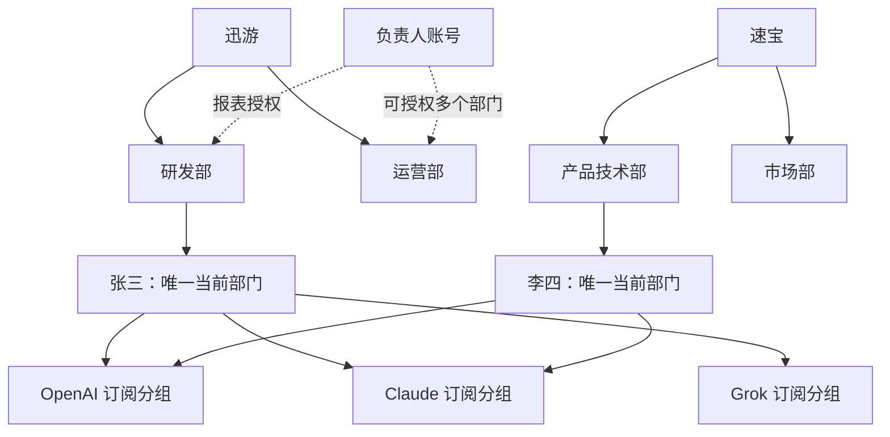
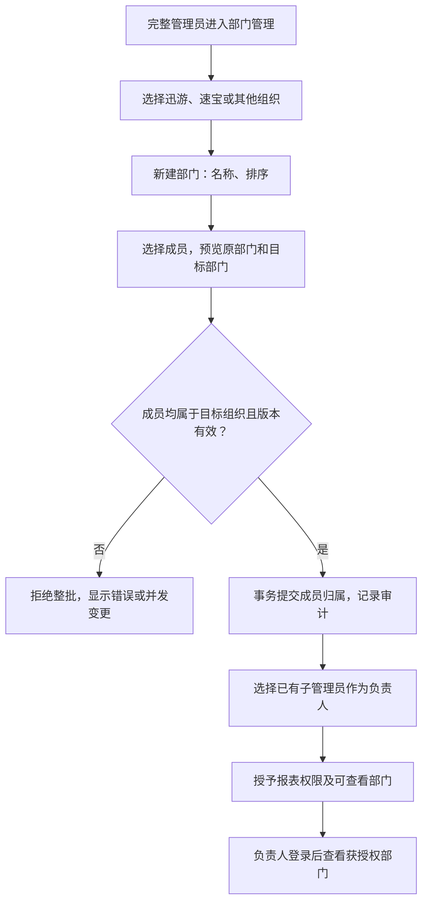
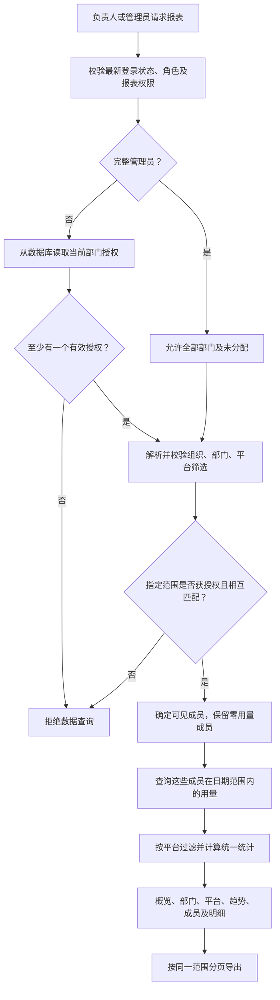
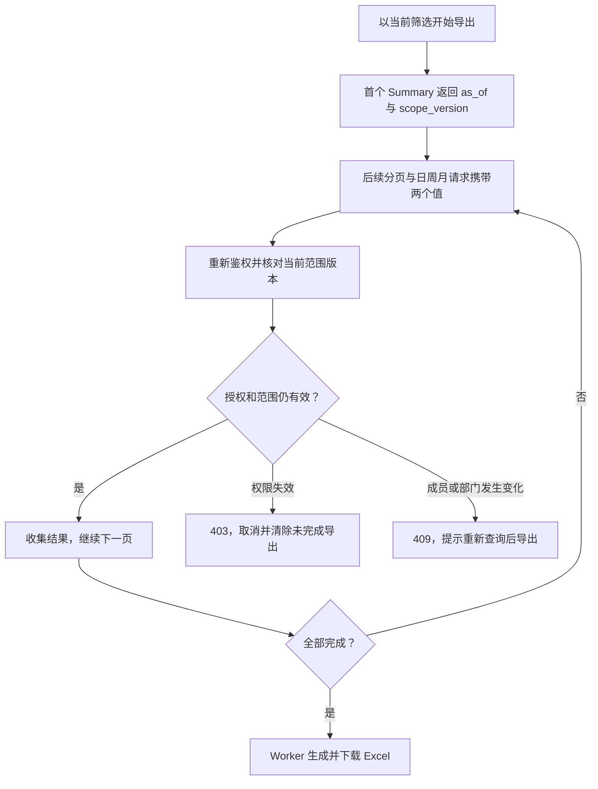

# 组织、部门与多平台用量报表设计

日期：2026-09-19。状态：**已授权按本方案实施，验收完成前不视为已落地**。

本方案基于当前工作区的组织报表、用户、订阅和子管理员实现。本文的新增字段、接口、页面、权限及验收目标均为设计，不代表现有能力。本轮只交付文档。

## 1. 方案摘要

采用“组织 → 部门 → 成员”的人员结构，保留现有 API 分组和平台订阅。部门用于人员归属与管理数据范围，订阅用于模型调用与额度，两套关系互相独立。

| 决策 | 首版建议 |
| --- | --- |
| 组织 | 沿用当前邮箱域名识别：迅游 `xunyou`、速宝 `wsdashi`、其他 `other` |
| 部门 | 同一套管理功能，每个组织独立配置一级部门；部门名称不写死 |
| 成员 | 每个用户最多一个当前部门，可同时持有多个平台订阅 |
| 负责人 | 复用 `sub_admin`，可查看/导出获授权部门报表，并保留部门内订阅额度重置；不能分配订阅 |
| 用量 | 默认汇总成员所有平台，可按现有有效平台口径筛选、拆分 |
| 历史 | 首版按当前成员归属统计；人员调岗后，历史用量随当前部门重新归类 |
| 导出 | 页面、日周月明细、Excel 使用同一授权及筛选口径 |
| 工作量 | 基础估算 **14–21 人日**；含约 20% 预留，建议排期 **17–26 人日**；包含订阅查询与重置的部门隔离 |

本次实施采用本文的“当前成员口径”。若后续改用于固定部门月度结算，再评审发生时归属，追加工作见第 12 节。

## 2. 已有基础与本次边界

| 已核对的现状 | 设计影响 |
| --- | --- |
| 组织按当前邮箱精确域名识别；不是独立组织实体 | 部门表直接保存组织键，不在首版建设通用组织管理系统 |
| 用户可关联多个授权分组、多个订阅；API Key 绑定分组 | 不从授权分组、订阅或 API Key 自动推导部门 |
| 组织报表已有 Summary、Periods、Trend 和 Excel Worker | 扩展已有链路，复用时间桶、峰值、分页及导出机制 |
| 当前组织汇总为固定三组织比较，忽略选中的组织筛选 | 新版所有返回区块统一按有效范围过滤，不返回范围外组织汇总 |
| 子管理员现有三项权限，没有组织报表权限及部门范围 | 增加独立权限，不复用具有全站查询能力的 `admin.usage` |
| 子管理员的订阅权限已允许单项全量/每日额度重置，以及按筛选批量重置每日额度 | 保留操作，增加部门数据隔离；不开放分配、延期、撤销、恢复或删除订阅 |
| 用量日志没有独立平台快照列；已有有效平台 SQL 表达式 | 复用其平台分类规则，保留“未知平台”，不按模型名猜平台 |
| 现有性能文档记录过 90 天峰值查询慢计划 | 开发时复测并预留优化风险；旧测量不是当前生产性能结论 |

首版包括部门管理、批量成员归属、负责人授权、部门报表、多平台筛选/汇总、Excel、部门内订阅查询与额度重置、审计和回归验证。多级部门、跨部门兼职、部门预算、审批、企业通讯录同步、任意新组织配置及财务结算历史不纳入首版。

## 3. 关系示意图

下图部门名称与人员均为示例；实际名称由各组织管理员配置。



同名部门可以存在于不同组织，由唯一部门 ID 区分。成员所属部门、负责人可查看部门是两种独立关系：负责人本人不必属于所有获授权部门。

## 4. 管理流程与页面

### 4.1 部门与成员配置



| 页面 | 操作与字段 | 权限 |
| --- | --- | --- |
| 部门管理 `/admin/departments` | 组织筛选、部门名称、状态、排序、成员数、负责人；新建、编辑、停用、恢复 | 完整管理员 |
| 部门成员弹窗 | 当前成员、搜索本组织用户、批量转入/移出；显示原部门、目标部门 | 完整管理员 |
| 用户管理 | 增加组织/部门列与筛选；批量分配部门。保留已有分组与订阅操作 | 完整管理员 |
| 负责人授权弹窗 | 选择已有 `sub_admin`，配置可查看部门；清楚展示其其他管理权限 | 完整管理员 |
| 组织用量报表 | 日期、组织、部门、平台、邮箱；概览、部门汇总、平台汇总、趋势、成员表、导出 | 管理员或已获部门报表授权的子管理员 |
| 现有订阅管理 | 负责人查询获授权部门成员的已有订阅，执行原有单项全量/每日重置、筛选批量每日重置 | 管理员或已获部门订阅权限的子管理员 |

普通用户不自选、不修改部门。授予负责人权限不隐式升级普通用户角色；管理员先通过现有用户管理将其设为子管理员。负责人可查看、导出部门报表及重置部门成员的订阅额度；不能创建分组、分配或变更订阅、修改额度上限、调整成员归属或授权。

### 4.1.1 新增独立的“部门管理”页面

管理后台侧栏新增一级菜单“部门管理”，放在“用户管理”之后，与其并列。路由为 `/admin/departments`，拟新增页面 `frontend/src/views/admin/DepartmentsView.vue`。该页面是部门及成员配置的主要入口，仅完整管理员可见、可访问；后端管理接口同样限制权限。

迅游和速宝共用这个页面，通过组织选择器切换数据，不分别建设页面。现有“组织用量报表”继续承担查询和导出，负责人直接进入报表。

| 页面区域 | 展示内容与操作 |
| --- | --- |
| 顶部筛选 | 组织选择、部门状态；组织选项包含迅游、速宝、其他，查看单个组织的部门 |
| 顶部操作 | “新增部门”；当前组织没有部门时显示空态及创建入口 |
| 部门列表 | 部门名称、状态、排序、成员数、负责人、操作；采用分页表格 |
| 每行操作 | 编辑、成员管理、负责人授权、停用/恢复、查看用量 |
| 编辑弹窗 | 新建时带入当前组织，填写名称和排序；编辑已有部门时所属组织只读 |
| 成员管理弹窗 | 查看当前成员，搜索并勾选本组织用户，批量转入或移出；提交前显示归属变化 |
| 负责人授权弹窗 | 展示本部门负责人，添加或撤销该部门范围，并配置报表与订阅重置权限；选择已有子管理员 |

点击“查看用量”跳转既有组织用量报表，并通过路由查询参数预选该组织与部门；报表页新增对这两个参数的解析及授权校验，日期采用默认当月。停用部门仍允许管理员查看已有成员与报表。

### 4.1.2 页面之间如何分工

| 入口 | 主要用途 | 典型操作 |
| --- | --- | --- |
| 新增部门管理页 | 从部门角度集中维护组织结构 | 创建研发部 → 批量加入成员 → 指定负责人 |
| 现有用户管理页 | 从用户角度维护账号及归属 | 找到张三 → 调整其部门；原订阅和分组配置继续保留 |
| 现有组织用量报表 | 查询与导出 | 选择研发部 → 查看各平台用量及成员明细 |
| 现有订阅管理页 | 查询已有订阅和重置额度 | 选择部门成员的具体订阅 → 重置全部或每日额度；也可按当前筛选批量重置每日额度 |

两个成员配置入口调用同一部门成员服务，不各自维护一套名单。移出部门只清空部门归属，不删除账号或取消订阅。部门行的负责人操作只增减当前部门授权，保存时保留该负责人在其他部门的授权，并按第 8 节的集合版本处理并发修改。

独立部门页面、成员弹窗和负责人弹窗已经计入第 12 节“前端页面”及对应后端工作包，本节是对原有范围的展开说明，不追加工作量。

### 4.2 部门生命周期

| 场景 | 规则 |
| --- | --- |
| 同组织重名 | 名称去首尾空格、按统一大小写规范比较后拒绝；停用部门也占用名称 |
| 不同组织同名 | 允许，所有关联使用 ID，不按名称匹配 |
| 修改所属组织 | 禁止；新建目标组织部门并迁移合法成员 |
| 停用部门 | 禁止新增成员和新增负责人授权；保留已有成员及授权，仍可查报表、执行已授权重置、移出成员、撤销授权 |
| 删除部门 | 首版不提供删除，只提供停用，避免成员和报表关联悬空 |
| 未分配成员 | `department_id = null`；管理员可查“未分配”，负责人不获得该范围 |
| 成员订阅到期 | 不改变部门归属；报表按用户状态和用量口径统计 |
| 跨组织邮箱变更 | 邮箱与部门调整在同一事务完成；不兼容旧部门时清空归属并审计，由管理员重新分配 |
| 用户停用、删除 | 报表沿用现有 active 且未删除用户口径；历史用量也不再出现在本管理报表中 |

跨组织邮箱变更需覆盖管理员更新与用户资料更新入口；仓储邮件更新边界统一兜底。任何遗漏入口产生的组织与部门不匹配记录，在报表查询时按“未分配”处理，不能进入原部门负责人的数据范围。

### 4.3 报表交互

| 访问情况 | 默认行为 |
| --- | --- |
| 完整管理员 | 全部组织、全部部门、全部平台；可依次下钻 |
| 仅有一个授权部门的负责人 | 自动选定该组织和部门，直接展示当月全部平台数据 |
| 同组织多个授权部门 | 默认该组织、“全部授权部门”；可切换具体部门 |
| 跨组织多个授权部门 | 默认“全部授权组织/部门”；选项只列被授权部门所属组织 |
| 有权限但无部门授权 | 显示“尚未配置可查看部门”；仅范围查询可返回空配置，数据查询拒绝 |

选择组织后才展示该组织的部门选项；切换组织清除原部门。部门变化刷新所有统计并把成员页码重置为 1；平台筛选同样作用于全部用量区块。重置只回到当前用户的授权默认范围。

选择一个组织、全部部门时，展示该组织可见部门及管理员可见的“未分配”汇总；选定单部门后只展示该部门数据。全部组织时展示授权范围内的组织汇总，不绘制全部部门长列表。

```text
日期：本月    组织：迅游    部门：研发部    平台：全部    邮箱：搜索

成员人数 / 活跃人数 / 请求数 / 总 Token / 实际消费
部门汇总                      平台汇总
用量趋势                      日 / 周 / 月峰值
成员表：邮箱 | 部门 | 请求 | Token | 实际消费 | 峰值
                                              导出 Excel
```

## 5. 数据模型

### 5.1 新增结构

| 数据对象 | 字段 | 约束 |
| --- | --- | --- |
| `departments` | `id`, `organization_key`, `name`, `status`, `sort_order`, `version`, `created_at`, `updated_at` | `organization_key` 沿用现有三键；部门归属组织不可修改；名称组织内唯一 |
| `users.department_id` | nullable bigint | 引用部门；一个用户一个当前部门；只通过部门成员服务写入 |
| `users.department_version` | bigint，默认 0 | 成员归属修改时递增，配合旧部门值校验，防止并发转岗覆盖 |
| `department_access_grants` | `user_id`, `department_id`, `created_by`, `created_at` | `(user_id, department_id)` 唯一；负责人可对应多个部门；报表与订阅操作共用范围 |

部门 `status` 使用 `active / inactive`，默认 active；名称长度 1–100 字符；排序默认 0，版本默认 0。成员与授权的部门外键禁止级联删除；部门首版不物理删除。成员版本在转岗、移出及跨组织邮箱变更清空归属时都必须递增。

组织键不是一张新组织表。通用性来自各组织使用相同部门数据结构和流程；若以后增加第三家正式公司，再单独扩展组织识别与配置。本版不宣称已支持任意组织自助创建。

### 5.2 索引与事务

| 项目 | 设计 |
| --- | --- |
| 部门重名 | 唯一索引 `(organization_key, lower(trim(name)))`，服务端同样归一化 |
| 部门列表 | `(organization_key, status, sort_order, id)` |
| 用户归属查询 | `(department_id, id)`，是否增加 active 部分索引由 EXPLAIN 决定 |
| 授权查询 | 主键 `(user_id, department_id)`；反向索引 `(department_id, user_id)` |
| 用量查询 | 优先复用既有 `(user_id, created_at)`；不预先假设必须新建大表索引 |
| 批量转岗 | 单次最多 200 人，ID 去重；按用户 ID 固定顺序锁行，重新检查组织、目标状态及部门版本，全部成功或全部回滚 |
| 授权变更 | 与选择的报表/部门订阅权限及审计原子提交；删除最后一个 grant 后可保留权限码，但数据查询与重置仍拒绝 |
| 通用用户更新 | 不接受任意部门字段覆盖；显式字段 mask 保留现有余额与并发计费保护 |

批量转岗携带每人的 `expected_department_id` 和 `expected_department_version`。相同状态的重复提交可返回无变化成功；任何真正冲突返回 409，并要求刷新预览。部门编辑使用 `version`。迁移只新增，不修改已应用文件；Ent 与 Wire 按仓库约束重新生成。

## 6. 权限与查询流程

新增权限码建议为 `admin.organization_usage` 和 `admin.department_subscriptions`。既有 `admin` 保持全量权限；部门负责人使用 `sub_admin`，分别获授报表与部门订阅权限，并共用 `department_access_grants` 中的部门范围。第二项权限复用现有订阅页面与重置动作，限定查询和操作对象。



核心约束：`最终范围 = 服务端授权范围 ∩ 用户筛选范围`。筛选只会缩小范围；省略筛选或传 `all` 不能扩大授权。

| 边界 | 处理 |
| --- | --- |
| 修改部门 ID 越权 | 数据接口返回 403，不返回该部门名称、人数或是否存在等额外信息 |
| 非法枚举、日期、ID 或组织部门组合 | 400；对负责人先做授权判断，避免越权对象信息泄露 |
| 撤销报表权限或部门授权 | 下一次请求重新读库即生效；已有在途响应或已下载文件不承诺追回 |
| 组织汇总、人数、峰值 | 与明细同范围；不能只限制人员表 |
| 筛选选项 | 新增专用 compact 范围接口；负责人不调用完整 `/admin/users`、`/admin/groups/all` 或部门管理接口 |
| 其他管理权限 | 不自动授予全站 `admin.usage`、`admin.subscriptions` 或 Token 分析权限；部门订阅操作使用独立的范围权限 |
| 仅限本部门账号 | 上线前检查其没有其他全站查询权限；`admin.department_subscriptions` 与全站 `admin.subscriptions` 互斥，服务端拒绝同时配置 |
| 普通成员 | 继续只查看个人用量；知道部门 ID 不产生管理权限 |
| Admin API Key | 沿用现有完整管理员语义，不能分发给部门负责人 |

首版不缓存负责人授权，避免引入跨实例撤权延迟。授权集合通过 `EXISTS` 或去重成员集合参与 SQL，避免 JOIN 多条 grant 或多份订阅导致消费翻倍。

### 6.1 负责人保留额度重置能力

此项为已确认的业务边界：主管理员维护分组、订阅分配及部门成员，负责人保留现有额度重置操作。新权限是部门范围的后端约束，不新增给负责人分配订阅的能力。

| 操作 | 主管理员 | 部门负责人 |
| --- | --- | --- |
| 查看订阅、额度进度 | 全部 | 获授权部门成员 |
| 重置单个订阅的日/周/月全部额度或仅每日额度 | 允许 | 获授权部门成员的具体订阅 |
| 按当前筛选批量重置每日额度 | 允许 | 当前筛选与授权部门的交集 |
| 分配、延期、撤销、恢复、删除订阅及通用批量动作 | 允许 | 拒绝 |
| 修改套餐额度上限、余额或 API 分组配置 | 按既有管理员权限 | 拒绝 |
| 编辑部门、调整成员、指定负责人 | 允许 | 拒绝 |

额度重置沿用现有订阅用量窗口语义，不修改历史 `usage_logs`、不清空报表消费、不修改套餐上限或延长订阅。多平台成员按选中的具体订阅重置；批量操作遵循当前已成功应用的部门、用户、分组、平台等筛选，不隐式重置该用户其他平台的所有订阅。

`admin.department_subscriptions` 是持久的受限权限类型；即使撤销报表权限、删除全部部门授权，订阅查询与重置也必须继续按部门模式处理，无授权则拒绝，绝不能回退全站。原有非部门子管理员的全站订阅权限保持原合同；将其配置成部门负责人时，由主管理员显式把全站订阅权限切换为部门订阅权限。

单项重置在同一事务内校验最新操作者权限、授权、订阅所属用户及当前部门，并锁定相关授权、成员与订阅行；转岗和撤权使用相容的锁顺序，避免“校验后转岗、随后仍重置”的间隙。批量重置锁定并绑定实际获授权的目标集合，原子更新执行时仍符合既有 active、未删除、未过期等条件的订阅，不接受客户端提交的可信授权 ID 集合。

筛选批量重置继续要求 `Idempotency-Key`，复用 `AtomicSuccess` 和提交后缓存失效；请求指纹覆盖部门筛选与实际授权范围，重放前再次校验当前授权。授权失效返回 403，范围变更返回 409，不能依旧权限继续执行。前端只有最新成功查询才能生成确认快照，加载或查询失败时禁止使用旧筛选重置；保留提交防重与审计。

## 7. 统计与历史口径

### 7.1 指标

| 指标 | 口径 |
| --- | --- |
| 成员人数 | 范围内 `status=active` 且未删除的用户，包含零用量用户；页面标签改为“成员人数”，可保留后端 `active_users` 字段兼容 |
| 活跃人数 | 上述成员中，在日期与平台条件内存在至少一条用量记录的人数，按用户去重 |
| 请求数 | 满足条件的 `usage_logs` 行数，沿用现有组织报表，不额外套用 `actual_cost > 0` 过滤 |
| Token | 输入、输出、缓存创建、缓存读取四项及其合计；沿用当前组织报表口径 |
| 消费 | `actual_cost` 合计，沿用现有单位；不重新计算账单，不使用上游账号成本替代 |
| 峰值与趋势 | 保留原有北京时间日期桶、周一周界、补零、裁剪和确定性并列规则 |
| 人员总数与分页 | 服务端先做部门与权限过滤，再 count、排序和分页 |
| 可加总性 | 请求、Token、费用可按平台加总；跨平台活跃人数不能相加，必须去重 |

平台筛选只限制用量，不改变部门成员总人数。例如研发部有 10 人，2 人使用 Grok：选择 Grok 后成员人数仍是 10，活跃人数是 2，其余成员显示零用量。

部门管理列表的成员数包含仍有关联的未删除用户，并区分启用/停用状态；报表成员人数只包含 active 用户，界面标注口径。

### 7.2 多平台处理

复用 `usageLogEffectivePlatformExpr` 的语义：普通分组优先取分组平台，缺失时回退上游账号平台；Composite 分组使用具体上游账号平台。关联读取不因分组或账号软删除而丢弃历史日志；无法识别的平台归入 `unknown`，计入总量。

平台名称沿用现有平台目录。GPT、Claude 是业务常用称呼，不新增基于模型名称的分类算法；例如由其他平台承载的 Claude 模型仍按当前有效平台分类。页面应标为“平台”，不是“模型家族”。

本口径依赖当前关联对象的配置，不是历史平台快照；修改平台配置可能改变旧日志的平台分类，需在报表说明中体现。如果需要严格历史归因，另做快照或配置版本方案。

### 7.3 调岗及历史

| 例子 | 首版结果 |
| --- | --- |
| 张三当前属于研发部，持有三种平台订阅 | 三个平台全部用量均计入研发部 |
| 张三今天转入运营部，查询上月报表 | 他的上月用量计入运营部，研发部负责人不再看到他的数据 |
| 张三尚未分配部门 | 管理员在该组织的“未分配”中查看；负责人不可见 |
| 张三订阅已过期，但用户仍 active | 仍是部门成员，已有用量照常统计 |
| 张三已停用或软删除 | 按当前组织报表规则排除，不作为历史财务账本 |

界面和 Excel 明示：“按当前成员及部门归属统计”。“全部部门”总量等于所选组织范围内各部门与未分配之和；前提是使用相同成员、日期、平台及邮箱筛选。

### 7.4 查询与导出一致性

`as_of` 继续只固定用量查询上界，不能冻结部门、用户状态或授权。单次 Summary 用只读一致性事务读取成员范围和各统计；多请求之间增加 `scope_version` 校验。

`scope_version` 是服务端对本次可见部门、成员 ID/邮箱/状态/归属及当前授权集合按固定顺序生成的不可读摘要。它不是授权凭证；每次仍重新鉴权。所有影响报表成员或标签的相关字段纳入摘要，不包含范围外部门的数据，避免无关变化影响负责人。



页面并行 Summary/Trend 时，Trend 的范围版本若与 Summary 不一致，整次加载重启一次；再次变化则提示刷新。人员翻页携带原版本，409 后清除过期结果再完整加载。保留现有 canonical `as_of` 对齐。

范围摘要解决成员及授权变化导致的混合导出，不冻结延迟写入或被清理的用量日志；首版仍是管理报表，不承诺数据库历史快照或财务封账一致性。

## 8. 接口设计草案

以下路径均以 `/api/v1` 为前缀；新增接口命名在实施时按现有 handler 约定确定。

### 8.1 管理接口

| 方法与路径 | 内容 | 权限 |
| --- | --- | --- |
| `GET /admin/departments` | 按组织、状态分页列部门；返回人数和版本 | 完整管理员 |
| `POST /admin/departments` | 新建；接收组织键、名称、排序 | 完整管理员 |
| `PUT /admin/departments/:id` | 修改名称、排序、状态；携带 `expected_version` | 完整管理员 |
| `GET /admin/departments/:id/members` | 成员名单与当前部门版本，支持用户状态过滤 | 完整管理员 |
| `POST /admin/departments/assign-members` | 批量设置 `department_id` 或 null；携带成员 ID 与预期旧版本 | 完整管理员 |
| `GET /admin/users/:id/department-scope` | 查询指定负责人的共享部门授权 | 完整管理员 |
| `PUT /admin/users/:id/department-scope` | 原子替换共享部门授权集合；携带原集合版本；只接受已是子管理员的目标用户 | 完整管理员 |

负责人配置明确展示“组织报表”和“部门订阅查询/额度重置”两项权限，标准负责人配置包含两项。保存非空授权集合时按管理员选择原子写入权限与范围，不隐式增加全站订阅权限；若目标已有全站订阅权限，必须明确切换，禁止两种订阅权限并存。并发权限变更采用最新值合并或 CAS，不能用旧数组覆盖其他管理员的修改。请求验证拒绝未知字段、无效 ID、重复/超限集合和组织不匹配；授予失败不留下半份授权。

成员批量接口采用显式用户 ID，首版不提供隐含“所有搜索结果”的后台大批处理。成员选择复用完整管理员用户列表，并扩展精确组织与部门筛选。

### 8.2 报表接口

| 方法与路径 | 变化 |
| --- | --- |
| `GET /admin/usage/organization-report/scope` | 新增；返回可见组织、部门和默认筛选，使用最小 DTO；无 grant 返回空配置 |
| `GET /admin/usage/organization-report/summary` | 扩展部门/平台/范围版本参数；增加部门和平台汇总、实际生效范围、`scope_version` |
| `GET /admin/usage/organization-report/periods` | 同一过滤与授权；日周月明细补部门标识及名称 |
| `GET /admin/usage/organization-report/trend` | 同一过滤与授权；保留补零时间轴 |

所有新增报表 GET 路由加入独立权限白名单；部门管理写路由不加入。路由守卫、侧栏、权限目录、中英文文案、登录默认跳转一起更新：仅持有部门报表与部门订阅权限的账号，在普通模式与 backend mode 优先进入组织报表，同时可进入既有订阅页；只有部门订阅权限时进入订阅页。其他账号保持原有 landing 顺序。

| 查询参数 | 定义 |
| --- | --- |
| `organization` | 沿用 `all / xunyou / wsdashi / other`；对负责人 `all` 仅表示授权组织 |
| `department_id` | 省略或 `all` 表示范围内全部部门；`unassigned` 仅管理员可用；其余必须是正整数 ID |
| 组织部门组合 | 指定数字部门或 `unassigned` 时必须同时指定一个组织；选中部门必须属于该组织 |
| `platform` | 省略或 `all`，或者当前平台目录中的值、`unknown`；非法值 400，不拼接任意 SQL |
| `scope_version` | 首次查询可省略；翻页、趋势续查与导出携带上次响应版本，不匹配返回 409 |
| 其他参数 | 沿用 `start_date`, `end_date`, `q`, `as_of`, 分页、排序及粒度合同 |

`scope` 返回可选择范围；Summary 返回实际应用范围，避免前端自行推断。负责人每个接口都必须检查报表权限和 grant，包括不传部门的请求。合法的空部门返回零值概览、空成员表和补零趋势，不回退全组织。

### 8.3 订阅查询与重置接口

| 方法与路径 | 部门权限下的要求 |
| --- | --- |
| `GET /admin/subscriptions/scope` | 返回订阅页可见组织/部门与默认筛选，复用内部部门范围服务，不依赖报表权限 |
| `GET /admin/subscriptions` | 复用现有列表，增加部门筛选，服务端先应用授权范围再排序分页 |
| `GET /admin/subscriptions/:id`、`/:id/progress` | 根据订阅所属用户校验当前部门，不只验证路由权限 |
| `GET /admin/users/:id/subscriptions`、`/admin/groups/:id/subscriptions` | 若页面调用，同样按部门收口；分组包含其他部门订阅时只返回获授权部分 |
| `GET /admin/subscriptions/search-users` | 新增订阅专用 compact 用户筛选，只返回授权部门成员，避免复用全站使用记录的用户搜索 |
| `GET /admin/subscriptions/search-groups` | 负责人仅获取其授权成员已有订阅涉及的分组 ID/名称 |
| `POST /admin/subscriptions/:id/reset-quota` | 复用原操作及请求体，事务内校验目标订阅所属部门 |
| `POST /admin/subscriptions/reset-daily-filtered` | 复用严格 JSON、幂等及原子成功合同，新增可选部门筛选与范围版本；实际授权由服务端注入 |

新部门订阅权限只放行这些确有需要的查询和两个重置 POST；未列出的订阅写操作继续拒绝。现有 GET/POST 必须接入部门范围，不能另做一个安全新入口却留下旧入口可绕过。现有订阅页面按“全站订阅权限或部门订阅权限”进入，再按具体权限解析范围；`canManageSubscriptions` 仍只允许完整管理员。

订阅专用选项与数据接口只要求相应订阅权限，不依赖报表权限是否仍存在。授权与范围读取复用内部服务，查询参数不能指定操作者或授权部门集合。部门模式的订阅列表回显 `scope_version`，批量重置必须携带最新成功查询保存的版本；全站管理员旧请求保持兼容。该版本检测成员范围变化，不代替事务中的最终授权检查。

## 9. 后端、前端与 Excel 改动

### 9.1 后端分层

| 模块 | 拟新增/修改 |
| --- | --- |
| 部门模块 | `DepartmentHandler / DepartmentService / DepartmentRepository`，负责部门、成员、授权与事务 |
| 部门范围服务 | 从受信登录主体解析权限和部门范围；供组织报表、订阅查询和重置共用，不接收客户端提供的授权列表 |
| 订阅服务与仓储 | 列表、详情、进度、筛选选项和两种重置路径接入部门范围，写入时原子校验归属与授权 |
| 组织用量服务 | 参数校验、范围版本、时间合同、统一响应；保留现有独立服务边界 |
| 组织用量仓储 | 从授权成员集合出发过滤，再关联日期范围内用量；所有聚合共享同一范围构造 |
| 用户仓储 | 部门专用原子更新、跨组织邮箱变更兜底；不影响通用余额与限额写入 |
| 审计 | 记录操作者、目标部门、成员 ID、变更前后归属和授权变化；不记录凭据 |

SQL 不以订阅表为统计主表，不把同一用户的三份订阅 JOIN 成三份用量。日期过滤保留原始 `created_at` 范围以使用索引；时区转换只用于后续分桶。Summary 内的总人数、部门总计、平台总计和成员结果使用相同的数据集合。

### 9.2 前端与导出

| 范围 | 改动 |
| --- | --- |
| 部门页面及弹窗 | 新增组织下部门列表、成员批量调整、负责人授权，复用 Select/Dialog/DataTable |
| 用户管理 | 部门列、组织/部门筛选、批量分配入口及并发冲突提示 |
| 订阅管理 | 复用现有页面及重置确认框，增加部门范围和专用选项；保留额度重置入口，负责人隐藏且禁止其他写操作 |
| 报表 Filters | 组织与部门联动；平台筛选；按授权默认值初始化 |
| 报表 Summary | 不再固定渲染三组织；增加当前组织下部门汇总与当前范围平台汇总 |
| 人员表 | 增加部门列，保留服务端排序分页和宽表横向滚动 |
| 页面状态 | 切换范围立即清除旧数据并取消旧请求；迟到响应不得覆盖新选择；403 清除受保护结果 |
| Excel | 原六个 Sheet 保留，增加“部门汇总”“平台汇总”；人员及周期明细增加部门列 |
| 导出元信息 | 记录组织、部门、平台、归属口径、生成时间、`as_of` 与范围版本 |
| 导出限制 | 保留 Worker、可取消、Excel 单表上限；100,000 行总预算扩展为所有数据 Sheet 合计，不漏算新增汇总 |

平台汇总只汇总当前筛选范围，不扩展首版为“每人每周期每平台”的第二套海量明细。单独选平台导出即可查看该平台的成员与日周月数据。所有 Sheet 只含本次授权数据，不向负责人导出全站背景对比。

### 9.3 主要代码落点

| 范围 | 现有路径或拟新增位置 |
| --- | --- |
| 数据模型 | `backend/ent/schema/user.go`；拟新增 department/grant schema；`backend/migrations/` |
| 部门链路 | `backend/internal/handler/admin/`、`backend/internal/service/`、`backend/internal/repository/` 下新增部门文件 |
| 报表 | `backend/internal/handler/admin/organization_usage_handler.go`、`backend/internal/service/organization_usage_service.go`、`backend/internal/repository/organization_usage_repo.go` |
| 订阅重置 | `backend/internal/handler/admin/subscription_handler.go`、`backend/internal/service/subscription_service.go`、`backend/internal/repository/user_subscription_repo.go`、`frontend/src/views/admin/SubscriptionsView.vue` 及对应 API/测试 |
| 鉴权及接线 | `backend/internal/service/admin_permission.go`、`backend/internal/server/middleware/admin_auth.go`、`backend/internal/server/routes/admin.go`、handler/provider Wire |
| 用户更新 | `backend/internal/service/admin_user.go`、`backend/internal/service/user_service.go`、user repository、管理 DTO |
| 前端 | `frontend/src/views/admin/OrganizationUsageView.vue`、`UsersView.vue`、`frontend/src/components/admin/organization-usage/`，新增部门页面/组件 |
| API 与导出 | `frontend/src/api/admin/organizationUsage.ts`、`frontend/src/utils/organizationUsageReport.ts`、对应 Worker 与测试 |
| 导航权限 | `frontend/src/router/index.ts`、`frontend/src/components/layout/AppSidebar.vue`、`frontend/src/utils/adminPermissions.ts`、类型及 i18n |

## 10. 初始化、上线与回退

| 顺序 | 动作 | 验收点 |
| --- | --- | --- |
| 1 | 加新增表及 nullable 部门字段，现有用户默认未分配 | 原订阅、API Key、调度和计费可继续使用 |
| 2 | 发布后端与前端；暂不向负责人授予报表权限 | 新老请求参数兼容，管理员可完成配置 |
| 3 | 分别建立迅游、速宝部门，按确认名单批量划分 | 同组织校验、未分配人数及分配结果可核对 |
| 4 | 管理员核对组织总量与部门合计，并测试三平台成员 | 总量守恒、不重复、不遗漏零用量成员 |
| 5 | 配置试点负责人，复核权限互斥与部门范围 | 菜单、直连接口、导出均无法查看未授权部门；单项与批量重置不能操作范围外订阅 |
| 6 | 逐步开放更多部门 | 异常率、SQL 耗时、导出成功率可观察 |

不直接按订阅组自动回填部门。可以将现有分组作为筛选辅助，由管理员确认名单；跨平台多个组、冲突归属和外部邮箱必须人工确认。

回退优先撤销新增部门报表与部门订阅权限并隐藏新入口；保留部门数据。应用回退前先撤销新权限码，避免旧版本无法识别，不能自动把部门订阅权限还原成全站权限。数据库采用前向迁移，不通过删除新表和字段回退；不用批量改订阅或清理用量来回退报表功能。

当前工作区包含尚未完成提交的上游合并。后续实施应在用户确认的稳定基线开始，避免把业务功能混入本次冲突合并；本设计不创建分支、不提交或部署。

## 11. 验收与验证计划

| 类别 | 必须覆盖 |
| --- | --- |
| 通用部门 | 两组织不同部门、跨组织同名、组织内重名拒绝、停用/恢复、未分配 |
| 成员变更 | 跨组织拒绝、批量全成全败、并发转岗 409、重复提交无副作用、跨组织邮箱变更 |
| 权限 | 普通用户拒绝；仅报表权限但无 grant 拒绝；多部门授权；省略参数、all、篡改 ID、越权邮箱搜索、所有明细及选项接口 |
| 额度重置 | 单项/筛选批量仅影响授权部门；多平台订阅不误重置；转岗/撤权并发、幂等重放、缓存失效、旧筛选快照失效；报表权限撤销或 grant 清空后不回退全站 |
| 写权限边界 | 部门负责人分配/延期/撤销/恢复/删除/通用批量订阅操作全部 403；部门与全站订阅权限互斥；重置后历史报表用量不变 |
| 隐蔽泄露 | 未授权组织的总人数、汇总、峰值、趋势、名称、导出 Sheet 均不返回 |
| 多平台 | 一人三个订阅但只统计一人；费用/Token 加总正确；Composite、软删除关联、unknown、零费用日志 |
| 人员口径 | 零用量保留、平台筛选不缩减成员总数、订阅过期不移除成员、停用用户按原口径排除 |
| 时间与历史 | 北京时间日界、周/月、366 天上限、部分周期、调岗后的当前归属语义 |
| 竞态及导出 | 切换组织清部门、取消旧请求、权限撤销、导出途中转岗或改名返回范围变化、八 Sheet 对账、100,000 行上限 |
| 回归 | API Key 分组访问、各平台订阅额度、计费结果、已有子管理员权限保持原合同 |
| 性能 | 30/90/366 天，全站/组织/部门/单平台，人员分页和导出均 EXPLAIN 与计时 |

性能目标在开发前按同一脱敏数据集和硬件固定。建议试点交互报表 p95 不超过 3 秒；这是验收目标，不是当前实测或容量承诺。若既有慢计划使目标无法达到，先定位查询形状，按风险项处理，不靠放宽超时冒充优化。

实施阶段运行受影响 Go 单测、真实 PostgreSQL integration、迁移与生成代码检查；前端运行 `pnpm lint:check`、`pnpm typecheck`、相关 Vitest 和 i18n 完整性测试；交付前按仓库门禁做整体回归与构建。Windows Go 缓存及串行执行方式遵循 `llm-wiki/wiki/ops.md`。

本轮只验证设计文档结构、链接、图示与估算一致性，未执行上述业务测试，也未连接生产数据。

## 12. 工作量与排期

估算基于熟悉本项目的开发人员，1 人日按约 8 小时有效工作计。包括编码、自测、评审修正、联调和上线准备；不含等待业务确认、生产审批及管理员整理真实人员名单。当前方案未通过生产数据压测，估算精度约为 ±30%。

| 工作包 | 主要内容 | 人日 |
| --- | --- | ---: |
| 数据建模与迁移 | 部门、成员字段、授权关系、索引、Ent/Wire | 1–1.5 |
| 部门与成员后端 | 管理 API、批量分配、并发控制、邮箱组织校验、审计 | 1.5–2 |
| 权限与数据范围 | 新权限、scope、所有查询隔离、撤权、landing | 2–3 |
| 报表后端 | 部门/平台筛选与汇总、统一统计、范围版本 | 2–3 |
| 前端页面 | 部门管理、用户归属、负责人授权、报表联动 | 2–3 |
| Excel | 新 Sheet、元信息、版本校验、取消与行数限制 | 1–1.5 |
| 部门订阅与重置隔离 | 复用查询/重置，补范围校验、并发/幂等、前端范围及专项回归 | 2–3 |
| 联调与验证 | 权限负向测试、数据库集成、多平台对账、性能复测、回归 | 2–3 |
| 文档及上线准备 | Wiki、初始化说明、试点验收、回退步骤 | 0.5–1 |
| **基础合计** | **按本文完整首版范围** | **14–21** |
| **建议预算** | **基础上增加约 20% 风险预留并取整** | **17–26** |

| 人员配置 | 预计日历时间 | 说明 |
| --- | --- | --- |
| 1 名熟悉项目的全栈开发 | 约 3.5–5.5 个工作周 | 按每周 5 天，包含建议预留；不把等待时间视为开发产出 |
| 1 后端 + 1 前端，测试协同 | 约 2.5–3.5 个工作周 | API 合同确定后可并行；人日不会简单减半 |

| 可选扩展或风险 | 追加量级 | 是否包含在基础范围 |
| --- | ---: | --- |
| 按用量发生时部门归属、任职生效区间及历史查询 | +4–7 人日 | 否；需重新明确零用量人数与离职用户的历史口径，无证据旧历史不能准确回填 |
| 多级部门及父部门汇总/授权继承 | +3–5 人日 | 否 |
| 负责人自行管理成员及对应权限/审计 | +2–3 人日 | 否 |
| 重构任意组织配置与邮箱映射 | +2–4 人日 | 否 |
| 独立治理现有峰值 SQL 或大型导出性能问题 | +2–4 人日 | 基础含复测与必要小调整，大型重构不含；先使用预留，超出再调整排期 |
| 真实名单清理及初始化 | 取决于成员规模与名单质量 | 管理工作，不计入开发人日；本轮没有人员数据，不能给准确值 |

可按四个可验收阶段交付：① 部门与成员维护；② 负责人授权、部门报表和订阅额度重置隔离；③ 平台拆分与 Excel；④ 权限、对账及性能验收。只有完成第二阶段的查询与写入后端隔离，才向负责人开放试点。

## 13. 评审决策与已确认边界

| 决策 | 本文建议 | 改变后的影响 |
| --- | --- | --- |
| 历史归属 | 当前成员口径，用于日常团队管理 | 若用于部门结算，改发生时归属并追加排期 |
| 部门层级 | 一级部门、每人一个主部门 | 多级或多部门兼职会改变权限继承、去重及汇总 |
| 负责人职责（已确认） | 查看、导出及重置获授权部门成员的订阅额度；不能分配订阅 | 部门成员与订阅分配仍由完整管理员维护；已计入重置范围隔离成本 |

## 14. 现有实现参考

- [原组织用量报表设计](organization-usage-report-design-cn.md)
- [趋势图设计](organization-usage-trend-chart-design-cn.md)
- [已有 PostgreSQL 性能基线](organization-usage-report-performance-cn.md)
- [组织用量仓储](../../backend/internal/repository/organization_usage_repo.go)
- [组织用量服务](../../backend/internal/service/organization_usage_service.go)
- [子管理员权限目录](../../backend/internal/service/admin_permission.go)
- [有效平台口径](../../backend/internal/repository/usage_log_repo.go)
- [用户 schema](../../backend/ent/schema/user.go)
- [API Key schema](../../backend/ent/schema/api_key.go)
- [用户订阅 schema](../../backend/ent/schema/user_subscription.go)
- [报表前端 API 与导出数据获取](../../frontend/src/api/admin/organizationUsage.ts)
- [报表组件说明](../../frontend/src/components/admin/organization-usage/README.md)
