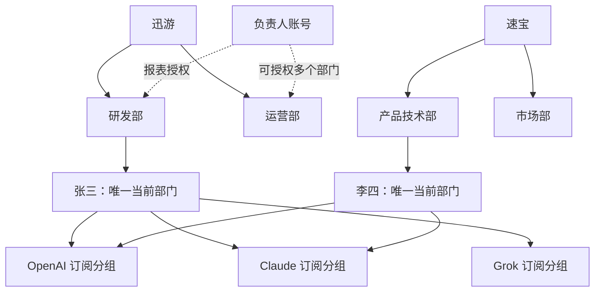
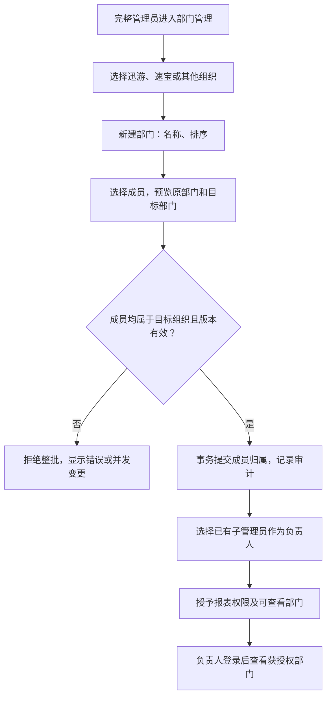
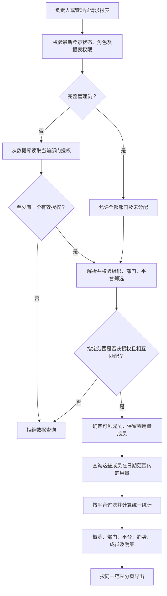
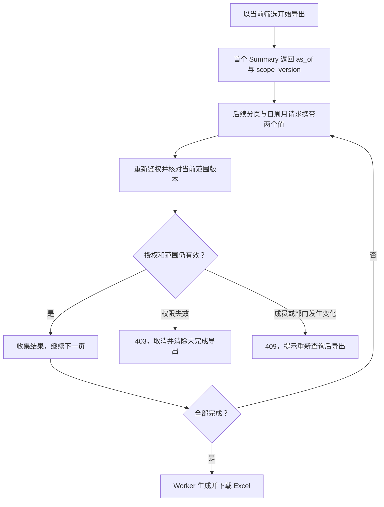

# 组织、部门与多平台用量报表设计

更新：2026-09-20。状态：**S1–S6 已完成，RV1–RV8 本机隔离验收通过；未推送、未部署，部门功能未合回 main。**

实现位于 `feature/hy/10207_department_usage`。本文记录已实现合同；成员创建时间上界与 SQL 内摘要两个备选未启用。另一任务的人员截图/Excel 调整不计入本次验收及提交。

配套文档：[实施方案](organization-department-usage-implementation-plan-cn.md)、[第二轮审核](organization-department-usage-design-review-cn.md)、[验收清单](../delivery/2026-09-19-department-usage/acceptance.md)、[既有性能记录](../delivery/2026-09-19-department-usage/performance.md)。历史实施证据见第 15 节，原始工作量预算见第 12 节。

## 1. 方案摘要

采用“组织 → 部门 → 成员”的人员结构，保留现有 API 分组和平台订阅。部门用于人员归属与管理数据范围，订阅用于模型调用与额度，两套关系互相独立。

| 决策 | 首版目标合同 |
| --- | --- |
| 组织 | 沿用当前邮箱域名识别：迅游 `xunyou`、速宝 `wsdashi`、其他 `other` |
| 部门 | 同一套管理功能，每个组织独立配置一级部门；部门名称不写死 |
| 成员 | 每个用户最多一个当前部门，可同时持有多个平台订阅 |
| 负责人 | 复用 `sub_admin`，可查看/导出获授权部门报表，并保留部门内订阅额度重置；不能分配订阅 |
| 用量 | 默认汇总成员所有平台，可按现有有效平台口径筛选、拆分 |
| 历史 | 首版按当前成员归属统计；人员调岗后，历史用量随当前部门重新归类 |
| 导出 | 页面、日周月明细、Excel 使用同一授权及筛选口径 |
| 工作量 | 基础估算 **14–21 人日**；含约 20% 预留，建议排期 **17–26 人日**；包含订阅查询与重置的部门隔离 |

本次实施采用本文的“当前成员口径”。若后续改用于固定部门月度结算，再评审发生时归属，追加工作见第 12 节。

## 2. 已有基础与本次边界

| 功能开发前的基础 | 设计影响 |
| --- | --- |
| 组织按当前邮箱精确域名识别；不是独立组织实体 | 部门表直接保存组织键，不在首版建设通用组织管理系统 |
| 用户可关联多个授权分组、多个订阅；API Key 绑定分组 | 不从授权分组、订阅或 API Key 自动推导部门 |
| 组织报表已有 Summary、Periods、Trend 和 Excel Worker | 扩展已有链路，复用时间桶、峰值、分页及导出机制 |
| 当前组织汇总为固定三组织比较，忽略选中的组织筛选 | 新版所有返回区块统一按有效范围过滤，不返回范围外组织汇总 |
| 子管理员现有三项权限，没有组织报表权限及部门范围 | 增加独立权限，不复用具有全站查询能力的 `admin.usage` |
| 子管理员的订阅权限已允许单项全量/每日额度重置，以及按筛选批量重置每日额度 | 保留操作，增加部门数据隔离；不开放分配、延期、撤销、恢复或删除订阅 |
| 用量日志没有独立平台快照列；已有有效平台 SQL 表达式 | 复用其平台分类规则，保留“未知平台”，不按模型名猜平台 |
| 现有性能文档记录过 90 天峰值查询慢计划 | 开发时复测并预留优化风险；旧测量不是当前生产性能结论 |

首版包括部门管理、批量成员归属、负责人授权、部门报表、多平台筛选/汇总、Excel、部门内订阅查询与额度重置、审计和回归验证。多级部门、跨部门兼职、部门预算、审批、企业通讯录同步、任意新组织配置及财务结算历史不纳入首版。

## 3. 关系示意图

下图部门名称与人员均为示例；实际名称由各组织管理员配置。


```mermaid
flowchart TD
    O1["迅游"] --> D1["研发部"]
    O1 --> D2["运营部"]
    O2["速宝"] --> D3["产品技术部"]
    O2 --> D4["市场部"]
    D1 --> U1["张三：唯一当前部门"]
    D3 --> U2["李四：唯一当前部门"]
    U1 --> S1["OpenAI 订阅分组"]
    U1 --> S2["Claude 订阅分组"]
    U1 --> S3["Grok 订阅分组"]
    U2 --> S1
    U2 --> S2
    L1["负责人账号"] -. "报表授权" .-> D1
    L1 -. "可授权多个部门" .-> D2
```

同名部门可以存在于不同组织，由唯一部门 ID 区分。成员所属部门、负责人可查看部门是两种独立关系：负责人本人不必属于所有获授权部门。

## 4. 管理流程与页面

### 4.1 部门与成员配置


```mermaid
flowchart TD
    A["完整管理员进入部门管理"] --> B["选择迅游、速宝或其他组织"]
    B --> C["新建部门：名称、排序"]
    C --> D["选择成员，预览原部门和目标部门"]
    D --> E{"成员均属于目标组织且版本有效？"}
    E -- "否" --> F["拒绝整批，显示错误或并发变更"]
    E -- "是" --> G["事务提交成员归属，记录审计"]
    G --> H["选择已有子管理员作为负责人"]
    H --> I["授予报表权限及可查看部门"]
    I --> J["负责人登录后查看获授权部门"]
```

| 页面 | 操作与字段 | 权限 |
| --- | --- | --- |
| 部门管理 `/admin/departments` | 组织筛选、部门名称、状态、排序、成员数、负责人；新建、编辑、停用、恢复 | 完整管理员 |
| 部门成员弹窗 | 当前成员、搜索本组织用户、批量转入/移出；显示原部门、目标部门 | 完整管理员 |
| 用户管理 | 增加组织/部门列与筛选；批量分配部门。保留已有分组与订阅操作 | 完整管理员 |
| 负责人授权弹窗 | 选择已有 `sub_admin`，配置可查看部门；清楚展示其其他管理权限 | 完整管理员 |
| 组织用量报表 | 日期、组织、部门、平台、邮箱；概览、部门汇总、平台汇总、趋势、成员表、导出 | 管理员或已获部门报表授权的子管理员 |
| 现有订阅管理 | 负责人查询获授权部门成员的已有订阅，执行原有单项全量/每日重置、筛选批量每日重置 | 管理员或已获部门订阅权限的子管理员 |

普通用户不自选、不修改部门。授予负责人权限不隐式升级普通用户角色；管理员先通过现有用户管理将其设为子管理员。负责人可查看、导出部门报表及重置部门成员的订阅额度；不能创建分组、分配或变更订阅、修改额度上限、调整成员归属或授权。

### 4.1.1 新增独立的“部门管理”页面

管理后台侧栏新增一级菜单“部门管理”，放在“用户管理”之后，与其并列。路由为 `/admin/departments`，新增页面 `frontend/src/views/admin/DepartmentsView.vue`。该页面是部门及成员配置的主要入口，仅完整管理员可见、可访问；后端管理接口同样限制权限。

迅游和速宝共用这个页面，通过组织选择器切换数据，不分别建设页面。现有“组织用量报表”继续承担查询和导出，负责人直接进入报表。

| 页面区域 | 展示内容与操作 |
| --- | --- |
| 顶部筛选 | 组织选择、部门状态；组织选项包含迅游、速宝、其他，查看单个组织的部门 |
| 顶部操作 | “新增部门”；当前组织没有部门时显示空态及创建入口 |
| 部门列表 | 部门名称、状态、排序、成员数、负责人、操作；采用分页表格 |
| 每行操作 | 编辑、成员管理、负责人授权、停用/恢复、查看用量 |
| 编辑弹窗 | 新建时带入当前组织，填写名称和排序；编辑已有部门时所属组织只读 |
| 成员管理弹窗 | 查看当前成员，搜索并勾选本组织用户，批量转入或移出；提交前显示归属变化 |
| 负责人授权弹窗 | 展示本部门负责人，添加或撤销该部门范围，并配置报表与订阅重置权限；选择已有子管理员 |

点击“查看用量”跳转既有组织用量报表，并通过路由查询参数预选该组织与部门；报表页新增对这两个参数的解析及授权校验，日期采用默认当月。停用部门仍允许管理员查看已有成员与报表。

### 4.1.2 页面之间如何分工

| 入口 | 主要用途 | 典型操作 |
| --- | --- | --- |
| 新增部门管理页 | 从部门角度集中维护组织结构 | 创建研发部 → 批量加入成员 → 指定负责人 |
| 现有用户管理页 | 从用户角度维护账号及归属 | 找到张三 → 调整其部门；原订阅和分组配置继续保留 |
| 现有组织用量报表 | 查询与导出 | 选择研发部 → 查看各平台用量及成员明细 |
| 现有订阅管理页 | 查询已有订阅和重置额度 | 选择部门成员的具体订阅 → 重置全部或每日额度；也可按当前筛选批量重置每日额度 |

两个成员配置入口调用同一部门成员服务，不各自维护一套名单。移出部门只清空部门归属，不删除账号或取消订阅。部门行的负责人操作只增减当前部门授权，保存时保留该负责人在其他部门的授权，并按第 8 节的集合版本处理并发修改。

独立部门页面、成员弹窗和负责人弹窗已经计入第 12 节“前端页面”及对应后端工作包，本节是对原有范围的展开说明，不追加工作量。

### 4.2 部门生命周期

| 场景 | 规则 |
| --- | --- |
| 同组织重名 | 名称去首尾空格、按统一大小写规范比较后拒绝；停用部门也占用名称 |
| 不同组织同名 | 允许，所有关联使用 ID，不按名称匹配 |
| 修改所属组织 | 禁止；新建目标组织部门并迁移合法成员 |
| 停用部门 | 禁止新增成员和新增负责人授权；保留已有成员及授权，仍可查报表、执行已授权重置、移出成员、撤销授权 |
| 删除部门 | 首版不提供删除，只提供停用，避免成员和报表关联悬空 |
| 未分配成员 | `department_id = null`；管理员可查“未分配”，负责人不获得该范围 |
| 成员订阅到期 | 不改变部门归属；报表按用户状态和用量口径统计 |
| 跨组织邮箱变更 | 邮箱与部门调整在同一事务完成；不兼容旧部门时清空归属并审计，由管理员重新分配 |
| 用户停用、删除 | 报表沿用现有 active 且未删除用户口径；历史用量也不再出现在本管理报表中 |
| 负责人角色降级 | 离开 `sub_admin` 时，角色/权限变化、删除其持有的 grants 与审计在同一事务完成；重新提权不恢复旧授权 |
| 负责人软删除 | 同事务清其持有的 grants；其他记录的 `created_by` 保留。当前用户删除为软删除，不触发用户外键物理删除限制 |
| 负责人临时停用 | 立即禁止管理访问；保留授权关系，恢复后按最新权限与既有授权访问，不等同角色降级 |

上述授权清理已在用户更新/软删除事务中实现并有真实 PostgreSQL 验证。角色、授权更新和清理共用并发保护，避免降级/删除完成后被在途授权写回复活；未来物理删除需另行设计 `created_by` 等外键清理。

跨组织邮箱变更需覆盖管理员更新与用户资料更新入口；仓储邮件更新边界统一兜底。任何遗漏入口产生的组织与部门不匹配记录，在报表查询时按“未分配”处理，不能进入原部门负责人的数据范围。

### 4.3 报表交互

| 访问情况 | 默认行为 |
| --- | --- |
| 完整管理员 | 全部组织、全部部门、全部平台；可依次下钻 |
| 仅有一个授权部门的负责人 | 自动选定该组织和部门，直接展示当月全部平台数据 |
| 同组织多个授权部门 | 默认该组织、“全部授权部门”；可切换具体部门 |
| 跨组织多个授权部门 | 默认“全部授权组织/部门”；选项只列被授权部门所属组织 |
| 有权限但无部门授权 | 显示“尚未配置可查看部门”；仅范围查询可返回空配置，数据查询拒绝 |

选择组织后才展示该组织的部门选项；切换组织清除原部门。部门变化刷新所有统计并把成员页码重置为 1；平台筛选同样作用于全部用量区块。重置只回到当前用户的授权默认范围。

选择一个组织、全部部门时，展示该组织可见部门及管理员可见的“未分配”汇总；选定单部门后只展示该部门数据。全部组织时展示授权范围内的组织汇总，不绘制全部部门长列表。

`other` 的“未分配”仅包含当前筛选内 active、未删除且没有部门归属的其他域名成员；已经分配到 `other` 下部门的人进入对应部门。该桶用于识别待分配成员，不等于全部非公司邮箱用户，也不默认隐藏。

```text
日期：本月    组织：迅游    部门：研发部    平台：全部    邮箱：搜索

成员人数 / 活跃人数 / 请求数 / 总 Token / 实际消费
部门汇总                      平台汇总
用量趋势                      日 / 周 / 月峰值
成员表：邮箱 | 部门 | 请求 | Token | 实际消费 | 峰值
                                              导出 Excel
```

## 5. 数据模型

### 5.1 新增结构

| 数据对象 | 字段 | 约束 |
| --- | --- | --- |
| `departments` | `id`, `organization_key`, `name`, `status`, `sort_order`, `version`, `created_at`, `updated_at` | `organization_key` 沿用现有三键；部门归属组织不可修改；名称组织内唯一 |
| `users.department_id` | nullable bigint | 引用部门；一个用户一个当前部门；只通过部门成员服务写入 |
| `users.department_version` | bigint，默认 0 | 成员归属修改时递增，配合旧部门值校验，防止并发转岗覆盖 |
| `department_access_grants` | `user_id`, `department_id`, `created_by`, `created_at` | `(user_id, department_id)` 唯一；负责人可对应多个部门；报表与订阅操作共用范围 |

部门 `status` 使用 `active / inactive`，默认 active；名称长度 1–100 字符；排序默认 0，版本默认 0。成员与授权的部门外键禁止级联删除；部门首版不物理删除。成员版本在转岗、移出及跨组织邮箱变更清空归属时都必须递增。

组织键不是一张新组织表。通用性来自各组织使用相同部门数据结构和流程；若以后增加第三家正式公司，再单独扩展组织识别与配置。本版不宣称已支持任意组织自助创建。

新增正式组织需同步 Go 组织目录、报表 SQL、订阅域名匹配、前端选项及测试，并追加迁移更新组织 CHECK 与邮箱归属触发器；不得改写已应用迁移。本轮仅明确改动清单，不建设新的组织配置平台。

migration 240 的审计触发器依赖 `audit_logs` 可用列及默认值；修改审计表结构时复验现有邮箱变更审计集成用例。清归属与审计同事务，不能吞掉审计异常后继续主操作。

### 5.2 索引与事务

| 项目 | 设计 |
| --- | --- |
| 部门重名 | 唯一索引 `(organization_key, lower(trim(name)))`，服务端同样归一化 |
| 部门列表 | `(organization_key, status, sort_order, id)` |
| 用户归属查询 | `(department_id, id)`，是否增加 active 部分索引由 EXPLAIN 决定 |
| 授权查询 | 主键 `(user_id, department_id)`；反向索引 `(department_id, user_id)` |
| 用量查询 | 优先复用既有 `(user_id, created_at)`；不预先假设必须新建大表索引 |
| 批量转岗 | 单次最多 200 人，ID 去重；按用户 ID 固定顺序锁行，重新检查组织、目标状态及部门版本，全部成功或全部回滚 |
| 授权变更 | 与选择的报表/部门订阅权限及审计原子提交；删除最后一个 grant 后可保留权限码，但数据查询与重置仍拒绝 |
| 通用用户更新 | 不接受任意部门字段覆盖；显式字段 mask 保留余额与并发计费保护；权限/角色更新与部门授权入口共用原子版本校验，见第 6.2 节 |

批量转岗携带每人的 `expected_department_id` 和 `expected_department_version`。相同状态的重复提交可返回无变化成功；任何真正冲突返回 409，并要求刷新预览。部门编辑使用 `version`。迁移只新增，不修改已应用文件；Ent 与 Wire 按仓库约束重新生成。

## 6. 权限与查询流程

新增权限码为 `admin.organization_usage` 和 `admin.department_subscriptions`。既有 `admin` 保持全量权限；部门负责人使用 `sub_admin`，分别获授报表与部门订阅权限，并共用 `department_access_grants` 中的部门范围。第二项权限复用现有订阅页面与重置动作，限定查询和操作对象。


```mermaid
flowchart TD
    A["负责人或管理员请求报表"] --> B["校验最新登录状态、角色及报表权限"]
    B --> C{"完整管理员？"}
    C -- "是" --> D["允许全部部门及未分配"]
    C -- "否" --> E["从数据库读取当前部门授权"]
    E --> F{"至少有一个有效授权？"}
    F -- "否" --> X["拒绝数据查询"]
    F -- "是" --> G["解析并校验组织、部门、平台筛选"]
    D --> G
    G --> H{"指定范围是否获授权且相互匹配？"}
    H -- "否" --> X
    H -- "是" --> I["确定可见成员，保留零用量成员"]
    I --> J["查询这些成员在日期范围内的用量"]
    J --> K["按平台过滤并计算统一统计"]
    K --> L["概览、部门、平台、趋势、成员及明细"]
    L --> M["按同一范围分页导出"]
```

核心约束：`最终范围 = 服务端授权范围 ∩ 用户筛选范围`。筛选只会缩小范围；省略筛选或传 `all` 不能扩大授权。

| 边界 | 处理 |
| --- | --- |
| 修改部门 ID 越权 | 数据接口返回 403，不返回该部门名称、人数或是否存在等额外信息 |
| 非法枚举、日期、ID 或组织部门组合 | 400；对负责人先做授权判断，避免越权对象信息泄露 |
| 撤销报表权限或部门授权 | 下一次请求重新读库即生效；已有在途响应或已下载文件不承诺追回 |
| 组织汇总、人数、峰值 | 与明细同范围；不能只限制人员表 |
| 筛选选项 | 新增专用 compact 范围接口；负责人不调用完整 `/admin/users`、`/admin/groups/all` 或部门管理接口 |
| 其他管理权限 | 不自动授予全站 `admin.usage`、`admin.subscriptions` 或 Token 分析权限；部门订阅操作使用独立的范围权限 |
| 仅限本部门账号 | 上线前检查其没有其他全站查询权限；`admin.department_subscriptions` 与全站 `admin.subscriptions` 互斥，服务端拒绝同时配置 |
| 普通成员 | 继续只查看个人用量；知道部门 ID 不产生管理权限 |
| Admin API Key | 沿用现有完整管理员语义，不能分发给部门负责人 |

首版不缓存负责人授权，避免引入跨实例撤权延迟。授权集合通过 `EXISTS` 或去重成员集合参与 SQL，避免 JOIN 多条 grant 或多份订阅导致消费翻倍。

### 6.1 负责人保留额度重置能力

此项为已确认的业务边界：主管理员维护分组、订阅分配及部门成员，负责人保留现有额度重置操作。新权限是部门范围的后端约束，不新增给负责人分配订阅的能力。

| 操作 | 主管理员 | 部门负责人 |
| --- | --- | --- |
| 查看订阅、额度进度 | 全部 | 获授权部门成员 |
| 重置单个订阅的日/周/月全部额度或仅每日额度 | 允许 | 获授权部门成员的具体订阅 |
| 按当前筛选批量重置每日额度 | 允许 | 当前筛选与授权部门的交集 |
| 分配、延期、撤销、恢复、删除订阅及通用批量动作 | 允许 | 拒绝 |
| 修改套餐额度上限、余额或 API 分组配置 | 按既有管理员权限 | 拒绝 |
| 编辑部门、调整成员、指定负责人 | 允许 | 拒绝 |

额度重置沿用现有订阅用量窗口语义，不修改历史 `usage_logs`、不清空报表消费、不修改套餐上限或延长订阅。多平台成员按选中的具体订阅重置；批量操作遵循当前已成功应用的部门、用户、分组、平台等筛选，不隐式重置该用户其他平台的所有订阅。

`admin.department_subscriptions` 是持久的受限权限类型；即使撤销报表权限、删除全部部门授权，订阅查询与重置也必须继续按部门模式处理，无授权则拒绝，绝不能回退全站。原有非部门子管理员的全站订阅权限保持原合同；将其配置成部门负责人时，由主管理员显式把全站订阅权限切换为部门订阅权限。

单项重置在同一事务内校验最新操作者权限、授权、订阅所属用户及当前部门，按 ID 顺序锁定操作者和成员，订阅 UPDATE 获取订阅行锁；转岗和撤权使用相容的锁顺序，避免“校验后转岗、随后仍重置”的间隙。批量重置锁定并绑定实际获授权的目标集合，原子更新执行时仍符合既有 active、未删除、未过期等条件的订阅，不接受客户端提交的可信授权 ID 集合。

筛选批量重置继续要求 `Idempotency-Key`，复用 `AtomicSuccess` 和提交后缓存失效；请求指纹覆盖部门筛选与实际授权范围，重放前再次校验当前授权。授权失效返回 403，范围变更返回 409，不能依旧权限继续执行。前端只有最新成功查询才能生成确认快照，加载或查询失败时禁止使用旧筛选重置；保留提交防重与审计。

锁范围按实际候选订阅成员收窄，锁内重新鉴权并复用范围结果，避免重复全量解析；出现未锁定的新候选则返回范围变化，不扩大写入。成员分配单次 200 人限制不作为部门总人数或筛选批量重置上限。

当前两条路径的锁序如下；表中计费双表顺序是仓储两个写分支的顺序，不表示现有每次计费都会写两张表。

| 路径 | 获取锁的顺序 | 当前约束与失效条件 |
| --- | --- | --- |
| 需要成员串行保护的额度重置 | `users` → `user_subscriptions`；用户行按 ID 升序锁定 | 与撤权、转岗在用户行串行，随后更新订阅额度 |
| 计费仓储的两个费用分支 | `user_subscriptions` → `users` | 网关 command 构造在订阅费用与余额费用之间二选一，因此当前请求只进入一侧；若未来同一事务混合扣费，两种锁序可能形成 AB-BA 死锁 |

当前未出现上述双表锁环依赖 command 二选一，不是仓储强约束，也不是对所有并发路径无死锁的证明。RV5 同时验证 command 费用互斥和真实 PG 中重置与余额扣费、撤权、转岗及角色/状态/邮箱变化；未来引入混合扣费前须重新统一锁序并扩充回归。本次保留行锁协议，不直接改为 advisory lock；仅改三个入口无法覆盖全部归属和权限写入。

### 6.2 权限修改的统一并发合同（已实现）

| 入口 | 规则 |
| --- | --- |
| 用户详情 | 返回 `admin_access_version`，对应同一快照下的目标用户 ID、角色、规范化权限与排序后的 grant ID 集合 |
| `PUT /admin/users/:id` | 显式提交 `role/admin_permissions` 必须携带 `expected_admin_access_version`；资料保存只提交实际改动，不附带旧权限数组 |
| `PUT /admin/users/:id/department-scope` | 沿用 `expected_version` 字段，采用同一授权版本规则；不保留两个互不相通的并发检查 |
| 写入原子性 | 同事务按统一顺序锁定相关用户、重读最新权限/grants、比对版本，再更新和审计；不能在锁外预读比对后直接覆盖 |
| 冲突与兼容 | 缺版本 400、过期 409，无写入副作用；前后端同步。只更新普通资料的旧请求兼容，旧权限修改请求需补版本 |

有部门 grant 不意味着有部门订阅权限。允许显式配置“部门报表 + 全站订阅”的一般子管理员组合，但不能把它标成“仅限本部门负责人”；禁止两种订阅权限并存和旧窗口隐式恢复全站权限。完整管理员携带当前版本明确调整权限的正常操作继续支持。

`UserEditModal.vue` 已改为以下流程：每次打开/切换用户调用 `GET /admin/users/:id` 获取详情与 `admin_access_version`，保存详情作为未编辑基线；只有角色或规范化权限集合实际变化时，才提交 role、权限集合及预期版本。仅修改备注等资料时不附带这三项，详情加载失败不能退回列表旧快照继续保存。

### 6.3 管理员查询优化的边界（已实现）

完整管理员、Admin API Key 及持全站订阅权限的子管理员，在未指定部门的普通订阅查询中，经最新鉴权后无需加载全站成员来证明其不受部门限制。管理员指定部门或“未分配”时仍必须执行组织/部门筛选，不能一律短路掉过滤。

管理员写操作只移除为部门限制而添加的不必要成员范围扫描与批量锁；操作者权限、目标订阅和原子更新需要的锁与事务仍保留。报表与负责人路径保持同范围查询及必要一致性，不能仅为性能而绕过鉴权或幂等校验。

## 7. 统计与历史口径

### 7.1 指标

| 指标 | 口径 |
| --- | --- |
| 成员人数 | 范围内 `status=active` 且未删除的用户，包含零用量用户；页面标签改为“成员人数”，可保留后端 `active_users` 字段兼容 |
| 活跃人数 | 上述成员中，在日期与平台条件内存在至少一条用量记录的人数，按用户去重 |
| 请求数 | 满足条件的 `usage_logs` 行数，沿用现有组织报表，不额外套用 `actual_cost > 0` 过滤 |
| Token | 输入、输出、缓存创建、缓存读取四项及其合计；沿用当前组织报表口径 |
| 消费 | `actual_cost` 合计，沿用现有单位；不重新计算账单，不使用上游账号成本替代 |
| 峰值与趋势 | 保留原有北京时间日期桶、周一周界、补零、裁剪和确定性并列规则 |
| 人员总数与分页 | 服务端先做部门与权限过滤，再 count、排序和分页 |
| 可加总性 | 请求、Token、费用可按平台加总；跨平台活跃人数不能相加，必须去重 |

平台筛选只限制用量，不改变部门成员总人数。例如研发部有 10 人，2 人使用 Grok：选择 Grok 后成员人数仍是 10，活跃人数是 2，其余成员显示零用量。

部门管理列表的成员数包含仍有关联的未删除用户，并区分启用/停用状态；报表成员人数只包含 active 用户，界面标注口径。

### 7.2 多平台处理

复用 `usageLogEffectivePlatformExpr` 的语义：普通分组优先取分组平台，缺失时回退上游账号平台；Composite 分组使用具体上游账号平台。关联读取不因分组或账号软删除而丢弃历史日志；无法识别的平台归入 `unknown`，计入总量。

平台名称沿用现有平台目录。GPT、Claude 是业务常用称呼，不新增基于模型名称的分类算法；例如由其他平台承载的 Claude 模型仍按当前有效平台分类。页面应标为“平台”，不是“模型家族”。

本口径依赖当前关联对象的配置，不是历史平台快照；修改平台配置可能改变旧日志的平台分类，需在报表说明中体现。如果需要严格历史归因，另做快照或配置版本方案。

### 7.3 调岗及历史

| 例子 | 首版结果 |
| --- | --- |
| 张三当前属于研发部，持有三种平台订阅 | 三个平台全部用量均计入研发部 |
| 张三今天转入运营部，查询上月报表 | 他的上月用量计入运营部，研发部负责人不再看到他的数据 |
| 张三尚未分配部门 | 管理员在该组织的“未分配”中查看；负责人不可见 |
| 张三订阅已过期，但用户仍 active | 仍是部门成员，已有用量照常统计 |
| 张三已停用或软删除 | 按当前组织报表规则排除，不作为历史财务账本 |

界面和 Excel 明示：“按当前成员及部门归属统计”。“全部部门”总量等于所选组织范围内各部门与未分配之和；前提是使用相同成员、日期、平台及邮箱筛选。

| 历史数字变化来源 | 当前口径的表现 |
| --- | --- |
| 转岗 | 旧用量随当前成员进入新部门 |
| 成员停用或软删除 | 该成员历史退出当前成员报表；日志不因本功能而被清空 |
| 邮箱跨组织变更 | 清部门后按当前邮箱组织进入“未分配”，直到重新归属 |
| 分组/账号平台配置变更 | 旧日志可能按当前关联配置重新分类平台 |

本次继续按既定的日常团队管理口径修正，不改为发生时快照、不追加独立书面确认流程。若以后用于固定月度结算，应同时评估日志归属、历史成员、平台快照和存量数据；只增加 `usage_logs.department_id` 无法解决全部漂移。

### 7.4 查询与导出一致性

`as_of` 继续只固定用量查询上界，不能冻结部门、用户状态或授权。单次 Summary 用只读一致性事务读取成员范围和各统计；多请求之间增加 `scope_version` 校验。

`scope_version` 按本次实际查询范围生成，不按操作者全部可见用户生成。输入包含当前操作所需权限模式、有效授权交集、规范化筛选、选中成员 ID/邮箱/组织/部门/成员版本及相关部门 ID/名称，固定排序后摘要。先按 active/未删除条件选人，状态导致集合变化时版本必须变化。

保留参与筛选和导出的邮箱、部门名；排除无关成员/部门、未用于输出或筛选的 username、纯排序及更新时间，不直接把包含排序修改的整个部门 `version` 纳入摘要。单部门查询不因其他部门成员变更中断；全站新增 active 成员确实改变范围，应使旧版本失效。版本不是授权凭证，每个请求仍重新鉴权。

`/scope` 只提供选项目录及默认值，其 `catalog_version` 与数据查询的 `scope_version` 区分。首次 Summary/订阅列表按实际筛选建立版本；后续分页、趋势和导出使用该成功响应的版本。现有代码把目录版本传入查询的做法须同步修正，不能只改后端哈希字段；具体衔接见实施方案 S2。

| 名称 | 绑定对象 | 用途 |
| --- | --- | --- |
| `catalog_version` | `/scope` 返回的授权选项目录 | 目录变化识别，不可充当数据查询快照或权限更新凭证 |
| `admin_access_version` | 被编辑用户的角色、权限、grant 集合 | 用户编辑和负责人授权的原子并发校验 |
| `scope_version` | 本次实际查询范围 | 分页、趋势、导出和筛选重置的范围一致性检查 |


```mermaid
flowchart TD
    A["以当前筛选开始导出"] --> B["首个 Summary 返回 as_of 与 scope_version"]
    B --> C["后续分页与日周月请求携带两个值"]
    C --> D["重新鉴权并核对当前范围版本"]
    D --> E{"授权和范围仍有效？"}
    E -- "是" --> F["收集结果，继续下一页"]
    F --> G{"全部完成？"}
    G -- "否" --> C
    G -- "是" --> H["Worker 生成并下载 Excel"]
    E -- "权限失效" --> I["403，取消并清除未完成导出"]
    E -- "成员或部门发生变化" --> J["409，提示重新查询后导出"]
```

页面先以 Summary 建立快照，再用 canonical `as_of/scope_version` 请求 Trend；人员翻页和趋势续查复用快照。仅 `REPORT_SCOPE_CHANGED` 可触发一次重新建立快照，持续变化停止；授权失效清数据。已加载页面导出沿用其成功快照，导出途中变化立即中止，不能拼接不同版本或静默改范围。

范围摘要解决成员及授权变化导致的混合导出，不冻结延迟写入或被清理的用量日志；首版仍是管理报表，不承诺数据库历史快照或财务封账一致性。

**RV3 备选项（默认未采用）：成员创建时间上界。** 开放注册站点可评估在报表成员选择中增加 `users.created_at <= canonical as_of`，使创建时间晚于本次上界的新注册不再扰动已开始的全站导出。若采用，Summary/Trend/Periods、零用量人数、部门汇总、版本摘要和 Excel 必须共用相同上界，并明确标注成员口径；当前状态、邮箱和归属仍实时检查，相关停用/转岗继续使版本失效。该条件不能冻结回填创建时间的导入、旧成员变化或迟到日志，也不应用到订阅查询及额度重置。默认仍按当前成员集合计算，全站新增 active 成员允许版本改变；备选方案未采用时不要求通过其专属断言。

## 8. 接口目标合同

以下路径均以 `/api/v1` 为前缀。授权版本、目录版本及错误码已同步到前后端和测试。错误信封的业务码优先读取 `reason`（`code` 可能是数字 HTTP 状态），兼容中间件的字符串 `code`。

### 8.1 管理接口

| 方法与路径 | 内容 | 权限 |
| --- | --- | --- |
| `GET /admin/departments` | 按组织、状态分页列部门；返回人数和版本 | 完整管理员 |
| `POST /admin/departments` | 新建；接收组织键、名称、排序 | 完整管理员 |
| `PUT /admin/departments/:id` | 修改名称、排序、状态；携带 `expected_version` | 完整管理员 |
| `GET /admin/departments/:id/members` | 成员名单与当前部门版本，支持用户状态过滤 | 完整管理员 |
| `POST /admin/departments/assign-members` | 批量设置 `department_id` 或 null；携带成员 ID 与预期旧版本 | 完整管理员 |
| `GET /admin/users/:id/department-scope` | 查询指定负责人的共享部门授权 | 完整管理员 |
| `PUT /admin/users/:id/department-scope` | 原子替换共享部门授权集合；携带原集合版本；只接受已是子管理员的目标用户 | 完整管理员 |
| `GET /admin/users/:id` | 编辑前加载最新资料与 `admin_access_version`；不为全部用户列表逐行增加 grant 查询 | 完整管理员 |
| `PUT /admin/users/:id` | 权限/角色字段携带 `expected_admin_access_version`，与部门授权共用事务校验 | 完整管理员 |

负责人配置明确展示“组织报表”和“部门订阅查询/额度重置”两项权限，标准负责人配置包含两项。保存非空授权集合时按管理员选择原子写入权限与范围，不隐式增加全站订阅权限；若目标已有全站订阅权限，必须明确切换，禁止两种订阅权限并存。并发权限变更采用最新值合并或 CAS，不能用旧数组覆盖其他管理员的修改。请求验证拒绝未知字段、无效 ID、重复/超限集合和组织不匹配；授予失败不留下半份授权。

成员批量接口采用显式用户 ID，首版不提供隐含“所有搜索结果”的后台大批处理。成员选择由部门成员查询接口在 SQL 内筛选分页；用户管理保留精确组织/部门筛选。

### 8.2 报表接口

| 方法与路径 | 变化 |
| --- | --- |
| `GET /admin/usage/organization-report/scope` | 返回可见组织、部门、默认筛选及目录 `catalog_version`；无 grant 返回空配置，不以目录版本代替查询快照 |
| `GET /admin/usage/organization-report/summary` | 扩展部门/平台/范围版本参数；增加部门和平台汇总、实际生效范围、`scope_version` |
| `GET /admin/usage/organization-report/periods` | 同一过滤与授权；日周月明细补部门标识及名称 |
| `GET /admin/usage/organization-report/trend` | 同一过滤与授权；保留补零时间轴 |

所有新增报表 GET 路由加入独立权限白名单；部门管理写路由不加入。路由守卫、侧栏、权限目录、中英文文案、登录默认跳转一起更新：仅持有部门报表与部门订阅权限的账号，在普通模式与 backend mode 优先进入组织报表，同时可进入既有订阅页；只有部门订阅权限时进入订阅页。其他账号保持原有 landing 顺序。

| 查询参数 | 定义 |
| --- | --- |
| `organization` | 沿用 `all / xunyou / wsdashi / other`；对负责人 `all` 仅表示授权组织 |
| `department_id` | 省略或 `all` 表示范围内全部部门；`unassigned` 仅管理员可用；其余必须是正整数 ID |
| 组织部门组合 | 指定数字部门或 `unassigned` 时必须同时指定一个组织；选中部门必须属于该组织 |
| `platform` | 省略或 `all`，或者当前平台目录中的值、`unknown`；非法值 400，不拼接任意 SQL |
| `scope_version` | 首次查询可省略；翻页、趋势续查与导出携带上次响应版本，不匹配返回 409 |
| 其他参数 | 沿用 `start_date`, `end_date`, `q`, `as_of`, 分页、排序及粒度合同 |

`scope` 返回可选择范围；Summary 返回实际应用范围，避免前端自行推断。负责人每个接口都必须检查报表权限和 grant，包括不传部门的请求。合法的空部门返回零值概览、空成员表和补零趋势，不回退全组织。

本次保留“组织 + 部门”报表参数合同。管理资源 `/departments/:id/members` 使用独立的 ID 校验，不再临时改成 `all` 绕过报表校验；仅传部门 ID 推导组织作为后续可选简化，不扩大本次兼容面。

### 8.3 订阅查询与重置接口

| 方法与路径 | 部门权限下的要求 |
| --- | --- |
| `GET /admin/subscriptions/scope` | 返回可见组织/部门、默认筛选和目录 `catalog_version`，不依赖报表权限，不作为列表/重置快照 |
| `GET /admin/subscriptions` | 复用现有列表，增加部门筛选，服务端先应用授权范围再排序分页 |
| `GET /admin/subscriptions/:id`、`/:id/progress` | 根据订阅所属用户校验当前部门，不只验证路由权限 |
| `GET /admin/users/:id/subscriptions`、`/admin/groups/:id/subscriptions` | 若页面调用，同样按部门收口；分组包含其他部门订阅时只返回获授权部分 |
| `GET /admin/subscriptions/search-users` | 新增订阅专用 compact 用户筛选，只返回授权部门成员，避免复用全站使用记录的用户搜索 |
| `GET /admin/subscriptions/search-groups` | 负责人仅获取其授权成员已有订阅涉及的分组 ID/名称 |
| `POST /admin/subscriptions/:id/reset-quota` | 复用原操作及请求体，事务内校验目标订阅所属部门 |
| `POST /admin/subscriptions/reset-daily-filtered` | 复用严格 JSON、幂等及原子成功合同，新增可选部门筛选与范围版本；实际授权由服务端注入 |

新部门订阅权限只放行这些确有需要的查询和两个重置 POST；未列出的订阅写操作继续拒绝。现有 GET/POST 必须接入部门范围，不能另做一个安全新入口却留下旧入口可绕过。现有订阅页面按“全站订阅权限或部门订阅权限”进入，再按具体权限解析范围；`canManageSubscriptions` 仍只允许完整管理员。

订阅专用选项与数据接口只要求相应订阅权限，不依赖报表权限是否仍存在。授权与范围读取复用内部服务，查询参数不能指定操作者或授权部门集合。部门模式的订阅列表回显 `scope_version`，批量重置必须携带最新成功查询保存的版本；全站管理员旧请求保持兼容。该版本检测成员范围变化，不代替事务中的最终授权检查。

### 8.4 错误码（修正目标）

| 错误码 | HTTP | 前端处理 |
| --- | ---: | --- |
| `ADMIN_ACCESS_VERSION_REQUIRED` | 400 | 权限/角色写入缺版本，刷新编辑数据后提交 |
| `ADMIN_ACCESS_CHANGED` | 409 | 权限或角色/grant 已变，重新确认，不自动覆盖 |
| `DEPARTMENT_DUPLICATE` | 409 | 提示同组织部门重名 |
| `DEPARTMENT_CONFLICT` | 409 | 部门编辑或成员归属 CAS 冲突，刷新预览 |
| `REPORT_SCOPE_CHANGED` | 409 | 当前查询范围变化，按第 7.4 节处理 |
| `DEPARTMENT_INACTIVE` | 400 | 目标停用，不能新增成员或授权 |
| `DEPARTMENT_MEMBER_ORGANIZATION_MISMATCH` | 400 | 成员不属于目标组织，整批不写入 |
| `DEPARTMENT_GLOBAL_SUBSCRIPTION_CONFIRMATION_REQUIRED` | 400 | 明确确认全站订阅权限切换，不误报成员冲突 |
| `DEPARTMENT_SCOPE_DENIED` | 403 | 清除保护数据，不能扩大范围或降级为全站 |

错误判断以 `code` 为准；HTTP 409 不是范围变化的同义词。已有严格 JSON、无效枚举/ID 校验及通用错误码继续保留。

## 9. 后端、前端与 Excel 改动

### 9.1 后端分层

| 模块 | 实施落点 |
| --- | --- |
| 部门模块 | `DepartmentHandler / DepartmentService / DepartmentRepository`，负责部门、成员、授权与事务 |
| 部门范围服务 | 从受信登录主体解析权限和部门范围；供组织报表、订阅查询和重置共用，不接收客户端提供的授权列表 |
| 订阅服务与仓储 | 列表、详情、进度、筛选选项和两种重置路径接入部门范围，写入时原子校验归属与授权 |
| 组织用量服务 | 参数校验、范围版本、时间合同、统一响应；保留现有独立服务边界 |
| 组织用量仓储 | 从授权成员集合出发过滤，再关联日期范围内用量；所有聚合共享同一范围构造 |
| 用户仓储 | 部门专用原子更新、跨组织邮箱变更兜底；不影响通用余额与限额写入 |
| 审计 | 记录操作者、目标部门、成员 ID、变更前后归属和授权变化；不记录凭据 |

SQL 不以订阅表为统计主表，不把同一用户的三份订阅 JOIN 成三份用量。日期过滤保留原始 `created_at` 范围以使用索引；时区转换只用于后续分桶。Summary 内的总人数、部门总计、平台总计和成员结果使用相同的数据集合。

部门及成员列表把过滤、count、排序和分页移入 SQL；分页部门的人数与负责人批量读取，避免每个部门再发两条查询。单用户订阅操作不能为了确认管理员身份加载全站成员；必要的全范围报表聚合不等于可以在每条管理员接口里重复装载全量用户 DTO。精确路径及性能证据要求见实施方案 S3/S5。

**S3 可选实现：数据库计算摘要。** 可在同一读取事务中，对规范化成员投影按 ID 排序后用 SQL 聚合并计算摘要（例如 `string_agg(... ORDER BY id)` 后取 `md5`），Go 只接收最终摘要，降低全量成员传输和对象分配；版本合同仍按第 7.4 节。必须固定字段编码、NULL/空值与空集合表达，避免分隔符歧义；摘要不代替鉴权。SQL 仍需处理选中成员，是否采用由 EXPLAIN、内存及前后耗时确定，不能宣称因此消除了数据库扫描。

### 9.2 前端与导出

| 范围 | 改动 |
| --- | --- |
| 部门页面及弹窗 | 新增组织下部门列表、成员批量调整、负责人授权，复用 Select/Dialog/DataTable |
| 用户管理 | 部门列、组织/部门筛选、批量分配入口及并发冲突提示 |
| 订阅管理 | 复用现有页面及重置确认框，增加部门范围和专用选项；保留额度重置入口，负责人隐藏且禁止其他写操作 |
| 报表 Filters | 组织与部门联动；平台筛选；按授权默认值初始化 |
| 报表 Summary | 不再固定渲染三组织；增加当前组织下部门汇总与当前范围平台汇总 |
| 人员表 | 增加部门列，保留服务端排序分页和宽表横向滚动 |
| 页面状态 | 目录预检后由 Summary 建立快照，再加载 Trend；范围切换取消旧请求并清数据；403 清除保护结果，仅范围错误触发一次重试 |
| Excel | 原六个 Sheet 保留，增加“部门汇总”“平台汇总”；人员及周期明细增加部门列 |
| 导出元信息 | 记录组织、部门、平台、归属口径、生成时间、`as_of` 与范围版本 |
| 导出限制 | 保留 Worker、可取消、Excel 单表上限；100,000 行总预算扩展为所有数据 Sheet 合计，不漏算新增汇总 |

平台汇总只汇总当前筛选范围，不扩展首版为“每人每周期每平台”的第二套海量明细。单独选平台导出即可查看该平台的成员与日周月数据。所有 Sheet 只含本次授权数据，不向负责人导出全站背景对比。

### 9.3 主要代码落点

| 范围 | 实施路径 |
| --- | --- |
| 数据模型 | `backend/ent/schema/user.go`；department/grant schema；`backend/migrations/` |
| 部门链路 | `backend/internal/handler/admin/`、`backend/internal/service/`、`backend/internal/repository/` 下新增部门文件 |
| 报表 | `backend/internal/handler/admin/organization_usage_handler.go`、`backend/internal/service/organization_usage_service.go`、`backend/internal/repository/organization_usage_repo.go` |
| 订阅重置 | `backend/internal/handler/admin/subscription_handler.go`、`backend/internal/service/subscription_service.go`、`backend/internal/repository/user_subscription_repo.go`、`frontend/src/views/admin/SubscriptionsView.vue` 及对应 API/测试 |
| 鉴权及接线 | `backend/internal/service/admin_permission.go`、`backend/internal/server/middleware/admin_auth.go`、`backend/internal/server/routes/admin.go`、handler/provider Wire |
| 用户更新 | `backend/internal/service/admin_user.go`、`backend/internal/service/user_service.go`、user repository、管理 DTO |
| 前端 | `frontend/src/views/admin/OrganizationUsageView.vue`、`UsersView.vue`、`frontend/src/components/admin/organization-usage/`，新增部门页面/组件 |
| API 与导出 | `frontend/src/api/admin/organizationUsage.ts`、`frontend/src/utils/organizationUsageReport.ts`、对应 Worker 与测试 |
| 导航权限 | `frontend/src/router/index.ts`、`frontend/src/components/layout/AppSidebar.vue`、`frontend/src/utils/adminPermissions.ts`、类型及 i18n |

## 10. 初始化、上线与回退

以下为生产上线流程。本轮仅在隔离测试库验证，未执行生产迁移或部署；本次未新增/改写 239、240 迁移。

| 顺序 | 动作 | 验收点 |
| --- | --- | --- |
| 1 | 加新增表及 nullable 部门字段，现有用户默认未分配 | 原订阅、API Key、调度和计费可继续使用 |
| 2 | 发布后端与前端；暂不向负责人授予报表权限 | 新老请求参数兼容，管理员可完成配置 |
| 3 | 分别建立迅游、速宝部门，按确认名单批量划分 | 同组织校验、未分配人数及分配结果可核对 |
| 4 | 管理员核对组织总量与部门合计，并测试三平台成员 | 总量守恒、不重复、不遗漏零用量成员 |
| 5 | 配置试点负责人，复核权限互斥与部门范围 | 菜单、直连接口、导出均无法查看未授权部门；单项与批量重置不能操作范围外订阅 |
| 6 | 逐步开放更多部门 | 异常率、SQL 耗时、导出成功率可观察 |

不直接按订阅组自动回填部门。可以将现有分组作为筛选辅助，由管理员确认名单；跨平台多个组、冲突归属和外部邮箱必须人工确认。

回退优先撤销新增部门报表与部门订阅权限并隐藏新入口；保留部门数据。应用回退前先撤销新权限码，避免旧版本无法识别，不能自动把部门订阅权限还原成全站权限。数据库采用前向迁移，不通过删除新表和字段回退；不用批量改订阅或清理用量来回退报表功能。

原上游合并已提交为 `ee829b777`；设计提交 `de5a3e383` 已合入本地 main，功能分支 `feature/hy/10207_department_usage` 从该 main 创建。部门功能独立提交，不自动合回 main 或部署。

## 11. 验收与验证计划

| 类别 | 必须覆盖 |
| --- | --- |
| 通用部门 | 两组织不同部门、跨组织同名、组织内重名拒绝、停用/恢复、未分配 |
| 成员变更 | 跨组织拒绝、批量全成全败、并发转岗 409、重复提交无副作用、跨组织邮箱变更 |
| 权限 | 普通用户拒绝；仅报表权限但无 grant 拒绝；多部门授权；省略参数、all、篡改 ID、越权邮箱搜索、所有明细及选项接口 |
| 额度重置 | 单项/筛选批量仅影响授权部门；多平台订阅不误重置；转岗/撤权并发、幂等重放、缓存失效、旧筛选快照失效；报表权限撤销或 grant 清空后不回退全站 |
| 写权限边界 | 部门负责人分配/延期/撤销/恢复/删除/通用批量订阅操作全部 403；部门与全站订阅权限互斥；重置后历史报表用量不变 |
| 隐蔽泄露 | 未授权组织的总人数、汇总、峰值、趋势、名称、导出 Sheet 均不返回 |
| 多平台 | 一人三个订阅但只统计一人；费用/Token 加总正确；Composite、软删除关联、unknown、零费用日志 |
| 人员口径 | 零用量保留、平台筛选不缩减成员总数、订阅过期不移除成员、停用用户按原口径排除 |
| 时间与历史 | 北京时间日界、周/月、366 天上限、部分周期、调岗后的当前归属语义 |
| 竞态及导出 | 切换组织清部门、取消旧请求、权限撤销、导出途中转岗或改名返回范围变化、八 Sheet 对账、100,000 行上限 |
| 回归 | API Key 分组访问、各平台订阅额度、计费结果、已有子管理员权限保持原合同 |
| 性能 | 30/90/366 天，全站/组织/部门/单平台，人员分页和导出均 EXPLAIN 与计时 |

既有基线为 600 用户、219,600 日志、30/90/366 天 × 四种范围、每组 10 次采样，仓储完整 Summary（含权限范围解析）p95 目标 3 秒。旧实测 12 组通过，366 天单平台 p95 2,846 ms；这是小样本测试机结果，不是修复后验证或生产 HTTP SLA。修复后在同环境同数据重测，不放宽阈值。

新增管理员订阅列表/详情/单项重置及部门/成员页面的前后 SQL 次数、EXPLAIN 与耗时对比。5,000 用户、200 部门可作为扩展压力诊断，不能自动成为既定容量承诺或沿用 3 秒 SLA；实际业务规模与日志规模需在性能记录中明确。

### 11.1 复核后必须补齐的验证

| 编号 | 修复/验证要求 |
| --- | --- |
| RV1 | 两权限写入口原子 CAS；旧编辑窗口不能恢复全站权限；当前版本的合法修改及仅报表 grant + 全站订阅组合不被误拒 |
| RV2 | 降级/软删除清 grants，重新提权无复活；与在途授权/重置并发符合事务顺序；停用/恢复沿用既定行为 |
| RV3 | 单部门忽略无关变更；相关邮箱/部门名/成员变化使旧版本失效；全站新增成员允许版本改变；Summary/Trend/导出和订阅快照正确衔接 |
| RV4 | 部门/成员 SQL 分页、批量统计，查询次数有界；管理员无部门筛选避免全量范围装载，指定部门仍过滤；记录同数据前后耗时 |
| RV5 | 重置与余额扣费/转岗/撤权及角色/状态/邮箱变化的真实 PG 并发验证；保留行锁、幂等、缓存失效和历史日志不变保障 |
| RV6 | 第 8.4 节业务错误各有 code 与提示，其他 409 不误触发报表范围刷新 |
| RV7 | 修复后的 Go/前端/PG/浏览器/HTTP/Excel/构建及固定基线性能复验；现有审计触发器断言直接复用 |
| RV8 | 设计、实施、验收、wiki、组件 README 与图谱一致；必要合成验收产物进入功能提交，引用可达，无凭据 |

RV1–RV8 已完成，逐项源码、测试、HTTP/浏览器及性能证据见配套验收表；旧基线单独保留。

RV1 增补用户编辑详情预取与仅修改资料时不提交权限字段的请求断言；RV5 增补计费 command 二选一及锁序失效条件。RV3 的创建时间上界、S3 的 SQL 摘要均为备选，选择采用后才增加其专属验证，不能混用两种成员口径的预期结果。

实施阶段运行受影响 Go 单测、真实 PostgreSQL integration、迁移与生成代码检查；前端运行 `pnpm lint:check`、`pnpm typecheck`、相关 Vitest 和 i18n 完整性测试；交付前按仓库门禁做整体回归与构建。Windows Go 缓存及串行执行方式遵循 `llm-wiki/wiki/ops.md`。

本轮使用隔离 PostgreSQL/Redis 和合成成员数据复验数据库、真实 HTTP、浏览器及 Excel，没有连接生产数据或调用真实上游。完整检查结果与首次失败/复跑边界见实施验收表。

## 12. 工作量与排期

估算基于熟悉本项目的开发人员，1 人日按约 8 小时有效工作计。包括编码、自测、评审修正、联调和上线准备；不含等待业务确认、生产审批及管理员整理真实人员名单。当前方案未通过生产数据压测，估算精度约为 ±30%。

本节保留首版从头建设的原预算，不代表实际已花工时或本次剩余工作量。复核修正按配套实施方案 S1–S6 执行并记录成本，不按“只加一个字段”估算历史快照改造。

| 工作包 | 主要内容 | 人日 |
| --- | --- | ---: |
| 数据建模与迁移 | 部门、成员字段、授权关系、索引、Ent/Wire | 1–1.5 |
| 部门与成员后端 | 管理 API、批量分配、并发控制、邮箱组织校验、审计 | 1.5–2 |
| 权限与数据范围 | 新权限、scope、所有查询隔离、撤权、landing | 2–3 |
| 报表后端 | 部门/平台筛选与汇总、统一统计、范围版本 | 2–3 |
| 前端页面 | 部门管理、用户归属、负责人授权、报表联动 | 2–3 |
| Excel | 新 Sheet、元信息、版本校验、取消与行数限制 | 1–1.5 |
| 部门订阅与重置隔离 | 复用查询/重置，补范围校验、并发/幂等、前端范围及专项回归 | 2–3 |
| 联调与验证 | 权限负向测试、数据库集成、多平台对账、性能复测、回归 | 2–3 |
| 文档及上线准备 | Wiki、初始化说明、试点验收、回退步骤 | 0.5–1 |
| **基础合计** | **按本文完整首版范围** | **14–21** |
| **建议预算** | **基础上增加约 20% 风险预留并取整** | **17–26** |

| 人员配置 | 预计日历时间 | 说明 |
| --- | --- | --- |
| 1 名熟悉项目的全栈开发 | 约 3.5–5.5 个工作周 | 按每周 5 天，包含建议预留；不把等待时间视为开发产出 |
| 1 后端 + 1 前端，测试协同 | 约 2.5–3.5 个工作周 | API 合同确定后可并行；人日不会简单减半 |

| 可选扩展或风险 | 追加量级 | 是否包含在基础范围 |
| --- | ---: | --- |
| 按用量发生时部门归属、任职生效区间及历史查询 | +4–7 人日 | 否；需重新明确零用量人数与离职用户的历史口径，无证据旧历史不能准确回填 |
| 多级部门及父部门汇总/授权继承 | +3–5 人日 | 否 |
| 负责人自行管理成员及对应权限/审计 | +2–3 人日 | 否 |
| 重构任意组织配置与邮箱映射 | +2–4 人日 | 否 |
| 独立治理现有峰值 SQL 或大型导出性能问题 | +2–4 人日 | 基础含复测与必要小调整，大型重构不含；先使用预留，超出再调整排期 |
| 真实名单清理及初始化 | 取决于成员规模与名单质量 | 管理工作，不计入开发人日；本轮没有人员数据，不能给准确值 |

可按四个可验收阶段交付：① 部门与成员维护；② 负责人授权、部门报表和订阅额度重置隔离；③ 平台拆分与 Excel；④ 权限、对账及性能验收。只有完成第二阶段的查询与写入后端隔离，才向负责人开放试点。

## 13. 评审决策与已确认边界

| 决策 | 本文建议 | 改变后的影响 |
| --- | --- | --- |
| 历史归属 | 当前成员口径，用于日常团队管理 | 若用于部门结算，改发生时归属并追加排期 |
| 部门层级 | 一级部门、每人一个主部门 | 多级或多部门兼职会改变权限继承、去重及汇总 |
| 负责人职责（已确认） | 查看、导出及重置获授权部门成员的订阅额度；不能分配订阅 | 部门成员与订阅分配仍由完整管理员维护；已计入重置范围隔离成本 |

### 13.1 第二轮审核采纳边界

| 审核项 | 处理决定 |
| --- | --- |
| P1-4、P1-1 | 修复权限并发与授权生命周期；不以 grant 非空禁止正常全站订阅组合，不把当前软删除误认成外键故障 |
| P1-2 | 收窄至实际查询范围；保留影响结果的邮箱/部门标签与成员变化检测，不删除全部版本机制 |
| P1-3、P2-2 | 优化管理员多余扫描、SQL 分页及逐部门查询；保留筛选、最新鉴权和必要事务锁 |
| P2-3、P2-5 | 区分错误码，补并发和锁范围验证；不直接去锁或仅用 WHERE EXISTS 替代串行保护 |
| P0-1、P0-3 | 保留当前成员口径及负责人同期交付；历史快照不纳入本次，不新增书面审批门槛 |
| P0-2、P3-1 | 修正已完成；设计、实施、历史基线和本轮证据分开记录，必要合成产物纳入提交 |
| P1-5、P2-6 | 保留原子审计触发器与成员版本，复用已有审计验证；不吞异常、不删除版本 |
| P2-1、P2-4、P3-2 | 写清组织扩展成本与 other 未分配含义；参数校验局部整理，暂不改变报表组合参数合同 |

## 14. 现有实现参考

- [原组织用量报表设计](organization-usage-report-design-cn.md)
- [趋势图设计](organization-usage-trend-chart-design-cn.md)
- [已有 PostgreSQL 性能基线](organization-usage-report-performance-cn.md)
- [组织用量仓储](../../backend/internal/repository/organization_usage_repo.go)
- [组织用量服务](../../backend/internal/service/organization_usage_service.go)
- [子管理员权限目录](../../backend/internal/service/admin_permission.go)
- [有效平台口径](../../backend/internal/repository/usage_log_repo.go)
- [用户 schema](../../backend/ent/schema/user.go)
- [API Key schema](../../backend/ent/schema/api_key.go)
- [用户订阅 schema](../../backend/ent/schema/user_subscription.go)
- [报表前端 API 与导出数据获取](../../frontend/src/api/admin/organizationUsage.ts)
- [报表组件说明](../../frontend/src/components/admin/organization-usage/README.md)
- [复核修正实施方案](organization-department-usage-implementation-plan-cn.md)

## 15. 实施与验收结果

- 首版提交 `a9c53a9f6` 已实现部门页面、成员/负责人管理、多平台报表和受限订阅重置。本次补齐统一权限 CAS、降级/软删除清授权、实际范围版本、SQL 分页/批量统计、候选成员锁及业务错误提示。
- `catalog_version`、`admin_access_version`、`scope_version` 各司其职。用户编辑先取详情、差量保存；旧权限窗口冲突刷新后手动确认。负责人仍不能分配订阅。
- Go default/unit、11 组真实 PG、前端 329 files / 2,459 tests、lint/typecheck/build、normal/embed build、HTTP 和浏览器/八 Sheet 验收通过。无 schema/provider 变更，不重复生成 Ent/Wire；`go mod tidy -diff` 无变化。
- 报表 600 用户/219,600 日志的 12 组 p95 均低于 3 秒；管理员接口 50 样本对比中，成员列表/订阅列表 p95 未改善，完整数值见性能记录，不能宣称所有尾延迟改善。
- 239/240 迁移保持不变，当前成员口径和原有并发/幂等规则保留。成员单次分配上限 200 不表示部门人数上限。
- 设计、实施方案、验收、性能、组件说明、wiki 与必要合成产物同步提交；仅本地功能分支交付，未推送、部署或合回 main。

### 15.1 2026-09-21 代码审核与精简

统一查询范围/版本校验、移除 SQL 后的二次成员筛选，管理详情使用必需的带版本仓储接口。授权只批量检查和锁定新增部门，保留授权不重复锁部门。前端移除旧并行趋势状态，导出缺少或不一致的 as_of/scope_version 时中止，不回退客户端快照。必要的用户/订阅行锁、CAS、幂等及审计保留。范围、测试与边界见 `organization-department-usage-code-review-cn.md`。
