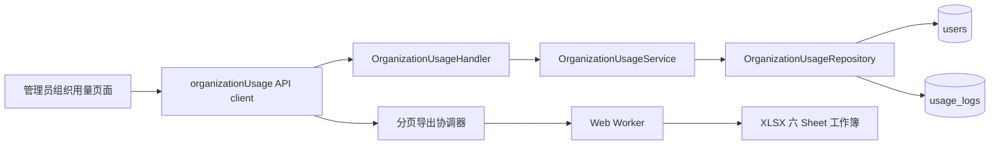

# 组织用量报表设计文档

## 文档状态

| 项目 | 内容 |
| --- | --- |
| 状态 | 已实现 |
| 管理端路由 | `/admin/organization-usage` |
| 后端接口前缀 | `/api/v1/admin/usage/organization-report` |
| 固定时区 | `Asia/Shanghai` |
| 实现提交 | `7c346b314 feat: 组织用量报表功能落地` |
| 是否新增数据库迁移 | 否 |

## 背景

管理端已有使用记录和 Token 分析页面，但它们面向请求明细、排行或分析，不适合承载按组织、人员、月、周和日统一汇总并导出的报表工作流。

本功能新增独立的“组织用量报表”页面，以用户当前邮箱域名为组织归属依据，统计指定日期范围内每个人的请求数、各类 Token、实际消费和日/周/月峰值，并导出可继续分析的 Excel 工作簿。

## 页面边界决策

采用独立页面，不继续扩张现有 `/admin/usage` 页面。

| 方案 | 结论 | 原因 |
| --- | --- | --- |
| 扩展现有使用记录页 | 不采用 | 现有页面以请求明细和通用筛选为主，加入组织汇总、峰值和六 Sheet 导出后职责过重 |
| 新增组织用量报表页 | 采用 | 报表筛选、聚合、分页和导出可以形成独立边界，也便于后续按组织维度演进 |

页面加入管理员侧栏，沿用管理员认证、合规确认和现有布局，不增加面向普通用户的入口。

## 目标与非目标

### 目标

- 支持当前自然月、当前自然周和最长 366 个自然日的自定义范围。
- 固定使用北京时间，日期参数为闭区间，周为周一到周日。
- 按 `xunyou.com`、`wsdashi.com`、其他三组汇总。
- 保留零用量的活跃用户，方便核对完整人员名单。
- 展示总体指标、组织汇总、团队日/周/月 Champion 和个人日/周/月峰值。
- 支持邮箱搜索、组织筛选、服务端排序和分页。
- 导出固定六个工作表，并保证多页数据使用同一用量快照。

### 非目标

- 首版不提供可配置组织规则，不新增配置项或组织表。
- 不新增数据库字段、索引或迁移。
- 趋势图见 `organization-usage-trend-chart-design-cn.md`；导出明细仍不补零，与页面趋势合同分离。
- 不回溯用户历史状态或历史邮箱；用户状态和组织归属以查询时的当前数据为准。
- 不替代现有使用记录、Token 分析或用户排行页面。

## 业务口径

### 用户范围

活跃账号定义为：

```sql
users.deleted_at IS NULL AND users.status = 'active'
```

账号角色同时包含普通用户和管理员。禁用账号和软删除账号不参与统计。

`active_users` 表示符合上述条件并符合邮箱搜索、组织筛选条件的账号数；`used_users` 表示这些账号中在选定用量范围内至少存在一条 `usage_logs` 记录的账号数。

前端展示中，`active_users` 标为“注册人数”，`used_users` 标为“活跃人数”；这只是业务展示名，不改变上述统计条件。

### 组织归属

组织按当前 `users.email` 中第一个 `@` 后的完整域名进行大小写不敏感精确匹配。

| 邮箱域名 | API 值 | 页面显示 |
| --- | --- | --- |
| 精确等于 `xunyou.com` | `xunyou` | 迅游 |
| 精确等于 `wsdashi.com` | `wsdashi` | 速宝 |
| 其他域名、无匹配域名和子域名 | `other` | 其他 |

例如 `USER@XUNYOU.COM` 归入 `xunyou`，`user@sub.xunyou.com` 归入 `other`。

### 指标

| 指标 | 计算方式 |
| --- | --- |
| `requests` | 用量记录行数 `COUNT(*)` |
| `input_tokens` | `SUM(usage_logs.input_tokens)` |
| `output_tokens` | `SUM(usage_logs.output_tokens)` |
| `cache_creation_tokens` | `SUM(usage_logs.cache_creation_tokens)` |
| `cache_read_tokens` | `SUM(usage_logs.cache_read_tokens)` |
| `total_tokens` | 输入、输出、缓存创建、缓存命中 Token 之和 |
| `actual_cost` | `SUM(usage_logs.actual_cost)` |

组织汇总始终返回三组，即使某一组当前为零用量，也返回全零指标行。

### 峰值和 Champion

个人峰值和团队 Champion 均以周期内 `total_tokens` 最大为第一判断条件，稳定并列规则为：

```text
total_tokens DESC,
actual_cost DESC,
requests DESC,
user_id ASC,
period_start ASC
```

个人峰值在同一用户、同一粒度内选择；团队 Champion 在符合当前组织和邮箱筛选的所有用户中选择。零用量用户的个人峰值为 `null`。

## 时间与快照语义

### 日期范围

- `start_date`、`end_date` 格式固定为 `YYYY-MM-DD`。
- 两端均包含在查询范围内。
- Service 按 `Asia/Shanghai` 解析日期，再转换为 UTC 半开区间：`created_at >= start AND created_at < end + 1 day`。
- 自定义范围最多包含 366 个自然日。
- 周桶使用 PostgreSQL `date_trunc('week', ...)`，即周一到周日。

日、周、月周期先按北京时间聚合。周期跨越所选范围边界时，响应中的 `period_start`、`period_end` 裁剪到所选范围，并返回 `partial=true`。

### `as_of` 快照

`as_of` 是可选的严格 RFC3339/RFC3339Nano 时间戳，主要用于多页 Excel 导出。

1. 前端导出开始时生成候选 `as_of`。
2. Summary 首次请求将候选值发送到服务端。
3. Service 将候选值转换为 UTC；若候选值晚于服务端当前时间，则裁剪到服务端当前时间。
4. Summary 响应在 `range.as_of` 返回服务端裁剪并规范化后的 canonical UTC 时间戳。
5. 后续 Summary 分页和日/周/月 Periods 分页全部复用该 canonical 值。

实际用量查询上界取日期范围结束时间和 `as_of` 的较早者。若 `as_of` 早于开始时间，查询范围钳制为空区间。

`as_of` 只冻结用量记录上界，不冻结用户表；账号是否 active、当前邮箱和组织归属仍以每次查询时的当前 `users` 数据为准。

`as_of` 不是密码学签名或服务端 snapshot id，不提供防篡改能力；管理员可以显式传入更早的合法时间戳以限制用量查询上界。

## 系统架构



### 后端边界

| 层 | 主要职责 | 文件 |
| --- | --- | --- |
| Handler | 读取查询参数、严格解析分页、映射 400/500、传播请求 Context | `backend/internal/handler/admin/organization_usage_handler.go` |
| Service | 日期、枚举、分页、排序校验；北京时间转换；`as_of` UTC 规范化与服务端时间裁剪 | `backend/internal/service/organization_usage_service.go` |
| Repository | active user CTE、组织分类、用量聚合、峰值、Champion、分页 SQL | `backend/internal/repository/organization_usage_repo.go` |
| Routes/Wire | 注册管理员路由和依赖注入 | `backend/internal/server/routes/admin.go`、各层 `wire.go` |

独立边界避免继续扩张现有 `UsageLogRepository`、`UsageService` 和使用记录 Handler。

### Repository 聚合流程

1. `active_users` CTE 从未删除且状态为 active 的用户出发，并应用邮箱搜索。
2. `usage_rows` 先按 UTC 时间范围过滤 `usage_logs`，再把 `created_at` 转为北京时间。
3. `usage_totals` 按用户汇总请求、Token 和实际消费。
4. Summary 人员查询以 active user 为主表 LEFT JOIN totals，保留零用量用户。
5. 日/周/月 `period_aggregates` 分别聚合周期数据。
6. 窗口函数按稳定规则选择个人峰值和团队 Champion。
7. Periods 只从存在用量记录的周期聚合结果返回数据，不生成全零明细。

2026-07-13 的真实 PostgreSQL 性能基线见 `docs/features/organization-usage-report-performance-cn.md`。当前 Summary 人员查询在特定基数下会因三个 peak CTE 嵌套循环重复扫描 `ranked_periods`；后续先收敛 peak 连接形状，再减少导出分页重复查询，不以新增索引或单纯提高超时替代结构修复。

组织汇总查询不应用当前组织筛选，因此页面始终能展示三组横向对比；总体指标、Champion 和人员表应用当前组织筛选。组织汇总仍响应日期范围和邮箱搜索。

## API 设计

两个接口均位于管理员认证路由下，并沿用管理员合规 guard。

### 公共查询参数

| 参数 | 必填 | 默认值 | 约束 |
| --- | --- | --- | --- |
| `start_date` | 是 | 无 | `YYYY-MM-DD` |
| `end_date` | 是 | 无 | `YYYY-MM-DD`，不能早于开始日期，闭区间不超过 366 天 |
| `as_of` | 否 | 无 | 严格 RFC3339/RFC3339Nano |
| `organization` | 否 | `all` | `all\|xunyou\|wsdashi\|other` |
| `q` | 否 | 空 | 邮箱模糊搜索 |
| `page` | 否 | `1` | 正整数 |
| `page_size` | 否 | `20` | `1..1000` |

非法日期、枚举、排序或分页参数返回 HTTP `400`；数据库和其他内部错误使用统一错误响应。

### Summary

```http
GET /api/v1/admin/usage/organization-report/summary
```

附加参数：

| 参数 | 默认值 | 允许值 |
| --- | --- | --- |
| `sort_by` | `total_tokens` | `email`、`requests`、`input_tokens`、`output_tokens`、`cache_creation_tokens`、`cache_read_tokens`、`total_tokens`、`actual_cost`、`peak_day_tokens`、`peak_week_tokens`、`peak_month_tokens` |
| `sort_order` | `desc` | `asc\|desc` |

响应结构：

| 字段 | 内容 |
| --- | --- |
| `range` | `start_date`、`end_date`、可选 canonical `as_of` |
| `overview` | 当前筛选下的活跃人数、有用量人数和聚合指标 |
| `organizations` | 固定三组组织汇总 |
| `champions` | `day`、`week`、`month` 团队 Champion |
| `items` | 当前页人员汇总及个人日/周/月峰值 |
| `pagination` | `total`、`page`、`page_size`、`pages` |

### Periods

```http
GET /api/v1/admin/usage/organization-report/periods
```

附加参数 `granularity=day|week|month`，缺省为 `day`。响应包含 `range`、`granularity`、有用量周期 `items` 和 `pagination`，用于正式导出明细。

## 前端设计

### 路由与组件

| 模块 | 文件 |
| --- | --- |
| 页面 | `frontend/src/views/admin/OrganizationUsageView.vue` |
| 筛选栏 | `frontend/src/components/admin/organization-usage/OrganizationUsageFilters.vue` |
| 总体与 Champion | `OrganizationUsageOverview.vue` |
| 三组织汇总 | `OrganizationUsageSummary.vue` |
| 人员宽表 | `OrganizationUsagePeopleTable.vue` |
| API client | `frontend/src/api/admin/organizationUsage.ts` |
| 日期与工作簿 | `frontend/src/utils/organizationUsageReport.ts` |
| 导出 Worker | `organizationUsageExportWorker.ts`、`organizationUsageExport.worker.ts` |

### 筛选与默认值

| 模式 | 默认范围 |
| --- | --- |
| 月报 | 当前自然月第一天到最后一天 |
| 周报 | 当前自然周周一到周日 |
| 自定义 | 最近 30 个自然日，包含当天 |

筛选还包括组织和邮箱。查询按钮应用草稿筛选并把页码重置为 1；重置恢复月报、全部组织、空邮箱、默认排序和每页 20 人。

点击组织汇总行会立即筛选总体指标、Champion 和人员表，同时保留当前已应用日期范围与邮箱搜索。

### 页面状态

- 加载中：人员表显示固定高度骨架行，避免布局跳动。
- 空数据：保留表头并显示空状态。
- 请求错误：显示页面级错误和重试按钮。
- 排序分页：全部由服务端执行，排序表头同步 `aria-sort`。
- 移动端：筛选栏响应式换行；人员表保持宽表并在表格容器内横向滚动，不改成卡片。
- 页面趋势图见 `organization-usage-trend-chart-design-cn.md`（`GET .../organization-report/trend`）；导出 Periods 明细仍不补零。

## Excel 导出设计

导出文件名格式：

```text
organization_usage_<start_date>_to_<end_date>.xlsx
```

固定生成六个工作表：

| Sheet | 内容 |
| --- | --- |
| 报表概览 | 日期范围、总体指标、日/周/月 Champion |
| 组织汇总 | 三组组织人数、请求、Token、实际消费 |
| 人员汇总 | 用户、组织、总指标和个人日/周/月峰值 |
| 月度明细 | 有用量的用户月周期记录 |
| 周度明细 | 有用量的用户周周期记录 |
| 日度明细 | 有用量的用户日周期记录 |

导出协调规则：

- API 分页大小固定为 500。
- 先完整拉取 Summary，再依次拉取 day、week、month Periods。
- Summary 首响应返回的 canonical `as_of` 必须用于后续所有分页。
- 人员汇总保留零用量活跃账号；周期明细不生成全零行。
- 人员汇总和三类周期明细合计最多 100,000 行。
- 单 Sheet 最多 1,048,575 条数据行，为 Excel 最大行数预留一行表头。
- Workbook 构建和 `XLSX.write` 在 Web Worker 中执行，避免阻塞主线程。
- 用户取消或页面卸载时终止网络请求和 Worker；页面卸载不显示“用户主动取消”提示。
- 即使没有人员和周期数据，也生成包含六个表头完整 Sheet 的合法工作簿。

## 安全与可靠性

- 接口仅注册在 `/api/v1/admin` 管理员路由组。
- `sort_by`、`sort_order`、`organization`、`granularity` 使用严格 allowlist，排序 SQL 不接受任意字符串。
- Handler 使用 `c.Request.Context()`，客户端取消请求可向 Repository 传播。
- 原始 `usage_logs.created_at` 时间条件在聚合前执行，避免先对整表做时区表达式计算。
- 导出通过复用服务端裁剪并规范化的 `as_of` 用量上界，降低新增用量导致分页漂移的风险。
- 客户端和 Excel 双重行数限制防止浏览器内存和工作簿格式失控。

## 影响范围

| 范围 | 说明 |
| --- | --- |
| 后端 | 新增独立 Handler、Service、Repository、路由与 Wire provider |
| 前端 | 新增管理员页面、侧栏入口、API client、组件、国际化和导出 Worker |
| 数据库 | 只读现有 `users`、`usage_logs`，无 schema/migration |
| 配置 | 无新增配置项或环境变量 |
| 文档 | 更新 `llm-wiki/wiki/backend.md`、`frontend.md`、`data-and-domain.md` 和组件 README |

## 测试与验证计划

| 层级 | 重点场景 |
| --- | --- |
| Repository | 域名精确匹配、大小写、子域名、active/删除过滤、零用量用户、北京时间日界线、周一边界、部分周期、聚合和稳定并列 |
| Service | 日期解析、366 天限制、`as_of` UTC 规范化和服务端时间裁剪、枚举和排序白名单、分页默认值 |
| Handler/Routes | 查询绑定、400/500 映射、Context 传播、管理员路由注册 |
| 前端页面 | 路由、侧栏、三种日期模式、组织点击、服务端排序分页、加载/空/错误状态 |
| Excel | 六 Sheet、表头与数值、零用量人员、有用量明细、取消导出、空工作簿、行数上限 |
| 浏览器 | 桌面和移动视口、控制台、错误覆盖层、内部横向滚动和目标交互 |

Windows 后端验证使用 `llm-wiki/wiki/ops.md` 的仓库内 `GOCACHE`/`GOMODCACHE`、每轮新建 `GOTMPDIR`、`-p 1 -count=1` 固定流程。

当前 Repository 自动化测试覆盖 SQL 合同和 sqlmock 行为；真实 PostgreSQL integration 仍需要在有 Docker 或可用 PostgreSQL 测试环境时执行，不能用 sqlmock 结果替代。

## 验收标准

- 管理员能从侧栏进入 `/admin/organization-usage`，普通用户不能访问。
- 月报、周报和合法自定义范围请求参数符合北京时间口径。
- 三组组织汇总始终存在，组织筛选正确影响总体、Champion 和人员表。
- active 零用量用户出现在人员汇总，禁用和软删除用户不出现。
- 总 Token、实际消费、个人峰值和团队 Champion 符合稳定排序规则。
- 服务端分页和排序不会退化为仅对当前页进行客户端排序。
- Excel 固定六 Sheet，多页数据使用同一 `as_of`，取消操作能停止网络与 Worker。
- 加载、空数据、错误、桌面和移动状态可正常使用且无页面级横向溢出。

## 后续演进

如后续需要增加组织，优先评估把固定域名规则迁移为受控配置或组织表，并同时定义历史归属口径。首版不预留未使用的数据库结构，避免在业务规则尚未稳定时引入迁移和管理界面。
