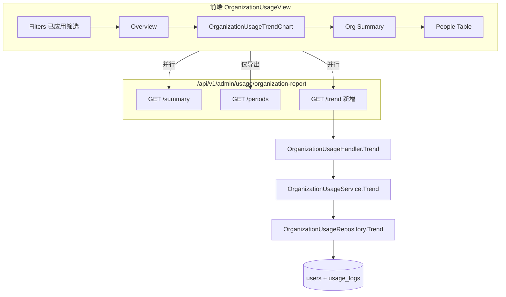
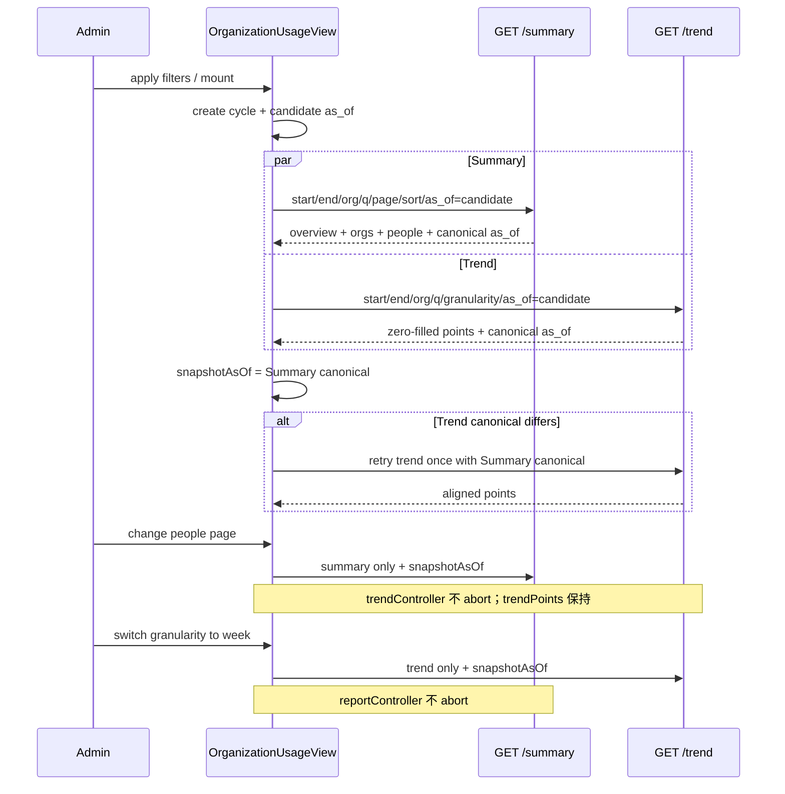

# 组织用量报表趋势折线图设计文档

## 文档状态

| 项目 | 内容 |
| --- | --- |
| 状态 | 已实现 |
| 作者 | Codex（基于现有源码与两轮设计审核修订） |
| 日期 | 2026-07-26 |
| 修订 | 2026-07-27（按第二轮 design review 收紧共享快照、PostgreSQL integration、图表比例与验证命令） |
| 管理端路由 | `/admin/organization-usage`（既有页面内增量） |
| 新增后端接口 | `GET /api/v1/admin/usage/organization-report/trend` |
| 固定时区 | `Asia/Shanghai`（与首版一致） |
| 是否新增数据库迁移 | 否 |
| 前置文档 | [`organization-usage-report-design-cn.md`](./organization-usage-report-design-cn.md) |
| 性能基线 | [`organization-usage-report-performance-cn.md`](./organization-usage-report-performance-cn.md) |

## Overview

管理端「组织用量报表」已支持概览指标、组织汇总、人员分页表与六 Sheet Excel 导出，但首版明确将趋势图列为非目标。管理员在核对月报/周报/自定义范围时，需要在页面内直接看到请求数与 Token 随时间变化的连续折线，而不是先导出明细再人工画图。

本设计在既有页面「用量概览」与「组织汇总」之间增加趋势折线图。后端新增轻量 `trend` 接口，在当前筛选（日期、组织、邮箱）下按 `day|week|month` 聚合截至共享快照的指标，并服务端补零返回连续时间序列；未来日期桶不伪造为 0。前端复用 Chart.js / vue-chartjs 折线模式，支持粒度自动推断与手动切换。不改库表、不改 Periods 导出语义、不替代 Summary。

## Background & Motivation

### 当前状态

| 能力 | 现状 | 文件 |
| --- | --- | --- |
| Summary | 概览 + 三组织 + Champion + 人员分页 | `backend/internal/handler/admin/organization_usage_handler.go` → Service → Repo |
| Periods | **用户 × 周期**有用量明细，分页，供 Excel | 同上；SQL 见 `organizationUsagePeriodsQuery` |
| 页面布局 | Filters → Overview → Org Summary → People Table | `frontend/src/views/admin/OrganizationUsageView.vue` |
| 折线组件先例 | Dashboard / Usage 的 `TokenUsageTrend.vue` | `frontend/src/components/charts/TokenUsageTrend.vue` |
| 近期 UI 决策 | 概览去掉实际成本、展示输入 Token；人员表缓存读取改名为「缓存 Token」、去掉缓存创建列 | Overview / PeopleTable |

首版设计（`organization-usage-report-design-cn.md`）非目标写明：

> 不增加趋势图，完整时序数据通过 Excel 明细查看。

这是有意识的范围裁剪，不是技术不可行。本设计是**后续演进**，落地后需同步修正首版非目标并交叉引用本文。

### 痛点

1. Periods 返回的是 `user_id + period_start` 明细（导出级），带 pagination（默认 `page_size` 20，最大 1000），语义与「全站/筛选范围按周期汇总折线」冲突。
2. 若前端拉全量 user×day 再 group-by：366 天 × 数百用户可达数万～数十万行，与导出上限/超时问题同源，且与人员分页竞态保护模型冲突。
3. Periods **不补零**（「只从存在用量记录的周期聚合结果返回数据」），图表需要连续 X 轴，空桶必须补 0。
4. 性能基线显示 Periods day 366 天 data 约 700 ms（600 用户合成集），这是 user 维度明细成本；趋势聚合去掉 user 维度后应显著更轻，但仍需避免误用 Periods 路径。

### 可行性结论

**可以实现。** 后端已有北京时间周期桶（`date_trunc('day'|'week'|'month')`）、组织/邮箱筛选 CTE、指标口径与 `as_of` 语义；前端已有 Chart.js Line + 暗色主题模式。缺口是「筛选范围内按周期汇总 + 补零」的专用读模型与 UI 插槽。

## Goals & Non-Goals

### Goals

- 在 `/admin/organization-usage` 展示与当前已应用筛选联动的用量趋势折线图。
- 提供 `day|week|month` 粒度：默认按日期跨度自动推断，并允许用户手动覆盖。
- 服务端返回截至 `data_through` 的连续时间序列（已到达范围内无数据周期补 0，未来周期不返回），一次响应不分页。
- 默认系列：请求数、输入 Token、输出 Token、总 Token（`total_tokens`）。总 Token 包含缓存创建与缓存读取两类 Token，因此不等于另外两条可见 Token 系列之和（见 K8）。
- API 仍返回完整 `OrganizationUsageMetrics`（含 `total_tokens`、`actual_cost`、`cache_creation_tokens`），便于后续开关。
- 权限、时区、日期闭区间、组织三组口径与首版完全一致。
- 中英文 i18n；暗色主题可用。
- 无 DB migration / 无新配置项。

### Non-Goals

- 不改变 Summary / Periods / Excel 六 Sheet 合同与导出协调逻辑。
- 不在趋势图中做多组织分色对比（首版单序列 = 当前筛选聚合；组织对比仍看组织汇总表）。
- 不做用户级趋势下钻、模型/账号维度拆分。
- 不引入前端对 Periods 全量分页聚合。
- 不解决 Summary peak CTE 性能问题（仍见 performance 文档第一阶段）；趋势 SQL 独立、不依赖 peak。
- 不新增组织规则配置或历史邮箱回溯。
- `as_of` 只冻结用量记录上界，不冻结用户表；用户状态、邮箱和组织归属仍沿用首版的当前值语义。

## Key Decisions

| # | 决策 | 选择 | 理由 |
| --- | --- | --- | --- |
| K1 | API 形态 | **新 endpoint** `.../organization-report/trend` | Periods 是 user×period 分页导出模型；trend 是无用户维度、补零、不分页的时间序列。新接口避免污染 Periods 合同与导出客户端。`fetchAll` **不得**调用 trend。 |
| K2 | 拒绝前端聚合 Periods | 不采用方案 B | 数据量大、与分页语义冲突、补零与 partial 裁剪难在客户端正确复现、放大 DB 与浏览器内存压力。 |
| K3 | 补零位置 | **服务端**生成 `start_date..data_through` 完整桶后 LEFT JOIN 聚合结果 | 保证合同稳定、多客户端一致；只补已到达日期，未来日期不画成 0；前端只渲染。 |
| K4 | 粒度默认 | 自动：`≤31 天 → day`，`≤120 天 → week`，否则 `month`；UI 可手动 `day\|week\|month` | 平衡点密度与可读性；月报默认 month 范围约 28–31 天仍走 day，便于看当月每日走势。推断必须复用前端既有**含首尾**自然日计算（与 `organizationUsageCalendarDays` / `validateCustomDateRange` 同口径），禁止用浏览器本地 `Date` 差值。 |
| K5 | 组织筛选语义 | 与 Overview / Champion / 人员表一致：**应用** `organization` 与 `q` | 点击组织汇总行后趋势应同步收窄；组织汇总表本身仍始终三组（既有行为不变）。 |
| K6 | `as_of` | 支持可选 `as_of`；Service **完整镜像** Summary：UTC 规范化、`clampAsOfToServerNow`、`repositoryRange()`、响应 `range.as_of = base.asOfCanonical`。页面每次完整加载生成同一个 candidate `as_of`，并行传给 Summary 与 Trend；Summary 返回的 canonical `as_of` 是页面权威快照。若 Trend 返回的 canonical 值不同，自动用 Summary canonical **仅重拉一次 Trend** | 正常时保持并行、无额外 RTT；客户端时钟超前导致两个请求分别 clamp 时，通过一次条件式 reconciliation 保证最终屏幕上的 Overview 与折线使用同一用量上界。人员分页/排序和粒度切换复用当前 canonical，不创建新快照。 |
| K7 | 与 Summary 加载关系 | **并行独立请求** + **独立状态机** + **共享快照协调**（见下表） | Summary 已较重；趋势 SQL 轻量可并行。禁止把 trend 塞进 Summary。人员 sort/page **不得**清掉或隐藏已成功的趋势数据，并复用当前 canonical `as_of`。 |
| K8 | 默认展示指标 | **A：requests + input + output + total**；**不默认画**两类缓存 Token 明细或实际消费 | 总 Token 曲线完整包含两类缓存 Token，不能与可见的 input/output 两条曲线相加比较。API 仍返回全字段，缓存创建和缓存读取保留给后续按需展示。 |
| K9 | 图表库 | 新建 `OrganizationUsageTrendChart.vue`，模式对齐 `TokenUsageTrend.vue`（vue-chartjs Line），不直接复用该组件 | Dashboard 组件绑定 `TrendDataPoint` 与 cache hit rate；组织报表字段与文案不同。 |
| K10 | 部分周期 `partial` | 用**未裁剪**的 `bucket_start/bucket_end` 计算 `partial`，再按所选范围与 `data_through` 用 GREATEST/LEAST 写响应 `period_start/end` | 历史范围与 Periods 一致；当前 week/month 若尚未结束，也因 `bucket_end > data_through` 返回 `partial=true`。day 桶只表达日历裁剪，不表达日内进度；精确时刻看 `range.as_of`。 |
| K11 | 点数量上限 | day 最多 366；week ≤ 54；month ≤ 13；**禁止分页** | 366 个闭区间自然日最多可跨 54 个周桶；响应体仍小。SQL **不得** `GROUP BY user_id`。 |
| K12 | 文档 | 更新首版设计非目标 + 本文交叉引用；实现后更新 llm-wiki 与组件 README | 满足 Agents.md 沉淀规则。PR2 可顺带改首版 design 交叉引用；**llm-wiki 必须在功能宣称 done 前更新**（可在 PR2 或 PR3）。 |
| K13 | 图表坐标轴 | **双轴默认**：左 Y = Token 系列，右 Y = requests；两轴均从 0 开始；legend 点击隐藏保留 | 量纲差数个数量级；零基线避免各轴自动缩放夸大波动。v1 不采用单轴。 |
| K14 | RBAC | 与 summary/periods **同一** `/api/v1/admin` usage 路由组 + 合规 guard；**v1 无新 RBAC/permission 位** | 未来若 organization-report 进 sub_admin 目录，trend 必须与 summary **同步**白名单。 |
| K15 | SQL 参数位 | Trend 保持 Periods 的 `$1..$6` 含义，新增 `$7 = data_through`；不使用分页参数 | 防止 q/org/所选日期占位符静默错位；`$7` 只接收 Service 计算出的北京时间日期，不直接信任客户端。 |
| K16 | Summary 失败 vs Trend | **采用 (a)**：页面级 `errorMessage`（Summary 失败）时整块内容区（含 Trend）不展示；Retry 同时重拉 Summary+Trend | 与现模板 `v-if="!errorMessage"` 一致，避免半屏成功半屏失败的分裂 UX。Trend **单独**失败不设 `errorMessage`，只在图表区错误+重试。 |
| K17 | 未来桶与 `data_through` | `data_through = min(end_date, effective_as_of 在 Asia/Shanghai 的日历日期)`；只生成 `start_date..data_through` 桶。若 `data_through < start_date`，返回空 points | 当前月/周筛选通常包含未来日期；把未来桶补 0 会制造虚假下跌。`as_of` 省略时 `effective_as_of = server now`；当前 day 包含截至精确 `as_of` 的数据，week/month 裁剪到 `data_through` 并标 partial。 |

`total_tokens = input_tokens + output_tokens + cache_creation_tokens + cache_read_tokens`；两类缓存 Token 继续由 API 返回，但不属于默认图表系列。

## Proposed Design

### 架构总览



### 页面交互与布局

放置顺序（`OrganizationUsageView.vue`）：

1. Header + `OrganizationUsageFilters`
2. 页面级错误条（既有 `errorMessage` + `retry-load`）
3. 在 `v-if="!errorMessage"` 内容区内：
   - `OrganizationUsageOverview`（`v-if="report && !loading"`，既有）
   - **`OrganizationUsageTrendChart`（新增；见状态机，不绑 `loading`）**
   - `OrganizationUsageSummary`（`v-if="report && !loading"`，既有）
   - `OrganizationUsagePeopleTable`（既有 skeleton）

#### View 状态（相对现有单 `loading` / `reportController` 的扩展）

现有页面只有 `reportController` + `loading`；sort/page 也会把 Overview/Summary 卸掉（既有行为，本功能不改）。Trend **必须**拆成独立状态，避免翻页清图。

| 状态 | 类型 | 说明 |
| --- | --- | --- |
| `reportController` | `AbortController \| null` | Summary 请求（既有） |
| `loading` | `boolean` | **仅** Summary；控制 Overview/Org Summary 隐藏与人员 skeleton（既有） |
| `report` / `errorMessage` | 既有 | Summary 数据与页面级错误 |
| `reportCycleId` | `number` | **新增**；每次完整加载递增，隔离旧筛选响应和快照 reconciliation |
| `snapshotAsOf` | `string` | **新增**；完整加载先写 candidate，Summary 成功后替换为 canonical；分页/排序/粒度切换复用 |
| `reconciledCycleId` | `number \| null` | **新增**；保证每个完整加载周期最多执行一次 canonical Trend 对齐 |
| `trendRequestedAsOf` | `string` | **新增**；记录当前 Trend 请求使用的快照，用于在响应前也能判断是否需要 canonical 对齐 |
| `trendController` | `AbortController \| null` | **新增** Trend 请求 |
| `trendLoading` | `boolean` | **新增**；仅图表区 skeleton，**不得**驱动 Overview 卸载 |
| `trendError` | `string` | **新增**；图表区错误，**不**写入 `errorMessage` |
| `trendPoints` / `trendMeta` | 数据 | 最近一次**成功**的 points + granularity/range（含 `range.as_of`） |
| `granularityMode` | `'auto' \| 'manual'` | 日期范围变化或 reset → `auto`；仅组织/q 变化时保留当前模式；用户点粒度 → `manual` |
| `effectiveGranularity` | `day\|week\|month` | 实际请求参数 |

#### 触发 × Abort × UX 状态机（必须实现）

| Trigger | Abort Summary | Abort Trend | Summary loading UX | Trend loading UX | 成功后 |
| --- | --- | --- | --- | --- | --- |
| mount / apply filters / reset / org row 点击 | yes | yes | 生成新 candidate `as_of`；既有：`loading=true`，隐藏 overview+org summary | `trendLoading=true`；**skeleton 替代**旧 trend（避免旧筛选曲线） | Summary canonical 成为权威；必要时单次重拉 Trend 后写入一致快照 |
| people sort / page / page_size | yes | **no** | 复用 `snapshotAsOf`；既有 people skeleton；overview 随 `loading` 隐藏（既有，out-of-scope 不改） | **保持**上一成功 `trendPoints` 可见；不设 `trendLoading` | 只更新 report/pagination |
| granularity 手动切换 | **no** | yes | 不变 | 使用 `snapshotAsOf`；图表区 skeleton | 只更新 trend* |
| 图表区 Retry | no | yes | 不变 | 使用 `snapshotAsOf`；skeleton | 只更新 trend* |
| 页面 Retry（`retry-load`） | yes | yes | 新周期、新 candidate 的 full reload | full reload | 两者 |
| unmount | yes | yes | — | — | — |

Late-response 守卫（与 Summary 对称）：

```ts
// loadTrend
trendController?.abort()
const controller = new AbortController()
trendController = controller
trendLoading.value = true
trendError.value = ''
try {
  const res = await getTrend(..., { signal: controller.signal })
  if (trendController !== controller || controller.signal.aborted) return
  trendPoints.value = res.points
  // ...
} catch {
  if (controller.signal.aborted || trendController !== controller) return
  trendPoints.value = []
  trendMeta.value = null
  trendError.value = t('...trendLoadFailed')
} finally {
  if (trendController === controller) {
    trendLoading.value = false
    trendController = null
  }
}
```

`loadReport`（Summary）保持既有 `reportController !== controller` 守卫；**禁止**在 sort/page 路径调用 `loadTrend`。

共享快照协调（K6，必须实现）：

1. `loadFullReport()` 递增 `reportCycleId`，生成 `candidateAsOf = new Date().toISOString()`，并把同一个 candidate 传给并行的 Summary 与 Trend。
2. Summary 成功后要求 `range.as_of` 非空，并用该 canonical 值覆盖 `snapshotAsOf`；缺失时视为 Summary 协议错误，进入页面级 `errorMessage`，不能继续展示未对齐 Trend。
3. 若当前周期的 Trend 请求/响应 `as_of` 与 Summary canonical 不同，立即 abort 旧 Trend，设置 skeleton，并以 canonical 值重拉一次；用 `reconciledCycleId` 防止重复。
4. canonical 重拉若仍返回不同 `range.as_of`，清空 points 并显示局部 `trendError`，不得继续循环重试。
5. 只有 `reportCycleId`、controller 和 signal 都仍有效时才写状态；旧周期的 Summary、Trend 和 reconciliation 响应全部丢弃。
6. sort/page/page_size、粒度切换和图表 Retry 复用 `snapshotAsOf`。只有 mount、apply filters、reset、组织行点击和页面 Retry 创建新快照。

这样正常时 Summary/Trend 仍并行；只有客户端时钟超前并导致两个服务端请求得到不同 clamp 值时，才增加一次 Trend RTT。由于 `as_of` 不冻结 `users`，测试与验收仍需保证用户状态/邮箱/组织 fixture 在查询期间不变。

页面级 Summary 失败（K16）：`errorMessage` 非空时内容区（含图表）不渲染；用户点 Retry → 新建完整加载周期，Summary + Trend 使用同一新 candidate 并行。

### 粒度自动推断

```text
calendar_days = inclusiveDays(start_date, end_date)
  // 必须与 backend organizationUsageCalendarDays 及
  // frontend organizationUsageReport 既有含首尾日计算一致
if calendar_days <= 31  -> day
else if calendar_days <= 120 -> week
else -> month
```

实现约束：

- `inferOrganizationUsageTrendGranularity` 放在 `frontend/src/utils/organizationUsageReport.ts`，**复用**该文件已有日期解析/含首尾天数 helper（或与 `validateCustomDateRange` 共用），**禁止** `new Date(end) - new Date(start)` 本地时区差值。
- 单测边界：`31 → day`，`32 → week`，`120 → week`，`121 → month`。
- 另测：默认月报范围（当月 1 号～月末，28–31 天）推断为 **`day`**。

说明：

- 默认「月报」通常 28–31 天 → **day**，符合「看本月每日走势」预期。
- 默认「周报」7 天 → day。
- 自定义 90 天 → week；366 天 → month。
- 手动选择 day 且范围为 366 天：合法，返回最多 366 点。

### 后端设计

#### 路由

在既有管理员 `usage` 组注册（`backend/internal/server/routes/admin.go`，与 summary/periods 同级）：

```go
usage.GET("/organization-report/trend", h.Admin.OrganizationUsage.Trend)
```

权限（K14）：与 summary/periods **同一** admin usage 路由组 + 合规 guard；**v1 不新增** RBAC permission 条目。

#### Handler

扩展 `organizationUsageService` 接口与 `OrganizationUsageHandler`：

```go
type organizationUsageService interface {
	Summary(context.Context, service.OrganizationUsageSummaryQuery) (*service.OrganizationUsageSummaryResponse, error)
	Periods(context.Context, service.OrganizationUsagePeriodsQuery) (*service.OrganizationUsagePeriodsResponse, error)
	Trend(context.Context, service.OrganizationUsageTrendQuery) (*service.OrganizationUsageTrendResponse, error)
}
```

Handler 绑定查询参数（无 page/page_size）：

| 参数 | 必填 | 默认 | 约束 |
| --- | --- | --- | --- |
| `start_date` | 是 | — | `YYYY-MM-DD` |
| `end_date` | 是 | — | 闭区间，≤366 自然日 |
| `as_of` | 否 | — | 严格 RFC3339/RFC3339Nano |
| `organization` | 否 | `all` | `all\|xunyou\|wsdashi\|other` |
| `q` | 否 | 空 | 邮箱模糊 |
| `granularity` | 否 | `day` | `day\|week\|month`（**服务端不做自动推断**；自动策略在前端） |

非法参数 → 400（`OrganizationUsageValidationError`）；内部错误走统一 `ErrorFrom`。

#### Service 合同（含 as_of 镜像 Summary）

```go
type OrganizationUsageTrendPoint struct {
	PeriodStart string `json:"period_start"`
	PeriodEnd   string `json:"period_end"`
	Partial     bool   `json:"partial"`
	OrganizationUsageMetrics
}

type OrganizationUsageTrendResponse struct {
	Range       OrganizationUsageRange        `json:"range"`
	DataThrough string                        `json:"data_through,omitempty"`
	Granularity string                        `json:"granularity"`
	Points      []OrganizationUsageTrendPoint `json:"points"`
}

type OrganizationUsageTrendQuery struct {
	StartDate    string
	EndDate      string
	AsOf         string
	Organization string
	Q            string
	Granularity  string
}
```

Service.Trend 步骤（与 Summary/Periods 对齐，**不得省略 as_of 回写**）：

1. `normalizeOrganizationUsageQuery(start, end, asOf, org, q, page=1, pageSize=20)`（或抽取无分页 filter helper；占位 page 仅满足签名）。
2. 取一次 `serverNow := s.now()`；若 `base.asOf != nil`，调用 `base.clampAsOfToServerNow(serverNow)`。
3. 校验/默认 `granularity`（空 → `day`；非法 → validation error）。
4. `startTime, endTime := base.repositoryRange()`。
5. 计算 `effectiveAsOf`：有 `base.asOf` 用 canonical 值，否则用 `serverNow.UTC()`；将其转换到 `Asia/Shanghai` 日历日期，并与 `base.end` 取较早值得到 `dataThrough`。
6. 若 `dataThrough.Before(base.start)`：不访问 Repository，返回 `data_through` 省略、`points=[]`。
7. 否则调用 `repo.Trend(...)`，Repository params 增加 `DataThrough time.Time`。
8. 返回：

```go
&OrganizationUsageTrendResponse{
	Range: OrganizationUsageRange{
		StartDate: query.StartDate,
		EndDate:   query.EndDate,
		AsOf:      base.asOfCanonical, // 与 Summary 相同：有则 echo canonical UTC
	},
	DataThrough: dataThrough.Format("2006-01-02"),
	Granularity: granularity,
	Points:      result.Points,
}
```

接口层仍允许调用方省略 `as_of`，省略时 `range.as_of` 不返回；组织用量页面按 K6 **始终传入** candidate/canonical `as_of`，并要求响应回写非空 canonical 值。

#### Repository 接口与参数位不变式（K15）

```go
// service.OrganizationUsageRepository 增加：
Trend(context.Context, OrganizationUsageTrendRepositoryParams) (*OrganizationUsageTrendRepositoryResult, error)
```

**参数占位符不变式**（与 Periods 对齐，禁止擅自重编号）：

| 占位符 | Periods 含义 | Trend 含义 |
| --- | --- | --- |
| `$1` | StartTime (UTC) | StartTime (UTC) |
| `$2` | EndTime (UTC exclusive 上界，可被 `as_of` 收紧) | 同 Periods |
| `$3` | email ILIKE pattern | 同 Periods；`active_users` CTE 固定使用 `$3` |
| `$4` | organization filter | 同 Periods |
| `$5` | selected start_date 日历串 | 同 Periods |
| `$6` | selected end_date 日历串 | 同 Periods |
| `$7` | page_size | `data_through` 北京时间日历串（Service 派生） |
| `$8` | offset | **不使用** |

优先复用/扩展 CTE helper（`organizationUsageActiveUsersCTE`、`organizationUsageRowsCTE`、`organizationUsagePeriodBucketSQL`），避免复制后公式漂移。

#### Repository SQL 形状

复用既有 CTE 积木，**不按 user 展开**（禁止调用再在应用层折叠 `organizationUsagePeriodAggregationSQL` 的 user 维结果）：

1. `active_users`（邮箱 `q`，`$3`）
2. `selected_users`（`organization`，`$4`）
3. `usage_rows`（`$1/$2`）
4. `filtered_usage`：`usage_rows JOIN selected_users`
5. `period_aggregates`：按粒度 `date_trunc`，**仅** `GROUP BY bucket_start, bucket_end`（**无** `user_id`）
6. `buckets`：`$5 start_date .. $7 data_through` 的完整桶序列（见下）
7. LEFT JOIN 补 0；`partial` 用**未裁剪** bucket 边界，并同时对 `$5/$6` 所选范围与 `$7 data_through` 做 GREATEST/LEAST 裁剪
8. `ORDER BY period_start ASC`

桶边界**必须**与 `organizationUsagePeriodBucketSQL` 一致：

| 粒度 | bucket_start 表达式 | bucket_end 表达式 |
| --- | --- | --- |
| day | `date_trunc('day', local_created_at)::date` | 同 start |
| week | `date_trunc('week', local_created_at)::date` | `(date_trunc('week', local_created_at) + interval '6 days')::date` |
| month | `date_trunc('month', local_created_at)::date` | `(date_trunc('month', local_created_at) + interval '1 month - 1 day')::date` |

##### Day 伪 SQL

```sql
WITH active_users AS ( /* organizationUsageActiveUsersCTE；$3 = q */ ),
selected_users AS (
  SELECT * FROM active_users WHERE $4 = 'all' OR organization = $4
),
usage_rows AS ( /* organizationUsageRowsCTE;$1/$2 */ ),
filtered_usage AS (
  SELECT ur.* FROM usage_rows ur
  JOIN selected_users su ON su.user_id = ur.user_id
),
period_aggregates AS (
  SELECT
    date_trunc('day', local_created_at)::date AS bucket_start,
    date_trunc('day', local_created_at)::date AS bucket_end,
    COUNT(*)::bigint AS requests,
    COALESCE(SUM(input_tokens), 0)::bigint AS input_tokens,
    COALESCE(SUM(output_tokens), 0)::bigint AS output_tokens,
    COALESCE(SUM(cache_creation_tokens), 0)::bigint AS cache_creation_tokens,
    COALESCE(SUM(cache_read_tokens), 0)::bigint AS cache_read_tokens,
    COALESCE(SUM(total_tokens), 0)::bigint AS total_tokens,
    COALESCE(SUM(actual_cost), 0)::double precision AS actual_cost
  FROM filtered_usage
  GROUP BY bucket_start, bucket_end
),
buckets AS (
  SELECT gs::date AS bucket_start, gs::date AS bucket_end
  FROM generate_series($5::date, $7::date, interval '1 day') AS gs
)
SELECT
  GREATEST(b.bucket_start, $5::date) AS period_start,
  LEAST(b.bucket_end, $6::date, $7::date) AS period_end,
  (b.bucket_start < $5::date OR b.bucket_end > $6::date OR b.bucket_end > $7::date) AS partial,
  COALESCE(pa.requests, 0), COALESCE(pa.input_tokens, 0), /* ... */
FROM buckets b
LEFT JOIN period_aggregates pa ON pa.bucket_start = b.bucket_start
ORDER BY period_start ASC
```

##### Week 伪 SQL（禁止从 raw start_date 直接 `interval '7 day'`）

```sql
-- period_aggregates 的 bucket_* 必须与 organizationUsagePeriodBucketSQL('week') 相同
period_aggregates AS (
  SELECT
    date_trunc('week', local_created_at)::date AS bucket_start,
    (date_trunc('week', local_created_at) + interval '6 days')::date AS bucket_end,
    /* 同 day 的聚合列 */
  FROM filtered_usage
  GROUP BY bucket_start, bucket_end
),
buckets AS (
  -- 起点：含 start_date 的那个周一，不是 start_date 本身
  SELECT
    gs::date AS bucket_start,
    (gs + interval '6 days')::date AS bucket_end
  FROM generate_series(
    date_trunc('week', $5::timestamp)::date,
    date_trunc('week', $7::timestamp)::date,
    interval '7 days'
  ) AS gs
)
-- SELECT 裁剪与 partial 判定与 day 相同：
-- partial = (b.bucket_start < $5::date OR b.bucket_end > $6::date OR b.bucket_end > $7::date)
-- period_start = GREATEST(b.bucket_start, $5::date)
-- period_end   = LEAST(b.bucket_end, $6::date, $7::date)
-- JOIN 键：pa.bucket_start = b.bucket_start
```

合同示例：范围 `2026-01-30 .. 2026-02-03`（周五～周二），且 `data_through=2026-02-03`，week 粒度：

| 期望 | 值 |
| --- | --- |
| 点数 | 2（含 1/26 起的周 + 2/2 起的周） |
| 第一点 | `bucket` 周一 `2026-01-26`；响应 `period_start=2026-01-30`，`period_end=2026-02-01`，`partial=true` |
| 第二点 | 周一 `2026-02-02`；`period_start=2026-02-02`，`period_end=2026-02-03`，`partial=true` |
| 顺序 | ASC |
| 无用量桶 | 指标全 0，仍占位 |

（与既有 `TestOrganizationUsagePeriodBucketSQL_UsesMondayAndClipsSelectedRange` 语义对齐。）

##### Month 伪 SQL

```sql
period_aggregates AS (
  SELECT
    date_trunc('month', local_created_at)::date AS bucket_start,
    (date_trunc('month', local_created_at) + interval '1 month - 1 day')::date AS bucket_end,
    /* 聚合列同上 */
  FROM filtered_usage
  GROUP BY bucket_start, bucket_end
),
buckets AS (
  -- 必须先 trunc 到月首，再 generate_series；禁止从月中 start_date 直接 +1 month
  SELECT
    gs::date AS bucket_start,
    (gs + interval '1 month - 1 day')::date AS bucket_end
  FROM generate_series(
    date_trunc('month', $5::timestamp)::date,
    date_trunc('month', $7::timestamp)::date,
    interval '1 month'
  ) AS gs
)
-- partial / GREATEST / LEAST 同 week
```

##### 点数合同

| 粒度 | `len(points)`（当 `data_through >= start_date`） |
| --- | --- |
| day | `= calendar_days(start_date, data_through)`（含首尾） |
| week | `= start_date..data_through 跨越的 distinct week-bucket 数`（含 leading/trailing partial） |
| month | `= start_date..data_through 跨越的 distinct month-bucket 数`（含 partial） |

若 `data_through < start_date`，Service 短路返回 `points=[]` 且省略 `data_through`。所选 `end_date` 早于快照日期时，`data_through=end_date`，点数合同退化为完整历史范围。

指标口径（与首版 Metrics 表一致）：

| 字段 | 计算 |
| --- | --- |
| `requests` | `COUNT(*)` |
| `input_tokens` / `output_tokens` / `cache_creation_tokens` / `cache_read_tokens` | `SUM(...)` |
| `total_tokens` | 四类 Token 之和（usage_rows 行级 total 再 SUM） |
| `actual_cost` | `SUM(actual_cost)` |

一致性校验（测试断言，**强制同一个 canonical `as_of`，并冻结用户 fixture**）：

```text
trend.range.as_of          == summary.range.as_of
sum(points.*.total_tokens) == overview.total_tokens
sum(points.*.requests)     == overview.requests
```

不传 `as_of` 只保留为通用 API 的可选合同，不是组织用量页面路径。若用户状态、邮箱或组织归属在两次查询间变化，`as_of` 不保证位等；这与首版快照边界一致。

#### 接口响应示例

```http
GET /api/v1/admin/usage/organization-report/trend?start_date=2026-07-01&end_date=2026-07-03&organization=xunyou&granularity=day&as_of=2026-07-03T12%3A00%3A00Z
```

```json
{
  "code": 0,
  "data": {
    "range": {
      "start_date": "2026-07-01",
      "end_date": "2026-07-03",
      "as_of": "2026-07-03T12:00:00Z"
    },
    "data_through": "2026-07-03",
    "granularity": "day",
    "points": [
      {
        "period_start": "2026-07-01",
        "period_end": "2026-07-01",
        "partial": false,
        "requests": 10,
        "input_tokens": 1000,
        "output_tokens": 200,
        "cache_creation_tokens": 0,
        "cache_read_tokens": 50,
        "total_tokens": 1250,
        "actual_cost": 0.12
      },
      {
        "period_start": "2026-07-02",
        "period_end": "2026-07-02",
        "partial": false,
        "requests": 0,
        "input_tokens": 0,
        "output_tokens": 0,
        "cache_creation_tokens": 0,
        "cache_read_tokens": 0,
        "total_tokens": 0,
        "actual_cost": 0
      },
      {
        "period_start": "2026-07-03",
        "period_end": "2026-07-03",
        "partial": false,
        "requests": 4,
        "input_tokens": 400,
        "output_tokens": 80,
        "cache_creation_tokens": 0,
        "cache_read_tokens": 0,
        "total_tokens": 480,
        "actual_cost": 0.04
      }
    ]
  }
}
```

已到达范围内空用量：返回截至 `data_through` 的全 0 连续点。仅当整个所选范围仍在快照之后时返回 `points: []` 且省略 `data_through`；非法日期等 → 400。

### 前端设计

#### API client

`frontend/src/api/admin/organizationUsage.ts` 新增：

```ts
export interface OrganizationUsageTrendPoint extends OrganizationUsageMetrics {
  period_start: string
  period_end: string
  partial: boolean
}

export interface OrganizationUsageTrendResponse {
  range: OrganizationUsageRange
  data_through?: string
  granularity: OrganizationUsageGranularity
  points: OrganizationUsageTrendPoint[]
}

export interface OrganizationUsageTrendQuery {
  start_date: string
  end_date: string
  as_of?: string
  organization?: OrganizationUsageOrganizationFilter
  q?: string
  granularity: OrganizationUsageGranularity
}

export async function getOrganizationUsageTrend(
  params: OrganizationUsageTrendQuery,
  options?: OrganizationUsageRequestOptions
): Promise<OrganizationUsageTrendResponse> { /* ... */ }
```

`organizationUsageAPI` 增加 `getTrend`。导出路径 `fetchAllOrganizationUsageData` **禁止**调用 trend（K1）。

```ts
export function inferOrganizationUsageTrendGranularity(
  startDate: string,
  endDate: string
): OrganizationUsageGranularity
// 实现：复用 organizationUsageReport.ts 含首尾自然日 helper
```

#### 组件

| 文件 | 职责 |
| --- | --- |
| `OrganizationUsageTrendChart.vue` | 标题、粒度切换、`trendLoading`/`trendError`、Line 图 |
| `OrganizationUsageView.vue` | 双 controller 状态机；编排 loadReport/loadTrend 与共享 `as_of` reconciliation |
| `i18n/locales/{zh,en}/admin/organizationUsage.ts` | 趋势标题、粒度、失败/重试；**系列名复用**既有 `metrics.*` |
| `organization-usage/README.md` | 状态机与组件说明 |

图表默认 datasets（K8 + K13）：

| # | 数据字段 | 图例 i18n | Y 轴 |
| --- | --- | --- | --- |
| 1 | `input_tokens` | `admin.organizationUsage.metrics.inputTokens` | 左 |
| 2 | `output_tokens` | `...metrics.outputTokens` | 左 |
| 3 | `total_tokens` | `...metrics.totalTokens` | 左 |
| 4 | `requests` | `...metrics.requests` | **右** |

不默认加入：`cache_creation_tokens`、`cache_read_tokens`、`actual_cost`。`total_tokens` 包含缓存创建和缓存读取两类 Token，不等于可见 `input_tokens` 与 `output_tokens` 曲线之和。

新增 i18n 仅限：`trend.title`、`trend.day|week|month`、`trend.loadFailed`、`trend.retry`、`trend.partialHint`、`trend.asOf` 等壳文案。

实现细节：

- Chart.js 注册与 `TokenUsageTrend.vue` 相同基础集
- `cubicInterpolationMode: 'monotone'`，不使用可能产生过冲的默认 cubic smoothing；`interaction.mode: 'index'`
- 暗色 grid/tick；主题切换必须通过响应式 theme 状态或 observer 触发 options 重算，不能使用无依赖的静态 computed
- 高度 `h-56`/`h-64`；`maintainAspectRatio: false`
- X：`period_start`；tooltip 附 `period_end` + partial 文案；最后一个已到达桶附格式化后的 `range.as_of`，明确当前 day 的日内截止时刻
- **`scales.x.ticks.maxTicksLimit`: 12–16**（day-366 可读性）
- 两个 Y 轴都设置 `beginAtZero: true`，避免双轴自动缩放夸大波动
- requests 轴 `ticks.precision: 0`；Token 轴复用既有紧凑数字格式
- 点数 `>60` 时 `pointRadius: 0`，否则 `pointRadius: 2`；始终保留 `pointHoverRadius: 4`
- legend 点击隐藏（默认）
- 右轴 requests：独立 scale id（如 `yRequests`），grid `drawOnChartArea: false`

#### 加载时序



### Wire / DI

- `service.OrganizationUsageRepository` 增加 `Trend`
- **所有 stub 同步加 `Trend`**，否则无法编译：
  - `backend/internal/service/organization_usage_service_test.go`（`organizationUsageRepositoryStub`）
  - `backend/internal/handler/admin/organization_usage_handler_test.go`（service stub + 若有 repo stub）
  - 其他实现该接口的测试 double
- Service/Handler 增加 `Trend` 方法
- Routes 注册；routes 测试断言 `GET .../trend`
- `wire_gen.go`：构造函数未变时通常无需重生成

### 与首版文档的交叉更新

`organization-usage-report-design-cn.md`：

- 非目标「不增加趋势图…」→「趋势图见 `organization-usage-trend-chart-design-cn.md`；导出明细仍不补零」
- 删除/改写「页面不增加趋势图」
- API 节增加 Trend 链接  

可在 **PR2** 顺带改 design 交叉引用；**llm-wiki**（`backend.md` / `frontend.md`）在 PR2 或 PR3 更新，功能 done 前必须完成（Agents.md）。

## API / Interface Changes

### 新增

```http
GET /api/v1/admin/usage/organization-report/trend
```

### 不变

```http
GET /api/v1/admin/usage/organization-report/summary
GET /api/v1/admin/usage/organization-report/periods
```

Periods **不**增加 `scope=aggregate`。

### 前端类型扩展

仅 `organizationUsage.ts` + View/组件；不修改全局 `TrendDataPoint`。

## Data Model Changes

无。只读 `users`、`usage_logs`；无 migration/新索引。

## Alternatives Considered

### A. 扩展 Periods：`scope=aggregate` 或 `mode=trend`

| 优点 | 缺点 |
| --- | --- |
| 少一条路由 | Periods 绑定 page/user/导出客户端；聚合+补零会胖合同 |
| 复用入口 | `fetchAll` 误用风险；测试矩阵翻倍 |

**结论：不采用（K1）。**

### B. 前端分页拉 Periods 后 group-by

**结论：明确拒绝（K2）。** 与 performance 文档测到的 user×day 放大同源。

### C. 新专用 trend API（采用）

**结论：采用（K1）。** `fetchAll` 不调用 trend。

### D. 把 points 塞进 Summary 响应

**结论：不采用（K7）。** 人员翻页会重复算趋势；Summary 已含 peak。

### E. 仅前端按 Overview 画单点 / 假趋势

无信息量，不满足用户意图。

## Security & Privacy Considerations

| 项 | 处理 |
| --- | --- |
| 认证授权 | **K14**：与 summary/periods 同一 `/api/v1/admin` usage 组 + 合规 guard；**v1 无新 RBAC 条目** |
| 子管理员 | 当前无独立 permission 位。未来 catalog 纳入 organization-report 时，trend 与 summary **同步**白名单（非 v1 范围，但是硬依赖约束） |
| 注入 | `organization`/`granularity` allowlist；`q` 既有 `ILIKE ESCAPE` |
| 数据暴露 | 仅聚合指标；trend 响应无邮箱/user_id |
| as_of | 非签名快照；页面共享 candidate，并以 Summary canonical 为权威；仍不冻结用户表 |
| 限流 | 管理端既有策略；不单独配额 |

威胁：低。控制读放大靠无 user 维 + ≤366 点。

## Observability

| 信号 | 建议 |
| --- | --- |
| 日志 | repo 错误包装 `query organization usage trend` |
| 指标 | admin API latency 自动覆盖即可 |
| 前端 | `trendError` 局部；不与 summary `errorMessage` 合并 |
| SQL 合同（PR1 必做） | 断言查询文本：**含** `generate_series`；**不含** `GROUP BY user_id`（或等价 user 维聚合） |
| PostgreSQL integration（PR1 必做） | 在现有 `organization_usage_repo_integration_test.go` 验证真实 `generate_series`、补零、北京时间边界、week/month partial、54 周桶上界、org/q 与同快照总和 |
| Explain | 可选 `trend-day-30/90/366`；非 CI 门禁 |
| Definition of done（性能） | 同 performance 文档 harness 下，366d day trend 若远超 Summary **组织汇总**量级（基线 ~100 ms）一个数量级以上，须排查是否误走 user 维后再合 |

延迟目标（本机基线**期望**，非 SLO）：

| 范围 | 期望量级 |
| --- | --- |
| 30 天 day | < 100 ms |
| 90 天 day | < 200 ms |
| 366 天 day | < 500 ms |

前端：day-366 时 `maxTicksLimit` 12–16 且隐藏普通 point，避免 X 轴和点标记挤爆；hover 仍可逐点查看。

## Rollout Plan

1. **PR1 后端**：只读 trend；无 UI 变化。  
2. **PR2 前端**：接图表 + 状态机；可顺带首版 design 交叉引用。  
3. **PR3 或 PR2 尾部**：llm-wiki；功能 done 前 wiki 必更。  
4. **回滚**：revert 路由或隐藏组件；无迁移。  
5. **验证**：预发 30/90/366；核对 Summary/Trend canonical `as_of` 相等并抽查总和；覆盖 366 天跨 54 周桶边界。

无 feature flag / 无新配置项。

## 风险与缓解

| 风险 | 严重度 | 缓解 |
| --- | --- | --- |
| candidate `as_of` 因客户端时钟超前被两个请求分别 clamp | 中 | K6：Summary canonical 为权威；检测不一致后每周期最多重拉一次 Trend |
| 翻页清掉趋势图 | 高 | K7 状态机：page/sort 不 abort trend、不绑 `loading` |
| 误用 user 维 Periods SQL | 高 | SQL 合同禁止 `GROUP BY user_id`；CR 检查 |
| week/month 桶与 Periods 不一致 | 中 | 复用 `organizationUsagePeriodBucketSQL`；周边界合同测试 |
| 参数位重编号 | 中 | K15 不变式 |
| 未来日期被补 0 形成虚假下跌 | 高 | K17：Service 派生 `data_through`，Repository 只生成已到达桶；当前月/周 integration + 浏览器验收 |
| Total 与可见系列被误读为可相加 | 中 | K8 明确总 Token 包含缓存创建和缓存读取；图表默认不单列两类缓存 Token |
| Summary peak 慢 | 中（既有） | trend 可先到先画；peak 修复另案 |
| 双轴自动缩放夸大波动 | 中 | 两轴 `beginAtZero: true`；requests 只显示整数 tick；单调插值避免过冲 |
| day-366 轴/点拥挤 | 低 | `maxTicksLimit` + 点数大于 60 时 `pointRadius: 0` |
| 主题切换后 Chart.js 颜色不更新 | 低 | 使用响应式 theme 信号或 observer 触发 chart options 重算；补运行时切换测试 |
| Summary 失败时趋势也不可见 | 低 | K16 有意选择；Retry 双拉 |

## 测试计划

### 后端

| 层 | 场景 |
| --- | --- |
| Service（**必测** `organization_usage_service_test.go`） | 日期/366/org/granularity 默认与非法；`as_of` clamp + canonical echo；`data_through=min(end, effective_as_of 北京日期)`；历史范围、当前范围、未来-only 短路；range 回写 |
| Repository 接口 + **全部 stub** 补 `Trend` | 编译门禁 |
| Repository SQL 合同 | 含 `generate_series`；无 `GROUP BY user_id`；`$1..$7` 绑定；`$7` 只作 `data_through`；ORDER ASC |
| Repository sqlmock 行为 | 参数绑定、扫描、错误包装和 rows.Err；不把 sqlmock 当作日期桶/补零正确性的证据 |
| Repository PostgreSQL integration（**必测**） | day 点数 = start..data_through；当前范围不生成未来桶；week `2026-01-30..2026-02-03` partial 裁剪；month 边界；空桶补零；`2024-01-07..2025-01-06` = 54 周桶；org/q；禁用/删除用户不计 |
| 一致性 | 固定用户 fixture，Summary/Trend 使用**同一 canonical as_of**，断言 `range.as_of`、requests 和 total_tokens 总和相等 |
| Handler | 绑定、400/500、Context |
| Routes | 断言注册 `GET .../organization-report/trend` |
| Explain | 可选 trend-day-* |

### 前端

| 层 | 场景 |
| --- | --- |
| API client | URL/params/signal；解析可选 `data_through`；`fetchAll` 不调 trend |
| `inferOrganizationUsageTrendGranularity` | 31/32、120/121；默认月报 → day；与含首尾 helper 一致 |
| TrendChart | loading/error/retry、粒度 emit、partial 与最后桶 `as_of` tooltip、运行时明暗主题切换、双轴零基线、requests 整数轴、单调插值、密集点半径、maxTicksLimit、全零仍画轴 |
| View | 同一 candidate 并行双拉；Summary canonical 缺失走页面错误；canonical 不同只对齐一次；对齐后仍不同走局部错误且不循环；正确渲染 `data_through` 前的点且不补前端未来点；page/sort 复用快照且**不**调 getTrend；filter abort 在途 trend；granularity **不**调 getSummary；旧 cycle 响应丢弃；retry-load 创建新 cycle |
| i18n | 系列复用 `metrics.totalTokens` 等；壳文案 zh/en + collision 守卫 |
| README | 双 controller 说明 |

### 手动/浏览器

- 当前月/当前周不出现未来 0 点；历史月 day 折线完整；点选组织；邮箱；week/month  
- 人员翻页：图不闪不空，Summary 请求继续携带当前 canonical `as_of`  
- 移动端；页面打开后现场切换明/暗主题，grid、tick、legend 同步更新  
- 模拟客户端时钟超前，确认最终 Trend 与 Summary canonical 相等且每周期最多一次 reconciliation  

### 验证命令

```text
go -C backend test -p 1 -count=1 ./internal/service -run OrganizationUsage
go -C backend test -p 1 -count=1 ./internal/repository -run OrganizationUsage
go -C backend test -p 1 -count=1 ./internal/handler/admin -run OrganizationUsage
go -C backend test -p 1 -count=1 ./internal/server/routes -run OrganizationUsage
go -C backend test -tags=integration -p 1 -count=1 ./internal/repository -run OrganizationUsageRepositoryIntegration -v
pnpm --dir frontend exec vitest run organizationUsage
```

Windows 下继续使用 `llm-wiki/wiki/ops.md` 的仓库内 `GOCACHE`/`GOMODCACHE` 与每轮 fresh `GOTMPDIR`。PostgreSQL integration 可走 Testcontainers，或仅在本进程通过 `SUB2API_POSTGRES_ONLY_INTEGRATION_DSN` 指向临时 PostgreSQL；不得把 DSN 写入仓库或日志。

## 已关闭问题

1. ~~双轴 vs 单轴~~ → **已关闭（K13）**：左 Token / 右 requests。  
2. ~~强制共享 as_of~~ → **已关闭（K6）**：页面共享 candidate；正常并行；canonical 不同才以 Summary 值单次重拉 Trend。  
3. ~~子管理员~~ → **已关闭为约束（K14）**：v1 无新 RBAC；未来与 summary 同步白名单。  
4. ~~图表展示三组织多线~~ → **已关闭为非目标**：若产品后续确认强需求，另开设计，不在 v1 预留未使用合同。

## 影响范围

| 范围 | 说明 |
| --- | --- |
| 后端 | Handler/Service/Repo/Routes + **service/handler 全部 stub** + 测试 |
| 前端 | API、View 状态机与共享快照协调、新组件、i18n、README、单测 |
| 数据库 | 无 |
| 配置 | 无 |
| 文档 | 本文；首版交叉引用；llm-wiki |

## 验收标准

- 管理员在概览下、组织汇总上看到趋势图。  
- 筛选（日期/组织/邮箱）变化后趋势重拉；最终 `trend.range.as_of == summary.range.as_of`，固定用户归属条件下 requests/total_tokens 与概览位等。  
- 自动粒度 31/120 边界正确；手动切换只打 trend。  
- `data_through` 之前的空周期补 0、折线连续；当前月/周不返回未来桶；整个范围尚未到达时返回空 points。366 天最多返回 366 day 点、54 week 点或 13 month 点。  
- 默认系列 = requests + input + output + total；**无**缓存明细或实际消费线；两个 Y 轴从 0 开始且曲线不产生数值过冲。
- 总 Token 包含缓存创建和缓存读取两类 Token，不能当作输入与输出两条可见 Token 曲线之和。
- 人员翻页/排序：**不**请求 trend，**不**清空已成功曲线。  
- Summary 失败：整页错误 + Retry 双拉；Trend 单独失败：仅图表区。  
- 非管理员不可访问；无 migration；中英文完整。  

## References

- [`docs/features/organization-usage-report-design-cn.md`](./organization-usage-report-design-cn.md)  
- [`docs/features/organization-usage-report-performance-cn.md`](./organization-usage-report-performance-cn.md)  
- `backend/internal/handler/admin/organization_usage_handler.go`  
- `backend/internal/service/organization_usage_service.go`  
- `backend/internal/repository/organization_usage_repo.go`（`organizationUsagePeriodBucketSQL`）  
- `backend/internal/repository/organization_usage_repo_integration_test.go`  
- `backend/internal/server/routes/admin.go`  
- `frontend/src/views/admin/OrganizationUsageView.vue`  
- `frontend/src/api/admin/organizationUsage.ts`  
- `frontend/src/utils/organizationUsageReport.ts`  
- `frontend/src/components/charts/TokenUsageTrend.vue`  
- `frontend/src/components/admin/organization-usage/*`  
- `llm-wiki/wiki/backend.md` / `frontend.md`  

---

## PR Plan

### PR1 — 后端 trend API 与测试

- **标题**: `feat(admin): organization usage trend API with zero-filled series`
- **依赖**: 无
- **影响文件 / 清单**:
  - `backend/internal/service/organization_usage_service.go` — Trend 类型、方法、as_of 镜像、`data_through` 派生与 future-only 短路
  - `backend/internal/service/organization_usage_service_test.go` — **必改**：stub + granularity/as_of/date 测试
  - `backend/internal/repository/organization_usage_repo.go` — Trend SQL（day/week/month + generate_series + `$7 data_through`）
  - `backend/internal/repository/organization_usage_repo_test.go` — SQL 合同（无 user_id group、有 generate_series）+ sqlmock 参数/扫描/错误路径
  - `backend/internal/repository/organization_usage_repo_integration_test.go` — **必改**：真实 PostgreSQL 补零、北京时间、week/month partial、54 周桶、org/q 与同快照总和
  - `backend/internal/handler/admin/organization_usage_handler.go` — Trend + service 接口
  - `backend/internal/handler/admin/organization_usage_handler_test.go` — service stub 加 Trend；绑定/400
  - `backend/internal/server/routes/admin.go` + `organization_usage_routes_test.go` — 断言 `GET .../trend`
  - 可选：`organization_usage_explain_integration_test.go` 查询名
- **变更摘要**: 新只读接口；`$1..$6` 复用 + `$7 data_through`；仅对已到达桶服务端补零；不分页；真实 PostgreSQL integration 强制同 canonical `as_of`
- **可独立合并**: 是

### PR2 — 前端趋势图与筛选联动

- **标题**: `feat(admin): organization usage trend chart on report page`
- **依赖**: PR1
- **影响文件**:
  - `frontend/src/api/admin/organizationUsage.ts` + 单测
  - `frontend/src/utils/organizationUsageReport.ts` — 推断 + 边界单测
  - `OrganizationUsageTrendChart.vue` + spec
  - `OrganizationUsageView.vue` + view 测试（状态机、共享 candidate、canonical reconciliation）
  - zh/en `admin/organizationUsage.ts`（壳文案；系列复用 metrics）
  - `organization-usage/README.md`
  - **允许**：同步改 `docs/features/organization-usage-report-design-cn.md` 交叉引用（若 PR3 可能滞后）
- **变更摘要**: 双 controller + report cycle 状态机；共享快照 fast path/单次对齐；双轴零基线与密集点策略；默认四系列（input/output/total/requests）；page 不打断 trend
- **可独立合并**: 需 PR1 可用
- **Done 约束**: 若本 PR 不改 llm-wiki，则 PR3 必须紧随；**wiki 更新前不得宣称功能完成**

### PR3 — 文档与 wiki 同步（已完成，历史 rollout 记录）

- **完成提交**: `79b5863e7080206047e39816834d997c6c15c118`（`docs: align organization usage display contract`）
- **依赖**: PR1+PR2（或与 PR2 合并）
- **实际范围**:
  - 首版 report design 的展示交叉同步
  - 本文状态更新为已实现，并同步默认趋势系列
  - `frontend/src/components/admin/organization-usage/README.md`
  - `llm-wiki/wiki/frontend.md`
- **未执行项**: performance 文档、`llm-wiki/wiki/backend.md` 与知识图谱刷新不在本次局部前端展示合同范围内。
- **完成方式**: 独立纯文档提交。

### 建议合并顺序

```text
PR1 (backend) → PR2 (frontend [+ optional design cross-link]) → PR3 (llm-wiki / 收尾文档)
```

不把 Summary peak 物化绑进本功能。
