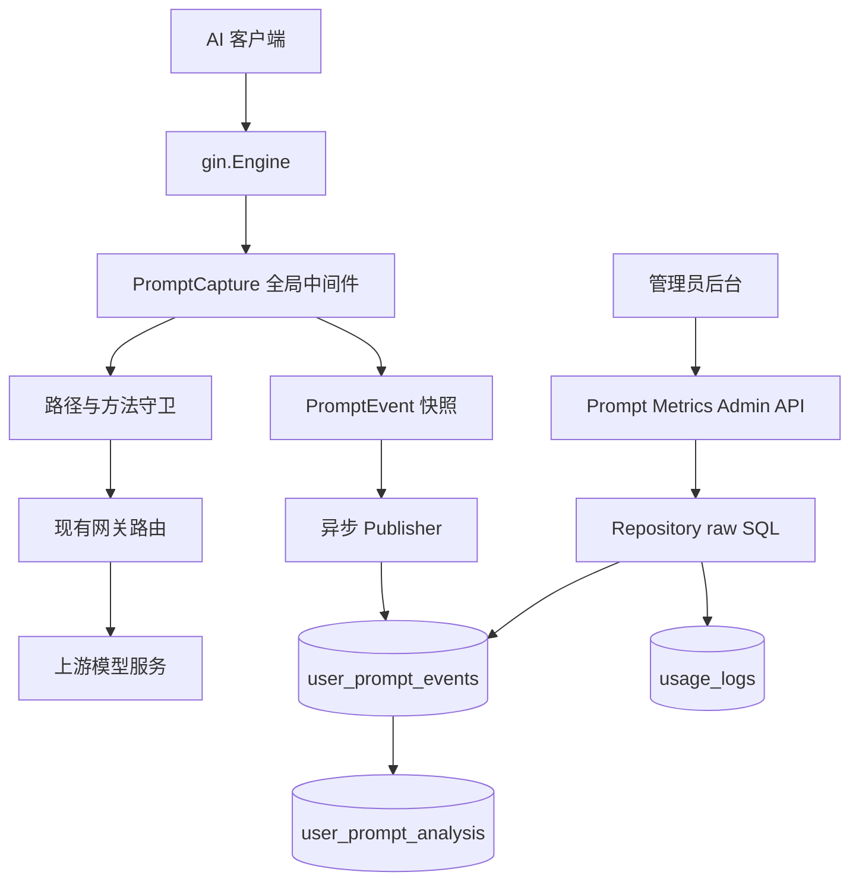
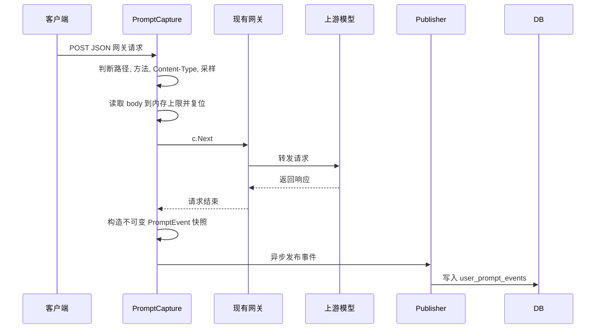

# Prompt Metrics 功能技术留底

> 适用目的: 在 sub2api 上游 main 大版本升级后, 能快速迁移本 feature, 或按同一方案重新实现.
> 当前实现形态: `功能岛 + 单一 Extension + 全局 AOP 中间件 + 路径守卫 + raw SQL`.

## 1. 需求边界

### 业务目标

本功能用于度量用户对 AI 的使用情况, 重点记录**用户手工输入的提示词**并做统计分析:

- 记录每次用户输入问题作为一次交互.
- 关联用户, API Key, 分组, 模型, endpoint, 项目名, git 分支, 客户端和时间.
- 管理员后台查看用户每日交互次数, 周/月趋势, token 与成本趋势.
- 查看项目列表, 分支列表, 客户端和模型维度的交互排行.
- 对提示词做摘要, 质量评分和改进建议.

### 明确不采集

- system, developer, assistant 角色内容.
- tool, tool_call, tool_result, function call, reasoning, file search 结果.
- 服务端注入的默认提示词.
- 模型输出, 流式响应增量和错误响应.
- 非用户手工输入导致的内部内容.

## 2. 最终方案

当前方案是轻量侵入的 AOP 实现:

- 后端功能岛集中在 `backend/internal/service/promptmetrics/`.
- server 层只注入一个 `*promptmetrics.Extension`.
- `PromptCapture` 全局挂载, 但通过路径白名单只处理网关 POST JSON 请求.
- 不修改 `routes/gateway.go` 和 `routes/admin.go` 的上游函数签名.
- 数据库使用独立 migration 和 raw SQL, 不进入 ent schema.
- 与 `usage_logs` 只通过 `request_id + api_key_id` 做查询时弱关联.

### 为什么这样设计

| 方案 | 优点 | 缺点 | 结论 |
| --- | --- | --- | --- |
| 改网关 handler 或 service | 能拿到完整上下文 | 侵入核心转发, 上游升级冲突高 | 不采用 |
| 每个网关 route 单独 `.Use()` | 采集位置清晰 | 会修改 `gateway.go` 大文件, 新 endpoint 容易漏挂 | 已淘汰 |
| 全局中间件 + 路径守卫 + Extension | 改动集中, 可迁移, 冲突低 | 路径白名单需维护 | 当前最佳方案 |

## 3. 架构图



## 4. 请求时序



关键约束:

- 不在异步 goroutine 中读取 `gin.Context`, 防止 context 复用导致数据错乱.
- 中间件读取 body 后必须复位 `c.Request.Body`, 保证现有业务 handler 不受影响.
- 解析失败, 入库失败和队列满都不能影响主请求响应.

## 5. 后端关键代码解析

### 5.1 Extension 是唯一集成对象

文件: `backend/internal/service/promptmetrics/extension.go`

核心职责:

- `NewExtension(cfg, publisher, extractor, handler)` 组装采集中间件和管理 API.
- `CaptureMiddleware()` 返回可全局挂载的 gin 中间件.
- `RegisterAdminRoutes(adminGroup)` 在已鉴权的 admin 分组下补挂 API.

迁移要点:

- 上游升级后只需要让 `server/http.go` 注入 `*promptmetrics.Extension`.
- `server/router.go` 中调用 `r.Use(promptMetrics.CaptureMiddleware())`.
- 管理 API 用新建的 `/admin` group 补挂, 不改上游 `RegisterAdminRoutes` 签名.

### 5.2 PromptCapture 负责无侵入采集

文件: `backend/internal/service/promptmetrics/middleware.go`

核心流程:

1. `shouldCapture` 检查:
   - `POST`
   - `Content-Type` 包含 `json`
   - 命中网关路径白名单
   - 采样率命中
2. `readAndResetBody` 读取请求体, 最多采集 `MaxPromptBytes`, 但复位完整 body 给后续 handler.
3. `c.Next()` 执行业务路由.
4. `buildEvent` 同步构造事件快照.
5. goroutine 中只调用 `publisher.Publish(event)`.

路径白名单:

- `/v1/`
- `/v1beta/`
- `/responses`
- `/chat/completions`
- `/images/`
- `/backend-api/codex/`
- `/antigravity/v1/`
- `/antigravity/v1beta/`

如果上游新增网关入口, 优先扩展 `isGatewayPromptPath`, 再补测试.

### 5.3 Extract 只提取用户输入

文件: `backend/internal/service/promptmetrics/extractor.go`

支持协议:

| 协议 | 入口特征 | 提取字段 |
| --- | --- | --- |
| Anthropic Messages | `/messages` | `messages[].role=="user"` 的 text |
| OpenAI Chat | `/chat/completions` | `messages[].role=="user"` 的 content |
| OpenAI Responses / Codex | `/responses` | `input` 字符串或 user message 的 text |
| Gemini | `/v1beta/models/*` | `contents[].role=="user"` 的 `parts.text` |
| OpenAI Images | `/images/*` | 顶层 `prompt` |

实现原则:

- 先按 endpoint 判断协议, 再用 body 字段兜底.
- 使用 `gjson` 解析, 非法 JSON 或缺字段直接返回空.
- 多段用户输入按顺序保留, 最终用空行拼接为一条事件.

### 5.4 DetectContext 补充项目和分支

文件: `backend/internal/service/promptmetrics/context.go`

优先级:

1. Header:
   - `X-Client-Project`
   - `X-Project-Name`
   - `X-Client-Branch`
   - `X-Git-Branch`
   - `X-Client-Name`
   - `X-Client-Version`
2. User-Agent 识别:
   - `codex-cli`
   - `claude-code`
   - `gemini-cli`
3. body 中 system / instructions / 用户文本的 cwd 和 branch 标记.

注意: 服务端无法可靠知道客户端本地 git 分支, header 是最稳定来源.

### 5.5 Repository 使用 raw SQL 隔离 ent 变化

文件: `backend/internal/service/promptmetrics/repository.go`

设计点:

- 只依赖最小 `Querier` 接口, 不依赖 ent 生成实体.
- `Insert` 写入 `user_prompt_events`.
- `Overview`, `Trend`, `Rank`, `ListEvents`, `EventByID` 为管理后台提供聚合.
- token 和 cost 通过 `LEFT JOIN usage_logs ON usage_logs.request_id = e.request_id AND usage_logs.api_key_id = e.api_key_id` 查询补齐.
- 排行字段通过 `allowedRankColumns` 白名单限制, 避免 SQL 注入.

迁移风险:

- 如果上游改了 `usage_logs` 字段名, 需要同步修改 token/cost join 语句.
- 如果 migration 编号冲突, 新建更大的 migration 编号, 不改已应用历史文件.

### 5.6 Service 提供本地规则分析兜底

文件: `backend/internal/service/promptmetrics/service.go`

当前 `Reanalyze` 会:

1. 把事件标记为 `pending`.
2. 读取事件详情.
3. 调用 `analyzePromptDetail` 生成本地规则分析.
4. upsert 到 `user_prompt_analysis`.

评分维度:

- 清晰度 `clarity`
- 上下文 `context`
- 可执行性 `actionability`
- 约束完整度 `constraint`
- 风险 `risk`

后续如果接入真正 LLM worker, 应保持管理 API 契约不变, 只替换分析实现.

### 5.7 Publisher 保证主链路不阻塞

文件: `backend/internal/service/promptmetrics/publisher.go`

实现:

- 基于 `pond/v2` worker pool.
- 队列满时直接丢弃, 每 256 次左右打一次 warn.
- DB 写入带 `WriteTimeout`.
- `Stop(timeout)` 预留给 graceful shutdown.

## 6. 数据库模型

迁移文件: `backend/migrations/142_prompt_metrics.sql`

### user_prompt_events

用途: 一次用户提示词输入事件.

关键字段:

| 字段 | 含义 |
| --- | --- |
| `request_id` | 与 `usage_logs.request_id` 弱关联 |
| `user_id` / `api_key_id` / `group_id` | 认证主体 |
| `model` / `requested_model` | 实际模型和客户端请求模型 |
| `endpoint` / `source_protocol` | 网关入口和协议 |
| `prompt_text` | 可选全文 |
| `prompt_excerpt` | 脱敏摘录 |
| `prompt_hash` | 归一化后 SHA256 |
| `prompt_chars` / `prompt_segments` / `prompt_tokens_estimated` | 提示词规模 |
| `project_name` / `git_branch` / `client_name` | 开发上下文 |
| `analysis_status` | `pending` / `done` / `failed` / `skipped` |

### user_prompt_analysis

用途: 一次提示词事件的分析结果.

关键字段:

- `prompt_event_id`
- `summary`
- `quality_score`
- `clarity_score`
- `context_score`
- `actionability_score`
- `constraint_score`
- `risk_score`
- `categories`
- `improvement_suggestions`
- `analyzer_model`

## 7. 管理端 API

统一前缀: `/api/v1/admin/prompt-metrics`

| 方法 | 路径 | 用途 |
| --- | --- | --- |
| GET | `/overview` | 总览指标 |
| GET | `/trend` | 趋势数据, 支持 `bucket=day|hour` |
| GET | `/rank` | 维度排行, 支持 `dimension=user|project|branch|client|model` |
| GET | `/events` | 事件列表和分页 |
| GET | `/events/:id` | 事件详情, 含全文和分析 |
| POST | `/events/:id/reanalyze` | 重新生成分析 |

常用过滤参数:

- `from`, `to`: RFC3339 时间.
- `user_id`, `api_key_id`, `group_id`.
- `project` / `project_name`.
- `branch` / `git_branch`.
- `client` / `client_name`.
- `model`, `endpoint`, `hash`.
- `min_quality`, `max_quality`, `only_low_quality`.
- `page`, `page_size`, `limit`, `offset`.

## 8. 前端实现

主要文件:

- `frontend/src/api/admin/promptMetrics.ts`: API 类型和请求函数.
- `frontend/src/views/admin/PromptMetricsView.vue`: 管理页.
- `frontend/src/router/index.ts`: `/admin/prompt-metrics` 路由.
- `frontend/src/components/layout/AppSidebar.vue`: 管理员侧边栏入口.
- `frontend/src/i18n/locales/zh.ts`, `frontend/src/i18n/locales/en.ts`: 文案.

页面能力:

- 时间范围筛选.
- 总事件数, 用户数, 低质量数, 截断数, token, cost, 平均分, pending 数.
- 交互趋势折线.
- 项目, 分支, 客户端, 模型, 用户排行.
- 事件明细列表和分页.
- 事件详情模态框.
- 手动重新分析.

## 9. 上游大版本升级后的迁移步骤

### 9.1 优先保留上游

冲突较多时, 优先接受上游新版实现, 再重新挂载本 feature. 不要在 `routes/gateway.go` 大文件中手工拼接旧冲突块.

### 9.2 恢复功能岛

确认以下目录和文件存在:

- `backend/internal/service/promptmetrics/`
- `backend/migrations/*_prompt_metrics.sql`
- `frontend/src/api/admin/promptMetrics.ts`
- `frontend/src/views/admin/PromptMetricsView.vue`

### 9.3 恢复后端触点

1. `backend/internal/config/config.go`
   - 保留 `PromptMetricsConfig`.
   - 保留 `Config.PromptMetrics`.
2. `backend/cmd/server/wire.go`
   - import `github.com/Wei-Shaw/sub2api/internal/service/promptmetrics`.
   - `wire.Build` 加入 `promptmetrics.ProviderSet`.
3. `backend/internal/server/http.go`
   - `ProvideRouter` 增加 `promptMetrics *promptmetrics.Extension`.
   - 调用 `SetupRouter(..., promptMetrics)`.
4. `backend/internal/server/router.go`
   - 中间件链中加入 `r.Use(promptMetrics.CaptureMiddleware())`.
   - `registerRoutes` 参数增加 `promptMetrics *promptmetrics.Extension`.
   - 调用 `registerPromptMetricsAdminRoutes(v1, adminAuth, promptMetrics)`.
   - 新增辅助函数在 `/admin` 分组下补挂 `promptMetrics.RegisterAdminRoutes(admin)`.
5. 执行:

```bash
cd backend
go generate ./cmd/server
```

### 9.4 恢复前端触点

1. `frontend/src/api/admin/index.ts` 导出 `promptMetricsAPI`.
2. `frontend/src/router/index.ts` 注册 `/admin/prompt-metrics`.
3. `frontend/src/components/layout/AppSidebar.vue` 增加菜单项.
4. `frontend/src/i18n/locales/zh.ts` 和 `en.ts` 增加文案.

### 9.5 新 endpoint 适配

如果上游新增可承载用户提示词的网关入口:

1. 扩展 `isGatewayPromptPath`.
2. 必要时扩展 `detectProtocol`.
3. 为 extractor 增加协议解析规则.
4. 增加 middleware 路径守卫测试和 gateway 路由注册测试.

## 10. 验证清单

后端必跑:

```bash
cd backend
go test -tags=unit ./internal/service/promptmetrics ./internal/server/routes ./internal/config
```

前端必跑:

```bash
cd frontend
pnpm run typecheck
```

格式检查:

```bash
git diff --check
```

手工验收:

- 网关 POST JSON 请求能产生 `user_prompt_events`.
- `/api/v1/admin/*` 请求不会触发 prompt capture.
- `/api/v1/admin/prompt-metrics/overview` 可返回总览.
- `/admin/prompt-metrics` 页面可展示趋势, 排行和事件列表.
- 手动 `reanalyze` 后能看到本地规则分析结果.

## 11. 已知取舍和后续优化

### 当前取舍

- 全局中间件依赖路径白名单, 需要在新增网关入口时维护.
- 默认本地规则分析不是最终 AI 评分, 只是无外部 worker 时的兜底.
- 服务端只能尽力推断项目和分支, 最佳方式仍是客户端显式上传 header.
- 事件入库是 best-effort, 队列满时允许丢弃以保护主链路.

### 后续优化

- 接入真正的 LLM 分析 worker, 消费 `analysis_status='pending'`.
- 增加定时清理任务, 执行 `PurgeFullText` 和 `DeleteOldEvents`.
- 增加导出功能和低质量/高成本告警.
- 推动 Codex, Copilot 或内部客户端统一发送项目名和 git 分支 header.

