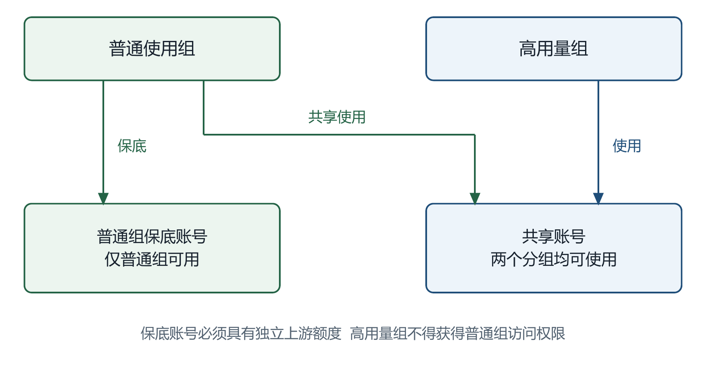
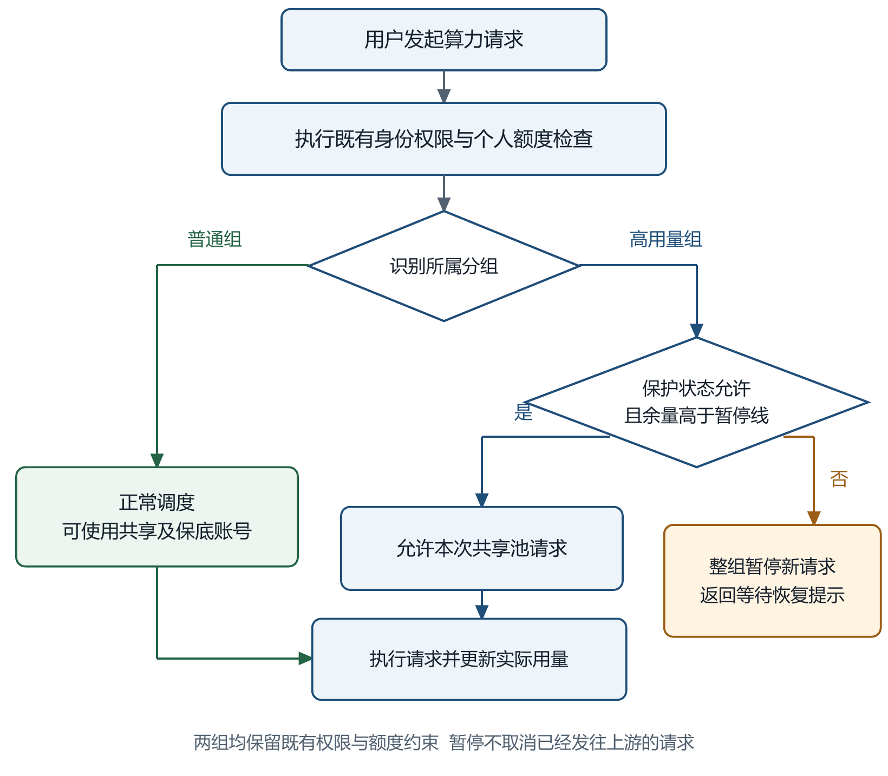
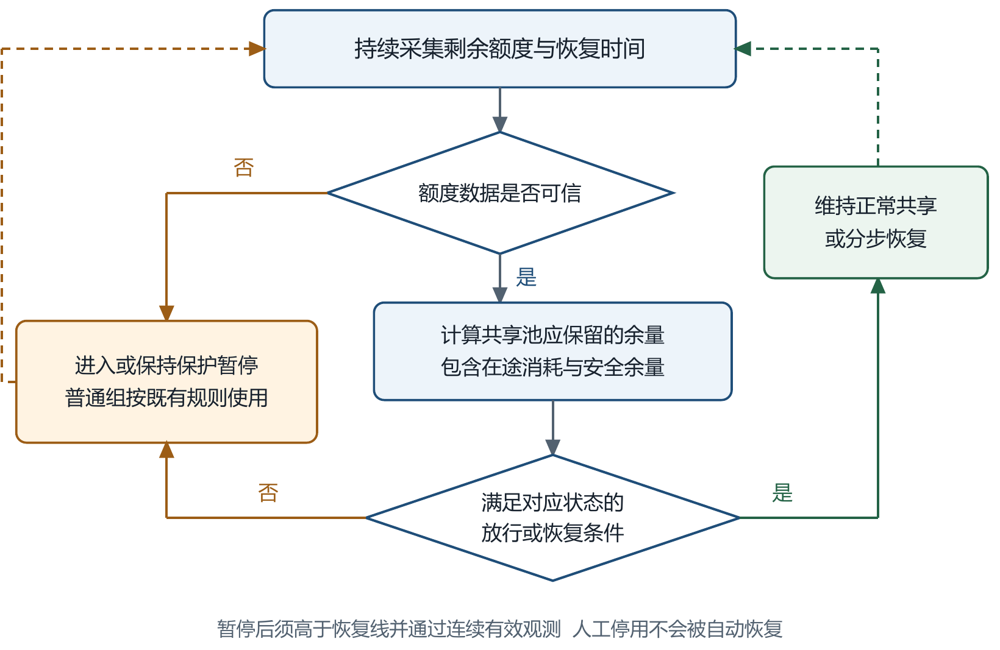

# 共享算力池普通用户保障机制汇报方案

交互汇报版：[打开 HTML 文档](shared-compute-pool-protection-report-cn.html)。包含共享模式对比、余量调节、暂停与恢复演示，以及三张机制流程图；演示不连接生产系统。

方案建议稿  |  2026年9月21日

### 一 汇报结论

建议分两阶段建设普通组保障机制：先利用现有账号分组配置划出保底资源，降低普通业务被挤占的风险；再增加共享池余量监测和高用量组自动暂停、恢复能力，在满足普通组保底需求的前提下，尽量开放高用量组的资源使用。

核心决策是确定普通组应获得的保障水平，以及高用量组在资源紧张时可接受的等待规则。自动控制能力属于拟建设内容，当前尚未实施。

### 二 问题与业务影响

当前多个上游账号组成共享算力池，普通用户和高用量用户通过不同分组使用同一批资源。分组区分了使用人群，但没有为普通组预留可用额度；高用量组短时间集中消耗后，普通组可能在上游额度恢复前无法正常使用。

| 影响对象 | 当前风险 | 本方案预期改善 |
| --- | --- | --- |
| 普通组 | 日常任务被高用量消耗挤占 | 在约定业务范围和保障额度内保留可用资源 |
| 高用量组 | 与普通组竞争同一资源池 | 资源充足时正常使用，达到保底线后等待恢复 |
| 运营管理 | 依赖人工发现和临时调整 | 统一暂停规则、恢复条件和可追溯记录 |

### 三 方案选择

| 方案 | 普通组保障 | 资源使用效率 | 建议 |
| --- | --- | --- | --- |
| 降低个人限额或并发 | 只能减缓消耗 | 可能长期限制高用量用户 | 辅助措施 |
| 配置独立保底账号 | 可隔离一部分资源 | 保底账号可能闲置 | 第一阶段先行 |
| 按池余量自动暂停和恢复 | 按保底需求控制新请求 | 充足时允许高用量组充分使用 | 第二阶段目标 |

保障以真实可用资源为基础。上游整体故障或普通组自身需求超出已配置容量时，仍需扩容或调整服务范围；本方案不承诺无限供给。

## 四 第一阶段实施现有配置保底

利用项目已有的账号与分组绑定能力，将资源划分为共享账号和普通组保底账号。普通组可使用两部分资源，高用量组仅可使用共享账号。

图1 第一阶段资源分配机制  现有能力可配置

| 步骤 | 实施动作 | 完成条件 |
| --- | --- | --- |
| 1 盘点资源 | 确认账号所属平台、真实额度、恢复周期及配额是否相互独立 | 避免把同一上游账号的多个凭证重复算作资源 |
| 2 划定保底 | 按普通组至额度恢复前的需求，分配独立保底账号 | 保底账号覆盖普通组实际使用的模型 |
| 3 配置权限 | 普通组绑定共享和保底账号；高用量组只绑定共享账号 | 高用量用户不能切换到普通组绕过限制 |
| 4 场景验证 | 模拟共享账号额度耗尽及跨组访问 | 普通组仍可使用保底账号，高用量组不能进入 |

### 现有能力的使用边界

分组日、周、月额度是每个用户订阅的限额；分组每分钟请求限制也按用户分别计数，均不能作为整组累计预算。OpenAI 账号用量阈值会让所有使用该账号的分组同时失去该资源，不能直接用来只暂停高用量组。

第一阶段无需新增自动控制功能，但保底资源不能自动借给高用量组。保底比例应依据实际需求确定，不预设固定账号数量。

## 五 第二阶段建设按分组执行的准入机制

系统在每次算力请求前检查分组和保护状态。资源充足时，高用量组正常使用共享池。达到保底线后，高用量组全部新请求暂停，普通组继续按既有规则使用资源。

图2 请求处理流程  第二阶段拟建设

### 请求处理规则

| 对象或场景 | 处理方式 |
| --- | --- |
| 普通组 | 保留既有权限、个人额度和并发检查；不受高用量组保护暂停影响 |
| 高用量组正常状态 | 检查最新保护状态及余量，满足要求后才进入共享池 |
| 高用量组保护暂停 | 整组拒绝新的算力请求，返回等待恢复提示；已有上游请求允许结束 |
| 所有请求入口 | 网页或客户端调用、长连接后续轮次和重试均执行同一规则 |

## 六 自动暂停与恢复机制

共享池暂停线以普通组在相关额度恢复前的需求为基础，扣除独立保底账号已能覆盖的部分，再加入在途消耗与安全余量。恢复线高于暂停线，且需连续有效观测满足条件，避免重复预留和频繁开关。

图3 保护控制循环  第二阶段拟建设

| 当前状态 | 判断条件 | 高用量组动作 |
| --- | --- | --- |
| 正常共享 | 任一关键额度窗口达到暂停线，或数据失去可信度 | 进入保护暂停 |
| 保护暂停 | 未超过恢复线，或恢复观测尚不充分 | 保持暂停，不因短时回升立即放行 |
| 恢复观察 | 所有相关额度窗口均超过恢复线且持续稳定 | 逐步恢复；再次达到暂停条件则退回暂停 |

### 示例说明

仅用于说明机制：共享池某一可比较额度窗口总资源为1000单位，暂停线为200单位，恢复线为300单位。余量降到200时暂停高用量组；恢复到260时仍暂停；超过300并持续满足条件后逐步恢复。200已包含该池需承担的保底需求和安全余量，实际数值需通过试点确定。

OpenAI账号需同时考虑5小时、7天等限制；不同账号和窗口的剩余百分比不能直接相加。用户扣费金额也不等同于上游真实算力。额度数据不可信时，高用量组采用保护暂停，普通组继续遵守已有健康与额度限制。

## 七 实施步骤与验收标准

| 阶段 | 主要工作 | 进入下一阶段的条件 |
| --- | --- | --- |
| 资源与需求确认 | 盘点额度独立性与普通组需求；按平台及不可互换模型分别确定策略 | 保障范围、计量方式和保底规模明确 |
| 现有配置保底 | 配置共享与保底账号、分组权限；验证跨组隔离 | 共享资源耗尽时普通组仍可完成约定测试请求 |
| 自动机制观察 | 开发余量监测、状态判定和日志；先记录拟暂停动作 | 观测覆盖相关恢复周期，误判和数据缺失有处置方案 |
| 小范围启用 | 选择同一平台的一个高用量组，启用暂停、等待提示和恢复机制 | 通过下列验收场景，并确认普通组体验与消耗符合预期 |
| 逐步推广 | 按平台扩展范围，结合运行数据调整阈值 | 每次扩展可单独关闭，保底资源仍有效 |

### 关键验收场景

| 场景 | 必须满足的结果 |
| --- | --- |
| 高用量组快速消耗 | 达到保护条件后，同组不同用户和不同Key的新请求均被暂停 |
| 普通组持续使用 | 在已约定保底范围内仍可完成目标模型请求，不被连带暂停 |
| 长连接与并行请求 | 长连接后续轮次不能绕过；在途消耗纳入安全余量，多节点状态一致 |
| 额度恢复 | 未到恢复线不放行；满足持续恢复条件后自动恢复，避免频繁切换 |
| 额度数据异常 | 高用量组进入保护；普通组不被无条件放行到失效账号 |
| 人工干预与回退 | 人工停用不被自动恢复；关闭自动机制后可回到已验证的配置保底方案 |

### 上线后跟踪指标

跟踪普通组因资源不足导致的失败率和等待时长、高用量组暂停时长、共享资源使用率、保底资源闲置率，以及暂停后的追加消耗。目标值在试点前约定，扩展前按同一口径复核。

研发工期和人力投入在计量口径、平台范围及入口清单确认后评估。本方案以阶段完成条件推进，不预设未经评估的交付日期。

## 八 提请确认的事项

建议确认两阶段实施方向，并先批准现有配置保底试点。自动控制功能在资源口径和验收标准确认后进入开发评估。

| 决策事项 | 建议原则 | 建议协同角色 |
| --- | --- | --- |
| 保障范围 | 明确普通组用户、关键模型和需要保障的使用时段 | 业务负责人、运营 |
| 保底规模 | 以普通组需求与上游恢复周期为依据，预留在途消耗余量 | 运营、研发 |
| 高用量组等待规则 | 确认整组暂停范围、恢复条件和用户提示方式 | 业务负责人、运营 |
| 试点范围与资源 | 先选一个平台和一个高用量组，验证后再扩展 | 研发、运维、测试 |
| 推广门槛 | 约定普通组保障指标、高用量组等待容忍度及回退触发条件 | 业务负责人、研发、运营 |

### 主要风险与应对

| 风险 | 应对措施 |
| --- | --- |
| 上游额度滞后或账号共享同一配额 | 按真实额度主体去重；监测数据时效，保留安全余量 |
| 暂停后仍有在途消耗 | 限制新增准入并估计未结算消耗，避免等到额度耗尽才暂停 |
| 高用量用户切组绕过 | 同时核对分组授权、已有Key和有效订阅，不仅隐藏前端入口 |
| 普通组需求增长或上游整体故障 | 复核保底规模与模型覆盖，触发扩容或调整保障范围 |

### 附 项目能力核对依据

本方案以2026年9月21日项目当前工作区源码为依据。现有能力与拟建设机制分别标注；示例阈值不代表生产配置。主要核对位置如下，供研发复核：

订阅与RPM计数：backend/internal/service/billing_cache_service.go

账号分组绑定：backend/internal/repository/account_repo.go

OpenAI账号阈值：backend/internal/service/openai_gateway_scheduling.go

分组停用校验：backend/internal/server/middleware/api_key_auth.go

知识库边界说明：llm-wiki/wiki/security-and-reliability.md
