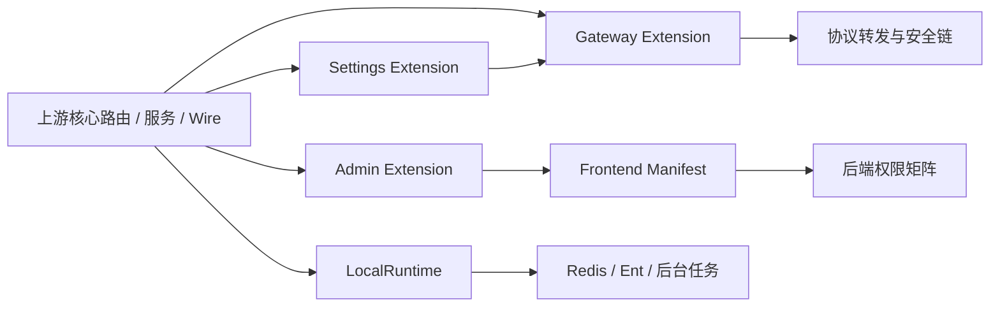

# 本地 Fork 治理方案 A：强类型扩展边界设计

| 字段 | 值 |
| --- | --- |
| 版本 | `1.0` |
| 日期 | 2026-08-12 |
| 状态 | 设计候选，待用户评审批准后进入实施计划；**尚未授权修改业务代码** |
| 对应债务 | `TD-009`：本地 fork 与 `Wei-Shaw/sub2api` 长期分叉 |
| 效果标准 | `docs/features/upstream-fork-governance-effectiveness-test-standard-cn.md` v1.1 |
| 核心目标 | 保留全部本地能力，同时把上游同步中的重复语义判断收口到少量、显式、可测试的编译期接缝 |

> 本文回答“方案 A 要改成什么样、怎样分阶段实施、评审看什么”。效果标准回答“怎样证明它确实降低了合并成本”。两者缺一不可。

---

## 一、决策摘要

采用**编译期强类型扩展**，不引入动态插件、反射扫描、外部扩展服务或运行时全局注册表。上游核心继续拥有协议、路由和主业务流程；本地能力通过五类稳定接缝接入：

| 接缝 | 收口对象 | 目标结果 |
| --- | --- | --- |
| Gateway Extension | RequestArchive、RequestIntercept、安全 guard 顺序、兼容补丁、Prompt 安全链 | 上游路由文件只保留少量显式调用，顺序合同由构造器和契约测试固定 |
| Admin Extension | Token Analysis、组织用量、Request Intercept、并发 preset 等本地管理能力 | 本地 handler、路由和权限映射集中拥有，不再散落追加到上游管理入口 |
| LocalRuntime | 本地 runner、flusher、索引器及 cleanup | Wire 只注入一个本地运行时聚合；启动、停止和基础设施关闭顺序可单测 |
| Settings Extension | 本地 settings 字段、校验、partial update 和运行时刷新 | namespaced API 成为主入口；通用 `PUT /admin/settings` 只保留窄兼容 adapter |
| Frontend Manifest | 本地管理路由、侧栏入口、权限和 lazy view | 路由、导航和权限展示共享单一静态 manifest，后端仍是最终授权源 |

### 1.1 明确不选的方案

| 方案 | 结论 | 原因 |
| --- | --- | --- |
| 动态插件 / 运行时模块加载 | 不采用 | 增加生命周期、版本、安全和故障隔离成本；当前本地能力与核心共享进程和数据模型，收益不足 |
| 万能 Registry + `init()` 自动注册 | 不采用 | 隐藏顺序和依赖，测试与 Wire 可读性下降，并把合并债转换为全局状态债 |
| 一次性搬空所有本地代码 | 不采用 | 变更面过大，无法可靠区分结构回归与历史基线问题 |
| 停止同步上游 | 不采用 | 与当前持续吸收 `Wei-Shaw/sub2api` 能力的产品策略冲突 |

---

## 二、当前结构与问题边界

### 2.1 已确认热点

| 热点 | 当前事实 | 重复成本 |
| --- | --- | --- |
| `backend/internal/server/routes/gateway.go` | 直接创建 Archive/Intercept，并在多个 route group 和 alias 中手工排列 | 上游新增 guard、alias 或认证链时必须逐处判断顺序 |
| `backend/internal/server/router.go` / `routes/admin.go` | 上游管理路由与本地管理能力共享入口 | 路由、权限、handler 字段和前端入口容易四处漏改 |
| `backend/cmd/server/wire.go` | `provideCleanup` 直接接收大量上游与本地 runtime | 每次新增上游任务都要人工并集；本地任务容易漏 Stop/Flush |
| `backend/internal/service/wire.go` | 本地 runner/flusher 与上游 service 共用一个大型 ProviderSet | Wire 冲突需要理解启动副作用和 cleanup 配对 |
| `setting_handler_update.go` | 通用 settings DTO、field presence、校验、写入与返回结构集中 | 上游增加字段时，本地字段持续扩大同一热点 |
| `frontend/src/router/index.ts` + `AppSidebar.vue` | 本地页面路由、导航与权限分别维护 | 页面存在但菜单缺失、菜单可见但路由被拒等漂移风险 |

### 2.2 必须保留的合同

| 能力域 | 不可改变的行为 |
| --- | --- |
| Gateway | `Archive -> 核心 Guard -> Intercept`；非法 Responses/Gemini 子路径不能被 Intercept 短路 |
| Prompt 安全 | Prompt Risk/judge、Content Moderation、Prompt Audit 的组合语义保持；judge 故障固定 fail-open |
| Settings | 未发送字段保留；显式 `false`、`0`、空字符串或空数组按字段合同生效 |
| Runtime | 本地任务只启动一次；Stop/Flush 幂等；必须先于 Redis/Ent 关闭完成 |
| Admin/Auth | 后端 HTTP method + Gin `FullPath()` 权限是最终授权源；前端隐藏不能代替服务端拒绝 |
| Compatibility | cache usage 只填缺失、不覆盖已有细分桶；reasoning effort 保持显式值优先 |

---

## 三、目标架构



架构原则：

1. 上游核心文件只看见**显式、强类型、数量有限**的本地入口；
2. 每个接缝只负责一个变化方向，不允许跨域万能 descriptor；
3. 运行顺序写在构造器/调用点中，不依赖 import 顺序或 `init()`；
4. 所有本地能力都有稳定合同 ID，并可从外部入口或生命周期边界验证；
5. 兼容 adapter 必须注明退出条件，不能无限期成为第二套主路径。

### 3.1 建议目录与所有权

| 目标路径 | 职责 | 禁止事项 |
| --- | --- | --- |
| `backend/internal/localext/gateway/` | 本地 ingress middleware envelope、兼容纯函数和安全链接缝 | 不注册全局 handler；不接管上游协议路由所有权 |
| `backend/internal/localext/admin/` | 本地 handlers 聚合、路由注册、能力清单 | 不绕过 `AdminAuth`；不从前端生成后端权限 |
| `backend/internal/localext/runtime/` | 本地 runtime 聚合、启动和停止 | 不关闭 Redis/Ent；不管理上游 runtime |
| `backend/internal/localext/settings/` | 本地 settings patch、校验、mutation 和兼容 adapter | 不复制通用 settings 全量 DTO |
| `frontend/src/extensions/localAdminManifest.ts` | 本地页面路由、导航元数据和 UI 权限提示 | 不充当服务端授权源；不做网络动态加载 |

这些路径是目标所有权边界。迁移期间允许原文件保留窄 adapter，但新增本地业务逻辑只能进入上述所有权范围或现有明确的本地域文件。

---

## 四、五类接缝详细设计

### 4.1 Gateway Extension

目标接口只表达已经确认的顺序，不提供任意 phase 字符串或优先级数字：

```go
type Extension struct {
    archive   gin.HandlerFunc
    intercept gin.HandlerFunc
}

func NewExtension(cfg *config.Config, settings *service.SettingService) *Extension

// Handlers 固定返回 Archive -> coreGuards -> Intercept。
func (e *Extension) Handlers(coreGuards ...gin.HandlerFunc) []gin.HandlerFunc
```

使用规则：

- `/v1`、`/v1beta`、root `/responses`、backend alias 等入口都通过同一个 `Extension` 组装本地 middleware；
- 认证、body limit、group assignment 仍由上游 route group 显式拥有；
- `guardResponsesSubpath`、`guardGeminiModelAction` 作为 `coreGuards` 传入，不能塞进本地配置或按字符串排序；
- 不允许调用者自行取得 `archive` / `intercept` 后重新排列；需要特殊入口时新增有名字的强类型方法和对应合同测试；
- Prompt Metrics 的全局 capture 仍在 router 明确位置挂载；Prompt Risk/judge 继续复用现有审核 coordinator，不新建并行审核流水线；
- cache usage 与 reasoning effort 兼容逻辑迁为同目录纯函数，只在现有规范化节点显式调用，不使用 callback registry。

失败语义：构造阶段配置读取失败沿用当前静态配置/运行时 provider 的既有降级；安全 guard 不得 fail-open；judge 网络/解析故障继续 fail-open，且必须有合同测试区分两者。

### 4.2 Admin Extension

新增一个编译期聚合，而不是通用模块注册器：

```go
type Handlers struct {
    TokenAnalysis      *admin.TokenAnalysisHandler
    OrganizationUsage *admin.OrganizationUsageHandler
    RequestIntercept   *admin.RequestInterceptHandler
    ConcurrencyPreset  *admin.UserConcurrencyPresetHandler
}

func (h *Handlers) Register(group *gin.RouterGroup)
```

约束：

- `routes/admin.go` 在完成 `AdminAuth` 和上游核心分组后只调用一次 `h.LocalAdmin.Register(admin)`；
- 每个本地路由的 method/path 保持不变，避免无业务收益的 API 迁移；
- 后端子管理员权限仍集中在 `service/admin_permission*.go`，本地 route spec 放入独立本地域文件并由权限矩阵测试覆盖；
- 顶层 `handler.Handlers` 只增加一个 `LocalAdmin *localadmin.Handlers` 字段，不继续为每个本地能力追加字段；
- 不把支付、账号等上游管理能力强行搬入本地聚合。

### 4.3 LocalRuntime

`LocalRuntime` 只聚合本地生命周期对象，目标成员首批为：

- `TokenAnalysisService` 的 auto-index 生命周期；
- `UserConcurrencyPresetRunner`；
- `UserPlatformQuotaUsageFlusher`；
- `promptmetrics.Extension` 的本地停止/刷新职责。

```go
type Runtime struct {
    tokenAnalysis    *service.TokenAnalysisService
    concurrency      *service.UserConcurrencyPresetRunner
    quotaFlusher     *service.UserPlatformQuotaUsageFlusher
    promptMetrics    *promptmetrics.Extension
    startOnce        sync.Once
    stopOnce         sync.Once
}

func NewRuntime(
    tokenAnalysis *service.TokenAnalysisService,
    concurrency *service.UserConcurrencyPresetRunner,
    quotaFlusher *service.UserPlatformQuotaUsageFlusher,
    promptMetrics *promptmetrics.Extension,
) *Runtime
func (r *Runtime) Stop(ctx context.Context) error
```

生命周期合同：

1. 迁移后的本地成员 provider 不得带启动副作用；`NewRuntime` 是 DI 图内唯一启动入口，并通过 `startOnce` 启动成员；各成员 `Start` 也必须幂等，防御误调用；
2. `Stop` 使用明确成员顺序并保证幂等；需要最终 flush 的对象先停止接收新工作，再 flush；
3. `cmd/server.provideCleanup` 只接收一个 `*localruntime.Runtime`，在 Redis/Ent 关闭前调用；
4. 上游 runtime 继续留在上游 cleanup，不被吸入本地聚合；
5. 新增本地后台任务必须同时补 `LIFE-START-01`、`LIFE-STOP-01` 映射，不允许只加 Wire provider。

依赖方向固定为 `cmd/server -> localext/runtime -> service/promptmetrics`。`service` 和 `promptmetrics` 不得反向 import `localext/runtime`；`cmd/server/wire.go` 单独加入 `localruntime.ProviderSet`，因此不会形成 import cycle。迁移时需要把 `ProvideTokenAnalysisService`、`ProvideUserConcurrencyPresetRunner`、`ProvideUserPlatformQuotaUsageFlusher` 中现有的自动 `Start()` 移到 `NewRuntime`，但其对象仍由原 service ProviderSet 构造并供 handler/service 消费。

### 4.4 Settings Extension

目标是“一个本地字段只有一个业务写入实现”，同时保持旧客户端兼容。

| 层 | 职责 |
| --- | --- |
| namespaced API | 本地 settings 的主入口，例如既有 `/admin/settings/request-archive`、`/admin/request-intercept/config` 和 risk-control 子资源 |
| domain patch | 解析 field presence，区分 omitted 与显式空值，校验并生成 setting mutations |
| legacy adapter | 通用 `PUT /admin/settings` 只提取仍需兼容的本地字段，并调用同一 domain patch |
| repository write | 对同一 setting table 的 mutations 继续合入一次 `SetMultiple`，避免 core/local 半写 |
| runtime refresh | 仅在持久化成功后刷新对应 snapshot/listener；失败不使用请求零值覆盖缓存 |

兼容策略：

- v1 实施不删除通用 settings 返回字段，不破坏现有前端；
- 新前端改用 namespaced API 后，legacy adapter 至少保留三个正式 release 观察周期；
- 退出 adapter 前必须证明访问日志中无旧写入、契约测试覆盖新旧入口等价，并单独提交删除 PR；
- 不新增“所有 settings 的万能 map”。typed patch 最终仍生成已有 repository 接受的 mutations。

### 4.5 Frontend Manifest

只收口本地管理页面，不一次性改写全部前端路由：

```ts
export interface LocalAdminFeature {
  id: string
  route: RouteRecordRaw
  nav: {
    labelKey: string
    iconKey: LocalAdminIconKey
    hideInSimpleMode?: boolean
  }
  adminPermission?: AdminPermission
}

export const localAdminFeatures: readonly LocalAdminFeature[]
```

消费者：

- `router/index.ts` 展开 `route`；
- `AppSidebar.vue` 用一个穷举 `Record<LocalAdminIconKey, NavItem['icon']>` 将 `iconKey` 映射为现有图标，再从同一列表生成可见导航；
- 路由守卫复用 `route.meta.adminPermission`；
- `getAdminLandingPath` 使用 manifest 中标记为可作为 landing 的条目，但顺序显式固定。

后端 `AdminAuth` 仍是最终授权源。manifest 的权限仅用于导航和客户端恢复，不允许因条目缺失而放宽服务端权限。

---

## 五、迁移策略

每一阶段必须是独立、可回滚、行为等价的 PR；不得在上游 merge PR 中实施。

| 阶段 | 交付物 | 进入条件 | 完成门槛 | 回滚 |
| --- | --- | --- | --- | --- |
| 0 | 14 类 fork 契约包及统一执行入口 | 设计获批 | 当前结构 `CPR=100%`，失败基线有独立归因 | 只删除新增测试/脚本 |
| 1 | Gateway Extension | 阶段 0 通过 | 所有入口顺序合同通过；协议行为零 diff | 恢复原显式 middleware 列表 |
| 2 | LocalRuntime | 阶段 1 稳定 | 启停、幂等、flush、Redis/Ent 顺序合同通过 | 恢复原 Wire 参数和 cleanup step |
| 3 | Admin Extension + Frontend Manifest | 阶段 0 通过，可与阶段 2 串行 | API path、权限矩阵、路由和侧栏一致 | 恢复原分散注册，API 不变 |
| 4 | Settings Extension | 前三阶段稳定 | 新旧写入口等价，omitted/empty 合同通过 | 前端切回旧 API，保留 adapter |
| 5 | Gateway compat/safety 文件归属收口 | Gateway 合同稳定 | usage/reasoning/safety 全合同通过 | 恢复原调用点，不改变 DTO |
| 6 | 同 SHA A/B | 阶段 1-5 完成 | v1.1 结果至少 `effective` | 不合入控制组；实验结构可按阶段回滚 |
| 7 | 连续真实同步观察 | A/B 为 `effective` | 达到 v1.1 `mitigated` 门槛 | 保持 `doing`，继续修正接缝 |

实施顺序故意先 Gateway、Runtime，再 Admin/Settings。前两项是历史高频冲突与高风险生命周期热点；Settings 变更面最大，必须等契约和接缝实践稳定后再做。

---

## 六、契约包设计

效果标准中的 14 个合同是阶段 0 独立交付，不隐藏在结构重构 PR 中。

| 测试层 | 覆盖合同 | 建议落点 |
| --- | --- | --- |
| Gateway route/integration | `GW-*` | `backend/internal/server/routes/*_test.go`，测试名统一含 `ForkContract` 与合同 ID |
| Settings handler/service | `SET-*` | `backend/internal/handler/admin/*_test.go`、`backend/internal/service/*_test.go` |
| Wire/lifecycle | `LIFE-*` | `backend/cmd/server/*_test.go` 与本地 runtime 单测 |
| Safety/compat | `SAFE-*`、`COMP-*` | 对应 service package 的外部行为测试 |
| Admin/auth | `AUTH-MATRIX-01`、`EXT-ADMIN-01` | 后端路由/权限测试 + 前端 router/sidebar manifest 测试 |

统一执行入口必须同时运行 Go 与前端合同，输出合同 ID、执行状态和失败归因。环境导致未执行必须显示 `unknown`，不能折算为通过。全量既有 unit、integration、lint、typecheck、Vitest 和 build 仍是独立门禁。

---

## 七、评审闭环

### 7.1 评审角色

同一人可以承担多个角色，但结论必须分开记录：

| 角色 | 主要问题 | 必须签字的阶段 |
| --- | --- | --- |
| 架构评审 | 接缝是否减少上游热点、是否引入新全局耦合 | 设计、每个结构 PR |
| 合同评审 | 14 类合同是否覆盖真实外部行为 | 阶段 0、每次合同变更 |
| 安全评审 | guard/intercept、fail-open、权限是否漂移 | Gateway、Safety、Admin |
| 可靠性评审 | Start/Stop/Flush、超时和基础设施关闭顺序 | LocalRuntime |
| 合并维护评审 | 代表性 SHA、SDP/RSD/ARM 记账是否可信 | A/B、三轮真实同步 |

### 7.2 设计评审问题

| ID | 问题 | 通过条件 |
| --- | --- | --- |
| `D-01` | 五类接缝是否都有单一职责和明确消费者？ | 每个接缝能说明输入、输出、依赖和失败语义 |
| `D-02` | 是否存在万能 registry、`init()`、反射或全局可变注册？ | 均不存在 |
| `D-03` | Gateway 顺序是否唯一表达？ | 只有 `Archive -> coreGuards -> Intercept`，调用者不能重排 |
| `D-04` | Runtime 是否只管理本地任务？ | 上游 runtime 不被吸入，Redis/Ent 不由它关闭 |
| `D-05` | Settings 是否只有一个本地业务写入实现？ | namespaced API 与 legacy adapter 复用同一 domain patch |
| `D-06` | 前端 manifest 是否误当授权源？ | 后端权限矩阵仍 fail-closed |
| `D-07` | 兼容 adapter 是否有退出条件？ | 至少写明观察周期、证据和删除 gate |
| `D-08` | 是否能按阶段独立回滚？ | 每阶段不依赖未合入的下一阶段即可恢复 |

### 7.3 单阶段 PR 评审模板

```markdown
## Fork 治理阶段评审

- 阶段 / PR：
- 本地基线 SHA：
- 触及接缝：Gateway / Admin / Runtime / Settings / Frontend
- 合同 ID：
- 外部行为变化：无 / 有（列明）
- 上游热点新增本地语义：无 / 有（说明为什么不可避免）
- `wire_gen.go`：仅生成 / 未触及
- 回滚路径：
- 定向验证：
- 完整验证：
- Wiki 更新：
- 评审结论：通过 / 修改后复审 / 拒绝
```

### 7.4 Go / No-Go 门禁

| Gate | Go 条件 | No-Go 条件 |
| --- | --- | --- |
| `G0 设计` | `D-01..08` 全通过，用户批准设计 | 仍有未决架构选择或范围含糊 |
| `G1 契约` | 14/14 可独立执行，当前结构 `CPR=100%` | 合同缺失、跳过或只有内部函数测试 |
| `G2 阶段合入` | 对应合同 + 全量门禁通过，diff 仅限本阶段 | 越阶段重构、能力删除、基线失败未归因 |
| `G3 A/B` | 样本具代表性、同 exact SHA、结果为 `effective` | 只达到 `improving` 或试验污染 |
| `G4 Mitigated` | 连续真实同步满足 v1.1 最终门槛 | 任何 `unknown`、`PRF>0` 或重复语义决策持续出现 |

---

## 八、效果、观测与完成定义

| 层级 | 定义 | 是否可改变 TD-009 状态 |
| --- | --- | --- |
| `baseline` | 契约建立或样本不具代表性，尚不能证明成本下降 | 否 |
| `improving` | 代表性 A/B 有明显改善但未达到完整效果线 | 否，维持 `doing` |
| `effective` | 代表性 A/B 达到 v1.1 效果门槛 | 否，进入真实同步观察 |
| `mitigated` | `effective` 后连续真实同步满足最终硬门槛 | 是，将 TD-009 改为 `mitigated` |
| `done` | fork 被取消、能力上游化或不再同步上游 | 是，但不属于当前方案 A 的目标 |

`SCF`、commit 数和单轮 Git 冲突数只作解释指标。决定性证据是 `SDP`、`RSD`、`ARM`、`CPR`、`PRF` 以及热点触及面。

---

## 九、风险与控制

| 风险 | 控制 |
| --- | --- |
| 把耦合搬进一个本地大包 | 五类接缝分包；禁止万能 descriptor；按合同审查依赖方向 |
| 抽象层让顺序更隐蔽 | Gateway API 只暴露固定顺序方法，不暴露可重排 middleware 字段 |
| LocalRuntime Stop 顺序错误 | 明确成员顺序、幂等测试、基础设施关闭边界测试 |
| legacy settings adapter 永久存在 | 三个 release 观察期 + 访问证据 + 单独删除 PR gate |
| 前端 manifest 与后端权限漂移 | 跨端 `AUTH-MATRIX-01`；后端 fail-closed |
| A/B 只选软样本 | 以热点域触及面判代表性；无代表性只记安全观察 |
| 结构改造混入功能修复 | 每阶段行为等价；上游/基线问题单独记录、单独 PR |

---

## 十、本次设计评审需要用户确认的结论

请按以下四项评审，任一项不同意都应先修设计，不进入业务代码实施：

| 决策 | 当前建议 |
| --- | --- |
| 架构形态 | 编译期五类强类型接缝，不做动态插件 |
| 实施策略 | 阶段 0 先补 14 类契约，再按 Gateway → Runtime → Admin/Frontend → Settings → Compat/Safety 迁移 |
| 效果门槛 | A/B 必须达到 `effective`，连续真实同步后才能标 `mitigated` |
| 兼容政策 | API path 不变；generic settings adapter 至少保留三个 release，再凭证据单独删除 |

批准本文只代表可以编写详细 implementation plan，不代表允许直接修改业务代码、提交、push 或创建 PR。
