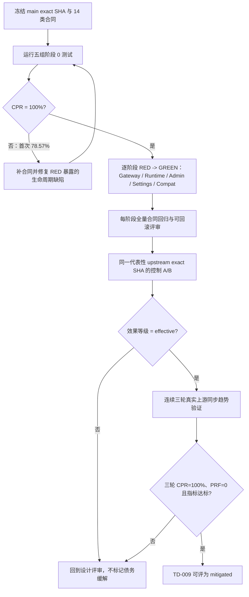

# 本地 Fork 治理方案 A：阶段 0 合同基线验证报告

| 字段 | 值 |
| --- | --- |
| 验证日期 | 2026-08-12（2026-08-13 补齐合同） |
| 工作分支 | `feature/hy/10177_fork_governance_validation` |
| 冻结基线 | `github/main@8784a4084268b532ab653774c0dc3999e24ff7c9` |
| 分支相对基线 | ahead `0` / behind `0`（测试开始时） |
| 验证范围 | 方案 A 阶段 0：补齐当前行为合同；仅修复 RED 暴露的生命周期幂等/禁用态问题，不实施扩展目录或 Wire 所有权迁移 |
| 结果 | `14 pass / 0 partial / 0 fail / 0 unknown / 0 not-run` |
| 当前 CPR | `14 / 14 = 100%` |
| Gate | **阶段 0 合同门禁通过；允许进入 Gateway Extension 的 RED 测试，不代表方案 A 已有效** |

> 本报告只回答“当前行为是否已有可重复的保护网”。它不能证明方案 A 已降低上游合并成本；该结论仍须在结构实施完成后，以同一 exact SHA 的代表性 A/B 和连续三轮真实同步验证。

---

## 一、评审结论

| 评审问题 | 结论 | 证据或原因 |
| --- | --- | --- |
| 分支是否从干净主线边界创建 | 是 | 分支、HEAD、`github/main` 均锁定到 `8784a408...`，ahead/behind 为 `0/0` |
| 五类高风险接缝是否都实际执行了测试 | 是 | Gateway、Settings、Runtime、Admin/Frontend、Compat/Safety 共 12 条权威命令 |
| 14 类合同是否全部闭环 | 是 | 2026-08-13 权威矩阵 `97/97` 通过，三个原 `partial` 均有运行时行为证据 |
| 是否发现产品行为失败 | 是，已最小修复 | RED 证明 Prompt Metrics 禁用仍建 worker、quota typed-nil cleanup panic、重复 cleanup 会二次 Stop 并 panic、Token Analysis Stop 后仍可接纳后台任务、quota 启停可遗留或越过在途调度；均由对应行为测试固定 |
| 是否可以开始方案 A 结构阶段 | 是，但仅限第一阶段 | 可进入 Gateway Extension 的 RED/最小实现；不得跳过阶段评审直接搬迁 Runtime/Admin/Settings |
| 本轮是否证明合并成本下降 | 否 | 尚未实施方案 A，也未执行同 SHA A/B；当前效果等级只能记 `baseline` |

## 二、完整闭环



本轮已从 `D` 回到 `B` 并达到 `CPR=100%`。下一步进入 `E` 的第一个独立阶段 `Gateway Extension`；每次只做一个结构接缝，仍须 RED -> GREEN、全合同回归和可回滚评审。

---

## 三、环境与可复现性

| 项目 | 实测值 |
| --- | --- |
| Go | `go1.26.5 windows/amd64` |
| 项目 GOROOT | `D:\project\pkg\mod\golang.org\toolchain@v0.0.1-go1.26.5.windows-amd64` |
| Node.js | `v24.13.0` |
| pnpm | `9.15.4` |
| Git | `2.55.0.windows.3` |
| Go cache | `backend/.gocache/review-cache`、`backend/.gocache/review-gopath`，已被 `.gitignore` 覆盖 |
| Windows 锁隔离 | 每条 Go 命令使用独立 `backend/.gocache/run-tmp-fork-*`，统一 `-p 1 -count=1` |
| 前端入口 | `node_modules\.bin\vitest.cmd`；当前环境 `pnpm exec vitest` 未解析本地 shim |

所有 Go 命令执行前均设置：

```powershell
$backend = (Resolve-Path .).Path
$cacheRoot = Join-Path $backend '.gocache'
$env:GOCACHE = Join-Path $cacheRoot 'review-cache'
$env:GOPATH = Join-Path $cacheRoot 'review-gopath'
$env:GOMODCACHE = Join-Path $env:GOPATH 'pkg\mod'
$env:GOTMPDIR = Join-Path $cacheRoot '<该命令独立目录>'
```

---

## 四、测试方案与实际结果

顶层计数不包含 Go 子测试；前端按 Vitest 的 `Tests` 计数。初次发现命令漏 tag 或执行器解析失败的诊断运行不计入结果，表内均为修正后重新执行的权威命令。

| ID | 测试方案 | 包/文件 | 顶层测试数 | 结果 |
| --- | --- | --- | ---: | --- |
| `V01` | Gateway ingress、别名、顺序与 guard | `./internal/server/routes` | 10 | PASS |
| `V02` | Settings omitted / explicit-empty | `./internal/handler/admin`（`unit`） | 4 | PASS |
| `V03` | cleanup nil-safe、顺序与幂等 | `./cmd/server` | 2 | PASS |
| `V04` | 四类本地生命周期对象启停/禁用/幂等 | `./internal/service ./internal/service/promptmetrics` | 15 | PASS |
| `V05` | 权限矩阵与写操作白名单 | `./internal/service`（`unit`） | 4 | PASS |
| `V06` | 最新数据库权限与 Admin API Key | `./internal/server/middleware`（`unit`） | 2 | PASS |
| `V07` | 四类本地管理 handler | `./internal/handler/admin` | 4 | PASS |
| `V08` | 前端路由、landing、侧栏和 API client | 6 个 Vitest 文件 | 28 | PASS |
| `V09` | cache usage 与 judge fail-open | `./internal/service` | 7 | PASS |
| `V10` | Prompt Audit / legacy 模式与优先级 | `./internal/securityaudit` | 3 | PASS |
| `V11` | Prompt Risk / judge / Content Moderation 融合 | `./internal/service` | 9 | PASS |
| `V12` | reasoning 默认、显式、策略、API Key/OAuth/WS | `./internal/service ./internal/handler`（`unit`） | 9 | PASS |
| **合计** |  |  | **97** | **97/97 PASS** |

### 4.1 权威命令

```powershell
# V01 Gateway
go test -p 1 -count=1 ./internal/server/routes -run 'TestGatewayRoutes(RequestArchiveRunsForOpenAIResponsesAlias|RequestInterceptRunsAfterArchive|GeminiModelActionGuardRunsBeforeRequestIntercept|ResponsesSubpathRejectsNonConformingSubpaths|ResponsesSubpathGuardRunsBeforeRequestIntercept|OpenAIResponsesCompactPathIsRegistered|OpenAIAlphaSearchPathsAreRegistered|OpenAIImagesPathsAreRegistered|AsyncImagesPathsAreRegistered|GrokImagesAndVideosPathsAreRegistered)$' -v

# V02 Settings
go test -tags unit -p 1 -count=1 ./internal/handler/admin -run '^(TestUpdateSettingsPartialPayloadKeepsUnsentKeys|TestUpdateSettingsFullPayloadStillClearsSentEmptyFields|TestUpdateSettingsForwardedClientIPHeadersOmittedPreservesAndEmptyClears|TestSettingHandler_UpdateSettings_PreservesOmittedAuthSourceDefaults)$' -v

# V03-V04 Runtime
go test -p 1 -count=1 ./cmd/server -run '^(TestProvideCleanup_WithMinimalDependencies_NoPanic|TestProvideCleanup_LocalTasksFinishBeforeInfrastructureAndCleanupIsIdempotent)$' -v
go test -p 1 -count=1 ./internal/service ./internal/service/promptmetrics -run '^(TestTokenAnalysisAutoIndexStopCancelsRunningRound|TestTokenAnalysisAutoIndexStartAfterStopDoesNotTouchRepository|TestTokenAnalysisIndexRangeAsyncAfterStopIsRejected|TestProvideTokenAnalysisServiceStartsAutoIndexOnce|TestFlusher_NilSafe|TestFlusher_StopPreventsFlush|TestFlusherStartAndStopAreIdempotentWithFinalFlush|TestFlusherDisabledDoesNotSchedule|TestFlusherDisabledStillPerformsFinalFlush|TestFlusherConcurrentStartAndStopDoesNotLeaveScheduledTask|TestFlusherStopWaitsForInFlightTickBeforeReturning|TestTimingWheelService_CancelWhileRecurringCallbackRunsPreventsReschedule|TestUserConcurrencyPresetRunnerStartAndStopAreIdempotent|TestUserConcurrencyPresetRunnerWithoutServiceDoesNotStart|TestNewExtensionStartsPublisherOnlyWhenEnabled)$' -v

# V05-V07 Admin
go test -tags unit -p 1 -count=1 ./internal/service -run '^(TestNormalizeAdminPermissions|TestCanAccessAdminRoute|TestCanAccessAdmin|TestSubAdminWriteWhitelistStaysNarrow)$' -v
go test -tags unit -p 1 -count=1 ./internal/server/middleware -run '^(TestAdminAuthSubAdminUsesLatestDatabasePermissions|TestAdminAuthAdminAPIKeyBypassesSubAdminRouteCatalog)$' -v
go test -p 1 -count=1 ./internal/handler/admin -run '^(TestUserConcurrencyPresetHandlerCreateAndApply|TestOrganizationUsageHandlerSummary_BindsStrictQueryAndReturnsEnvelope|TestTokenAnalysisHandlerSummaryParsesDateRange|TestRequestInterceptHandlerSaveListAndTest)$' -v

# V08 Frontend（从 frontend 目录）
cmd.exe /c node_modules\.bin\vitest.cmd run src/router/__tests__/subAdminRoutes.spec.ts src/router/__tests__/organizationUsageRoute.spec.ts src/utils/__tests__/adminPermissions.spec.ts src/components/layout/__tests__/AppSidebar.spec.ts src/api/__tests__/admin.tokenAnalysis.spec.ts src/api/__tests__/admin.requestIntercept.spec.ts

# V09 Compat / fail-open
go test -p 1 -count=1 ./internal/service -run '^(TestOpenAIGatewayService_ResponsesCompatPreservesCompatibleCacheUsage|TestPromptRiskJudge_FailOpenOnUnreachable|TestRunPromptRiskJudge_(ConcurrencyLimitFailOpen|SuccessBodyTooLargeFailOpen|Non2xxFailOpen|TimeoutFailOpen|BadJSONFailOpen))$' -v

# V10-V11 Safety order
go test -p 1 -count=1 ./internal/securityaudit -run '^(TestCoordinatorModesAndPriority|TestCoordinatorBlockingPriorityCoversBothEngineDecisionMatrix|TestCoordinatorAsyncEnqueueFailuresNeverChangeResponseOrDownstreamDispatch)$' -v
go test -p 1 -count=1 ./internal/service -run '^(TestPromptRiskJudge_(FusionDowngradesOnNone|FusionKeepsBlockOnHigh|ExemptionShortCircuits|ContextInFlightSkips|InternalHTTPRequestSkipsPromptRiskStage|InternalHeaderIgnoredWhenJudgeDisabled|DisabledNoOp)|TestContentModerationCheck_(PreBlockKeywordHitSkipsUpstreamCall|KeywordsIgnoredInObserveMode))$' -v

# V12 Reasoning
go test -tags unit -p 1 -count=1 ./internal/service ./internal/handler -run '^(TestApplyDefaultOpenAIReasoningEffort|TestApplyOpenAIReasoningEffortPolicy|TestOpenAIReasoningEffortPolicyForCompositeTarget|TestForwardAsRawChatCompletions_PreservesMappedGPT56MaxEffort|TestOpenAIGatewayService_APIKeyPassthrough_StripsTopLevelThinkingAndKeepsReasoning|TestOpenAIGatewayServiceForward_NormalizesResponsesLiteToolsForOAuth|TestWSPassthroughUsageMeta_(InitFromFirstFrame_MappedModelCandidate|InitFromFirstFrame_NonGPT56FallsBackToXHigh|UpdateFromResponseCreate_MappedModelCandidate))$' -v
```

---

## 五、14 类合同状态

| 合同 ID | 状态 | 当前证据 | 缺口/判定 |
| --- | --- | --- | --- |
| `GW-ARCHIVE-01` | `pass` | `V01` 表驱动执行 `/v1/responses`、`/responses`、`/backend-api/codex/responses` | 三个入口均生成同 `archive_id` 的 request/response 对并归一为 `/v1/responses` |
| `GW-ORDER-01` | `pass` | `V01` 拦截响应仍形成完整 request/response 摘要 | 满足最低断言 |
| `GW-GUARD-01` | `pass` | `V01` Gemini 与 Responses 非法路径均先于 Intercept 拒绝 | 满足最低断言 |
| `GW-ROUTES-01` | `pass` | `V01` compact、alpha、OpenAI/async images、Grok image/video 路由集 | 满足当前路由并存断言 |
| `SET-PATCH-01` | `pass` | `V02` partial payload、forwarded headers 和 auth source omitted 行为 | 未发送字段保持原值 |
| `SET-EMPTY-01` | `pass` | `V02` full payload 与显式空数组清除 | 显式空值语义稳定 |
| `LIFE-START-01` | `pass` | `V04` 从真实 Provider/公开入口观察 Token Analysis、preset runner、quota flusher、Prompt Metrics | 启用时只启动一次；quota/Prompt Metrics 禁用时不创建调度/worker；重复 Start 无第二条 loop/task；Stop 后 Start 不再接纳任务或触及仓储；quota 并发 Start/Stop 不遗留调度 |
| `LIFE-STOP-01` | `pass` | `V03-V04` 使用真实 cleanup、TimingWheel callback 及可观察 Redis/Ent/quota spy | 最终 flush 一次且 disabled 状态也 flush；Stop 等待在途 tick，Cancel 阻止 callback 自我重挂；flush 时 Redis/Ent 开放；重复 cleanup/Stop 无副作用；Stop 后 async 返回 409 |
| `SAFE-ORDER-01` | `pass` | `V10-V11` 覆盖 Prompt Risk/judge/Content Moderation 前置链和 Prompt Audit/legacy 优先级 | off/async/blocking、block/observe 和回环边界均执行 |
| `SAFE-FAIL-01` | `pass` | `V09` 覆盖并发满、响应过大、非 2xx、超时、坏 JSON、不可达 | 故障均降级为 observe/allow |
| `AUTH-MATRIX-01` | `pass` | `V05-V06-V08` 覆盖 admin/sub_admin/user、未知路由、敏感写、最新权限、landing/sidebar | 后端 fail-closed 与前端入口一致 |
| `COMP-USAGE-01` | `pass` | `V09` 同时断言 cache read/create 计费桶及 Responses details | compatible helper 未覆盖已有桶 |
| `COMP-REASON-01` | `pass` | `V12` 覆盖默认注入、显式值、策略上限、Chat、API Key/OAuth Responses、WS 多轮 | 满足跨路径最低断言 |
| `EXT-ADMIN-01` | `pass` | `V07-V08` 覆盖 Token Analysis、组织用量、Request Intercept、并发 preset handler 与前端入口/API | 四类本地管理能力均有可执行入口证据 |

```text
CPR = pass 合同数 / 应执行合同数
    = 14 / 14
    = 100%
```

`CPR=100%` 只说明阶段 0 的不可回归合同齐备。它不能证明方案 A 已减少人工语义决策，也不能把 TD-009 标记为 `mitigated`。

---

## 六、验证方案审查中发现的问题

| 问题 | 风险 | 本轮处理 |
| --- | --- | --- |
| Settings 原命令缺 `-tags unit` | 命令退出 0，但 4 项只执行 2 项，形成假阳性 | 核对 build tag 后用 `-tags unit` 重跑 4/4，并修正计划 |
| 原后端权限测试名 `TestAdminPermissionAllowed` 不存在 | 正则可能选空仍显示包级 `ok` | 用 `go test -list` 找到真实测试，改为权限矩阵、route catalog 和 middleware 六项 |
| 原计划漏掉 `SAFE-ORDER-01` | 14 类合同只实际安排 13 类 | 增加 coordinator 和 Prompt Risk/judge/Content Moderation 两层测试 |
| 原 reasoning 命令只测 WS 三项 | 无法证明默认值和 OAuth/API Key/Chat/Responses 优先级 | 扩为跨 service/handler 的 9 个顶层测试 |
| 原 `EXT-ADMIN-01` 主要依赖前端静态入口 | 后端 handler/DTO 消失仍可能漏报 | 增加四类真实 handler 测试 |
| 当前环境 `pnpm exec vitest` 找不到本地 shim | 前端合同无法执行 | 确认依赖存在后，用仓库本地 `vitest.cmd` 重跑 6 文件 28 项 |
| Gateway 归档测试未覆盖 root alias | 注册成功不等于归档中间件生效 | 降级 `GW-ARCHIVE-01` 为 `partial`，不伪造 PASS |
| Prompt Metrics 禁用时仍创建 worker pool | 禁用配置只旁路请求，后台资源仍存在 | RED 后让 `NewExtension` 仅在启用时创建 publisher |
| quota flusher 使用具体 TimingWheel，且 Stop 不幂等 | 难以观察调度；typed nil cleanup panic；重复 Stop 会重复最终 flush | 提取包内窄 scheduler 接口，归一 typed nil，并为 Start/Stop 增加 once |
| quota 并发 Start/Stop 可在 Cancel 后完成注册 | shutdown 返回后仍遗留周期任务；虽 tick 因 stopped 不再写库，但调度资源未释放 | RED 后用 lifecycle mutex 串行注册/取消；Stop 先发布 stopped，再等待进行中的注册并取消 |
| TimingWheel Cancel 无法撤销在途 recurring 代次 | callback 执行结束后无条件重新 `SetTimer`，已取消任务会复活 | RED 后为 recurring 任务维护可取消代次；Cancel/Stop/同名覆盖使旧代次不能重挂，Stop 后拒绝新任务 |
| quota Stop 不等待在途 tick | cleanup 可先关闭 Redis/Ent，而旧 tick 仍继续 flush | RED 后用 lifecycle lock + WaitGroup 登记 tick；Stop 先拒绝新 tick、取消调度、等待在途 tick，再执行最终 flush |
| Token Analysis Start 可重复创建 loop | Provider 外重复调用会产生多条后台循环 | 为 auto-index Start 增加 once，并从真实 Provider 验证只启动一次 |
| Token Analysis Stop 后仍可 Start/async | Stop 已返回后仍可能 `WaitGroup.Add` 并进入仓储，破坏 shutdown 边界 | RED 后增加生命周期门闩；自动 Start 为空操作，手动 async 返回 409，`Add/Wait` 顺序由同一把锁保护 |
| 顶层 cleanup 可重复执行 | 第二次 Stop 会关闭已关闭 channel，Redis/Ent 也会重复 Close | `provideCleanup` 外层加 once；行为测试证明本地 flush 先于基础设施关闭 |

---

## 七、下一阶段：Gateway Extension

| 顺序 | RED/评审项 | 必须证明 | 生产代码规则 |
| --- | --- | --- | --- |
| 1 | `localext/gateway.NewExtension(...).Handlers(...)` 首个 RED | 固定输出 `Archive -> coreGuards -> Intercept`，调用者不能自行重排 | 只新增 Gateway 接缝，不同时迁移 Runtime/Admin/Settings |
| 2 | 路由等价回归 | 主路由、root/backend aliases 和特殊 guard 的 HTTP 行为不变 | 上游 route group 继续拥有认证、body limit 和 group assignment |
| 3 | 14 类合同矩阵 | `97/97` 及 `CPR=100%` 不回退，`no tests to run` 判失败 | 合同测试不替代完整 unit/integration/frontend/build |
| 4 | 结构评审与回滚 | diff 仅含目标接缝；回滚不需要数据/config migration | 未通过时回滚本阶段，不推进 LocalRuntime |

`LocalRuntime` 的目标接口测试属于第二个结构阶段：必须在 Gateway Extension 独立通过评审后再建立，不作为阶段 0 的循环前置条件。

---

## 八、用户评审方法

本轮评审不是“是否批准方案 A 全部开发”，而是只签字确认阶段 0 闭环，并决定是否允许开始 Gateway Extension。按顺序检查：

| 顺序 | 评审输入 | 需要回答的问题 | 拒绝条件 |
| ---: | --- | --- | --- |
| 1 | 本报告第五节 | 14 个 `pass` 是否都有可执行行为断言 | 任一状态只靠源码字符串、日志或 Wire 文本 |
| 2 | 本报告第六节 | 修正后的命令是否会实际选中目标测试 | 存在失效测试名、漏 build tag 或静默选空 |
| 3 | 本报告第七节 | 下一阶段是否只做 Gateway Extension | 同一阶段混入 Runtime/Admin/Settings 迁移 |
| 4 | `git diff --check` 与 Understand 状态 | 文档是否格式正确，图谱状态是否如实记录 | diff 错误或把 PARTIAL 写成 READY |

可接受的评审结论只有两种：

1. **批准阶段 0 闭环**：认可 `14/14` 与 `97/97` 证据，允许开始 Gateway Extension RED；
2. **退回修正**：指出具体合同 ID、最低断言或证据命令，不以“测试都绿”要求把 `partial` 改为 `pass`。

批准阶段 0 闭环不授权 commit、push、PR、部署，也不授权跳过独立阶段评审。

---

## 九、文档与知识图谱验证

| 检查 | 结果 | 说明 |
| --- | --- | --- |
| `git diff --check` | PASS | 已跟踪文档无 whitespace error |
| 新增 Markdown LF/尾随空格检查 | PASS | 检查 5 个本轮新增 Markdown；无 CR 字节、无行尾空格 |
| 生产代码变化 | 已审计 | 仅生命周期加固与对应测试：once、不可逆 Stop 门闩、禁用态 worker、quota scheduler 测试接缝；未创建方案 A 扩展目录或迁移 Wire 所有权 |
| 四个受影响 Go 包 | PASS | `./cmd/server`、`./internal/server/routes`、`./internal/service/promptmetrics`、`./internal/service` 全包通过；最终 service 重跑用时 103.864 秒 |
| 生命周期聚焦 `-race` | PASS | TimingWheel、Token Analysis 与 quota 的 10 个启停/并发边界测试通过；无 data race，最终命令用时 42.6 秒 |
| Wire 生成漂移 | PASS | fresh repo-local cache 下 `go generate ./cmd/server` 前后 `wire_gen.go` SHA-256 均为 `E3E51E9...506C7` |
| `tools\check-understand-status.cmd` | `PARTIAL` | 图谱 JSON 结构有效；wiki source hash 与当前文档不一致，且 `llm-wiki` 有 5 个 dirty 路径；共 2 项需处理 |
| 代码图谱结构 | PASS | 7862 nodes / 27001 edges，边引用有效，基线无相关 pathspec 变化 |
| Wiki 图谱结构 | PASS | 33 nodes / 67 edges，kind 与边引用有效 |

Understand 的 `PARTIAL` 不计为 READY。本轮没有刷新图谱，因为 `llm-wiki/.understand-anything/knowledge-graph.json` 与 `meta.json` 已有用户/Grok 修改；直接刷新可能覆盖其未提交状态。待用户统一审查文档和图谱改动后，再单独执行 `tools\refresh-understand-wiki.cmd` 并复查。
