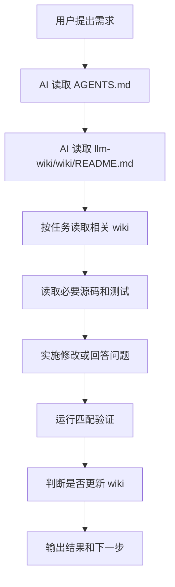

# AI 日常协作流程

## 人需要做什么

1. 正常提出需求, 不需要额外提示“请读取 llm-wiki”或“请更新 llm-wiki”。
2. 如果需求涉及业务背景, 直接说明目标, 约束和验收标准。
3. 如果发现 AI 结论和项目事实不一致, 指出冲突点; AI 应修正 wiki。
4. 对高风险改动, 明确是否允许改数据结构, migration, 配置默认值和兼容逻辑。

## AI 需要做什么

每轮任务开始:

1. 读取根目录 `AGENTS.md`。
2. 读取 `llm-wiki/wiki/README.md`。
3. 按任务类型读取对应 wiki。
4. 再读取相关源码, 不从全仓库盲扫开始。

实现过程中:

1. 以源码和测试为准。
2. 遇到 wiki 过期, 立即在本轮修正。
3. 修改业务代码时保持范围小, 不做无关重构。
4. 对缺陷先定位根因, 再改代码和补验证。

收尾前:

1. 判断是否需要更新 `llm-wiki/wiki/`。
2. 执行匹配的验证命令。
3. 输出修改内容, 验证结果和后续建议。

## wiki 更新决策

必须更新:

- 新增/修改架构, 模块职责, 依赖注入, 路由, 后台任务。
- 新增/修改配置项, 环境变量, 启动方式, CI。
- 新增/修改数据库 schema, migration, 数据生命周期。
- 新增/修改认证, 权限, 限流, 幂等, 支付, 计费, 网关协议。
- 发现现有 wiki 与源码冲突。

可不更新:

- 纯样式微调。
- 局部文案。
- 局部测试 fixture 调整。
- 不改变外部行为的内部变量命名。

## 推荐写法

wiki 页面应写:

- 稳定事实。
- 关键路径。
- 为什么这个点对维护重要。
- 验证命令或检查方式。
- 常见坑。

wiki 页面不应写:

- 对话过程。
- 临时猜测。
- 未验证结论。
- 密钥或私密凭据。

## 平时怎样运作

## Codex 与 Copilot 规则

- Codex 项目规则: 根目录 `AGENTS.md`。
- Copilot 项目规则: `.github/copilot-instructions.md`。
- 两者都要求开发前自动查阅 wiki, 并在任务改变项目知识时同步更新 wiki。

## 知识图谱怎么配合

权威顺序不变: `AGENTS.md` → `llm-wiki` → 源码/测试。图谱只做导航。

| 动作 | 命令/入口 |
| --- | --- |
| 检查是否就绪 | `tools\check-understand-status.cmd` |
| 打开代码/Wiki 图 | `tools\start-understand-dashboard.cmd` |
| 刷新 Wiki 图 | `tools\refresh-understand-wiki.cmd` |
| 重建代码图 | `/understand` |
| 变更影响 | `/understand-diff` |

Windows 不要使用裸 `powershell -File ...`（RemoteSigned 下可能被拦截）; `.cmd` 已带 `ExecutionPolicy Bypass`。状态检查会在 wiki dirty 或图谱基线落后 HEAD 时返回 PARTIAL。

持久化约定:

- 入库: wiki 正文、`llm-wiki/index.md`、共享 config/ignore、**wiki 图谱 JSON**、AGENTS 与本页规则。
- 不入库: 代码图谱 JSON、fingerprints、dashboard 日志（见根 `.gitignore`）。

## 相关页面

- [[README]]
- [[backend]]
- [[frontend]]
- [[ops]]
- [[data-and-domain]]
- [[security-and-reliability]]
- [[ai-workflow]]
